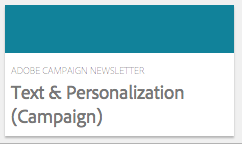

# Trabalhar com o Adobe Campaign Classic e o Adobe Campaign Standard{#working-with-adobe-campaign-classic-and-adobe-campaign-standard}

Você pode criar conteúdo de email no AEM e processá-lo em emails do Adobe Campaign. Para fazer isso, você deve:

1. Crie um boletim informativo no AEM com base em um modelo específico do Adobe Campaign.
1. Selecione [um serviço do Adobe Campaign](#selecting-the-adobe-campaign-cloud-service-and-template) antes de editar o conteúdo para acessar todas as funcionalidades.
1. Editar o conteúdo.
1. Validar o conteúdo.

O conteúdo pode ser sincronizado com um delivery no Adobe Campaign. As instruções detalhadas estão descritas neste documento.

Consulte também [Criação do Adobe Campaign Forms no AEM](/help/sites-authoring/adobe-campaign-forms.md).

>[!NOTE]
>
>Antes de usar esta funcionalidade, você deve configurar o AEM para integrar com o [Adobe Campaign](/help/sites-administering/campaignonpremise.md) ou o [Adobe Campaign Standard](/help/sites-administering/campaignstandard.md).

## Envio de conteúdo de e-mail via Adobe Campaign {#sending-email-content-via-adobe-campaign}

Após configurar o AEM e o Adobe Campaign, você pode criar conteúdo de delivery de email diretamente no AEM e processá-lo no Adobe Campaign.

Ao criar conteúdo do Adobe Campaign no AEM, você deve vincular a um serviço do Adobe Campaign antes de editar o conteúdo para acessar todas as funcionalidades.

Há dois casos possíveis:

* O conteúdo pode ser sincronizado com um delivery do Adobe Campaign. Isso permite usar o conteúdo do AEM em um delivery.
* (Somente no Adobe Campaign Classic) O conteúdo pode ser enviado diretamente para o Adobe Campaign, que gera automaticamente um novo delivery de email. Esse modo tem limitações.

As instruções detalhadas estão descritas neste documento.

### Criação de novo conteúdo de email {#creating-new-email-content}

>[!NOTE]
>
>Ao adicionar modelos de email, adicione-os em **/content/campaigns** para torná-los disponíveis.

#### Criação de novo conteúdo de email {#creating-new-email-content-1}

1. No AEM, selecione **Sites** e depois **Campanhas** e navegue até o local em que suas campanhas de email são gerenciadas. No exemplo a seguir, o caminho é **Sites** > **Campanhas** > **Geometrixx Outdoors** > **Campanhas por email**.

   >[!NOTE]
   >
   >[Amostras de email só estão disponíveis no Geometrixx](/help/sites-developing/we-retail.md). Baixe o conteúdo de amostra do Geometrixx do Compartilhamento de pacotes.

   

1. Selecione **Criar** e depois **Criar Página**.
1. Selecione um dos modelos disponíveis específicos ao Adobe Campaign ao qual você está se conectando e clique em **Avançar**. Três templates estão disponíveis por padrão:

   * **Email do Adobe Campaign Classic**: permite adicionar conteúdo a um modelo predefinido (duas colunas) antes de enviá-lo ao Adobe Campaign Classic para entrega.
   * **Email do Adobe Campaign Standard**: permite adicionar conteúdo a um modelo predefinido (duas colunas) antes de enviá-lo ao Adobe Campaign Standard para entrega.

1. Preencha o **Título** e, opcionalmente, a **Descrição** e clique em **Criar**. O título é usado como o assunto do informativo/email, a menos que você o substitua ao editar o email.

### Seleção do serviço de nuvem e do modelo do Adobe Campaign {#selecting-the-adobe-campaign-cloud-service-and-template}

Para integrar ao Adobe Campaign, é necessário adicionar um serviço em nuvem do Adobe Campaign à página. Isso fornecerá acesso à personalização e outras informações do Adobe Campaign.

Além disso, talvez também seja necessário selecionar o modelo do Adobe Campaign, alterar o assunto e adicionar conteúdo de texto sem formatação para os usuários que não visualizarão o email no HTML.

Você pode selecionar o serviço em nuvem na guia **Sites** ou no email/informativo após criá-lo.

A seleção do serviço de nuvem na guia **Sites** é a abordagem recomendada. A seleção do serviço de nuvem no email/informativo requer uma solução alternativa.

Na página **Sites**:

1. No AEM, selecione a página de email e clique em **Exibir Propriedades**.

   

1. Selecione **Editar** e depois a guia **Serviços em nuvem**, role para baixo até a parte inferior e clique no sinal + para adicionar uma configuração e selecione **Adobe Campaign**.

   

1. Selecione a configuração que corresponde à sua instância do Adobe Campaign na lista suspensa e, em seguida, confirme clicando em **Salvar**.
1. Para exibir o modelo aplicado ao email, clique na guia **Adobe Campaign**. Se quiser selecionar outro modelo, acesse-o no email ao editar.

   Se você quiser aplicar um modelo de entrega de email específico (do Adobe Campaign), diferente do modelo de email padrão, em **Propriedades**, selecione a guia **Adobe Campaign**. Insira o nome interno do template do delivery de email na instância do Adobe Campaign relacionada.

   O modelo selecionado determina quais campos de personalização estão disponíveis no Adobe Campaign.

   

Dentro do informativo/email em criação, talvez você não possa selecionar a configuração do Adobe Campaign Cloud Service em **Propriedades da página** devido a um problema de layout. Você pode usar a solução alternativa descrita aqui:

1. No AEM, selecione a página de email e clique em **Editar**. Clique em **Abrir Propriedades**.

   

1. Selecione **Serviços em nuvem** e clique em **+** para adicionar uma configuração. Selecione qualquer configuração visível (não importa qual). Clique no sinal **+** para adicionar outra configuração e selecione **Adobe Campaign**.

   >[!NOTE]
   >
   >Como alternativa, você pode selecionar os serviços em nuvem selecionando **Exibir Propriedades** na guia **Sites**.

1. Selecione a configuração que corresponde à sua instância do Adobe Campaign na lista suspensa, exclua a primeira configuração criada que não era para o Adobe Campaign e, em seguida, confirme clicando na marca de seleção.
1. Continue com a etapa 4 no procedimento anterior para selecionar modelos e adicionar texto sem formatação.

### Edição de conteúdo de email {#editing-email-content}

Para editar conteúdo de e-mail:

1. Abra o email e, por padrão, entre no modo Editar.

   

1. Se você quiser alterar o assunto do email ou adicionar texto sem formatação para os usuários que não visualizarão o email no HTML, selecione **Email** e adicione um assunto e texto. Selecione o ícone de página para gerar automaticamente uma versão de texto simples do HTML. Clique na marca de seleção ao concluir.

   Você pode personalizar o informativo usando campos de personalização do Adobe Campaign. Para adicionar um campo de personalização, abra o seletor de campo de personalização clicando no botão que exibe o logotipo do Adobe Campaign. Em seguida, você poderá escolher entre todos os campos disponíveis para este informativo.

   >[!NOTE]
   >
   >Se os campos de personalização nas propriedades do editor estiverem esmaecidos, reexamine sua configuração.

   

1. Abra o painel Componentes no lado esquerdo da tela e selecione **Informativo do Adobe Campaign** no menu suspenso para encontrar esses componentes.

   

1. Arraste os componentes diretamente para a página e edite-os de acordo. Por exemplo, você pode arrastar um componente **Text &amp; Personalization (Campanha)** e adicionar texto personalizado.

   

   Consulte [Componentes do Adobe Campaign](/help/sites-authoring/adobe-campaign-components.md) para obter uma descrição detalhada de cada componente.

   

### Inserir personalização {#inserting-personalization}

Ao editar seu conteúdo, você pode inserir:

* Campos de contexto do Adobe Campaign. São campos que você pode inserir no texto que se adaptam de acordo com os dados do recipient (por exemplo, nome, sobrenome ou quaisquer dados da dimensão de destino).
* Blocos de personalização do Adobe Campaign. Esses são blocos de conteúdo predefinido que não estão relacionados aos dados do recipient, como um logotipo de marca ou um link para uma mirror page.

Consulte [Componentes do Adobe Campaign](/help/sites-authoring/adobe-campaign-components.md) para obter uma descrição completa dos componentes do Campaign.

>[!NOTE]
>
>* Somente os campos da targeting dimension **Profiles** da Adobe Campaign são considerados.
>* Ao exibir Propriedades de **Sites**, você não tem acesso aos campos de contexto do Adobe Campaign. É possível acessá-los diretamente do email ao editar.

Para inserir personalização:

1. Insira um novo componente **Informativo** > **Texto e Personalization (Campanha)** arrastando-o para a página.

   

1. Abra o componente clicando no ícone Lápis. O editor local se abre.

   

   >[!NOTE]
   >
   >**Para Adobe Campaign Standard:**
   >
   >* Os campos de contexto disponíveis correspondem à targeting dimension **Perfis** no Adobe Campaign.
   >* Consulte [Vinculando uma página do AEM a um email do Adobe Campaign](#linking-an-aem-page-to-an-adobe-campaign-email-adobe-campaign-standard).
   >
   >**Para Adobe Campaign Classic:**
   >
   >* Os campos de contexto disponíveis são recuperados dinamicamente do esquema **nms:seedMember** do Adobe Campaign. Os dados de extensão do Target são recuperados dinamicamente do fluxo de trabalho que contém o delivery sincronizado com o conteúdo. (Consulte a seção [Sincronização do conteúdo criado no AEM com uma entrega do Adobe Campaign](#synchronizing-content-created-in-aem-with-a-delivery-from-adobe-campaign-classic)).
   >
   >* Para adicionar ou ocultar elementos de personalização, consulte [Gerenciamento de campos e blocos de personalização](/help/sites-administering/campaignonpremise.md#managing-personalization-fields-and-blocks).
   >* **Importante**: todos os campos da tabela de propagação também devem estar na tabela de destinatários (ou na tabela de contatos correspondente).

1. Insira texto digitando. Insira campos de contexto ou blocos de personalização clicando nos componentes do Adobe Campaign e selecionando-os. Quando terminar, marque a marca de seleção.

   

   Depois de inserir campos de contexto ou blocos de personalização, você pode visualizar o informativo e testar os campos. Consulte [Visualizando um informativo](#previewing-a-newsletter).

### Visualização de informativo {#previewing-a-newsletter}

Você pode visualizar como o informativo será exibido e visualizar a personalização.

1. Com o informativo aberto, clique em **Visualizar** no canto superior direito do AEM. O AEM exibe a aparência do informativo quando os usuários o recebem.

   

   >[!NOTE]
   >
   >Se você estiver usando o Adobe Campaign Standard e o modelo de exemplo, dois blocos de personalização que exibem conteúdo inicial - **&quot;&lt;%@ include view=&quot;MirrorPage&quot; %>&quot;** e **&quot;&lt;%@ include view=&quot;UnsubscriptionLink&quot; %>&quot;** - exibirão erros ao importar o conteúdo durante a entrega. Você pode ajustá-los selecionando os blocos correspondentes usando o seletor de blocos de personalização.

1. Para visualizar a personalização, abra o ContextHub clicando/tocando no ícone correspondente na barra de ferramentas. As tags de campo de personalização agora são substituídas pelos dados iniciais da persona selecionada. Veja como as variáveis se adaptam ao alternar perfis no ContextHub.

   

1. Você pode visualizar os dados de seed provenientes do Adobe Campaign associados ao perfil selecionado no momento. Para fazer isso, clique no módulo Adobe Campaign na barra do ContextHub. Isso abre uma caixa de diálogo exibindo todos os dados de seed do perfil atual. Novamente, os dados se adaptam ao alternar para um perfil diferente.

   

### Aprovar conteúdo no AEM {#approving-content-in-aem}

Após a conclusão do conteúdo, é possível iniciar o processo de aprovação. Vá para a guia **Workflow** da caixa de ferramentas e selecione o fluxo de trabalho **Aprovar para Adobe Campaign**.

Esse workflow pronto para uso tem duas etapas: revisão e depois aprovação ou revisão e depois rejeição. No entanto, esse fluxo de trabalho pode ser estendido e adaptado a um processo mais complexo.

Para aprovar o conteúdo do Adobe Campaign, aplique o fluxo de trabalho selecionando **Fluxo de trabalho** e selecionando **Aprovar para o Adobe Campaign** e clique em **Iniciar Fluxo de Trabalho**. Percorra as etapas e aprove o conteúdo. Você também pode rejeitar o conteúdo selecionando **Rejeitar** em vez de **Aprovar** na última etapa do fluxo de trabalho.

Depois que o conteúdo é aprovado, ele é exibido como aprovado no Adobe Campaign. O email pode ser enviado.

No Adobe Campaign Standard:

No Adobe Campaign Classic:

>[!NOTE]
>
>O conteúdo não aprovado pode ser sincronizado com um delivery no Adobe Campaign, mas o delivery não pode ser executado. Somente o conteúdo aprovado pode ser enviado por meio de deliveries do Campaign.

## Vinculação do AEM com o Adobe Campaign Standard e o Adobe Campaign Classic {#linking-aem-with-adobe-campaign-standard-and-adobe-campaign-classic}

A maneira de vincular ou sincronizar o AEM com o Adobe Campaign depende de você estar usando o Adobe Campaign Standard com base em assinatura ou o Adobe Campaign Classic com base no local.

Consulte as seguintes seções para obter instruções baseadas na solução da Adobe Campaign:

* [Vincular uma página do AEM a um email do Adobe Campaign (Adobe Campaign Standard)](#linking-an-aem-page-to-an-adobe-campaign-email-adobe-campaign-standard)
* [Sincronização do conteúdo criado no AEM com uma entrega do Adobe Campaign Classic](#synchronizing-content-created-in-aem-with-a-delivery-from-adobe-campaign-classic)

### Vincular uma página do AEM a um email do Adobe Campaign (Adobe Campaign Standard) {#linking-an-aem-page-to-an-adobe-campaign-email-adobe-campaign-standard}

O Adobe Campaign Standard permite recuperar e vincular o conteúdo criado no AEM com:

* Um email.
* Um template de email.

Isso permite entregar o conteúdo. Você verá se um boletim informativo está vinculado a um único delivery pelo código exibido na página.

>[!NOTE]
>
>Se um boletim informativo estiver vinculado a vários deliveries, o número de deliveries vinculados (mas nem todas as IDs são exibidas).

Para vincular uma página criada no AEM com um email da Adobe Campaign:

1. Crie um email com base em um template de email específico do AEM. Consulte [Criação de emails no Adobe Campaign Standard](https://helpx.adobe.com/campaign/standard/channels/using/creating-an-email.html) para obter mais informações.

   

1. Abra o bloco **Conteúdo** no painel de entrega.

   

1. Selecione **Vincular a um conteúdo do Adobe Experience Manager** na barra de ferramentas para acessar a lista de conteúdos disponíveis no AEM.

   >[!NOTE]
   >
   >Se a opção **Vincular a uma Adobe Experience Manager** não aparecer na barra de ações, verifique se o **Modo de edição de conteúdo** está configurado corretamente como **Adobe Experience Manager** nas propriedades de email.

   

1. Selecione o conteúdo que deseja usar no email.

   Esta lista especifica:

   * O rótulo do conteúdo no AEM.
   * O status de aprovação do conteúdo no AEM. Se o conteúdo não for aprovado, é possível sincronizar o conteúdo, mas ele precisará ser aprovado antes que o delivery seja enviado. No entanto, é possível executar determinadas operações, como enviar uma prova ou o teste de pré-visualização.
   * A data da última modificação do conteúdo.
   * Qualquer conteúdo já vinculado a um delivery.

   >[!NOTE]
   >
   >Por padrão, o conteúdo que já está sincronizado com um delivery fica oculto. No entanto, você pode exibi-lo e usá-lo. Por exemplo, se você deseja usar o conteúdo como um template para vários deliveries.

   Quando o email é vinculado a um conteúdo do AEM, o conteúdo não pode ser editado no Adobe Campaign.

1. Especifique os outros parâmetros do seu email no painel (públicos, programação de execução).
1. Execute o delivery do email. Durante a análise de delivery, a versão mais atualizada do conteúdo do AEM é recuperada.

   >[!NOTE]
   >
   >Se o conteúdo for atualizado no AEM enquanto estiver vinculado a um email, ele será atualizado automaticamente no Adobe Campaign durante a análise. A sincronização também pode ser executada manualmente usando **Atualizar conteúdo do Adobe Experience Manager** na barra de ação de conteúdo.
   >
   >Você pode cancelar o vínculo entre um email e o conteúdo do AEM usando **Excluir o vínculo com o conteúdo do Adobe Experience Manager** da barra de ação de conteúdo. Esse botão só estará disponível se um conteúdo já estiver vinculado ao delivery. Para vincular um conteúdo diferente a um delivery, é necessário excluir o link do conteúdo atual antes de poder estabelecer um novo link.
   >
   >Quando o link é excluído, o conteúdo local é mantido e se torna editável no Adobe Campaign. Se você vincular novamente o conteúdo depois de modificá-lo, todas as alterações serão perdidas.

### Sincronização do conteúdo criado no AEM com uma entrega do Adobe Campaign Classic {#synchronizing-content-created-in-aem-with-a-delivery-from-adobe-campaign-classic}

O Adobe Campaign permite recuperar e sincronizar o conteúdo criado no AEM com:

* Um delivery de campanha
* Uma atividade de delivery em um workflow de campanha
* Uma entrega recorrente
* Uma entrega contínua
* Uma entrega do Centro de mensagens
* Um template do delivery

No AEM, se um informativo estiver vinculado a um único delivery, o código do delivery será exibido na página.

>[!NOTE]
>
>Se o informativo estiver vinculado a vários deliveries, o número de deliveries vinculados (mas não todas as IDs serão exibidas).
>
>[!NOTE]
>
>A etapa do fluxo de trabalho **Publicar no Adobe Campaign** foi descontinuada no AEM 6.1. Esta etapa era parte da integração do AEM 6.0 com o Adobe Campaign e não é mais necessária.

Para sincronizar o conteúdo criado no AEM com um delivery do Adobe Campaign:

1. Crie uma entrega ou adicione uma atividade de entrega a um fluxo de trabalho da campanha selecionando o modelo de entrega **Entrega de email com conteúdo do AEM (mailAEMContent)**.

   

1. Selecione **Sincronizar** na barra de ferramentas para acessar a lista de conteúdos disponíveis no AEM.

   >[!NOTE]
   >
   >Se a opção **Sincronizar** não aparecer na barra de ferramentas da entrega, verifique se o campo **Modo de edição de conteúdo** está configurado corretamente no **AEM** selecionando **Propriedades** > **Avançadas**.

   

1. Selecione o conteúdo que deseja sincronizar com o delivery.

   Esta lista especifica:

   * O rótulo do conteúdo no AEM.
   * O status de aprovação do conteúdo no AEM. Se o conteúdo não for aprovado, é possível sincronizar o conteúdo, mas ele precisará ser aprovado antes que o delivery seja enviado. No entanto, é possível executar determinadas operações, como enviar uma BAT ou o teste de visualização.
   * A data da última modificação no conteúdo.
   * Qualquer conteúdo já vinculado a um delivery.

   >[!NOTE]
   >
   >Por padrão, o conteúdo que já está sincronizado com um delivery fica oculto. No entanto, você pode exibi-lo e usá-lo. Por exemplo, se você deseja usar o conteúdo como um template para vários deliveries.

   

1. Especificar os outros parâmetros do delivery (target e assim por diante)
1. Se necessário, inicie o processo de aprovação de delivery no Adobe Campaign. A aprovação de conteúdo no AEM é necessária além das aprovações configuradas no Adobe Campaign (orçamento, público-alvo e assim por diante). A aprovação de conteúdo no Adobe Campaign só é possível se o conteúdo já estiver aprovado no AEM.
1. Execute o delivery. Durante a análise de delivery, a versão mais atualizada do conteúdo do AEM é recuperada.

   >[!NOTE]
   >
   >* Depois que a entrega e o conteúdo são sincronizados, o conteúdo da entrega no Adobe Campaign se torna somente leitura. O assunto do email e seu conteúdo não podem mais ser modificados.
   >* Se o conteúdo for atualizado no AEM enquanto estiver vinculado a um delivery no Adobe Campaign, ele será atualizado automaticamente no delivery durante a análise de delivery. A sincronização também pode ser executada manualmente usando o botão **Atualizar conteúdo agora**.
   >* Você pode cancelar a sincronização entre uma entrega e o conteúdo do AEM usando o botão **Dessincronizar**. Isso só estará disponível se um conteúdo já estiver sincronizado com o delivery. Para sincronizar um conteúdo diferente com um delivery, você deve cancelar a sincronização do conteúdo atual antes de poder estabelecer um novo link.
   >* Se dessincronizado, o conteúdo local é mantido e se torna editável no Adobe Campaign. Se você ressincronizar o conteúdo depois de modificá-lo, perderá todas as alterações.
   >* Para deliveries recorrentes e contínuos, a sincronização com o conteúdo do AEM é interrompida toda vez que o delivery é executado.
