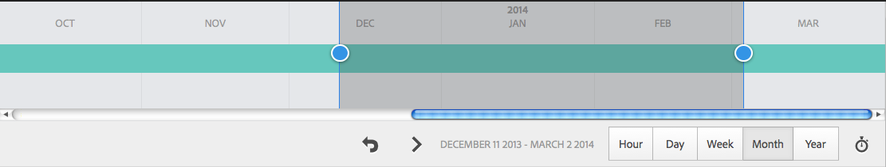

# Análise do desempenho das páginas{#analyzing-page-performance}

Abra a página [Content Insight](/help/sites-authoring/content-insights.md) para analisar o desempenho da página que você está criando. Configure o período de relatório para concentrar a análise.

## Abrir as Análises e Recomendações para uma página {#opening-analytics-and-recommendations-for-a-page}

Use o seguinte procedimento para visualizar as Análises e Recomendações para uma página:

1. Navegue até a página que deseja analisar.
1. Na barra de ferramentas, clique ou toque em **Análises e Recomendações**.

   >[!NOTE]
   >
   >As Análises e Recomendações para uma página aparecem somente se tiver configurado o AEM[ para fazer a integração com o Adobe Analytics](/help/sites-administering/adobeanalytics-connect.md).

   

### Alterar o período de relatório {#changing-the-reporting-period}

Altere os seguintes aspectos relacionados ao tempo dos relatórios de análise:

* O período de tempo do relatório.
* A granularidade dos dados.

As ferramentas para alterar os aspectos relacionados ao tempo dos relatórios são exibidas na parte superior da página Content Insight. 

#### Alterar o período de relatório {#changing-the-reporting-period-1}

Altere o período de relatório da página Content Insight para concentrar a análise das atividades da página em um período específico. Quando você altera o período de relatório, os relatórios são atualizados automaticamente. A área sombreada no período de tempo representa o período de relatório. As datas do período de tempo aumentam da esquerda para a direita.

Para alterar o período de relatório de uma página Content Insight:

1. Se o período de tempo não for exibido na parte superior da página, clique ou toque no ícone Alternar período de tempo.

   

1. Para alterar a data de início do período de relatório, arraste o círculo exibido no lado esquerdo da área sombreada para a data de início desejada.

   Se não for possível ver o lado esquerdo de área sombreada, use a barra de rolagem para trazê-lo à exibição.

1. Para alterar a data de término do período de relatório, arraste o círculo exibido no lado direito da área sombreada para a data de término desejada.

#### Alterar a granularidade do período de relatório {#changing-the-granularity-of-the-reporting-period}

Altere o intervalo de tempo medido para cada ponto de dados em um relatório. Por exemplo, quando a granularidade de Semana é selecionada, cada ponto de dados no relatório de Exibições representa o número de exibições para uma semana.

A granularidade afeta os relatórios que representam os dados ao longo do tempo, como os relatórios de Exibições e Média de minutos gastos na página. A granularidade também afeta o período de tempo.

1. Se o controle de granularidade não for exibido, clique ou toque no ícone Alternar granularidade.

   

1. Clique ou toque na granularidade desejada. Assim que selecionado, o relatório é atualizado automaticamente para refletir a granularidade.

### Atribuir tarefas para recomendações de SEO {#assigning-tasks-for-seo-recommendations}

Use o relatório Recomendações de SEO para criar tarefas a fim de melhorar a visibilidade da página aos mecanismos de pesquisa. Para cada recomendação no relatório que não tenha uma marca de verificação, é possível criar uma tarefa a ser atribuída a um usuário para executar o trabalho necessário.

O status da recomendação de SEO indica quando a tarefa foi criada, mas que ainda não foi concluída.

Quando criada, a tarefa será exibida na lista de Tarefas do usuário. Para obter informações sobre tarefas, consulte [Trabalhar com tarefas](/help/sites-authoring/task-content.md).

Use o procedimento a seguir para criar uma tarefa para uma recomendação de SEO.

1. Clique ou toque no ícone de informações da recomendação de SEO.

   

1. Clique no ícone de triângulo circundado que aparece ao lado do ícone de informações.

   

1. Preencha os campos de formulário que parecem e toque em Criar:

   * Projeto: selecione o projeto no qual criar a tarefa.
   * Nome: o nome que identifica a tarefa. O nome padrão é o título da recomendação de SEO.
   * Atribuir a: selecione o usuário a ser atribuído à tarefa. Comece a digitar o nome do usuário para filtrar a lista.
   * Descrição: uma descrição da atividade necessária para concluir a tarefa. A descrição padrão são as informações que acompanham a recomendação de SEO.
   * Prioridade da tarefa: a prioridade da tarefa.
   * Data de vencimento: a data limite de conclusão da tarefa.

   **Observação:** a tarefa criada também inclui o caminho para a página à qual a recomendação de SEO se aplica.

1. Clique ou toque em Concluído para fechar a mensagem Tarefa criada.
