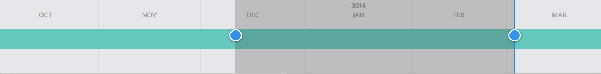

# Análise do desempenho da página{#analyzing-page-performance}

Abra o [Content Insight](/help/sites-authoring/content-insights.md) página para analisar o desempenho da página que você está criando. Configure o período do relatório para focalizar sua análise.

## Abrir o Analytics e o Recommendations em uma página {#opening-analytics-and-recommendations-for-a-page}

Use o procedimento a seguir para ver o Analytics e o Recommendations de uma página:

1. Navegue até a página que deseja analisar.
1. Na barra de ferramentas, clique em **Analytics e Recommendations**.

   >[!NOTE]
   >
   >O Analytics e o Recommendations para uma página somente serão exibidos se você tiver configurado o AEM para [integrar ao Adobe Analytics](/help/sites-administering/adobeanalytics-connect.md).

   

### Alteração do Período de Geração de Relatórios {#changing-the-reporting-period}

Altere os seguintes aspectos relacionados ao tempo dos relatórios de análise:

* O período no qual o relatório será gerado.
* A granularidade dos dados.

As ferramentas para alterar os aspectos relacionados ao tempo dos relatórios aparecem na parte superior da página Content Insight. 

#### Alteração do Período de Geração de Relatórios {#changing-the-reporting-period-1}

Altere o período de geração de relatório da página Content Insight para focalizar sua análise da atividade da página em um período específico. Quando você altera o período do relatório, os relatórios são atualizados automaticamente. A área sombreada no período representa o período do relatório. As datas no período aumentam da esquerda para a direita.

Para alterar o período de geração de relatório de uma página de Content Insight:

1. Se o período de tempo não for exibido na parte superior da página, clique no ícone Alternar período de tempo.

   

1. Para alterar a data de início do período do relatório, arraste o círculo que aparece no lado esquerdo da área sombreada para a data de início desejada.

   Se você não conseguir ver o lado esquerdo da área sombreada, use a barra de rolagem para exibi-la.

1. Para alterar a data final do período do relatório, arraste o círculo que aparece no lado direito da área sombreada para a data final desejada.

#### Alteração da Granularidade do Período de Geração de Relatórios {#changing-the-granularity-of-the-reporting-period}

Alterar o tempo que cada ponto de dados passa em um relatório. Por exemplo, quando a granularidade Semana é selecionada, cada ponto de dados no relatório Exibições representa o número de exibições para uma semana.

A granularidade afeta os relatórios que plotam dados em relação ao tempo, como os relatórios Exibições e Média de páginas em minutos. A granularidade também afeta a escala do período.

1. Se o controle de granularidade não for exibido, clique no ícone Alternar granularidade.

   

1. Clique na granularidade desejada. Depois de selecionado, o relatório é atualizado automaticamente para refletir a granularidade.

### Atribuição de tarefas para SEO Recommendations {#assigning-tasks-for-seo-recommendations}

Use o relatório SEO Recommendations para criar tarefas a fim de melhorar a visibilidade da página para mecanismos de pesquisa. Para cada recomendação no relatório que não tem uma marca de seleção, você pode criar uma tarefa atribuída a um usuário para executar o trabalho necessário.

O status da recomendação da SEO indica quando a tarefa foi criada, mas ainda não foi concluída.

Quando criada, a tarefa aparece na lista Tarefas do usuário. Para obter informações sobre tarefas, consulte [Trabalhar com tarefas](/help/sites-authoring/task-content.md).

Use o procedimento a seguir para criar uma tarefa para uma recomendação da SEO.

1. Clique no ícone de informações da recomendação da SEO.

   

1. Clique no ícone de triângulo delimitado que aparece ao lado do ícone de informações.

   

1. Preencha os campos de formulário exibidos e selecione Criar:

   * Projeto: Selecione o projeto no qual criar a tarefa.
   * Nome: o nome que identifica a tarefa. O nome padrão é o título da recomendação da SEO.
   * Atribuir a: selecione o usuário ao qual a tarefa será atribuída. Comece a digitar o nome do usuário para filtrar a lista.
   * Descrição: Uma descrição da atividade necessária para concluir a tarefa. A descrição padrão são as informações que acompanham a recomendação da SEO.
   * Prioridade da tarefa: a prioridade da tarefa.
   * Data de Vencimento: A data até a qual a tarefa deve ser concluída.

   **Nota:** A tarefa criada também inclui o caminho para a página à qual a recomendação de SEO se aplica.

1. Clique em Concluído para fechar a mensagem Tarefa criada.
