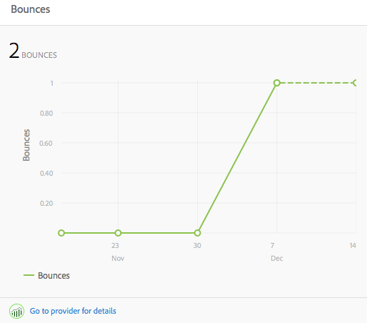

# Content Insight{#content-insight}

O Content Insight fornece informações sobre o desempenho de páginas usando análises da web e recomendações de SEO. Use o Content Insight para tomar decisões sobre como modificar páginas ou para saber como alterações anteriores modificaram o desempenho. Para cada página criada, você pode abrir o Content Insight para analisá-la.

O layout da página do Content Insight muda de acordo com as dimensões da tela e a orientação do dispositivo usado.

## Dados de relatório

A página do Content Insight inclui relatórios que usam dados do Adobe SiteCatalyst, Adobe Target, Adobe Social e BrightEdge:

* SiteCatalyst: há relatórios disponíveis para as seguintes métricas:

   * Exibições da página
   * Tempo médio gasto na página
   * Fontes

* Target: gera relatórios sobre a atividade da campanha para a qual a página inclui ofertas.
* BrightEdge: gera relatórios sobre os recursos da página que melhoram a visibilidade da página para os mecanismos de pesquisa e recomenda os recursos que devem ser implementados.

Consulte [Abrir as Análises e as Recomendações referentes a uma página](/help/sites-authoring/ci-analyze.md#opening-analytics-and-recommendations-for-a-page).

## Período de relatório

Os relatórios mostram os dados de um período de tempo controlado por você. Quando você ajusta o período de relatório, os relatórios são atualizados automaticamente com os dados referentes ao período. As dicas visuais indicam a hora em que as versões da página foram alteradas, de modo a permitir a comparação do desempenho de cada versão.

Também é possível especificar a granularidade dos dados reportados (por exemplo, é possível visualizar dados diários, semanais, mensais ou anuais).

Consulte [Alteração do período de relatório](/help/sites-authoring/ci-analyze.md#changing-the-reporting-period).

>[!NOTE]
>
>Os relatórios do Content Insight exigem que o administrador integre o AEM com o SiteCatalyst, o Target e o BrightEdge. Consulte [Integração com o SightCatalyst](/help/sites-administering/adobeanalytics.md), [Integração com o Adobe Target](/help/sites-administering/target.md)e [Integração com o BrightEdge](/help/sites-administering/brightedge.md).

## O Relatório de exibições {#the-views-report}

O Relatório de exibições inclui os seguintes recursos para avaliar o tráfego da página:

* O número total de exibições de uma página para o período de relatório.
* Um gráfico do número de exibições durante o período de relatório:

   * Total de visualizações.
   * Visitantes únicos.

## O Relatório de média de participação na página {#the-page-average-engaged-report}

O Relatório de média de participação na página inclui os seguintes recursos para avaliar a eficiência da página:

* O tempo médio que a página permanece aberta durante todo o período do relatório.
* Um gráfico da duração média de uma exibição de página durante o período de relatório.

## O Relatório de origens {#the-sources-report}

O Relatório de origens indica como os usuários navegaram até a página (por exemplo, a partir dos resultados de um mecanismo de pesquisa ou usando o URL conhecido).

## O Relatório de devoluções {#the-bounces-report}

O Relatório de devoluções inclui um gráfico que mostra o número de devoluções que ocorreram para uma página durante o período de tempo de relatório selecionado.

## O Relatório de atividades da campanha {#the-campaign-activity-report}

Para cada campanha com página ativa, um relatório é exibido, chamado de Atividades de *Nome da campanha*. O relatório mostra as impressões e conversões de página para cada segmento ao qual uma oferta é fornecida.

## O Relatório de recomendações de SEO {#the-seo-recommendations-report}

O Relatório de recomendações de SEO contém os resultados da análise do BrightEdge para a página. O relatório é uma lista de verificação dos recursos da página que indica quais recursos estão incluídos ou não na página a fim de maximizar a capacidade de localização usando os mecanismos de pesquisa.

O relatório permite criar tarefas para a realização de melhorias na capacidade de localização da página. As recomendações indicam que as tarefas foram criadas para implementar a recomendação. Consulte [Atribuir tarefas para recomendações de SEO](/help/sites-authoring/ci-analyze.md#assigning-tasks-for-seo-recommendations).

