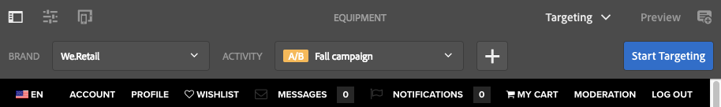
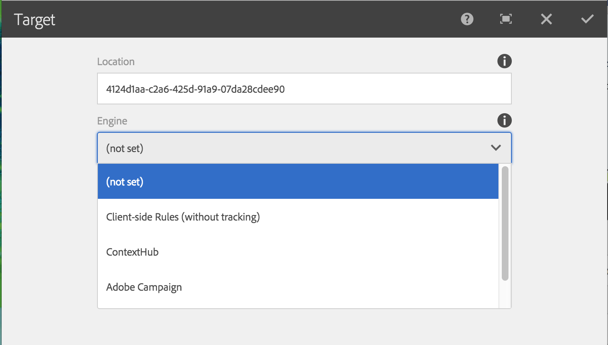

# Criação de conteúdo direcionado usando o modo Direcionar{#authoring-targeted-content-using-targeting-mode}

Crie conteúdo direcionado usando o modo Direcionar do AEM. O modo Direcionar e o componente do Target fornecem ferramentas para criar conteúdo para experiências:

* Reconheça facilmente o conteúdo direcionado que está na página. Uma linha pontilhada forma uma borda em torno de todo o conteúdo direcionado.
* Selecione uma marca e uma atividade para ver as experiências.
* Adicione experiências a uma atividade ou remova experiências.
* Realize testes A/B e converta vencedores (somente no Adobe Target).
* Adicione ofertas a uma experiência criando ofertas ou usando as ofertas de uma biblioteca.
* Configure objetivos e monitore o desempenho.
* Simule a experiência do usuário.
* Para mais customização, configure o componente do Target.

Você pode usar o AEM ou o Adobe Target como o mecanismo de direcionamento (é necessário ter uma conta válida do Adobe Target para usá-lo). Se você estiver usando o Adobe Target, é necessário configurar a integração primeiro. See [instructions for integrating with Adobe Target](/help/sites-administering/target.md).

As atividades e experiências que você vê no modo de Direcionamento refletem o [console Atividades](/help/sites-authoring/activitylib.md):

* As alterações feitas nas atividades e experiências usando o modo de Direcionamento são refletidas no console Atividades.
* As alterações feitas no console Atividades são refletidas no modo de Direcionamento.

>[!NOTE]
>
>Quando você cria uma campanha no Adobe Target, ele atribui uma propriedade chamada `thirdPartyId` a cada campanha. Quando você exclui a campanha no Adobe Target, o thirdPartyId não é excluído. Não é possível reutilizar o `thirdPartyId` para campanhas de tipos diferentes (AB, XT) e ele não pode ser removido manualmente. Para evitar esse problema, nomeie cada campanha como um nome exclusivo; Assim, os nomes de campanhas não podem ser reutilizados em tipos de campanha diferentes.
>
>Se você usar o mesmo nome no mesmo tipo de campanha, a campanha existente será substituída.
>
>Se, durante a sincronização, você encontrar o erro “A solicitação falhou. `thirdPartyId` já existe”, altere o nome da campanha e sincronize novamente.

>[!NOTE]
>
>Ao direcionar, a combinação de identidade visual e atividade é mantida no nível do usuário, não no nível do canal.

## Alternar para o modo de Direcionamento {#switching-to-targeting-mode}

Alterne para o modo de Direcionamento para acessar as ferramentas e criar o conteúdo direcionado.

Para alternar para o modo de Direcionamento:

1. Abra a página para a qual deseja criar o conteúdo direcionado.
1. Na barra de ferramentas na parte superior da página, clique ou toque no menu suspenso de modo para revelar os tipos de modo disponíveis.

   

1. Clique ou toque em **Direcionamento**. As opções de direcionamento são exibidas na parte superior da página.

   

## Adicionar uma atividade usando o modo de direcionamento {#adding-an-activity-using-targeting-mode}

Use o modo de Direcionamento para adicionar uma atividade a uma marca. Quando você adiciona uma atividade, ela contém a experiência Padrão. Depois de adicionar a atividade, você inicia o processo de direcionamento de conteúdo para a atividade.

Também é possível criar e gerenciar as atividades do Adobe Target no AEM com a opção de selecionar o mecanismo de direcionamento (AEM ou Adobe Target) e o tipo de atividade (Direcionamento de experiência ou Teste A/B).

Além disso, é possível gerenciar as metas e métricas de todas as atividades do Adobe Target, bem como gerenciar os públicos do Adobe Target. O relatório de atividades do Adobe Target, incluindo a conversão de vencedores para os testes A/B, também está incluído.

Quando você adiciona uma atividade, ela também é exibida no [console Atividades](/help/sites-authoring/activitylib.md).

Para adicionar uma atividade:

1. Use o menu suspenso **Marca** para selecionar a marca para a qual você deseja criar a atividade.

   >[!NOTE]
   >
   >É recomendado [criar marcas pelo console de atividades](/help/sites-authoring/activitylib.md#creating-a-brand-using-the-activities-console).
   >
   >
   >If you create a brand in any other way, make certain that the node `/campaigns/<brand>/master` exists or an error will result when you attempt to create an activity.

1. Clique ou toque em + ao lado do menu suspenso **Atividade**.
1. Digite um nome para a atividade.

   >[!NOTE]
   >
   >Quando você cria uma nova atividade e tem uma configuração da nuvem do Adobe Target anexada à página ou a uma página principal, o AEM assume automaticamente o Adobe Target como mecanismo.

1. No menu suspenso do mecanismo de **Direcionamento**, selecione o mecanismo direcionamento.

   * If you select **ContextHub AEM**, the remaining fields are dimmed and not available. Clique ou toque em **Criar**.

   * Se você selecionar **Adobe Target**, será possível selecionar uma configuração (por padrão, é a configuração inserida ao [configurar a conta](/help/sites-administering/opt-in.md)) e o tipo de atividade.

   * Se estiver usando a integração AEM/Adobe Campaign e enviar o conteúdo direcionado (boletins informativos), selecione **Adobe Campaign**. Consulte [Integrar com o Adobe Campaign](/help/sites-administering/campaign.md) para obter mais informações.

1. No menu Atividade, selecione **Direcionamento de experiência** ou **Teste A/B**.

   * Direcionamento de experiência - gerencie as atividades do Adobe Target a partir do AEM.
   * Teste A/B - criar/gerenciar atividades de teste A/B no Adobe Target a partir do AEM.

## O processo de direcionamento: Criar, Direcionar e Metas e configurações {#the-targeting-process-create-target-and-goals-settings}

O modo de direcionamento permite configurar diferentes aspectos de uma atividade. Use o seguinte processo de três etapas para criar conteúdo direcionado para uma atividade de marca:

1. [Criar:](#create-authoring-the-experiences) adicione ou remova experiências e adicione ofertas para cada experiência.
1. [Direcionar:](#diagramtargetconfiguringtheaudiences) especifique o público direcionado por cada experiência. É possível direcionar um público específico e, se estiver usando os testes A/B, decidir qual porcentagem do tráfego deve ser alocada para a experiência.
1. [Metas e configurações](#settingsgoalssettingsconfiguringtheactivityandsettinggoals): programe a atividade e defina a prioridade. Também é possível definir metas de métricas de sucesso.

Use o procedimento a seguir para iniciar o processo de direcionamento de conteúdo para uma atividade.

>[!NOTE]
>
>Para usar o processo de definição de metas, você deve ser um membro do grupo de usuários Autores da Atividade do Público alvo.

Para adicionar uma atividade:

1. No menu suspenso **Marca**, selecione a marca que contém a atividade em que você está trabalhando.
1. No menu suspenso **Atividade**, selecione a atividade para a qual você está criando o conteúdo direcionado.
1. Para exibir os controles que orientarão você pelo processo de direcionamento, clique ou toque em **Iniciar o direcionamento**.

   

   >[!NOTE]
   >
   >Para alterar a atividade com a qual você está trabalhando, clique ou toque em **Voltar**.

## Criar: criação de experiências {#create-authoring-the-experiences}

A etapa Criar do direcionamento de conteúdo envolve a criação das experiências. Nesta etapa, é possível criar ou excluir as experiências da atividade, bem como adicionar ofertas a cada experiência.

### Exibir ofertas de experiência no modo de direcionamento {#seeing-experience-offers-in-targeting-mode}

Depois de [iniciar o processo de direcionamento](/help/sites-authoring/content-targeting-touch.md#the-targeting-process-create-target-and-goals-settings), selecione uma experiência para ver as ofertas fornecidas para ela. Quando você seleciona uma experiência, os componentes direcionados na página mudam para exibir a oferta para essa experiência.

>[!CAUTION]
>
>Tenha cuidado ao desabilitar o direcionamento de um componente que já esteja direcionado na instância do autor. A atividade respectiva também será automaticamente excluída da instância de publicação.

>[!NOTE]
>
>Uma oferta é o conteúdo de um componente direcionado.

As experiências são exibidas no painel Públicos-alvo. No exemplo a seguir, as experiências incluem **Padrão**, **Feminino**, **Feminino acima de 30** e **Feminino abaixo de 30**. Este exemplo mostra a oferta Padrão de um componente de **Imagem** direcionado.

Quando uma experiência diferente é selecionada, o componente de imagem mostra a oferta para essa experiência.

Quando uma experiência é selecionada e o componente de destino não inclui uma oferta para essa experiência, o componente exibe **Adicionar oferta** sobreposta à oferta padrão semitransparente. Quando nenhuma oferta é criada para uma experiência, a oferta **Padrão** é exibida no segmento que está mapeado para a experiência.

A experiência padrão também é exibida quando as propriedades do visitante não correspondem aos segmentos mapeados às experiências. See [Adding Experiences using Targeting Mode](#adding-and-removing-experiences-using-targeting-mode).

### Ofertas personalizadas e ofertas da biblioteca {#custom-offers-and-library-offers}

As ofertas [criadas na página](/help/sites-authoring/content-targeting-touch.md#adding-a-custom-offer) e usadas para uma única experiência são chamadas de ofertas personalizadas. A seguinte imagem é sobreposta ao conteúdo de uma oferta personalizada:

As ofertas [adicionadas de uma biblioteca de ofertas](/help/sites-authoring/content-targeting-touch.md#adding-an-offer-from-an-offer-library) são sobrepostas com a seguinte imagem:

É possível salvar as ofertas personalizadas a uma biblioteca de ofertas se quiser reutilizá-las. Também é possível converter uma oferta da biblioteca para uma oferta personalizada se quiser modificar o conteúdo para uma experiência. Depois da edição, é possível salvar a oferta na biblioteca.

### Adicionar e remover experiências usando o modo de direcionamento {#adding-and-removing-experiences-using-targeting-mode}

Na etapa Criar do [processo de direcionamento](/help/sites-authoring/content-targeting-touch.md#the-targeting-process-create-target-and-goals-settings), é possível adicionar e remover experiências. Além disso, é possível duplicar uma experiência e também renomeá-la.

#### Adicionar experiências usando o modo de direcionamento {#adding-experiences-using-targeting-mode}

Para adicionar uma experiência:

1. To add an experience, click or tap **+** **Add Experience Targeting** that appears below existing experiences in the **Audiences** pane.
1. Selecione um público. Por padrão, o nome é o nome da experiência. Você pode digitar outro nome, se desejado. Clique ou toque em **OK**.

#### Remover experiências usando o modo de direcionamento {#removing-experiences-using-targeting-mode}

Para excluir uma experiência:

1. Clique ou toque na seta ao lado do nome da experiência.

   

1. Clique em **Excluir**.

#### Renomear experiências usando o modo de direcionamento {#renaming-experiences-using-targeting-mode}

Para renomear experiências usando o modo de direcionamento:

1. Clique ou toque na seta ao lado do nome da experiência.
1. Click **Rename Experience** and type in the new name.
1. Clique ou toque em outro lugar na tela para salvar as alterações.

#### Editar públicos usando o modo de direcionamento {#editing-audiences-using-targeting-mode}

Para editar os públicos que usam o modo de direcionamento:

1. Clique ou toque na seta ao lado do nome da experiência.
1. Click **Edit Audience** and select a new audience.
1. Clique em **OK**.

#### Duplicar experiências usando o modo de direcionamento {#duplicating-experiences-using-targeting-mode}

Para copiar experiências usando o modo de direcionamento:

1. Clique ou toque na seta ao lado do nome da experiência.
1. Clique em **Duplicar** e escolha o público.
1. Renomeie a experiência, se desejado, e clique em **OK**.

### Criar ofertas usando o modo de direcionamento {#creating-offers-using-targeting-mode}

Direcione um componente para criar ofertas para experiências. Os componentes direcionados fornecem o conteúdo que é usado como ofertas para as experiências.

* [Direcione um componente existente](/help/sites-authoring/content-targeting-touch.md#creating-a-default-offer-by-targeting-an-existing-component). O conteúdo torna-se a oferta da experiência padrão.
* [Adicione um componente de Direcionamento](/help/sites-authoring/content-targeting-touch.md#creating-an-offer-by-adding-a-target-component) e, em seguida, adicione o conteúdo ao componente.

Depois que um componente é direcionado, você pode adicionar ofertas para cada experiência:

* [Adicione ofertas personalizadas](/help/sites-authoring/content-targeting-touch.md#adding-a-custom-offer).
* [Adicione ofertas de uma biblioteca](/help/sites-authoring/content-targeting-touch.md#adding-an-offer-from-an-offer-library).

As seguintes ferramentas estão disponíveis para trabalhar com ofertas:

* [Adicione uma oferta personalizada a uma biblioteca de ofertas](/help/sites-authoring/content-targeting-touch.md#adding-a-custom-offer-to-a-library).
* [Converta uma oferta de biblioteca a uma oferta personalizada](/help/sites-authoring/content-targeting-touch.md#converting-a-library-offer-to-a-custom-library).
* [Abra uma oferta de biblioteca e edite o conteúdo](/help/sites-authoring/content-targeting-touch.md#editing-a-library-offer).

#### Criação de uma oferta padrão direcionando um componente existente {#creating-a-default-offer-by-targeting-an-existing-component}

Direcione um componente na página para usá-lo como oferta para a experiência padrão da atividade. Quando você direciona um componente, ele é envolvido em um componente de Direcionamento e seu conteúdo se torna a oferta para a experiência padrão.

Ao direcionar um componente, somente o componente poderá ser usado na oferta. Não é possível remover o componente da oferta ou adicionar outros componentes à oferta.

Siga o seguinte procedimento após [iniciar o processo de direcionamento](/help/sites-authoring/content-targeting-touch.md#the-targeting-process-create-target-and-goals-settings).

1. Clique ou toque no componente à direcionar. A barra de ferramentas do componente é exibida, semelhante ao exemplo a seguir.

   

1. Clique ou toque no ícone de Direcionamento.

   

   O conteúdo do componente é a oferta para a experiência padrão. Quando um componente é direcionado, seu nó padrão é replicado para cada experiência. Isso é necessário para editar o nó de conteúdo correto durante a criação da experiência. For these non-default experiences, either [add a custom offer](/help/sites-authoring/content-targeting-touch.md#adding-a-custom-offer) or [add a library offer](/help/sites-authoring/content-targeting-touch.md#adding-an-offer-from-an-offer-library).

#### Criação de uma oferta adicionando um componente de Direcionamento {#creating-an-offer-by-adding-a-target-component}

Adicione um componente de Direcionamento para criar a oferta para experiência Padrão. O componente de Direcionamento é um contêiner de outros componentes e os componentes incluídos nele tornam-se direcionados. No componente de Direcionamento, é possível adicionar vários componentes para criar uma oferta. Além disso, é possível usar componentes diferentes em cada experiência para criar ofertas diferentes.

See [Configuring Target component options](/help/sites-authoring/content-targeting-touch.md#configuring-target-component-options) for information on customizing this component.

>[!NOTE]
>
>Offers that you create using the [Offers console](/help/sites-authoring/offerlib.md) can also contain several components. Estas ofertas pertencem a uma biblioteca de ofertas e podem ser usadas para várias experiências.

Como o componente de Direcionamento é um contêiner, ele é exibido como uma área para soltar outros componentes.

No modo de Direcionamento, o componente de Direcionamento tem uma borda azul e a mensagem para soltar indica a natureza de direcionamento.

No modo de Edição, o componente de Direcionamento tem um ícone de alvo.

Quando você arrasta os componentes ao componente de Direcionamento, eles se tornam componentes direcionados.

Quando você adiciona um componente ao componente de Direcionamento, ele fornece o conteúdo para uma experiência específica. Para especificar a experiência, você seleciona a experiência antes de adicionar os componentes.

É possível adicionar um componente de Direcionamento à página no modo de Edição ou no modo de Direcionamento. É possível adicionar componentes ao componente de Direcionamento somente no modo de Direcionamento. O componente de Direcionamento pertence ao grupo do componente de Personalização.

Se estiver editando o conteúdo direcionado, clique ou toque em **Iniciar o direcionamento** antes de fazer isso.

1. Arraste o componente de Direcionamento para a página na qual você deseja exibir a oferta.
1. Por padrão, nenhuma ID de localização é definida. Clique ou toque na roda dentada de configuração para definir a localização.

   >[!NOTE]
   >
   >Se definido pelo administrador, talvez seja necessário definir o local explicitamente.
   >
   >
   >Administrators can decide whether setting this configuration is required at **https://&lt;host>:&lt;port>/system/console/configMgr/com.day.cq.personalization.impl.servlets.TargetingConfigurationServlet**
   Para exigir que os usuários insiram um local, marque a caixa de seleção **Forçar local **Forçar local.

1. Selecione a experiência para a qual deseja criar a oferta.
1. Crie a oferta:

   * Para a experiência Padrão, arraste os componentes para a área de destino e edite as propriedades dos componentes como de costume para criar o conteúdo da oferta.
   * Para experiências diferentes do padrão,[ adicione uma oferta personalizada](#adding-a-custom-offer) ou[ uma oferta da biblioteca](/help/sites-authoring/content-targeting-touch.md#adding-an-offer-from-an-offer-library).

#### Adicionar uma oferta personalizada {#adding-a-custom-offer}

Crie uma oferta, criando o conteúdo de um componente direcionado no modo de direcionamento. Quando você cria uma oferta personalizada, ela é usada como a oferta de uma única experiência.

If you decide that the offer can be used for other experiences, you can create a custom offer and [add it to the library](/help/sites-authoring/content-targeting-touch.md#adding-a-custom-offer-to-a-library). Para obter informações sobre como usar o console Ofertas para criar uma oferta reutilizável, consulte [Adicionar uma oferta a uma biblioteca de ofertas](/help/sites-authoring/offerlib.md#add-an-offer-to-an-offer-library).

1. Selecione a experiência na qual está adicionando a oferta.
1. Para exibir o menu do componente, clique ou toque no componente direcionado ao qual você está adicionando a oferta.

   

1. Clique ou toque no ícone +.

   O conteúdo da oferta padrão é usado como a oferta para experiência atual.

1. Clique ou toque na oferta para exibir o menu da oferta e, em seguida, clique ou toque no ícone Editar.

   

1. Edite o conteúdo do componente.

#### Adicionar uma oferta de uma biblioteca de ofertas {#adding-an-offer-from-an-offer-library}

Add an offer from the [offer library](/help/sites-authoring/offerlib.md) to an experience. É possível adicionar qualquer oferta da biblioteca da marca que você está direcionando.

Não é possível adicionar ofertas da biblioteca à experiência padrão.

1. Selecione a experiência na qual está adicionando a oferta.
1. Para exibir o menu do componente, clique ou toque no componente direcionado ao qual você está adicionando a oferta.

   

1. Clique ou toque no ícone de pasta.

   

1. Selecione a oferta da biblioteca e clique ou toque no ícone de marca de seleção.

   

   O seletor de oferta permite procurar ou filtrar as ofertas. Ao navegar ou filtrar, também é possível classificar as ofertas e alterar como você as vê. O número na parte superior direita indica quantas ofertas estão disponíveis na biblioteca atual.

   * Click or tap **Browse** to navigate to another folder. O painel de navegação é aberto e você clica na seta para mostrar o detalhamento das pastas. Click or tap **Browse** again to close the navigation pane.

   

   * Clique ou toque em **Filtro** para filtrar as ofertas com relação a palavras-chave ou tags. Você digita as palavras-chave e seleciona as tags no menu suspenso. Clique ou toque novamente em **Filtro** para fechar o painel de filtragem.

   

   * Altere a forma como você classifica as ofertas clicando ou tocando na seta ao lado de **Do mais novo ao mais antigo**. As ofertas podem ser ordenadas da mais recente para a mais antiga ou da mais antiga para a mais recente.

   

   Clique ou toque no ícone ao lado de **Exibir como** para exibir as ofertas como mosaicos ou como uma lista.

   

#### Adicionar uma oferta personalizada a uma biblioteca {#adding-a-custom-offer-to-a-library}

Adicione uma oferta personalizada à [biblioteca de ofertas](/help/sites-authoring/offerlib.md) se quiser reutilizá-la em várias experiências. É possível adicionar ofertas à biblioteca da marca atual que você está direcionando.

Para obter informações sobre como usar o console Ofertas para criar uma oferta reutilizável, consulte [Adicionar uma oferta a uma biblioteca de ofertas](/help/sites-authoring/offerlib.md#add-an-offer-to-an-offer-library).

1. Selecione a experiência para revelar a oferta personalizada.
1. Clique ou toque na oferta personalizada para exibir o menu da oferta e, em seguida, clique ou toque no ícone **Salvar oferta na biblioteca de ofertas**.

   

1. Digite um nome para a oferta, selecione a biblioteca à qual você está adicionando a oferta e clique ou toque no ícone de marca de seleção.

#### Converter uma oferta de biblioteca a uma biblioteca personalizada {#converting-a-library-offer-to-a-custom-library}

Converta uma oferta de biblioteca a uma oferta personalizada para alterar a oferta para a experiência atual sem alterá-la em outras experiências.

1. Selecione a experiência para revelar a oferta da biblioteca.
1. Clique ou toque na oferta da biblioteca para exibir o menu da oferta e, em seguida, clique ou toque no ícone Converter para oferta inline.

   

#### Editar uma oferta da biblioteca {#editing-a-library-offer}

Abra uma oferta de biblioteca a partir de uma experiência no modo Direcionamento para editar a oferta. As modificações feitas aparecem em todas as experiências que usam a oferta.

1. Selecione a experiência para revelar a oferta da biblioteca.
1. Converta a oferta da biblioteca oferta local/personalizada. See [Converting a Library Offer to a Custom Library](#converting-a-library-offer-to-a-custom-library).
1. Edite o conteúdo da oferta.

1. Salve na biblioteca. See [Adding a Custom Offer to a Library](#adding-a-custom-offer-to-a-library).

## Direcionar: configurar os públicos {#target-configuring-the-audiences}

A etapa Direcionar do [processo de direcionamento](/help/sites-authoring/content-targeting-touch.md#the-targeting-process-create-target-and-goals-settings) envolve o mapeamento dos públicos com as experiências utilizadas na etapa Criar. A página de Direcionamento mostra os públicos direcionados por cada experiência. É possível especificar ou alterar o público para cada experiência. Se estiver usando o Adobe Target, também poderá criar testes A/B que permitem direcionar uma porcentagem do tráfego de um público para uma experiência específica.

### Se estiver usando o direcionamento do AEM ou o Adobe Target (direcionamento de experiência)... {#if-you-are-using-aem-targeting-or-adobe-target-experience-targeting}

Os públicos são exibidos no lado esquerdo do diagrama de mapeamento e as experiências, no lado direito.

Defina um público usando um segmento. A configuração da nuvem para a página determina os segmentos que estão disponíveis para você. Quando a página não está associada a uma configuração da nuvem do Adobe Target, os segmentos do AEM ficam disponíveis para definir os públicos. Quando a página está associada a uma configuração da nuvem do Adobe Target, você usa os segmentos de Direcionamento.

Para obter informações sobre mecanismos de direcionamento, consulte [Mecanismo de direcionamento](/help/sites-authoring/personalization.md#targeting-engine).

Um público não deve ser usado por mais de uma experiência. Um símbolo de aviso aparecerá ao lado de uma experiência quando ela for mapeada a um público que está mapeado a outra experiência.

### Associar experiências a públicos (AEM ou Adobe Target) {#associating-experiences-with-audiences-aem-or-adobe-target}

Use o seguinte procedimento para associar uma experiência a um público usando o direcionamento do AEM (ou o direcionamento de experiência do Adobe Target):

1. Clique ou toque na seta suspensa ao lado da caixa do público que está mapeado à experiência.
1. (Optional) Click or tap **Edit** and then type a keyword to search for the desired segment.
1. Na lista de públicos, selecione o público e clique ou toque em **OK**.

### Se estiver usando o Teste A/B (Adobe Target)... {#if-you-are-using-a-b-testing-adobe-target}

Se tiver uma atividade de teste A/B, os públicos estarão à esquerda, a porcentagem de exibição de cada experiência estará no centro e as experiências estarão à direita.

É possível alterar as porcentagens, desde que somem 100 por cento. Um público pode ser usado por várias experiências em testes A/B.

### Associar públicos e porcentagens de tráfego aos testes A/B {#associating-audiences-and-traffic-percentages-with-a-b-testing}

1. Clique ou toque na caixa suspensa ao lado do público que está mapeado à experiência.
1. (Opcional) Clique em **Editar** e digite uma palavra-chave para pesquisar pelo segmento desejado.
1. Clique ou toque em **OK.**
1. Insira as porcentagens para configurar como o tráfego do público é distribuído a cada experiência. O número total deve ser igual a 100.
1. (Opcional) Edite o nome da experiência clicando no menu suspenso ao lado do nome da experiência.

## Metas e configurações: configurar a atividade e definir metas {#goals-settings-configuring-the-activity-and-setting-goals}

The Goals &amp; Settings step of [the targeting process](/help/sites-authoring/content-targeting-touch.md#the-targeting-process-create-target-and-goals-settings) involves configuring the behavior of the brand activity. Especifique quando a atividade começa e termina, bem como sua prioridade. Além disso, você também rastreia metas. Especificamente, é possível decidir o que deseja medir com suas atividades.

As medidas de meta somente estão disponíveis se você usar o Adobe Target como mecanismo de direcionamento. Você deve definir pelo menos uma métrica de meta. Se tiver o Adobe Analytics configurado e uma configuração da nuvem A4T do Analytics, será possível selecionar se deseja que a origem dos relatórios seja o Adobe Target ou o Adobe Analytics.

As métricas de meta são medidas somente para a campanha publicada.

Se estiver usando o AEM como o mecanismo de direcionamento:

Se estiver usando o Adobe Target como mecanismo de direcionamento:

Se estiver usando o Adobe Target como mecanismo de direcionamento e tiver o A4T Analytics configurado para a conta, terá um menu suspenso **Fonte de relatórios** adicional:

As seguintes métricas de sucesso estão disponíveis (usadas somente para publicação):

<table>
 <tbody>
  <tr>
   <td><strong>Conversão</strong></td>
   <td>
A porcentagem de visitantes que clicaram em qualquer parte da experiência que está sendo testada. Uma conversão pode ser contada uma vez por visitante ou cada vez que um visitante conclui uma conversão. A métrica de conversão é definida como uma das seguintes opções:

    <ul>
     <li><strong>Exibida uma página</strong> - você pode definir que página a audiência visualizada selecionando o <strong>URL e, em seguida, definindo o URL ou vários URLs, ou selecionando</strong> URL contém <strong></strong> e, em seguida, adicionando um caminho ou uma palavra-chave.</li>
     <li><strong>Exibida uma mbox</strong> - você pode definir qual mbox sua audiência exibiu digitando o nome da mbox. You can enter multiple mboxes by clicking <strong>Add an Mbox</strong>.</li>
    </ul> </td>
  </tr>
  <tr>
   <td><strong>Receita</strong></td>
   <td>
Receita gerada pela visita. Você pode escolher entre as seguintes métricas de receita:

    <ul>
     <li>Receita por Visitante (RPV)</li>
     <li>Valor médio de pedido (AOV)</li>
     <li>Total de vendas </li>
     <li>Pedidos</li>
    </ul> 
Para qualquer uma dessas opções, se uma mbox foi visualizada indica que a meta foi atingida. É possível definir a mbox ou várias mboxes.
 </td>
  </tr>
  <tr>
   <td><strong>Envolvimento</strong></td>
   <td>
Você pode medir três tipos de envolvimento:

    <ul>
     <li>Exibições da página</li>
     <li>Marcação personalizada</li>
     <li>Horário no site</li>
    </ul> </td>
  </tr>
 </tbody>
</table>

Além disso, há as configurações avançadas que permitem determinar como contar métricas de sucesso. As opções incluem a contagem da métrica por impressão ou uma vez a cada visitante e a escolha entre manter o usuário na atividade ou removê-lo.

Use as configurações avançadas para determinar o que acontece **depois** que um usuário atinge a métrica de meta. A tabela a seguir mostra as opções disponíveis.

<table>
 <tbody>
  <tr>
   <td><strong>Depois que um usuário encontra essa métrica de objetivo...</strong></td>
   <td><strong>Você seleciona o seguinte para acontecer...</strong></td>
  </tr>
  <tr>
   <td><strong>Incrementar contagem e manter usuário em atividade</strong></td>
   <td>Especifique como a contagem é aumentada:
    <ul>
     <li>Uma vez por participante</li>
     <li>Em cada impressão, excluir atualizações de página</li>
     <li>Em todas as impressões</li>
    </ul> </td>
  </tr>
  <tr>
   <td><strong>Incrementar contagem, liberar usuário e permitir reentrada</strong></td>
   <td>Selecione a experiência que o visitante vê se ele entrar novamente na atividade:
    <ul>
     <li>Mesma experiência</li>
     <li>Experiência aleatória</li>
     <li>Experiência não vista</li>
    </ul> </td>
  </tr>
  <tr>
   <td><strong>Aumentar contagem, liberar usuário e reentrada de barra</strong></td>
   <td>Determine o que o usuário vê em vez do conteúdo da atividade:
    <ul>
     <li>Mesma experiência, sem rastreamento</li>
     <li>Conteúdo padrão ou outro conteúdo de atividade</li>
    </ul> </td>
  </tr>
 </tbody>
</table>

Consulte a [documentação do Adobe Target](https://docs.adobe.com/content/help/en/target/using/activities/success-metrics/success-metrics.html) para obter mais informações sobre a métrica de sucesso.

### Definição das configurações (direcionamento do AEM) {#configuring-settings-aem-targeting}

Para definir se o direcionamento do AEM deve ser usado:

1. Para especificar quando a atividade começa, use o menu suspenso **Início** para selecionar um dos seguintes valores:

   * **Quando ativado**: a atividade começa quando a página que contém o conteúdo direcionado é ativada.
   * **Data e hora especificada**: um momento específico. Ao selecionar essa opção, clique ou toque no ícone de calendário, selecione uma data e especifique a hora para iniciar a atividade.

1. Para especificar quando a atividade termina, use o menu suspenso **Fim** para selecionar um dos seguintes valores:

   * **Quando desativado**: a atividade termina quando a página que contém o conteúdo direcionado é desativada.
   * **Data e hora especificada**: um horário específico. Ao selecionar essa opção, clique ou toque no ícone de calendário, selecione uma data e especifique a hora para concluir a atividade.

1. Para especificar uma prioridade para a atividade, use o controle deslizante e selecione **Baixa**, **Normal** ou **Alta**.

### Configurar metas e configurações (Adobe Target) {#configuring-goals-settings-adobe-target}

Para definir metas e configurações usando o Adobe Target:

1. Para especificar quando a atividade começa, use o menu suspenso **Início** para selecionar um dos seguintes valores:

   * **Quando ativado**: a atividade começa quando a página que contém o conteúdo direcionado é ativada.
   * **Data e hora especificada**: um momento específico. Ao selecionar essa opção, clique ou toque no ícone de calendário, selecione uma data e especifique a hora para iniciar a atividade.

1. Para especificar quando a atividade termina, use o menu suspenso **Fim** para selecionar um dos seguintes valores:

   * **Quando desativado**: a atividade termina quando a página que contém o conteúdo direcionado é desativada.
   * **Data e hora especificada**: um horário específico. Ao selecionar essa opção, clique ou toque no ícone de calendário, selecione uma data e especifique a hora para concluir a atividade.

1. Para especificar uma prioridade para a atividade, use o controle deslizante e selecione **Baixa**, **Normal** ou **Alta**.
1. Se tiver configurado o Adobe Anaytics com sua conta do Adobe Target, você verá o menu suspenso **Fonte dos relatórios**. Selecione **Adobe Target** ou **Adobe Analytics** como a fonte.

   Se você selecionar **Adobe Analytics**, selecione a empresa e o conjunto de relatórios. Se você selecionar **Adobe Target**, nenhuma ação será necessária.

   

1. Na área **Métrica de meta**, em **Meu objetivo principal**, selecione a métrica de sucesso que deseja rastrear - Conversão, Receita, Participação - e insira como essa métrica é medida (ou que ação o público-alvo executa para indicar que um objetivo foi atingido). Consulte a definição das métricas de objetivo na tabela anterior e consulte a [documentação do Adobe Target](https://docs.adobe.com/content/help/en/target/using/activities/success-metrics/success-metrics.html) sobre métricas de sucesso.

   Você pode renomear a meta ao clicar nos três pontos no canto superior direito e selecionar **Renomear**.

   Se precisar limpar todos os campos, clique nos três pontos no canto superior direito e selecione **Limpar todos os campos**.

   Todas as métricas também possuem configurações avançadas que você pode definir. Selecione **Configurações avançadas** para acessá-las. See definition of how success metrics are counted in previous table and see [Adobe Target documentation](https://docs.adobe.com/content/help/en/target/using/activities/success-metrics/success-metrics.html).

   >[!NOTE]
   Você deve ter, pelo menos, uma meta definida.

   

   >[!NOTE]
   Se alguma informação estiver faltando na sua métrica, uma linha vermelha circulará a métrica.

1. Clique em **Adicionar uma nova métrica** para configurar métricas de sucesso adicionais.

   

   >[!NOTE]
   É possível remover metas adicionais clicando ou tocando nas reticências e em **Excluir**. O AEM requer que você tenha pelo menos uma meta definida.

1. If you want more control over how success metrics are counted, click or tap **Advanced Settings** to access those.
1. Clique em **Salvar**.

Depois de configurar, será possível [ver o desempenho das atividades](/help/sites-authoring/activitylib.md#viewing-performance-and-converting-winning-experiences-a-b-test) que usam o Adobe Target (direcionamento de experiência ou teste A/B). Além disso, com o direcionamento do teste A/B, é possível [converter os vencedores.](/help/sites-authoring/activitylib.md#viewing-performance-and-converting-winning-experiences-a-b-test)

## Simular uma experiência {#simulating-an-experience}

Simule a experiência de um visitante para verificar se o conteúdo da página é exibido conforme esperado de acordo com o design do conteúdo direcionado. Ao simular, carregue diferentes perfis de usuário e veja o conteúdo direcionado para cada usuário.

Os seguintes critérios determinam o conteúdo que é exibido ao simular a experiência de um visitante:

* Os dados no armazenamento da sessão do usuário (via Context Hub).
* As [atividades ativadas](/help/sites-authoring/activitylib.md).
* As [regras que definem os segmentos](/help/sites-administering/campaign-segmentation.md).
* O conteúdo das experiências nos componentes do Target.
* A [configuração do mecanismo de direcionamento.](/help/sites-authoring/activitylib.md)

Se um conteúdo inesperado aparecer na página ao carregar um perfil, verifique a configuração de cada item na lista.

>[!NOTE]
Se estiver usando o teste A/B, ao simular, as experiências serão exibidas com base na porcentagem de tráfego. Isso é controlado pelo Adobe Target, o que pode levar a resultados inesperados para os autores. (A atividade _author é sincronizada com as configurações específicas que permitem uma nova avaliação durante a simulação.) Os autores podem precisar atualizar para ver as outras experiências com base em suas configurações de tráfego.

Para simular a experiência do visitante, use as seguintes ferramentas:

* A atividade de simulação no modo de Direcionamento: a página exibe as ofertas para o usuário que está selecionado atualmente no Context Hub. É possível editar as ofertas direcionadas ao usuário.
* Modo de visualização: use o Context Hub para selecionar os usuários e locais que atendem aos critérios dos segmentos que baseiam suas experiências. Quando as seleções do Context Hub mudam, o conteúdo direcionado muda de acordo.

1. To switch to Preview mode, on the toolbar click or tap **Preview**.
1. Na barra de ferramentas, clique ou toque no ícone do Context Hub.

   

1. Use o Context Hub para alterar as propriedades de contexto. Por exemplo, clique ou toque na propriedade Persona para selecionar um usuário diferente.

   

   A página muda para mostrar o conteúdo direcionado para o contexto atual.

1. Para fazer alterações nas ofertas que são exibidas, alterne para o modo de Direcionamento. Com a atividade de simulação selecionada, edite as ofertas para o contexto que você configurou no modo de Visualização.

## Configuração das opções do componente de Direcionamento {#configuring-target-component-options}

É possível personalizar o componente de Direcionamento acessando as opções do componente de duas maneiras:

1. Depois de direcionar o componente, no componente de Direcionamento, clique ou toque no componente e no ícone de configurações (roda dentada).

   

   O AEM exibe a janela de opções do componente de Direcionamento.

   

1. Como alternativa, para acessar essas configurações no modo de tela cheia, na janela de opções do componente de Direcionamento, clique ou toque no ícone de tela cheia.

   

   O AEM exibe a janela de opções do componente de Direcionamento em tela cheia.

   

1. Defina as configurações do componente de Direcionamento conforme descrito nas tabelas a seguir.

<table>
 <tbody>
  <tr>
   <td><strong>Opção</strong></td>
   <td><strong>Descrição</strong></td>
  </tr>
  <tr>
   <td><strong>Local</strong></td>
   <td>
O local é uma string que dá um nome ao local do conteúdo direcionado e conecta as ofertas a locais (ou locais ou componentes) na página onde essas ofertas devem ser colocadas.
 
Este campo é um valor genérico.
 
Se você adicionar uma oferta a um componente, ela se lembrará da ID de localização. Quando a página é executada, o mecanismo avalia os segmentos do usuário e, com base nisso, resolve as experiências a partir das campanhas ativas que devem ser exibidas. Em seguida, verifica as IDs de localização na página e tenta corresponder ofertas com essas IDs de localização.
 </td>
  </tr>
  <tr>
   <td><strong>Mecanismo</strong></td>
   <td>Selecione entre Regras do lado do <strong>cliente (sem rastreamento), Adobe Target, ContextHub </strong>e<strong> Adobe Campaign </strong>dependendo do mecanismo que você deseja usar.</td>
  </tr>
 </tbody>
</table>

Se você selecionar Adobe Target como mecanismo:

<table>
 <tbody>
  <tr>
   <td><strong>Opção</strong></td>
   <td><strong>Descrição</strong></td>
  </tr>
  <tr>
   <td><strong>Destinação exata</strong></td>
   <td>
Habilitar a definição de metas precisa indica ao componente que aguarde até que os dados do contexto do cliente ou do hub de contexto estejam disponíveis antes de enviar a solicitação para a Adobe Target. Pode aumentar o tempo de carregamento. Ao criar, o direcionamento preciso está sempre ativado.
 
If you select the <strong>Accurate targeting</strong> check box, the mbox performs an <code>mboxDefine</code> first and an <code>mboxUpdate</code> later resulting in an Ajax request once the data is available.
 
If you do not select the <strong>Accurate targeting</strong> check box, the mbox performs an <code>mboxCreate</code> resulting in a synchronous request right away (in this case, not all context data may be available yet).
 
<strong>Observação:</strong> A ativação ou desativação de direcionamento preciso em um componente específico não afeta as configurações definidas globalmente. Sempre é possível substituir as configurações globais selecionando Direcionamento preciso no componente.
 </td>
  </tr>
  <tr>
   <td><strong>Incluir segmentos resolvidos</strong></td>
   <td>
Marcar essa caixa de seleção inclui todos os segmentos resolvidos na chamada da mbox e quaisquer parâmetros configurados na página e na estrutura.
 
Somente funciona em situações com a API XML na qual você está sincronizando os segmentos do AEM. Se tiver segmentos no AEM que não são manipulados pelo Adobe Target (como segmentos de script), essa opção permite resolver o segmento no AEM e enviar informações para o Adobe Target de que o segmento está ativo.
 </td>
  </tr>
  <tr>
   <td><strong>Parâmetros herdados de contexto</strong></td>
   <td>Parâmetros de contexto do Lista herdados da estrutura do Adobe Target, se houver, associados à página selecionada.</td>
  </tr>
  <tr>
   <td><strong>Parâmetros de contexto</strong></td>
   <td>Clique ou toque em <strong>Adicionar campo</strong> para configurar parâmetros de contexto adicionais (o mesmo que está disponível na estrutura do Público alvo). Context parameters added to the component apply <i>only</i> to the component and not to other component as would be the case if you added context parameters directly to the framework.</td>
  </tr>
  <tr>
   <td><strong>Params estáticos</strong></td>
   <td>Clique ou toque em <strong>Adicionar campo</strong> para configurar parâmetros estáticos adicionais (o mesmo que está disponível na estrutura do Público alvo). Static parameters added to the component apply <i>only</i> to the component and not to other component as would be the case if you added static parameters directly to the framework. Os parâmetros estáticos não provêm do contexto (contexto do cliente do content hub).</td>
  </tr>
 </tbody>
</table>

>[!NOTE]
Quando você seleciona um componente e o torna passível de direcionamento, o AEM também o substitui e introduz um componente do Adobe Target. (O componente do Adobe Target é usado ao adicioná-lo manualmente à página e também ao direcionar um componente existente.)

Se você selecionar Client Context (lado do cliente) como mecanismo:

<table>
 <tbody>
  <tr>
   <td><strong>Opção</strong></td>
   <td><strong>Descrição</strong></td>
  </tr>
  <tr>
   <td><strong>Opções do lado do cliente - Estratégia</strong></td>
   <td>
Selecione uma das seguintes opções:

    <ul>
     <li><strong>Primeiro</strong>: A experiência mais alta na lista, conforme ordenado na campanha.</li>
     <li><strong>Aleatório</strong>: Qualquer experiência é usada.</li>
     <li><strong>Pontuação</strong>da sequência de cliques: As tags e as ocorrências de tags relacionadas que são rastreadas no contexto do cliente são usadas. As taxas de ocorrência de tags definidas na página de teaser são comparadas.</li>
    </ul> </td>
  </tr>
 </tbody>
</table>

Selecione **Adobe Campaign** como mecanismo se estiver integrando o AEM com o Adobe Campaign. Consulte [Integrar o AEM com o Adobe Campaign](/help/sites-administering/campaign.md) para obter mais informações.

Selecione **ContextHub** como mecanismo se estiver usando o ContextHub para o direcionamento. Consulte [Configurar o ContextHub.](/help/sites-developing/ch-configuring.md)
