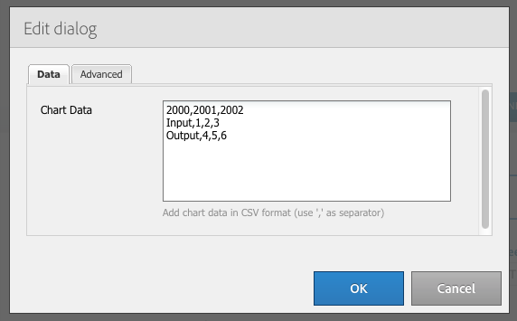
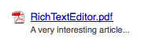
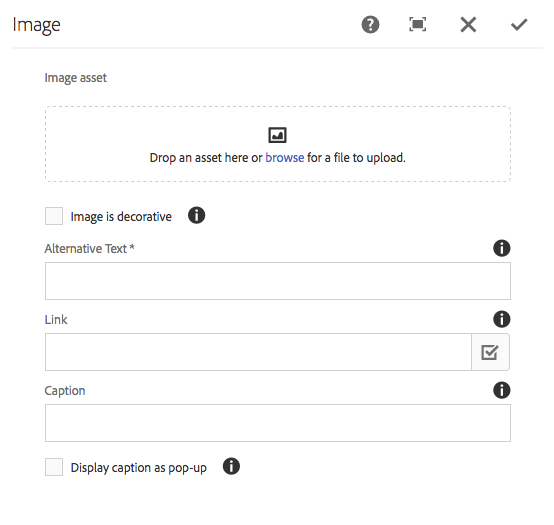
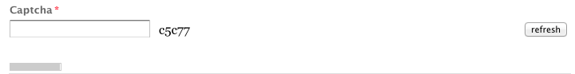

# Componentes de base {#foundation-components}

>[!CAUTION]
>
>A maioria dos componentes básicos agora está obsoleta com o AEM 6.5. Consulte a [notas de versão](/help/release-notes/deprecated-removed-features.md) para obter mais informações.
>
>O Adobe recomenda usar o mais moderno e extensível [Componentes principais](https://experienceleague.adobe.com/docs/experience-manager-core-components/using/introduction.html?lang=pt-BR) em projetos AEM. Esses componentes fazem parte da [Conteúdo de amostra do We.Retail](/help/sites-developing/we-retail.md) e também podem ser [instalado separadamente e usado para desenvolvimento](https://experienceleague.adobe.com/docs/experience-manager-core-components/using/get-started/using.html) pelo administrador.
>
>Você pode usar o [AEM Modernizar conjunto de ferramentas](https://opensource.adobe.com/aem-modernize-tools/) para refatorar seu site baseado em Componentes de base para usar os Componentes principais.

Os componentes básicos foram projetados para uso na criação de conteúdo para uma página da Web padrão. Eles formam um subconjunto dos componentes disponíveis prontamente para uma instalação padrão do AEM.

Alguns estão disponíveis imediatamente por meio do navegador de componentes. Vários outros também estão disponíveis usando o [modo de design](/help/sites-authoring/default-components-designmode.md) (se a página for baseada em um modelo estático) ou por [editar o modelo](/help/sites-authoring/templates.md) (se a página for baseada em um modelo editável).

O uso de componentes de base é compatível, mas eles foram descontinuados e substituídos por componentes principais que oferecem mais extensibilidade e flexibilidade.

>[!NOTE]
>
>Esta seção discute apenas os componentes disponíveis prontos para uso em uma instalação padrão do AEM.
>
>Dependendo da sua instância, você pode ter componentes personalizados desenvolvidos explicitamente para suas necessidades. Esses componentes personalizados podem até ter o mesmo nome de alguns dos componentes discutidos aqui.

Os componentes estão disponíveis na guia **Componentes** do painel lateral do editor de páginas ao [editar uma página](/help/sites-authoring/editing-content.md).

Você pode selecionar um componente e arrastá-lo até o local desejado na página. A partir daí é possível editá-lo usando:

* [Configurar propriedades](/help/sites-authoring/editing-page-properties.md)
* [Editar conteúdo](/help/sites-authoring/editing-content.md)

* [Editar conteúdo - Modo de tela cheia](/help/sites-authoring/editing-content.md#edit-content-full-screen-mode)

Os componentes são classificados de acordo com várias categorias chamadas grupos de componentes, incluindo:

* [Geral](#general): inclui componentes básicos, incluindo texto, imagens, tabelas e gráficos.
* [Colunas](#columns): Inclui componentes necessários para organizar o layout do conteúdo.
* [Formulário](#formgroup): inclui todos os componentes necessários para criar um formulário.

## Geral {#general}

Os componentes Gerais são os componentes básicos usados para criar conteúdo.

### Item da conta {#account-item}

>[!CAUTION]
>
>Este componente de base está obsoleto. O Adobe recomenda o uso de [Componentes principais](https://experienceleague.adobe.com/docs/experience-manager-core-components/using/introduction.html?lang=pt-BR) em vez disso.

Você pode definir um link com título e descrição.


### Imagem adaptativa {#adaptive-image}

>[!CAUTION]
>
>Este componente de base está obsoleto. O Adobe recomenda o uso de [Componente principal da imagem](https://experienceleague.adobe.com/docs/experience-manager-core-components/using/wcm-components/image.html?lang=pt-BR) em vez disso.

O componente de base da imagem adaptável gera imagens dimensionadas para caber na janela em que a página da Web é aberta. Para usar o componente, você fornece um recurso de imagem do sistema de arquivos ou do DAM. Quando a página da Web é aberta, o navegador da Web baixa uma cópia da imagem que foi redimensionada para que seja adequada à janela atual.

As seguintes características podem determinar o tamanho da janela:

* Tela do dispositivo: dispositivos móveis normalmente exibem páginas da Web para que se estendam por toda a tela.
* Tamanho da janela do navegador da Web: os usuários de notebooks e desktops podem redimensionar as janelas do navegador da Web.

Por exemplo, o componente gera uma imagem pequena quando a página da Web é aberta em um telefone celular e uma imagem média quando aberta em um tablet. Em um laptop, o componente cria e fornece uma imagem grande quando a página é aberta em um navegador maximizado. Quando o navegador da Web é redimensionado para caber em uma parte da tela, o componente se adapta fornecendo uma imagem menor e atualiza a visualização.

#### Formatos de imagem compatíveis {#supported-image-formats}

Você pode usar arquivos de imagem das seguintes extensões de nome de arquivo com o componente de Imagem adaptável:

* .jpg
* .jpeg
* .png
* .gif &#42;&#42;

>[!CAUTION]
>
>Arquivos GIF animados não são suportados no AEM para representações adaptáveis.

#### Tamanhos e qualidade das imagens {#images-sizes-and-quality}

A tabela a seguir lista a largura da imagem gerada para a largura de visor especificada. A altura da imagem gerada é calculada para manter uma taxa de proporção constante e nenhum espaço em branco ocorre dentro da borda da imagem. O corte pode ser usado para evitar espaços em branco.

Quando a imagem é uma imagem JPEG, o tamanho da janela de visualização também pode influenciar a qualidade da JPEG. As seguintes qualidades de JPEG são possíveis:

* Baixo (0,42)
* Médio (0,82)
* Alta (1,00)

| **Intervalo de largura da janela de visualização (pixels)** | **Largura da imagem (pixels)** | **Qualidade do JPEG** | **Tipo de dispositivo direcionado** |
|---|---|---|---|
| largura &lt;= 319 | 320 | baixa |  |
| largura = 320 | 320 | médio | Celular (retrato) |
| 320 &lt; largura &lt; 481 | 480 | médio | Telefone celular (paisagem) |
| 480 &lt; largura &lt; 769 | 476 | alta | Tablet (retrato) |
| 768 &lt; largura &lt; 1025 | 620 | alta | Tablet (paisagem) |
| largura &lt;= 1025 | total (tamanho original) | alta | Desktop |

#### Propriedades {#properties}

A caixa de diálogo permite editar as propriedades da instância do componente de Imagem adaptável, muitas das quais são comuns ao componente de Imagem no qual ele se baseia. As propriedades estão disponíveis em duas guias:

* **Imagem**

   * **Imagem**
Arraste uma imagem do localizador de conteúdo ou clique para abrir uma janela de navegação onde você pode carregar uma imagem. Depois que a imagem for carregada, você poderá recortá-la, girá-la ou excluí-la. Para ampliar e reduzir a imagem, use a barra deslizante abaixo da imagem (acima dos botões OK e Cancelar)

   * **Cortar**
Recortar parte de uma imagem. Arraste a borda para cortar a imagem.

   * **Girar**
Clique em Girar repetidamente até que a imagem seja girada conforme desejado.

   * **Limpar**
Remover a imagem atual.

* **Avançado**

   * **Título**
O componente de Imagem adaptável não usa essa propriedade.

   * **Texto Alternativo**
O texto alternativo a ser usado para a imagem.

   * **Vincular a**
O componente de Imagem adaptável não usa essa propriedade.

   * **Descrição**
O componente de Imagem adaptável não usa essa propriedade.

#### Extensão do componente de imagem adaptável {#extending-the-adaptive-image-component}

Para obter informações sobre como personalizar o componente de Imagem adaptável, consulte [Como entender o componente de imagem adaptável](/help/sites-developing/responsive.md#using-adaptive-images).

### Carrossel {#carousel}

>[!CAUTION]
>
>Este componente de base está obsoleto. O Adobe recomenda o uso de [Componente principal do carrossel](https://experienceleague.adobe.com/docs/experience-manager-core-components/using/wcm-components/carousel.html?lang=pt-BR) em vez disso.

O componente Carrossel permite exibir imagens associadas a páginas individuais:

* um de cada vez
* por um curto período
* em uma ordem especificada por você
* com um atraso que você especifica

Os controles clicáveis também permitem que o usuário percorra as páginas exibidas em tempo real, sob demanda. A seleção da imagem da página visível atualmente leva você para essa página. Em outras palavras, o Carrossel atua como um controle de navegação.

#### Propriedades {#properties-1}

Essas propriedades estão disponíveis em duas guias:

* **Carrossel**
Aqui você especifica como o carrossel opera:

   * Velocidade de reprodução O tempo em milissegundos antes de o próximo slide ser exibido.
   * Tempo de transição O tempo em milissegundos para a transição entre dois slides.
   * Controles estilo Várias opções estão disponíveis em um menu suspenso; por exemplo, Botões Anterior / Próximo, Comutadores Superior-Direito.

* **Lista**

  Aqui você especifica como as páginas são incluídas no carrossel:

   * **Criar lista usando**
Há várias maneiras de criar uma lista de páginas - Páginas secundárias, Lista fixa, Pesquisa ou Pesquisa avançada (todas descritas abaixo).
Independentemente do método escolhido, as páginas incluídas na lista devem ter, cada uma, uma imagem associada à página. Essa imagem é exibida no Carrossel. Se não houver imagem para uma determinada página nas Propriedades da página, você deve associar uma imagem à página antes de começar. Caso contrário, o Carrossel exibe uma página em branco. Consulte [Editar propriedades da página](/help/sites-authoring/editing-page-properties.md).
Dependendo do item escolhido, um novo painel será exibido:

      * **Opções de páginas secundárias**

         * **Página principal**
Especifique um caminho manualmente ou usando o seletor. Deixe em branco para utilizar a página atual como principal.

      * **Opções para a lista fixa**

         * **Páginas**
Selecione uma lista de páginas. Uso `+` para adicionar mais entradas e os botões de seta para cima/baixo para ajustar a ordem.

      * **Opções de pesquisa**

         * **Iniciar em**
Insira um caminho inicial manualmente ou usando o seletor.

         * **Pesquisar consulta**
Você pode inserir uma consulta de pesquisa de texto simples.

      * **Opções de pesquisa avançada**

         * **Notação de predicativo do Querybuilder**
Você pode inserir uma consulta de pesquisa usando a notação de predicado do Querybuilder. Por exemplo, você pode digitar &quot;fulltext=Marketing&quot; para que todas as páginas com &quot;Marketing&quot; em seu conteúdo sejam exibidas no Carrossel.
Consulte [API do QueryBuilder](/help/sites-developing/querybuilder-api.md) para obter uma discussão completa das expressões de query e mais exemplos.

   * **Ordenar por**
Selecionar `jcr:title`, `jcr:created`, `cq:lastModified`ou `cq:template` no menu suspenso.

   * **Limite**
Opcional. O número máximo de itens que você deseja usar no Carrossel.

>[!NOTE]
>
>Você pode criar um componente de carrossel personalizado para o Adobe Experience Manager que exibe ativos digitais no DAM do AEM. Consulte [Criação de componentes personalizados do carrossel para o Adobe Experience Manager](https://experienceleague.adobe.com/docs/experience-manager-learn/getting-started-wknd-tutorial-develop/overview.html?lang=pt-BR).

### Gráfico {#chart}

>[!CAUTION]
>
>Este componente de base está obsoleto. O Adobe recomenda o uso de [Componentes principais](https://experienceleague.adobe.com/docs/experience-manager-core-components/using/introduction.html?lang=pt-BR) em vez disso.

O componente de Gráfico permite adicionar um gráfico de barras, de linhas ou de pizza. O AEM cria um gráfico a partir dos dados que você fornece. Você fornece dados digitando diretamente na guia Dados ou copiando e colando uma planilha.

* **Dados**

   * **Dados do gráfico**
Insira os dados do gráfico usando o formato CSV; o formato de Valores separados por vírgula usa vírgulas (&quot;,&quot;) como separador de campo.

* **Avançado**

   * **Tipo de gráfico**
Selecione entre Gráfico de Pizza, Gráfico de Linhas e Gráfico de Barras.

   * **Texto alternativo**
Exibe texto alternativo em vez do gráfico.

   * **Largura**
A largura do gráfico em pixels.

   * **Altura**
A altura do gráfico em pixels.

A seguir, há um exemplo de dados de gráfico seguido pelo gráfico de Barras resultante:

 

>[!NOTE]
>
>Você pode criar um controle de gráfico AEM personalizado que exiba dados no JCR AEM. Para obter informações, consulte [Exibição de Dados do Adobe Experience Manager em um Gráfico](https://experienceleague.adobe.com/docs/experience-manager-learn/getting-started-wknd-tutorial-develop/overview.html?lang=pt-BR).

### Fragmento de conteúdo {#content-fragment}

>[!CAUTION]
>
>Este componente de base está obsoleto. O Adobe recomenda o uso de [Componente principal do fragmento de conteúdo](https://experienceleague.adobe.com/docs/experience-manager-core-components/using/wcm-components/content-fragment-component.html?lang=pt-BR) em vez disso.

[Fragmentos de conteúdo](/help/sites-authoring/content-fragments.md) são criados e gerenciados como ativos independentes da página. Em seguida, é possível usar estes fragmentos e suas variações ao criar suas páginas de conteúdo.

### Importador de design {#design-importer}

>[!CAUTION]
>
>Este componente de base está obsoleto. O Adobe recomenda o uso de [Componentes principais](https://experienceleague.adobe.com/docs/experience-manager-core-components/using/introduction.html?lang=pt-BR) em vez disso.

Este componente permite fazer upload de um arquivo zip que contém um pacote de design.

### Download {#download}

>[!CAUTION]
>
>Este componente de base está obsoleto. O Adobe recomenda o uso de [Componentes principais](https://experienceleague.adobe.com/docs/experience-manager-core-components/using/introduction.html?lang=pt-BR) em vez disso.

O componente de Download cria um link na página da Web selecionada para baixar um arquivo específico. Você pode arrastar um ativo do Localizador de conteúdo ou carregar um arquivo.

* **Download**

   * **Descrição**
Uma breve descrição é exibida com o link de download.

   * **Arquivo**
O arquivo está disponível para download na página da Web resultante. Arraste um ativo do localizador de conteúdo ou selecione a área para fazer upload do arquivo que deseja disponibilizar para download.

O exemplo a seguir mostra o componente de Download no Geometrixx:



### Externo {#external}

>[!CAUTION]
>
>Este componente de base está obsoleto. O Adobe recomenda o uso de [Componentes principais](https://experienceleague.adobe.com/docs/experience-manager-core-components/using/introduction.html?lang=pt-BR) em vez disso.

O componente de integração de aplicativos externos (**Externo**) permite incorporar aplicativos externos à página do AEM usando um iframe.

* **Externo**

   * **Aplicativo de destino**
Especifique o URL do aplicativo Web a ser integrado; por exemplo:

     ```
     https://en.wikipedia.org/wiki/Main_Page
     ```

   * **Envio de parâmetros**
Marque a caixa para que os parâmetros sejam passados para o aplicativo quando necessário.

   * **Largura e altura **Definir o tamanho do iframe

O aplicativo externo é integrado ao sistema de parágrafo da página AEM; por exemplo, ao usar um aplicativo do Target de `https://en.wikipedia.org/wiki/Main_Page`:


>[!NOTE]
>
>Dependendo do caso de uso, outras opções estão disponíveis para integração de aplicativos externos, por exemplo, o [Integração de portlets](/help/sites-administering/aem-as-portal.md).

### Flash {#flash}

>[!CAUTION]
>
>Este componente de base está obsoleto. O Adobe recomenda o uso de [Componentes principais](https://experienceleague.adobe.com/docs/experience-manager-core-components/using/introduction.html?lang=pt-BR) em vez disso.

>[!CAUTION]
>
>Não se espera mais que esse componente funcione imediatamente sem uma ampla personalização no nível do projeto.

O componente de Flash permite carregar um filme de Flash. Você pode arrastar um ativo flash do localizador de conteúdo para o componente ou usar a caixa de diálogo:

* **Flash**

   * **Flash filme**

     O arquivo de filme flash. Arraste um ativo do localizador de conteúdo ou clique em para abrir uma janela de navegação.

   * **Tamanho**

     Dimension em pixels da área de exibição que contém o filme.

* **Imagem alternativa**

  Uma imagem alternativa a ser mostrada

* **Avançado**

   * **Menu de contexto**

     Indica se o menu de contexto deve ser exibido ou oculto.

   * **Modo de janela**

     Como a janela aparece, por exemplo, opaca, transparente ou como uma janela distinta (sólida).

   * **Cor do plano de fundo**

     Uma cor de plano de fundo selecionada no gráfico de cores fornecido.

   * **Versão mínima**

     A versão mínima do Flash Player de Adobe necessária para executar o filme. O padrão é 9.0.0.

   * **Atributos**

     Quaisquer outros atributos necessários.

### Imagem {#image}

>[!CAUTION]
>
>Este componente de base está obsoleto. O Adobe recomenda o uso de [Componente principal da imagem](https://experienceleague.adobe.com/docs/experience-manager-core-components/using/wcm-components/image.html?lang=pt-BR) em vez disso.

O componente de imagem exibe uma imagem e o texto que a acompanha de acordo com os parâmetros especificados.

É possível carregar uma imagem, editá-la e manipulá-la (por exemplo, cortar, girar, adicionar link/título/texto).

Você pode arrastar e soltar uma imagem da [Navegador de ativos](/help/sites-authoring/author-environment-tools.md#assets-browser) diretamente no componente ou em seu [Caixa de diálogo Configurar](/help/sites-authoring/editing-content.md#component-edit-dialog). Você poderá também enviar uma imagem da janela de Configuração; esta janela também controla todas as definições e manipulações da imagem:



Depois que a imagem for carregada (e não antes), você poderá usar [edição no local](/help/sites-authoring/editing-content.md#edit-content) para cortar/girar a imagem conforme necessário:


>[!NOTE]
>
>O editor local usa o tamanho original e a proporção da imagem ao editar. Também é possível especificar propriedades de altura e largura. Quaisquer restrições de tamanho e taxa de proporção definidas nas propriedades são aplicadas quando você salva as alterações de edição.
>
>Dependendo da sua instância, as restrições mínimas e máximas também podem ser impostas pela [design da página](/help/sites-developing/designer.md). Essas restrições são desenvolvidas durante a implementação do projeto.

Várias opções adicionais estão disponíveis no modo de edição de tela cheia; por exemplo, map e zoom:


>[!NOTE]
>
>O progresso do upload não pode ser monitorado com o Internet Explorer.
>
>Os usuários do Internet Explorer devem carregar a imagem e clicar em **Ok**, reabra a imagem para ver o arquivo carregado na visualização e poder executar modificações (ou seja, recortar).
>
>Consulte a [Plataformas certificadas](/help/release-notes/release-notes.md#certifiedplatforms) para obter mais informações sobre os recursos de HTML5 usados pelo AEM.

Quando uma imagem é carregada, você pode configurar o seguinte:

* **Mapa**

  Para mapear uma imagem, selecione Mapear. Você pode especificar como deseja criar o mapa de imagem (retângulo, polígono etc.) e onde a área deve apontar.

* **Cortar**

  Para recortar parte de uma imagem, selecione Cortar. Use o mouse para cortar a imagem.

* **Girar**

  Para girar uma imagem, selecione Girar. Use repetidamente até que a imagem seja girada da maneira desejada.

* **Limpar**

  Remover a imagem atual.

* **Título**

  O título da imagem.

* **Texto Alternativo**

  Um texto alternativo a ser usado ao criar conteúdo acessível.

* **Vincular a**

  Crie um link para ativos ou outras páginas no seu site.

* **Descrição**

  Uma descrição da imagem.

* **Tamanho**

  Define a altura e a largura da imagem.

>[!NOTE]
>
>Algumas opções só estão disponíveis no editor de tela cheia.

A imagem final (com **Título** e **Descrição**) pode ser mostrado como:


### Contêiner de layout {#layout-container}

Esse componente fornece um sistema de parágrafo de grade para permitir adicionar e posicionar componentes em um [grade responsiva](/help/sites-authoring/responsive-layout.md). Você pode definir layouts de conteúdo diferentes com base na largura dos dispositivos de destino, incluindo uma variedade de telefones, tablets e área de trabalho.


>[!NOTE]
>
>Este componente foi implementado com [Linguagem de modelo HTML (HTL)](https://experienceleague.adobe.com/docs/experience-manager-htl/content/overview.html?lang=pt-BR).

### Lista {#list}

>[!CAUTION]
>
>Este componente de base está obsoleto. O Adobe recomenda o uso de [Listar Componente Principal](https://experienceleague.adobe.com/docs/experience-manager-core-components/using/wcm-components/list.html) em vez disso.

O componente Lista permite configurar critérios de pesquisa para exibir uma lista:

* **Lista**

   * **Criar lista usando**

     Aqui você especifica onde a lista recupera o conteúdo. Há vários métodos:

   * Dependendo do item escolhido, um novo painel será exibido:

      * **Opções de páginas secundárias**

         * **Filhos de** (Página principal)

           Especifique um caminho manualmente ou usando o seletor. Deixe em branco para utilizar a página atual como principal.

      * **Opções para a lista fixa**

         * **Páginas**

           Selecione uma lista de páginas. Use + para adicionar mais entradas e os botões para cima/baixo para ajustar a ordem.

      * **Opções de pesquisa**

         * Começa em

           Insira um caminho inicial manualmente ou usando o seletor.

         * Pesquisar consulta

           Você pode inserir uma consulta de pesquisa de texto simples.

      * **Opções de pesquisa avançada**

         * **Notação de predicativo do Querybuilder**

           Você pode inserir uma consulta de pesquisa usando a notação de predicado do Querybuilder. Por exemplo, você pode digitar &quot;fulltext=Marketing&quot; para que todas as páginas com &quot;Marketing&quot; em seu conteúdo sejam exibidas no Carrossel.

           Consulte [API do QueryBuilder](/help/sites-developing/querybuilder-api.md) para obter uma discussão completa das expressões de query e mais exemplos.

      * **Tags**

        Especifique a **Página principal**, **Tags/Palavras-chave** e os critérios de correspondência necessários.

   * **Exibir como**

     Como você deseja que os itens sejam listados; inclui Links, Teasers e Notícias.

   * **Ordenar por**

     Se a lista deve ser ordenada e, em caso afirmativo, os critérios a serem usados para a classificação. Você pode inserir um critério ou selecionar um na lista suspensa fornecida.

   * **Limite**

     Especifique o número máximo de itens que deseja exibir na lista.

   * **Ativar feed**

     Indica se um feed RSS deve ser ativado para a lista.

   * **Paginar após**

     Aqui você pode especificar o número de itens da lista a serem exibidos de uma vez. Uma lista com mais itens do que o especificado usa a paginação para exibir a lista em várias partes.

O exemplo a seguir mostra uma **Lista** forma como ele pode exibir uma lista de páginas secundárias (o design é controlado por definições CSS personalizadas de um design de site).


### Logon {#login}

>[!CAUTION]
>
>Este componente de base está obsoleto. O Adobe recomenda o uso de [Componentes principais](https://experienceleague.adobe.com/docs/experience-manager-core-components/using/introduction.html?lang=pt-BR) em vez disso.

>[!CAUTION]
>
>Não se espera mais que esse componente funcione imediatamente sem uma ampla personalização no nível do projeto.

Fornece os campos Nome de usuário e Senha.


Você pode configurar:

* Fazer Logon

   * Rótulo da seção

     Texto de lead-in para os campos de entrada.

   * Rótulo do nome de usuário

     Texto para rotular o campo de nome de usuário.

   * Rótulo da senha

     Texto para rotular o campo de senha.

   * Rótulo do botão de logon

     Texto do botão de logon.

   * Redirecionar para

     Você pode especificar a página do site que deve ser aberta depois que o usuário fizer logon.

* Já está conectado.

   * Continuar a etiqueta do botão

     Texto para indicar que o usuário já está conectado.

### Status do pedido {#order-status}

>[!CAUTION]
>
>Não se espera mais que esse componente funcione imediatamente sem uma ampla personalização no nível do projeto.

* **Título**

   * **Título**

     Especifique o texto do título que deseja exibir.

   * **Link**

     Especifique a página (produto) para a qual o status do pedido deve ser exibido.

   * **Tipo/tamanho**

     Selecione a partir da seleção fornecida.


### Referência {#reference}

>[!CAUTION]
>
>Este componente de base está obsoleto. O Adobe recomenda o uso de [Componente principal do fragmento de conteúdo](https://experienceleague.adobe.com/docs/experience-manager-core-components/using/wcm-components/content-fragment-component.html?lang=pt-BR) em vez disso.

A variável **Referência** permite referenciar o texto de outra página do site do AEM (na instância atual). O conteúdo do parágrafo referenciado aparece como se estivesse na página atual. O conteúdo é atualizado quando o parágrafo de origem é alterado (pode ser necessário atualizar a página).

* **Referência do parágrafo**

   * **Referência**

     Especifique o caminho para a página e o parágrafo que deseja referenciar (inclua o conteúdo).

Para especificar o caminho para um parágrafo, você deve usar o seguinte sufixo no caminho (para a página):

`.../jcr:content/par/<paragraph-ID>`

Por exemplo:

`/content/geometrixx-outdoors/en/equipment/biking/cajamara/jcr:content/par/similar-products`

Além de fazer referência a um parágrafo específico, o caminho também pode ser modificado para especificar um par-system inteiro. Você pode fazer essa referência ao colocar o caminho com o seguinte sufixo:

`/jcr:content/par`

Por exemplo:

`/content/geometrixx-outdoors/en/equipment/biking/cajamara/jcr:content/par`

Após a configuração, o conteúdo é exibido exatamente como na página de origem. O fato de ser uma referência só é visto quando você abre o componente para edição:


### Pesquisar {#searching}

>[!CAUTION]
>
>Este componente de base está obsoleto. O Adobe recomenda o uso de [Componente principal de Pesquisa rápida](https://experienceleague.adobe.com/docs/experience-manager-core-components/using/wcm-components/quick-search.html) em vez disso.

O componente de Pesquisa adiciona o recurso de pesquisa à página.

Você pode configurar:

* Pesquisar

   * **Tipos de nós**

     Se a pesquisa precisar ser restrita a um tipo de nó específico, liste-os aqui; por exemplo, `cq:Page`.

   * **Caminho para pesquisar em**

     Especifique a página raiz da ramificação que deseja pesquisar.

   * **Texto do botão de pesquisa**

     O nome exibido no botão de pesquisa real.

   * **Texto de estatísticas**

     O texto exibido acima dos resultados da pesquisa.

   * **Nenhum texto de resultados**

     Se não houver resultados, o texto inserido aqui será exibido.

   * **Texto de verificação ortográfica**

     Se alguém inserir um termo semelhante, este texto será exibido antes do termo.
Por exemplo, se você digitar `Geometrixxe`, o sistema exibe &quot;Você quis dizer? Geometrixx&quot;.

   * **Texto de páginas semelhantes**

     O texto que é exibido ao lado de um resultado para páginas semelhantes. Para ver páginas com conteúdo semelhante, clique neste link.

   * **Texto de Pesquisas Relacionadas**

     O texto que aparece ao lado das pesquisas por termos e tópicos relacionados.

   * **Texto de tendência da pesquisa**

     O título acima dos termos de pesquisa que um usuário insere.

   * **Rótulo das páginas de resultado**

     O texto que aparece na parte inferior desta lista com links para outras páginas de resultados.

   * **Rótulo anterior**

     O nome que aparece no link para as páginas de pesquisa anteriores.

   * **Próximo rótulo**

     O nome que aparece no link para as páginas de pesquisa subsequentes.

O exemplo a seguir mostra o componente de Pesquisa após uma pesquisa pela palavra *`geometrixx`* no diretório raiz de uma instalação padrão. Também ilustra a paginação de resultados:


O exemplo a seguir mostra um termo de pesquisa com ortografia incorreta e indisponível:


### Mapa do site {#sitemap}

>[!CAUTION]
>
>Este componente de base está obsoleto. O Adobe recomenda o uso de [Navegação](https://experienceleague.adobe.com/docs/experience-manager-core-components/using/wcm-components/navigation.html), [Navegação por idiomas](https://experienceleague.adobe.com/docs/experience-manager-core-components/using/wcm-components/language-navigation.html), e [Componentes principais da navegação estrutural](https://experienceleague.adobe.com/docs/experience-manager-core-components/using/wcm-components/breadcrumb.html) em vez disso.

Uma listagem automática de mapa de site, que (com as configurações padrão) lista todas as páginas (como links ativos) no site atual. Por exemplo, um extrato mostra:


Se necessário, você pode configurar o seguinte:

* **Mapa do site**

   * **Caminho raiz**

     Caminho de onde a listagem deve começar.

### Slideshow {#slideshow}

>[!CAUTION]
>
>Este componente de base está obsoleto. O Adobe recomenda o uso de [Componente principal do carrossel](https://experienceleague.adobe.com/docs/experience-manager-core-components/using/wcm-components/carousel.html?lang=pt-BR) em vez disso.

>[!CAUTION]
>
>Não se espera mais que esse componente funcione imediatamente sem uma ampla personalização no nível do projeto.

Este componente permite carregar uma série de imagens para serem exibidas como uma apresentação de slides na página. É possível adicionar ou remover imagens e atribuir um título a cada uma. Em Avançado, também é possível especificar o tamanho da área de exibição.

Você pode configurar:

* **Slides**

   * **Novo slide**

     Você pode especificar uma seleção de slides usando o **Adicionar** (e **Remover**) botões.

   * **Título**

     Especifique um título, se necessário. O título é sobreposto no slide apropriado.

* **Avançado**

   * **Tamanho**

     Especifique a largura e a altura em pixels.

O componente de apresentação de slides exibe repetidamente cada um em sequência, por um curto período, antes de passar para o próximo slide:


### Tabela {#table}

>[!CAUTION]
>
>Este componente de base está obsoleto. O Adobe recomenda o uso de [Componente principal de texto](https://experienceleague.adobe.com/docs/experience-manager-core-components/using/wcm-components/text.html) em vez disso.

>[!NOTE]
>
>A variável **Tabela** O componente de base é baseado no [Editor de Rich Text](/help/sites-authoring/rich-text-editor.md), como é o **[Texto](#text)** Componente de Fundação.

A variável **Tabela** O componente é pré-configurado para permitir construir, preencher e formatar uma tabela. Usando a caixa de diálogo, é possível configurar a tabela e criar o conteúdo das seguintes maneiras:

* do zero
* copiar e colar uma planilha ou uma tabela de um editor externo (como Excel, OpenOffice e Notepad).

É possível fazer alterações básicas no conteúdo usando o editor em linha:


No modo de tela cheia, é possível configurar o layout da tabela:


A captura de tela a seguir mostra um exemplo do componente de tabela; o design é determinado pelo CSS específico do site:


### Nuvem de tags {#tag-cloud}

Uma nuvem de tags mostra uma seleção apresentada graficamente das tags aplicadas ao conteúdo em seu site:


Ao configurar o componente do Tag Cloud, você pode especificar:

* **Tags a exibir**

  De onde as tags a serem exibidas são coletadas. Selecione de uma página, uma página com todas as tags secundárias ou todas as tags.

* **Página**

  Selecione a página que será referenciada.

* **Nenhum link nas tags**

  Se as tags exibidas devem agir como links.

Para obter mais informações sobre como aplicar tags, visite [Uso de tags](/help/sites-authoring/tags.md).

### Texto {#text}

>[!CAUTION]
>
>Este componente de base está obsoleto. O Adobe recomenda o uso de [Componente principal de texto](https://experienceleague.adobe.com/docs/experience-manager-core-components/using/wcm-components/text.html) em vez disso.

>[!NOTE]
>
>A variável **Texto** O componente de base é baseado no [Editor de Rich Text](/help/sites-authoring/rich-text-editor.md), como é o **Tabela** Componente de Fundação.

O componente de Texto permite inserir um bloco de texto usando um editor WYSIWYG, com a funcionalidade fornecida pelo [Editor de Rich Text](/help/sites-authoring/rich-text-editor.md). Uma seleção de ícones permite formatar o texto, incluindo características de fonte, alinhamento, links, listas e recuo.


Ao abrir a variável **Configurar** também é possível definir:

* **Espaçador**
* **Estilo do texto**

O texto formatado é mostrado na página. O design real depende do CSS do site:


Para obter informações mais detalhadas sobre o componente de Texto e a funcionalidade fornecida pelo editor de Rich Text, consulte o [Editor de Rich Text](/help/sites-authoring/rich-text-editor.md) página.

#### Edição no local {#inplace-editing}

Além do modo de edição de Rich Text baseado em caixas de diálogo, o AEM também fornece [Edição no local](/help/sites-authoring/editing-content.md), que permite a edição direta do texto como ele é exibido no layout da página.

### Texto e imagem {#text-image}

>[!CAUTION]
>
>Este componente de base está obsoleto. O Adobe recomenda o uso de [Imagem](https://experienceleague.adobe.com/docs/experience-manager-core-components/using/wcm-components/image.html?lang=pt-BR) e [Componente principal de texto](https://experienceleague.adobe.com/docs/experience-manager-core-components/using/wcm-components/text.html) em vez disso.

O componente de Texto e imagem adiciona um bloco de texto e uma imagem. Também é possível adicionar e editar texto e imagens separadamente. Consulte a [Texto](#text) e [Imagem](#image) componentes para obter detalhes.


Você pode configurar:

* **Estilos de componentes** (**Estilos**)

  Aqui você pode alinhar a imagem à esquerda ou à direita. O padrão é **Esquerda** alinhado, com a imagem à esquerda.

* **Propriedades da imagem** (**Propriedades avançadas da imagem**)

  Permite especificar o seguinte:

   * **Ativos da imagem**

     Carregue a imagem necessária.

   * **Título**

     O título do bloco, mostrado por mouseover.

   * **Texto Alternativo**

     Texto alternativo a ser mostrado se a imagem não puder ser exibida. Se deixado em branco, o título será usado.

   * **Vincular a**

     Especifique um caminho de destino.

   * **Descrição**

     Uma descrição da imagem.

   * **Tamanho**

     Define a altura e a largura da imagem.

O exemplo a seguir mostra um componente de Imagem de texto que exibe a imagem alinhada à esquerda:


### Título {#title}

>[!CAUTION]
>
>Este componente de base está obsoleto. O Adobe recomenda o uso de [Componente principal do título](https://experienceleague.adobe.com/docs/experience-manager-core-components/using/wcm-components/list.html) em vez disso.

O componente de título pode:

* Exiba o nome da página atual deixando o campo Título em branco.
* Exiba um texto especificado no campo Título.

Você pode configurar:

* **Título**

  Se quiser usar um nome diferente do título da página, insira-o aqui.

* **Link**

  O URI se o título for para operar como um link.

* **Tipo/tamanho**

  Selecione Pequeno ou Grande na lista suspensa. O pequeno é gerado como uma imagem. Grande é gerado como texto.

O exemplo a seguir mostra uma **Título** componente que está sendo exibido; o design é determinado pelo CSS específico do site.


### Vídeo {#video}

>[!CAUTION]
>
>Este componente de base está obsoleto. O Adobe recomenda o uso de [Componente de Incorporação dos Componentes principais](https://experienceleague.adobe.com/docs/experience-manager-core-components/using/wcm-components/embed.html) em vez disso.

>[!CAUTION]
>
>Não se espera mais que esse componente funcione imediatamente sem uma ampla personalização no nível do projeto.

A variável **Vídeo** permite colocar um elemento de vídeo predefinido e pronto para uso em uma página.

Consulte também [Configurar seus perfis de vídeo](/help/sites-administering/config-video.md#configuringvideoprofiles) para uso com elementos HTML5.

Depois de colocar uma instância do componente na página, você pode configurar o seguinte:

* Vídeo

   * **Ativo de vídeo**

     Carregue ou solte seu ativo de vídeo.

   * **Tamanho**

     O tamanho nativo do vídeo (largura x altura em pixels) é exibido nas caixas ao lado de Tamanho (veja acima). Insira manualmente as dimensões de largura e altura aqui se desejar substituir as dimensões nativas do vídeo. Selecionar **OK** ignora a caixa de diálogo.

>[!NOTE]
>
>Os formatos compatíveis incluem:
>
>* `.mp4`
>* `Ogg`
>* `FLV` (vídeo de Flash)

## Colunas {#columns}

As colunas são um mecanismo para controlar o layout do conteúdo no AEM. Em uma instalação padrão, são fornecidos componentes para criar duas ou três colunas.

O exemplo a seguir mostra o componente de Duas colunas em uso. É possível usar os espaços reservados para novos componentes:


### 2 colunas {#columns-1}

Um componente de Controle de Coluna que assume o padrão de duas colunas iguais.

### 3 colunas {#columns-2}

Um componente de Controle de Coluna que assume três colunas iguais como padrão.

### Controle de coluna {#column-control}

O componente de Controle de coluna permite que os usuários selecionem como desejam dividir o conteúdo do painel principal da página da Web em várias colunas. Os usuários podem selecionar o número de colunas necessárias (de uma lista predefinida) e, em seguida, criar, excluir ou mover o conteúdo em cada uma das colunas.

* **Controle de coluna**

   * **Layout da coluna**

     Selecione o número de colunas que você deseja renderizar. Depois de criada, cada coluna tem seu próprio link para arrastar componentes ou ativos ao adicionar conteúdo.

## Formulário {#form}

>[!CAUTION]
>
>O componente de base está obsoleto. O Adobe recomenda o uso de [Componentes principais](https://experienceleague.adobe.com/docs/experience-manager-core-components/using/introduction.html?lang=pt-BR) em vez disso.

Os componentes de formulário são usados para criar formulários para os visitantes enviarem entrada. Os componentes de formulário e Forms podem ser usados para coletar informações, incluindo feedback do usuário (por exemplo, um questionário de satisfação do cliente) e informações do usuário (por exemplo, registro do usuário).

>[!NOTE]
>
>Consulte [Ajuda do AEM Forms](/help/forms/using/introduction-aem-forms.md) para obter informações sobre o AEM Forms.

Os Forms são criados a partir de vários componentes diferentes:

* **Formulário**

  O componente de Formulário define o início e o fim de um novo formulário em uma página. Outros componentes podem ser colocados entre esses elementos, como tabelas e downloads.

* **Campos e elementos do formulário**

  Os campos e elementos de formulário podem incluir caixas de texto, botões de opção e imagens. O usuário geralmente conclui uma ação em um campo de formulário, como digitar texto. Consulte elementos de formulário individuais para obter mais informações.

* **Componentes do perfil**

  Os componentes do perfil estão relacionados aos perfis de visitantes usados para colaboração social e outras áreas em que a personalização do visitante é necessária.

O exemplo a seguir mostra um formulário. É composto pelos seguintes **Formulário** componente (início e término), com dois **Formulário** **Texto** campos usados para entrada, uma **Geral** **Texto** campo usado para o texto de lead- in e um **Enviar** botão.


>[!NOTE]
>
>As informações sobre o desenvolvimento e a personalização de formulários estão disponíveis no [Página Desenvolvimento do Forms](/help/sites-developing/developing-forms.md). Essa capacidade inclui adicionar ações, restrições, pré-carregar campos e usar scripts para chamar um serviço para ação, entre outros.

### Configurações comuns aos (muitos) componentes de formulário {#settings-common-to-many-form-components}

Embora cada um dos componentes do formulário tenha uma finalidade diferente, muitos são compostos de opções e parâmetros semelhantes.

Ao configurar qualquer um dos componentes de formulário, as seguintes guias estão disponíveis na caixa de diálogo:

* **Título e texto**

  Aqui você deve especificar as informações básicas, como o título do formulário e qualquer texto que o acompanhe. Quando apropriado, também permite definir outras informações importantes, como se o campo é multisselecionável e se os itens estão disponíveis para seleção.

* **Valores iniciais**

  Permite especificar um valor padrão.

* **Restrições**

  Aqui você pode especificar se um campo é obrigatório e colocar restrições nesse campo (por exemplo, deve ser numérico).

* **Estilo**

  Indica o tamanho e o estilo dos campos.

>[!NOTE]
>
>Os campos que você vê variam significativamente dependendo do componente individual.

Essas guias fornecem os parâmetros necessários. As guias podem depender do tipo de componente individual, mas podem incluir o seguinte:

* **Título e texto**

   * **Nome do elemento**

     Nome do elemento de formulário. Indica onde os dados estão armazenados no repositório.
Este campo é obrigatório e deve conter apenas os seguintes caracteres:

      * caracteres alfanuméricos
      * `_ . / : -`

   * **Título**

     O título exibido com o campo. Se deixado em branco, o título padrão é exibido.

   * **Descrição**

     Permite fornecer informações adicionais ao usuário, se necessário. No formulário, ele é mostrado abaixo do campo, em uma fonte menor do que o título.

   * **Mostrar/Ocultar**

     Determina quando o campo está visível.

* **Valores iniciais**

   * **Valor padrão**

     O valor exibido no campo quando o formulário é aberto. Ou seja, antes que o usuário tenha feito qualquer entrada.

* **Restrições**

   * **Obrigatório**

     As restrições dependem do tipo de componente de formulário, mas fornecem uma ou mais caixas de clique para indicar que este campo é obrigatório, ou determinadas partes deste campo, são obrigatórias.

   * **Mensagem obrigatória**

     Uma mensagem para informar aos usuários que esse campo é obrigatório. Um campo obrigatório também é sinalizado com um asterisco.

   * **Restrição**

     As restrições disponíveis para seleção dependem do tipo de componente de formulário.

   * **Mensagem de restrição**

     Uma mensagem para informar aos usuários o que é necessário.

* **Estilo**

   * **Tamanho**

     Em linhas e colunas.

   * **Largura**

     Em pixels.

   * **CSS**

### Formulário (componente) {#form-component}

>[!CAUTION]
>
>Este componente de base está obsoleto. O Adobe recomenda o uso de [Componente principal do contêiner de formulário](https://experienceleague.adobe.com/docs/experience-manager-core-components/using/wcm-components/forms/form-container.html) em vez disso.

O componente de Formulário define o início e o fim de um formulário usando o **Início do formulário** e **Fim do formulário** elementos. O início e o fim são sempre emparelhados para garantir que o formulário seja definido corretamente.


Entre o início e o fim de um formulário, é possível adicionar componentes de formulário que definem os campos de entrada reais para usuários.

>[!NOTE]
>
>O componente de formulário, dos Componentes de base, suporta apenas o uso de outros componentes de formulário dos componentes de base (botão, texto, oculto e assim por diante). Usar [componentes principais](https://experienceleague.adobe.com/docs/experience-manager-core-components/using/introduction.html?lang=pt-BR) os componentes de formulário em um formulário de componente de fundação (e vice-versa) não são compatíveis.

#### Início do formulário {#start-of-form}

Esse componente define o início de um novo formulário em uma página. Você pode configurar:

* **Formulário**

   * **Página de agradecimento**

     A página a ser referenciada para agradecer aos visitantes por fornecer sua entrada. Se deixado em branco, o formulário será exibido novamente após o envio.

   * **Iniciar fluxo de trabalho**

     Determina qual fluxo de trabalho será acionado depois que um formulário for enviado.

* **Avançado**

   * **Tipo de ação**

     Um formulário precisa de uma ação. A ação define a operação que é acionada para execução com os dados enviados pelo usuário (semelhante à ação= em HTML). Alguns precisam de uma correspondência **Configuração de ação**.
Uma seleção de tipos de ação está incluída em uma instalação padrão do AEM:

      * **Solicitação de conta**
      * **Criar conteúdo**
      * **Criar lead**
      * **Criar e atualizar conta**
      * **Serviço de e-mail: Criar assinante e adicionar à lista**
      * **Serviço de e-mail: enviar e-mail de resposta automática**
      * **Serviço de e-mail: cancelar inscrição do usuário na lista**
      * **Editar comunidade**
      * **Editar recursos**
      * **Editar recursos controlados pelo fluxo de trabalho**
      * **E-mail**
      * **Detalhes do pedido feito**
      * **Atualização do perfil**
      * **Redefinir senha**
      * **Definir senha**
      * **Armazenar conteúdo**

        O tipo de ação padrão.

      * **Armazenar conteúdo com uploads**
      * **Enviar pedido**
      * **Cancelar assinatura do assinante**
      * **Atualizar pedido**

   * **Identificador de formulário**

     O identificador do formulário identifica exclusivamente o formulário. Use o identificador de formulário se você tiver vários formulários em uma única página; verifique se eles têm identificadores diferentes.

   * **Carregar caminho**

     O caminho para as propriedades do nó usadas para carregar valores predefinidos nos campos de formulário.

     Um campo opcional que especifica o caminho para um nó no repositório. Quando esse nó tem propriedades que correspondem aos nomes dos campos, os campos apropriados no formulário são pré-carregados com o valor dessas propriedades. Se não houver correspondência, o campo conterá o valor padrão.

     Usar **Carregar caminho** você pode pré-carregar o formulário com valores nos campos obrigatórios. Consulte [Pré-carregando Valores de Formulário](/help/sites-developing/developing-forms.md#preloading-form-values).

   * **Validação de cliente**

     Indica se a validação do cliente é necessária para este formulário (validação do servidor) *sempre* ocorre). A validação do cliente pode ser obtida com o **Forms Captcha** componente.

   * **Tipo de recurso de validação**

     Define o tipo de recurso de validação de formulário se desejar validar o formulário inteiro (em vez de campos individuais). Se você estiver validando o formulário completo, inclua também um dos seguintes:

      * Um script para validação de cliente:

        `/apps/<*myApp*>/form/<*myValidation*>/formclientvalidation.jsp`

      * Um script para validação no lado do servidor:

        `/apps/<*myApp*>/form/<*myValidation*>/formservervalidation.jsp`

   * **Configuração de ação**

     As opções disponíveis em **Configuração de ação** depende do selecionado **Tipo de ação**:

      * **Solicitação de conta**

         * **Criar página de conta**

           A página usada ao criar uma conta.

      * **Criar conteúdo**

         * Caminho do conteúdo

           O caminho de conteúdo para qualquer conteúdo que o formulário despeja. Digite um caminho que termine com uma barra `/`. A barra significa que, para cada porta de formulário, um novo nó é criado no local determinado; por exemplo:

           `/forms/feedback/`

         * **Tipo**

           Selecione o tipo necessário.

         * **Formulário**

           Especifique o formulário.

         * **Renderizar com**

           Selecione a opção necessária na lista.

         * **Tipo de recurso**

           Se definido, ele é adicionado a cada comentário como `sling:resourceType`

         * **Exibir seletor**

      * **Criar lead**

         * **O cliente em potencial foi adicionado a esta lista**

           Especifique a lista de clientes potenciais necessária.

      * **Criar e atualizar conta**

         * **Grupo inicial**

           Grupo ao qual atribuir o novo usuário.

         * **Início**

           Página a ser exibida após o logon bem-sucedido.

         * **Caminho**

           O caminho (relativo) para onde a nova conta é criada e armazenada.

         * **Exibir Dados...**

           Selecionar esse botão acessa as informações sobre os resultados do formulário no Editor de itens em massa. Aqui, é possível exportar as informações para um `.tsv` arquivo (separado por tabulação) (para uso, por exemplo, em uma planilha do Excel).

      * **E-mail**

         * **De**

           Insira o endereço de email do qual o email deve vir.

         * **Mailto**

           Insira um ou mais endereços de email para os quais o formulário é enviado.

         * **CC**

           Insira um ou mais endereços de email CC.

         * **CCO**

           Insira um ou mais endereços de email CCO.

         * **Assunto**

           Insira um assunto para o email.

      * **Redefinir senha**

         * **Página Alterar Senha**

           A página usada ao alterar a senha.

      * **Armazenar conteúdo**

         * **Caminho do conteúdo**

           O caminho de conteúdo para qualquer conteúdo que o formulário despeja. Digite um caminho que termine com uma barra `/`. A barra significa que, para cada porta de formulário, um novo nó é criado no local determinado; por exemplo:
           `/forms/feedback/`

         * **Exibir Dados...**

           Clique nesse botão para poder acessar as informações sobre os resultados do formulário no Editor de itens em massa. Aqui, é possível exportar as informações para um arquivo .tsv (separado por tabulação) (para uso em uma planilha do Excel, por exemplo).

      * **Armazenar conteúdo com os uploads**

        Tem as mesmas opções que **Armazenar conteúdo**.

      * **Cancelar assinatura do assinante**

         * **O cliente em potencial foi excluído da lista**

           Especifique a lista de clientes potenciais necessária.

#### Final do formulário {#end-of-form}

Marca o fim do formulário. Você pode configurar o seguinte:

* **Fim do formulário**

   * **Mostrar botão Enviar**

     Indica se um botão Enviar deve ser mostrado ou não.

   * **Enviar nome**

     Um identificador se estiver usando vários botões de envio em um formulário.

   * **Enviar título**

     O nome que aparece no botão, como Enviar ou Enviar.

   * **Mostrar botão de redefinição**

     Marcar a caixa de seleção torna visível o botão Redefinir.

   * **Redefinir título**

     O nome que aparece no botão Redefinir.

   * **Descrição**

     Informações que aparecem abaixo do botão.

### Nome da conta {#account-name}

>[!CAUTION]
>
>Este componente de base está obsoleto. O Adobe recomenda o uso de [Componente principal de texto de formulário](https://experienceleague.adobe.com/docs/experience-manager-core-components/using/wcm-components/forms/form-text.html) em vez disso.

Permite que o usuário insira um nome de conta:


### Endereço {#address}

>[!CAUTION]
>
>Este componente de base está obsoleto. O Adobe recomenda o uso de [Componente principal de texto de formulário](https://experienceleague.adobe.com/docs/experience-manager-core-components/using/wcm-components/forms/form-text.html) em vez disso.

Permite adicionar um campo de endereço internacional com o seguinte formato:


O componente é configurado para uso imediato, mas você pode alterar a configuração, se necessário. Por exemplo, restrições podem ser adicionadas para os elementos individuais do endereço. Deixar campos vazios significa que as configurações padrão são usadas.

### Captcha {#captcha}

>[!CAUTION]
>
>Este componente de base está obsoleto. O Adobe recomenda o uso de [Componentes principais](https://experienceleague.adobe.com/docs/experience-manager-core-components/using/introduction.html?lang=pt-BR) em vez disso.

>[!CAUTION]
>
>Não se espera mais que esse componente funcione imediatamente sem uma ampla personalização no nível do projeto.

O componente Captcha requer que o usuário digite uma sequência alfanumérica, conforme exibido na tela. A string é alterada a cada atualização.



Você pode configurar vários parâmetros para esse componente, incluindo uma mensagem a ser exibida quando a cadeia de caracteres captcha for inválida.

### Grupos de caixa de seleção {#checkbox-group}

>[!CAUTION]
>
>Este componente de base está obsoleto. O Adobe recomenda o uso de [Componente principal das opções de formulário](https://experienceleague.adobe.com/docs/experience-manager-core-components/using/wcm-components/forms/form-options.html) em vez disso.

Uma caixa de seleção permite criar uma lista de uma ou mais caixas de seleção, várias das quais podem ser selecionadas ao mesmo tempo.


Você pode especificar vários parâmetros, incluindo um título, uma descrição e um nome de elemento. Usando os botões + e - você pode adicionar ou remover itens e, em seguida, posicioná-los com as setas para cima e para baixo.

>[!NOTE]
>
>Usar **Caminho de carregamento de itens** você pode pré-carregar a lista do grupo de caixas de seleção com valores.
>
>Consulte [Pré-carregamento de campos de formulário com vários valores](/help/sites-developing/developing-forms.md#preloading-form-fields-with-multiple-values).

### Detalhes do cartão de crédito {#credit-card-details}

>[!CAUTION]
>
>Este componente de base está obsoleto. O Adobe recomenda o uso de [Componentes principais](https://experienceleague.adobe.com/docs/experience-manager-core-components/using/introduction.html?lang=pt-BR) em vez disso.

Permite fornecer os campos necessários para inserir detalhes do cartão de crédito. Você pode configurá-lo para especificar os tipos de cartão aceitos e as informações necessárias (por exemplo, código de segurança).


### Lista suspensa {#dropdown-list}

>[!CAUTION]
>
>Este componente de base está obsoleto. O Adobe recomenda o uso de [Componente principal das opções de formulário](https://experienceleague.adobe.com/docs/experience-manager-core-components/using/wcm-components/forms/form-options.html) em vez disso.

Uma lista suspensa pode ser configurada para fornecer ao usuário um intervalo de valores para seleção:


Você pode especificar um título e itens para serem exibidos na lista. Usando os botões + e -, você pode adicionar ou remover os itens da lista e, em seguida, posicioná-los com os botões Para cima e Para baixo. Você pode especificar se os usuários podem selecionar vários itens da lista e quaisquer itens que devem ser selecionados automaticamente na primeira vez que abrirem a lista (valores iniciais).

>[!NOTE]
>
>Usar **Caminho de carregamento de itens** é possível pré-carregar a lista suspensa com valores.
>
>Consulte [Pré-carregamento de campos de formulário com vários valores](/help/sites-developing/developing-forms.md#preloading-form-fields-with-multiple-values).

### Upload de arquivo {#file-upload}

>[!CAUTION]
>
>Este componente de base está obsoleto. O Adobe recomenda o uso de [Componentes principais](https://experienceleague.adobe.com/docs/experience-manager-core-components/using/introduction.html?lang=pt-BR) em vez disso.

O componente de carregamento de arquivo fornece ao usuário um mecanismo para selecionar e carregar um arquivo.


>[!NOTE]
>
>Você pode criar um componente de upload personalizado para carregar arquivos em um Sling Servlet. Para obter informações, consulte [Upload de arquivos para o Adobe Experience Manager](https://experienceleaguecommunities.adobe.com/t5/adobe-experience-manager/aem-cloud-service-create-asset-servlet-for-uploading-small-files/td-p/404276).

### Campo oculto {#hidden-field}

>[!CAUTION]
>
>Este componente de base está obsoleto. O Adobe recomenda o uso de [Componente principal Formulário oculto](https://experienceleague.adobe.com/docs/experience-manager-core-components/using/wcm-components/forms/form-hidden.html) em vez disso.

Permite criar um campo oculto. Esses campos ocultos podem ser usados para vários propósitos. Por exemplo, quando você deve executar uma ação após enviar o formulário ou quando dados ocultos são necessários no pós-processamento.


>[!NOTE]
>
>Você também pode personalizar o formulário para mostrar ou ocultar componentes específicos do formulário de acordo com o valor de outros campos no formulário. Alterar a visibilidade de um campo de formulário é útil quando o campo é necessário somente em condições específicas.
>
>Consulte [Mostrando e ocultando componentes de formulário](/help/sites-developing/developing-forms.md#showing-and-hiding-form-components).

### Botão de imagem {#image-button}

>[!CAUTION]
>
>Este componente de base está obsoleto. O Adobe recomenda o uso de [Componente principal do botão de formulário](https://experienceleague.adobe.com/docs/experience-manager-core-components/using/wcm-components/forms/form-button.html) em vez disso.

Um botão de imagem permite criar um botão com sua própria imagem e texto:


### Carregamento de imagem {#image-upload}

>[!CAUTION]
>
>Este componente de base está obsoleto. O Adobe recomenda o uso de [Componentes principais](https://experienceleague.adobe.com/docs/experience-manager-core-components/using/introduction.html?lang=pt-BR) em vez disso.

O componente de upload de imagem fornece ao usuário um mecanismo para selecionar e fazer upload de um arquivo de imagem.


### Campo de link {#link-field}

>[!CAUTION]
>
>Este componente de base está obsoleto. O Adobe recomenda o uso de [Componentes principais](https://experienceleague.adobe.com/docs/experience-manager-core-components/using/introduction.html?lang=pt-BR) em vez disso.

O campo link permite que o usuário especifique um URL:


Usado com mais frequência para o formulário de evento do calendário, em que é usado para o campo URL/link de um evento.

### Campo de senha {#password-field}

>[!CAUTION]
>
>Este componente de base está obsoleto. O Adobe recomenda o uso de [Componentes principais](https://experienceleague.adobe.com/docs/experience-manager-core-components/using/introduction.html?lang=pt-BR) em vez disso.

Permite que o usuário insira sua senha:


### Redefinição de senha {#password-reset}

>[!CAUTION]
>
>Este componente de base está obsoleto. O Adobe recomenda o uso de [Componentes principais](https://experienceleague.adobe.com/docs/experience-manager-core-components/using/introduction.html?lang=pt-BR) em vez disso.

Esse componente fornece ao usuário dois campos para:

* a entrada de uma senha
* entrada repetida da senha a ser verificada para confirmar se a entrada está correta.

Com as configurações padrão, o componente é exibido da seguinte maneira:


### Grupo radial {#radio-group}

>[!CAUTION]
>
>Este componente de base está obsoleto. O Adobe recomenda o uso de [Componente principal das opções de formulário](https://experienceleague.adobe.com/docs/experience-manager-core-components/using/wcm-components/forms/form-options.html) em vez disso.

Um grupo de opções fornece uma lista de uma ou mais caixas de seleção, das quais apenas uma pode ser selecionada em um momento específico.

Você pode especificar o nome do elemento junto com um título e uma descrição. Usando os botões + e - você pode adicionar ou remover itens, posicioná-los com as setas para cima e para baixo e especificar um valor padrão, se necessário:


>[!NOTE]
>
>Usar **Caminho de carregamento de itens** você pode pré-carregar o grupo de opções com valores.
>
>Consulte [Pré-carregamento de campos de formulário com vários valores](/help/sites-developing/developing-forms.md#preloading-form-fields-with-multiple-values).

### Botão Enviar {#submit-button}

>[!CAUTION]
>
>Este componente de base está obsoleto. O Adobe recomenda o uso de [Componente principal do botão de formulário](https://experienceleague.adobe.com/docs/experience-manager-core-components/using/wcm-components/forms/form-button.html) em vez disso.

Este componente permite criar um botão de envio, com o texto padrão:


Ou com seu próprio texto:


### Campo de tags {#tags-field}

>[!CAUTION]
>
>Este componente de base está obsoleto. O Adobe recomenda o uso de [Componentes principais](https://experienceleague.adobe.com/docs/experience-manager-core-components/using/introduction.html?lang=pt-BR) em vez disso.

Este campo permite selecionar tags:


Você pode especificar vários parâmetros, incluindo os namespaces que podem ser usados, usando a guia especializada:

* **Campo de tag**

   * **Namespaces permitidos**

      * **Geometrixx Outdoors**
      * **Fluxo de trabalho**
      * **Fórum**
      * **Banco de imagens**
      * **Geometrixx Media**
      * **Tags padrão**
      * **Marketing**
      * **Propriedades do ativo**
      * **Largura em pixels**
      * **Tamanho do popup**

### Campo de texto {#text-field}

>[!CAUTION]
>
>Este componente de base está obsoleto. O Adobe recomenda o uso de [Componente principal de texto de formulário](https://experienceleague.adobe.com/docs/experience-manager-core-components/using/wcm-components/forms/form-text.html) em vez disso.

O campo de texto padrão pode ser configurado para o tamanho necessário e com seu próprio lead na mensagem:


### Botões de envio do fluxo de trabalho {#workflow-submit-button-s}

>[!CAUTION]
>
>Este componente de base está obsoleto. O Adobe recomenda o uso de [Componente principal do botão de formulário](https://experienceleague.adobe.com/docs/experience-manager-core-components/using/wcm-components/forms/form-button.html) em vez disso.

Permite criar um botão Submit para uso em um workflow.


