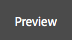
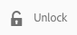

# Editar conteúdo da página{#editing-page-content}

Assim que a página for criada (nova ou como parte de um lançamento ou uma live copy), você pode editar o conteúdo para fazer as atualizações necessárias.

O conteúdo é adicionado usando [componentes](/help/sites-authoring/default-components-console.md) (apropriado ao tipo de conteúdo) que pode ser arrastado para a página. Estes podem então ser editados no local, movidos ou excluídos. 

>[!NOTE]
>
>Sua conta precisa do [direitos de acesso apropriados](/help/sites-administering/security.md) e [permissões](/help/sites-administering/security.md#permissions) para editar páginas.
>
>Caso encontre algum problema, sugerimos que você entre em contato com o administrador do sistema.

>[!NOTE]
>
>Se a página e/ou o modelo foi configurado corretamente, é possível usar o [layout responsivo](/help/sites-authoring/responsive-layout.md) durante a edição.

>[!NOTE]
>
>Quando estiver no modo de **Edição**, os links em seu conteúdo ficam visíveis, mas **não ficam acessíveis**. Use o [modo de Visualização](#previewingpagestouchoptimizedui) se você deseja navegar usando os links no seu conteúdo.

## Barra de ferramentas da página {#page-toolbar}

A barra de ferramentas da página oferece acesso à funcionalidade adequada, dependendo da configuração da página.

A barra de ferramentas oferece acesso a várias opções. Dependendo do contexto e da configuração atuais, algumas opções podem não estar disponíveis.

* **Ativar/desativar painel lateral**

  Isso abre/fecha o painel lateral, que contém a tag [Navegador de ativos](/help/sites-authoring/author-environment-tools.md#assets-browser), [Navegador de componentes](/help/sites-authoring/author-environment-tools.md#components-browser), e [Árvore de conteúdo](/help/sites-authoring/author-environment-tools.md#content-tree).

  

* **Informações da página**

  Fornece acesso à [Informações da página](/help/sites-authoring/author-environment-tools.md#page-information) incluindo detalhes da página e ações que podem ser tomadas na página, incluindo visualização e edição de informações da página, visualização de propriedades da página e publicação/cancelamento da publicação da página.

  

* **Emulador**

  Alterna a [barra de ferramentas do emulador](/help/sites-authoring/responsive-layout.md#selecting-a-device-to-emulate), que é usado para emular a aparência da página em outro dispositivo. Isso é alternado automaticamente no modo de layout.

  

* **ContextHub**

  Abre a [hub de contexto](/help/sites-authoring/ch-previewing.md). Disponível somente no modo de Visualização.

  

* **Título da página**

  Isso é puramente informativo.

  

* **Seletor de modo**

  Exibe o atual [modo](/help/sites-authoring/author-environment-tools.md#page-modes) e permite selecionar outro modo, como editar, layout, timewarp ou direcionamento.

  

* **Visualizar**

  Habilita [modo de visualização](/help/sites-authoring/editing-content.md#preview-mode). Isso exibe a página como ela será exibida quando publicada.

  

* **Anotar**

  Permite adicionar [anotações](/help/sites-authoring/annotations.md) à página ao revisar uma página. Após a primeira anotação, o ícone alternará para um número que indica o número de anotações na página.

  

### Notificação de status {#status-notification}

Se uma página é parte de um [fluxo de trabalho](/help/sites-authoring/workflows.md) ou de vários fluxos de trabalho, essas informações serão exibidas em uma barra de notificação na parte superior da tela ao editar a página.

>[!NOTE]
>
>A barra de status só é visível para contas de usuário com privilégios apropriados.

A notificação lista o fluxo de trabalho que está sendo executado na página. Se o usuário estiver envolvido na etapa atual do fluxo de trabalho, as opções serão [afetar o status do workflow](/help/sites-authoring/workflows-participating.md) e obter mais informações sobre o fluxo de trabalho também estão disponíveis, como:

* **Concluído** - Abre a **Item de trabalho completo** caixa de diálogo

* **Delegar** - Abre a **Item de trabalho completo** caixa de diálogo

* **Exibir detalhes** - abre a janela **Detalhes** do fluxo de trabalho

Concluir e delegar etapas do fluxo de trabalho por meio da barra de notificação funciona da mesma maneira como ao [participar de fluxos de trabalho](/help/sites-authoring/workflows-participating.md) por meio da caixa de entrada de Notificações.

Se a página estiver sujeita a vários workflows, o número de workflows será exibido na extremidade direita da notificação, junto a botões de seta para permitir que você navegue pelos workflows.

## Espaço reservado do componente {#component-placeholder}

O placeholder do componente é um indicador para mostrar onde um componente será posicionado ao soltá-lo, acima do componente sobre o qual você está passando o mouse no momento.

* Ao adicionar um novo componente à página (arrastar do navegador de componentes):

  

* Ao mover um componente existente:

  

## Inserir um componente {#inserting-a-component}

### Inserir um componente do navegador de componentes {#inserting-a-component-from-the-components-browser}

É possível adicionar um novo componente, usando o [navegador de componentes](/help/sites-authoring/author-environment-tools.md#components-browser). O [placeholder do componente](#component-placeholder) mostra onde o componente será posicionado:

1. Certifique-se de que a página está no modo de [**edição**](/help/sites-authoring/author-environment-tools.md#page-modes).
1. Abra o [navegador de componentes](/help/sites-authoring/author-environment-tools.md#components-browser).
1. Arraste o componente para a [posição desejada](#component-placeholder).

1. [Editar](#editmovecopypastedelete) o componente.

>[!NOTE]
>
>Em um dispositivo móvel, o navegador de componentes preencherá a tela inteira. Depois de começar a arrastar um componente, o navegador será fechado para mostrar a página novamente para que você possa colocar o componente.

### Inserir um componente do Sistema de parágrafos {#inserting-a-component-from-the-paragraph-system}

É possível adicionar um novo componente, usando a caixa **Arraste componentes aqui**:

1. Certifique-se de que a página está no modo de [**edição**](/help/sites-authoring/author-environment-tools.md#page-modes).
1. Há duas maneiras de selecionar e adicionar um novo componente do sistema de parágrafos:

   * Selecione o **Inserir componente** na barra de ferramentas de um componente existente ou na variável **Arraste os componentes para cá** caixa.

   

   * Se você estiver em um dispositivo de desktop, clique duas vezes na caixa **Arraste componentes aqui**.

   A variável **Inserir novo componente** será aberta para permitir que você selecione o componente desejado:

   

1. O componente selecionado será adicionado à parte inferior da página. [Editar](#editmovecopypastedelete) o componente, conforme necessário.

### Inserir um componente usando o Navegador de ativos   {#inserting-a-component-using-the-assets-browser}

Você também pode adicionar um novo componente à página arrastando um ativo da página [navegador de ativos](/help/sites-authoring/author-environment-tools.md#assets-browser). Isso criará automaticamente um novo componente do tipo apropriado (e que contém o ativo).

Isso é válido para os seguintes tipos de ativos (alguns dependerão do sistema de página/parágrafo):

<table>
 <tbody>
  <tr>
   <th><strong>Tipo de ativo</strong></th>
   <th><strong>Tipo de componente resultante</strong></th>
  </tr>
  <tr>
   <td>Imagem</td>
   <td>Imagem</td>
  </tr>
  <tr>
   <td>Documento</td>
   <td>Download</td>
  </tr>
  <tr>
   <td>Produto</td>
   <td>Produto</td>
  </tr>
  <tr>
   <td>Vídeo</td>
   <td>Flash</td>
  </tr>
  <tr>
   <td>Fragmento de conteúdo</td>
   <td>Fragmento de conteúdo  </td>
  </tr>
 </tbody>
</table>

>[!NOTE]
>
>Esse comportamento pode ser configurado para a instalação. Consulte [Configurar um sistema de parágrafo para que arrastar um ativo crie uma instância de componente](/help/sites-developing/developing-components.md#configuring-a-paragraph-system-so-that-dragging-an-asset-creates-a-component-instance) para obter mais detalhes.

Para criar um componente arrastando um dos tipos de ativos acima:

1. Certifique-se de que a página está no modo de [**edição**](/help/sites-authoring/author-environment-tools.md#page-modes).
1. Abra o [navegador de ativos](/help/sites-authoring/author-environment-tools.md#assets-browser).
1. Arraste o ativo para a posição desejada. O [placeholder do componente](#component-placeholder) mostra onde o componente será posicionado.

   Um componente, apropriado para o tipo de ativo, será criado no local necessário; ele conterá o ativo selecionado.

1. [Editar](#editmovecopypastedelete) o componente, se necessário.

>[!NOTE]
>
>Em um dispositivo móvel, o navegador de ativos preencherá a tela inteira. Depois de começar a arrastar um ativo, o navegador será fechado para mostrar a página novamente para que você possa colocar o ativo.

Se, durante a navegação pelos ativos, você perceber que precisa fazer uma alteração rápida a um ativo, é possível iniciar o [editor de ativos](/help/assets/manage-assets.md) diretamente do navegador, clicando no ícone editar ao lado do nome do ativo.

## Editar/Configurar/Copiar/Recortar/Excluir/Colar {#edit-configure-copy-cut-delete-paste}

Selecionar um componente abrirá a barra de ferramentas. Isto proporciona acesso a várias ações que podem ser executadas no componente.

As ações reais disponíveis para o usuário serão mostradas conforme apropriado, e nem todas as ações podem estar descritas aqui.

* **Editar**

  [Dependente do tipo de componente](/help/sites-authoring/default-components.md) isso permitirá [editar o conteúdo do componente](#edit-content). Muitas vezes será disponibilizada uma barra de ferramentas.

  

* **Configurar**

  [Dependente do tipo de componente](/help/sites-authoring/default-components.md) isso permitirá editar e configurar as propriedades do componente. Frequentemente uma caixa de diálogo será aberta.

  

* **Copiar**

  Isso copiará o componente para a área de transferência. Após a ação de colagem, o componente original permanecerá.

  

* **Recortar**

  Isso copiará o componente para a área de transferência. Após a ação de colagem, o componente original será removido.

  

* **Excluir**

  O componente será excluído da página com sua confirmação.

  

* **Inserir componente**

  Isso abre a caixa de diálogo para [adicionar um novo componente](/help/sites-authoring/editing-content.md#inserting-a-component-from-the-paragraph-system).

  

* **Colar**

  Isso colará o componente da área de transferência na página. Se o original permanece, depende se você usou copiar ou recortar.

   * É possível colar na mesma página ou em uma diferente.
   * O item colado será colado acima do item no qual você seleciona a ação de colagem.
   * A ação Colar só será exibida se houver conteúdo na área de transferência.

  

  >[!NOTE]
  >
  >Se você colar em uma página diferente que já estava aberta antes da operação de cortar/copiar, será necessário atualizar a página para ver o conteúdo colado.

* **Grupo**

  Isso permite selecionar vários componentes de uma só vez. O mesmo pode ser alcançado em um dispositivo desktop por um **Ctrl+Clique** ou **Command+clique**.

  

* **Pai**

  Permite selecionar o componente principal do componente selecionado.

  

* **Layout**

  Isso permite modificar o [layout](/help/sites-authoring/editing-content.md#edit-component-layout) do componente selecionado. Isso se aplica somente ao componente selecionado e não ativa o [Modo de layout](/help/sites-authoring/author-environment-tools.md#page-modes) para a página inteira.

  

* **Converta em uma variação de fragmento de experiência**

  Isso permite criar um novo [fragmento de experiência](/help/sites-authoring/experience-fragments.md) do componente selecionado ou adicione-o a um fragmento de experiência existente.

  

## Editar (Conteúdo) {#edit-content}

Existem dois métodos de adição e/ou edição do conteúdo dos componentes:

* Abra o [caixa de diálogo do componente para edição](#component-edit-dialog).
* [Arrastar e soltar um ativo](#draganddropintocomponent) no navegador de ativos para adicionar conteúdo diretamente.

### Caixa de diálogo de edição de componente   {#component-edit-dialog}

Abra um componente para editar o conteúdo usando o ícone [Editar (lápis) da barra de ferramentas do componente](#edit-configure-copy-cut-delete-paste).

As opções de edição exatas dependerão do componente. Para alguns componentes [todas as ações só estarão disponíveis no modo de tela cheia](#edit-content-full-screen-mode). Por exemplo:

* [Componente de texto](/help/sites-authoring/rich-text-editor.md#main-pars-title-24)

  

* Componente de imagem

  

  >[!NOTE]
  >
  >A edição não funciona em um componente de imagem vazio.
  >
  >
  >Você deve [arrastar ou fazer upload de uma imagem (usando Configurar)](/help/sites-authoring/default-components-foundation.md#image) antes de começar a editá-lo.

* Componente de imagem - tela cheia

  [Entrar no modo de tela cheia](/help/sites-authoring/editing-content.md#edit-content-full-screen-mode) para o componente de imagem permite mais espaço para editar a imagem, bem como mostrar opções de edição adicionais como **Inicializar mapa** e **Restaurar zoom**. Além disso, a tela cheia permite selecionar predefinições de corte.

  

* Componentes construídos a partir de mais de um componente básico, como a [Componente de base de texto e imagem](/help/sites-authoring/default-components-foundation.md#text-image), primeiro solicite que você confirme qual conjunto de opções de edição deseja:

  

### Arraste e solte ativos no componente {#drag-and-drop-assets-into-component}

Para tipos de componentes específicos, você pode arrastar e soltar ativos do navegador de ativos diretamente no componente para atualizar o conteúdo:

| **Tipo de ativo** | **Tipo de componente** |
|---|---|
| Imagem | Imagem |
| Documento | Download |
| Produto | Produto |
| Vídeo | Flash |
| Fragmento de conteúdo | Fragmento de conteúdo |

## Modo de Edição (Conteúdo) de Tela Cheia {#edit-content-full-screen-mode}

Para todos os componentes, o modo de tela cheia pode ser acessado com (e fechado de):

Por exemplo, o componente de **Texto:**

>[!NOTE]
>
>Para alguns componentes, o modo de tela cheia terá mais opções disponíveis do que o editor básico no local.

## Mover um componente {#moving-a-component}

Para mover um componente de parágrafo:

1. Selecione o parágrafo a ser movido com o toque e segure ou com o clique e segure.
1. Arraste o parágrafo para o novo local. AEM indica onde o parágrafo pode ser depositado. Solte-o no local desejado.

   

1. Seu parágrafo foi movido.

>[!NOTE]
>
>Também é possível usar [Cortar e colar](/help/sites-authoring/editing-content.md#edit-configure-copy-cut-delete-paste) para mover um componente.

## Editar layout de componente {#edit-component-layout}

Em vez de repetidamente alternar entre os modos de edição e de [layout](/help/sites-authoring/responsive-layout.md) para ajustar um componente, você pode selecionar a ação **Layout** referente a um componente para alterar o layout do componente e poupar tempo, uma vez que não é preciso sair do modo de edição.

1. Quando estiver no modo de **Edição** do console de sites, selecionar um componente revela a barra de ferramentas do componente.

   

   Clique ou toque na ação **Layout** para definir o layout do componente.

   

1. Depois que a ação Layout for selecionada:

   * As alças de redimensionamento para a exibição do componente.
   * A barra de ferramentas do emulador é mostrada na parte superior da tela.
   * As ações de Layout em vez das ações de edição padrão são exibidas na barra de ferramentas do componente.

   

   Agora é possível modificar o layout do componente da mesma maneira que você faria no [modo de layout](/help/sites-authoring/responsive-layout.md#defining-layouts-layout-mode).

1. Após fazer as alterações necessárias no layout, clique no botão **Fechar** no menu de ação de componente para concluir a modificação do layout do componente. A barra de ferramentas do componente retornará ao seu estado normal de edição.

   

>[!NOTE]
>
>O escopo da ação Layout é limitada ao componente selecionado. Por exemplo, se você estiver editando o layout de um componente e, em seguida, clicar em outro componente, a barra de ferramentas de edição padrão (não a barra de ferramentas do layout) será exibida para o componente recém-selecionado, e as alças de redimensionamento, bem como a barra de ferramentas do emulador desaparecerão.
>
>Se precisar editar o layout geral da página, afetando vários componentes, alterne para a guia [modo de layout](/help/sites-authoring/responsive-layout.md).

## Componentes herdados {#inherited-components}

Componentes herdados podem ser o resultado de vários cenários, incluindo:

* [Gerenciamento de vários sites](/help/sites-administering/msm.md)
* [Lançamentos](/help/sites-authoring/launches.md) (quando com base na live copy).
* Componentes específicos, como o Sistema de parágrafo herdado no Geometrixx.

Você pode cancelar (e depois reativar) a herança. Dependendo do componente, isso pode estar disponível em:

* **Live Copy**

  A barra de ferramentas do componente, se o componente estiver em uma página que faz parte de uma live copy ou inicialização (com base em uma live copy). Por exemplo:

  

  A opção Cancelar herança está disponível:

  

  Ou reativar a herança se já tiver sido cancelada:

  

  A ação de Implantação também está disponível no blueprint ou na origem de Live Copy:

  

* **Um Sistema De Parágrafo Herdado**

  A janela de configuração. Por exemplo, como no Sistema de parágrafo herdado:

  

## Editar o modelo da página {#editing-the-page-template}

Se a página for baseada em um [modelo editável](/help/sites-authoring/templates.md#editable-and-static-templates), você pode alternar facilmente para a variável [editor de modelo](/help/sites-authoring/templates.md#editing-templates-template-authors) selecionando **Editar modelo** no [Menu Informações da página](/help/sites-authoring/author-environment-tools.md#page-information).

Se a página for baseada em um [modelo estático](/help/sites-authoring/templates.md#editable-and-static-templates), você pode alternar para [Modo de design](/help/sites-authoring/default-components-designmode.md) usando o [seletor de modo de página](/help/sites-authoring/author-environment-tools.md#page-modes) na barra de ferramentas para ativar/desativar componentes para uso na página.

É possível ver em qual modelo a página é baseada ao selecionar a página na [Exibição de coluna](/help/sites-authoring/basic-handling.md#column-view) ou na [Exibição de lista](/help/sites-authoring/basic-handling.md#list-view).

## Status da Live Copy   {#live-copy-status}

A variável [Modo de página Status da Live Copy](/help/sites-authoring/author-environment-tools.md#page-modes) permite ter uma visão geral rápida do status da live copy e de quais componentes não são herdados:

* Borda verde: herdada
* Borda rosa: a herança foi cancelada

Por exemplo:

## Adicionar anotações {#adding-annotations}

As [anotações](/help/sites-authoring/annotations.md) permitem que revisores e outros autores forneçam feedback sobre o seu conteúdo. Eles são usados com frequência para fins de revisão e validação.

## Visualizar páginas   {#previewing-pages}

Existem duas opções para a visualização de uma página:

* [Modo de visualização](#preview-mode) - uma visualização rápida, no local

* [Exibir como publicado](#view-as-published) - uma visualização completa que abre a página em uma nova guia

>[!NOTE]
>
>* Os links no conteúdo estão visíveis, mas não podem ser acessados no modo Editar.
>* Use qualquer uma das opções de visualização, caso deseje navegar usando os links.
>* Use o [atalho de teclado](/help/sites-authoring/keyboard-shortcuts.md) `Ctrl-Shift-M` para alternar entre a visualização e o último modo selecionado.
>

>[!NOTE]
>
>O cookie do Modo WCM está definido para ambas as opções.

### Modo de visualização {#preview-mode}

Ao editar o conteúdo, é possível visualizar a página usando a visualização [modo](/help/sites-authoring/author-environment-tools.md#page-modes). Este modo:

* Oculta vários mecanismos de edição para fornecer uma visualização rápida de como a página aparecerá na publicação.
* Permite usar links para navegar.
* Faz **não** atualizar o conteúdo da página.

Ao criar, o modo de visualização está disponível usando o ícone na parte superior direita do editor de página:

### Exibir como publicado {#view-as-published}

A variável **Exibir como publicado** está disponível na [Informações da página](/help/sites-authoring/author-environment-tools.md#page-information) menu. Isso abre a página em uma nova guia, atualiza o conteúdo e mostra a página exatamente como ela aparecerá no ambiente de publicação.

## Bloquear uma página   {#locking-a-page}

O AEM permite bloquear uma página, de modo que ninguém mais possa modificar o conteúdo. Isso é útil quando você está fazendo diversas edições para uma página específica ou quando precisa congelar uma página por pouco tempo.

Uma página pode ser bloqueada a partir:

* **Sites** console

   1. Selecione a página com [modo de seleção](/help/sites-authoring/basic-handling.md#viewing-and-selecting-resources).
   1. Selecione o ícone de bloqueio.

  

* **Editor de página**

   1. Selecione o **Informações da página** ícone para abrir o menu.
   1. Selecione o **Bloquear página** opção.

Uma vez bloqueadas, as informações de exibição do console são atualizadas e, ao editar, um símbolo de cadeado é apresentado na barra de ferramentas.

>[!CAUTION]
>
>O bloqueio de uma página pode ser executado quando [representação de um usuário](/help/sites-administering/security.md#impersonating-another-user). No entanto, uma página bloqueada dessa maneira só pode ser desbloqueada pelo usuário que foi representado ou pelo usuário administrador.
>
>As páginas não podem ser desbloqueadas representando o usuário que as bloqueou.

## Desbloquear uma página {#unlocking-a-page}

Desbloquear uma página é muito semelhante a [bloquear uma página](#locking-a-page). Uma vez bloqueada, as opções de bloqueio são substituídas por ações de desbloqueio.

O menu de Informações da página lista **Desbloquear** como uma opção, e o ícone Bloquear no console de sites é substituído pelo ícone **Desbloquear**.

>[!CAUTION]
>
>O bloqueio de uma página pode ser executado quando [representação de um usuário](/help/sites-administering/security.md#impersonating-another-user). No entanto, uma página bloqueada dessa maneira só pode ser desbloqueada pelo usuário que foi representado ou pelo usuário administrador.
>
>As páginas não podem ser desbloqueadas representando o usuário que as bloqueou.

## Desfazer e refazer edições de página {#undoing-and-redoing-page-edits}

Os ícones a seguir permitem desfazer ou refazer uma ação. Eles são mostrados na barra de ferramentas quando apropriado:

>[!NOTE]
>
>A variável [atalho de teclado](/help/sites-authoring/page-authoring-keyboard-shortcuts.md) `Ctrl-Z` O também está disponível para desfazer ações de edição de página.
>
>O atalho de teclado `Ctrl-Y` O também está disponível para refazer ações de edição de página.

>[!NOTE]
>
>Consulte [Desfazer e refazer edições de página - A teoria](#undoing-and-redoing-page-edits-the-theory) para obter todos os detalhes do que é possível fazer ao desfazer e refazer edições de página.

## Desfazer e refazer edições de página - a teoria {#undoing-and-redoing-page-edits-the-theory}

>[!NOTE]
>
>O administrador do sistema pode [configurar vários aspectos dos recursos Desfazer/Refazer](/help/sites-administering/config-undo.md) de acordo com os requisitos de sua instância.

O AEM armazena um histórico de ações que você executa e a sequência executada. Assim, você desfaz várias ações na ordem executada, bem como refazer para aplicar novamente uma ou mais ações.

Se um elemento na página de conteúdo estiver selecionado (po exemplo, como um componente de texto), o comando de desfazer e refazer será aplicado ao item selecionado.

O comportamento dos comandos desfazer e refazer é semelhante ao de outros programas de software. Use os comandos para restaurar o estado recente da sua página da Web conforme você toma decisões sobre o conteúdo. Por exemplo, caso mova um parágrafo de texto para um local diferente na página, você pode usar o comando desfazer para mover o parágrafo de volta. Se você decidir que a posição anterior era melhor, use o comando Refazer para &quot;desfazer a ação de desfazer&quot;.

>[!NOTE]
>
>É possível:
>
>* Refazer ações desde que você não tenha feito uma edição de página desde que usou desfazer.
>* Desfazer no máximo 20 ações de edição (configuração padrão).
>* Também use [Atalhos de teclado](/help/sites-authoring/page-authoring-keyboard-shortcuts.md) para desfazer e refazer.
>

Você pode desfazer e refazer os seguintes tipos de alterações de página:

* Adição, edição, remoção e movimentação de parágrafos
* Edição no local do conteúdo de parágrafo
* Copiar, recortar e colar itens em uma página

Os campos de formulário que os componentes de formulário renderizam não devem ter valores especificados durante a criação de páginas. Portanto, os comandos desfazer e refazer não afetam as alterações feitas nos valores desses tipos de componentes. Por exemplo, não é possível desfazer a seleção de um valor em uma lista suspensa.

>[!NOTE]
>
>Permissões especiais são necessárias para desfazer e refazer as alterações nos arquivos e imagens.

>[!NOTE]
>
>O histórico de alterações em arquivos e imagens dura no mínimo dez horas. Além desse tempo, no entanto, a ação de desfazer as alterações não é garantida. O administrador pode alterar o tempo padrão de dez horas.
