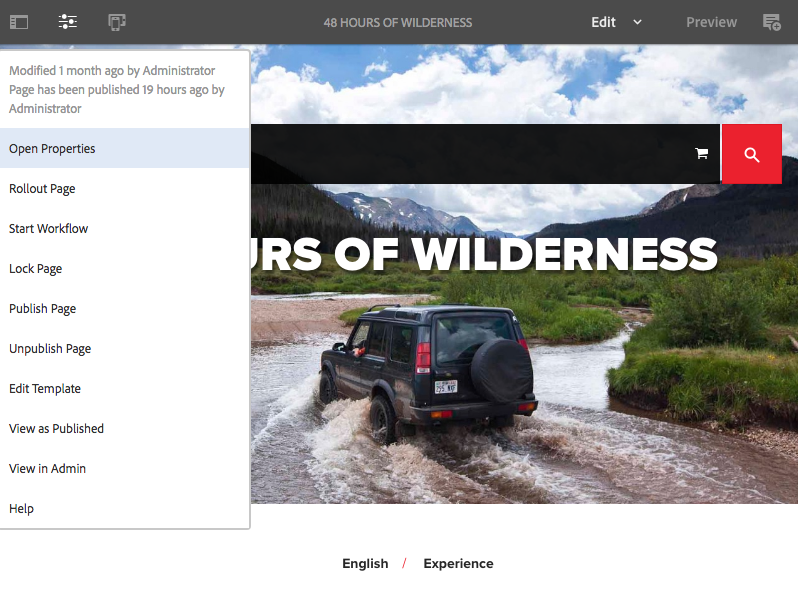
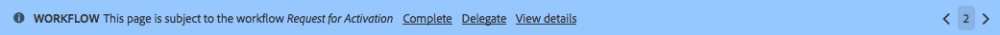
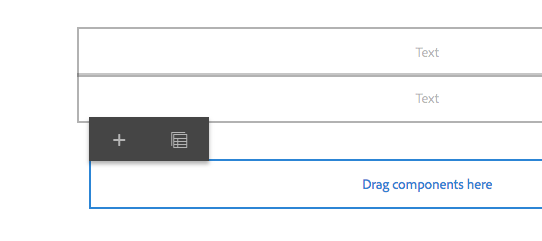
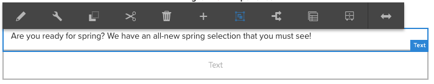

# Editar conteúdo da página{#editing-page-content}

Depois que a página é criada (nova ou como parte de um lançamento ou uma live copy), você pode editar o conteúdo para fazer as atualizações necessárias.

O conteúdo é adicionado usando [componentes](/help/sites-authoring/default-components-console.md) (apropriado ao tipo de conteúdo) que podem ser arrastados para a página. Estes podem então ser editados no local, movidos ou excluídos. 

>[!NOTE]
>
>Sua conta precisa do [direitos de acesso apropriados](/help/sites-administering/security.md) e [permissões](/help/sites-administering/security.md#permissions) para editar páginas.
>
>Se você encontrar algum problema, o Adobe sugere que você entre em contato com o administrador do sistema.

>[!NOTE]
>
>Se a página, o modelo ou ambos estiverem configurados corretamente, você poderá usar um [layout responsivo](/help/sites-authoring/responsive-layout.md) ao editar.

>[!NOTE]
>
>Quando estiver no modo de **Edição**, os links em seu conteúdo ficam visíveis, mas **não ficam acessíveis**. Use o [modo de Visualização](#previewingpagestouchoptimizedui) se você deseja navegar usando os links no seu conteúdo.

## Barra de ferramentas da página {#page-toolbar}

A barra de ferramentas da página oferece acesso à funcionalidade adequada, dependendo da configuração da página.

A barra de ferramentas oferece acesso a várias opções. Dependendo do contexto e da configuração atual, algumas opções podem não estar disponíveis.

* **Ativar/desativar painel lateral**

  Isso abre/fecha o painel lateral, que contém o [Navegador de ativos](/help/sites-authoring/author-environment-tools.md#assets-browser), [Navegador de componentes](/help/sites-authoring/author-environment-tools.md#components-browser) e [Árvore de conteúdo](/help/sites-authoring/author-environment-tools.md#content-tree).

  

* **Informações da página**

  Ele fornece acesso à [Informações da página](/help/sites-authoring/author-environment-tools.md#page-information) incluindo detalhes da página e ações que podem ser tomadas na página, incluindo visualização e edição de informações da página, visualização de propriedades da página e publicação/cancelamento da publicação da página.

  

* **Emulador**

  Ativa a [barra de ferramentas do emulador](/help/sites-authoring/responsive-layout.md#selecting-a-device-to-emulate), que é usada para emular a aparência da página em outro dispositivo. Isso é alternado automaticamente no modo de layout.

  

* **ContextHub**

  Abre a [hub de contexto](/help/sites-authoring/ch-previewing.md). Disponível somente no modo de Visualização.

  

* **Título da página**

  Isso é puramente informativo.

  

* **Seletor de modo**

  Ele exibe o atual [modo](/help/sites-authoring/author-environment-tools.md#page-modes) e permite selecionar outro modo, como editar, layout, timewarp ou direcionamento.

  

* **Visualizar**

  Habilita [modo de visualização](/help/sites-authoring/editing-content.md#preview-mode). Essa ação exibe a página como ela aparece ao ser publicada.

  

* **Anotar**

  Permite adicionar [anotações](/help/sites-authoring/annotations.md) à página ao revisar uma página. Após a primeira anotação, o ícone alterna para um número que indica o número de anotações na página.

  

### Notificação de status {#status-notification}

Se uma página é parte de um [fluxo de trabalho](/help/sites-authoring/workflows.md) ou de vários fluxos de trabalho, essas informações serão exibidas em uma barra de notificação na parte superior da tela ao editar a página.

>[!NOTE]
>
>A barra de status só é visível para contas de usuário com os privilégios apropriados.

A notificação lista o fluxo de trabalho que está sendo executado na página. Se o usuário estiver envolvido na etapa atual do fluxo de trabalho, as opções para [afetar o status do fluxo de trabalho](/help/sites-authoring/workflows-participating.md) e obter mais informações sobre ele também estarão disponíveis, como:

* **Concluído** - Abre a **Item de trabalho completo** caixa de diálogo

* **Delegar** - Abre a **Item de trabalho completo** caixa de diálogo

* **Exibir detalhes** - abre a janela **Detalhes** do fluxo de trabalho

Concluir e delegar etapas do fluxo de trabalho por meio da barra de notificação funciona da mesma maneira como quando [participação em fluxos de trabalho](/help/sites-authoring/workflows-participating.md) na caixa de entrada Notificação.

Se a página estiver sujeita a vários workflows, o número de workflows será exibido na extremidade direita da notificação, junto a botões de seta para permitir que você navegue pelos workflows.

## Espaço reservado do componente {#component-placeholder}

O espaço reservado do componente é um indicador para mostrar onde um componente será posicionado ao soltá-lo, acima do componente sobre o qual você está passando o mouse.

* Ao adicionar um componente à página (arrastar do navegador de componentes):

  

* Ao mover um componente existente:

  

## Inserir um componente {#inserting-a-component}

### Inserir um componente do navegador de componentes {#inserting-a-component-from-the-components-browser}

É possível adicionar um componente, usando a [navegador de componentes](/help/sites-authoring/author-environment-tools.md#components-browser). O [espaço reservado do componente](#component-placeholder) mostra onde o componente está posicionado:

1. Certifique-se de que a página está no modo de [**edição**](/help/sites-authoring/author-environment-tools.md#page-modes).
1. Abra o [navegador de componentes](/help/sites-authoring/author-environment-tools.md#components-browser).
1. Arraste o componente para a [posição desejada](#component-placeholder).

1. [Editar](#editmovecopypastedelete) o componente.

>[!NOTE]
>
>Em um dispositivo móvel, o navegador de componentes preenche toda a tela. Depois de começar a arrastar um componente, o navegador é fechado para mostrar a página novamente para que você possa colocar o componente.

### Inserir um componente do Sistema de parágrafos {#inserting-a-component-from-the-paragraph-system}

É possível adicionar um componente, usando a **Arraste os componentes para cá** caixa do sistema de parágrafos:

1. Certifique-se de que a página está no modo de [**edição**](/help/sites-authoring/author-environment-tools.md#page-modes).
1. Há duas maneiras de selecionar e adicionar um componente do sistema de parágrafos:

   * Selecione a opção **Inserir componente** (+) seja na barra de ferramentas de um componente já existente ou na caixa **Arraste componentes aqui**.

   

   * Se você estiver em um dispositivo de desktop, clique duas vezes na guia **Arraste os componentes para cá** caixa.

   A variável **Inserir novo componente** é aberta para permitir que você selecione o componente desejado:

   

1. O componente selecionado será adicionado à parte inferior da página. [Edite-o](#editmovecopypastedelete), conforme necessário.

### Inserir um componente usando o Navegador de ativos   {#inserting-a-component-using-the-assets-browser}

Você também pode adicionar um componente à página arrastando um ativo da página [navegador de ativos](/help/sites-authoring/author-environment-tools.md#assets-browser). Isso cria automaticamente um componente do tipo apropriado (e que contém o ativo).

Isso é válido para os seguintes tipos de ativos (alguns dependem do sistema de página/parágrafo):

<table>
 <tbody>
  <tr>
   <th><strong>Tipo de ativo</strong></th>
   <th><strong>Tipo de componente resultante</strong></th>
  </tr>
  <tr>
   <td>Imagem</td>
   <td>Imagem</td>
  </tr>
  <tr>
   <td>Documento</td>
   <td>Download</td>
  </tr>
  <tr>
   <td>Produto</td>
   <td>Produto</td>
  </tr>
  <tr>
   <td>Vídeo</td>
   <td>Flash</td>
  </tr>
  <tr>
   <td>Fragmento de conteúdo</td>
   <td>Fragmento do conteúdo  </td>
  </tr>
 </tbody>
</table>

>[!NOTE]
>
>Esse comportamento pode ser configurado para a instalação. Consulte [Configurar um sistema de parágrafo para que arrastar um ativo crie uma instância de componente](/help/sites-developing/developing-components.md#configuring-a-paragraph-system-so-that-dragging-an-asset-creates-a-component-instance) para obter mais detalhes.

Para criar um componente arrastando um dos tipos de ativos acima:

1. Certifique-se de que a página está no modo de [**edição**](/help/sites-authoring/author-environment-tools.md#page-modes).
1. Abra o [navegador de ativos](/help/sites-authoring/author-environment-tools.md#assets-browser).
1. Arraste o ativo desejado para a posição desejada. A variável [espaço reservado do componente](#component-placeholder) mostra onde o componente está posicionado.

   Um componente, apropriado para o tipo de ativo, será criado nesse local e conterá o ativo selecionado.

1. [Editar](#editmovecopypastedelete) o componente, se necessário.

>[!NOTE]
>
>Em um dispositivo móvel, o navegador de ativos preenche toda a tela. Quando você começa a arrastar um ativo, o navegador se fecha para mostrar a página novamente para que você possa colocar o ativo.

Ao navegar pelos ativos, se você perceber que deve fazer uma alteração rápida a um ativo, clique no ícone de edição ao lado do nome do ativo para iniciar o [Editor de ativos](/help/assets/manage-assets.md).

## Editar/Configurar/Copiar/Recortar/Excluir/Colar {#edit-configure-copy-cut-delete-paste}

Selecionar um componente abre a barra de ferramentas. Isso fornece acesso a várias ações que podem ser executadas no componente.

As ações de fato disponíveis para o usuário serão mostradas conforme apropriado e nem todas elas estarão descritas aqui.

* **Editar**

  [Dependendo do tipo de componente](/help/sites-authoring/default-components.md), isso permite a [edição do conteúdo do componente](#edit-content). Frequentemente, é fornecida uma barra de ferramentas.

  

* **Configurar**

  [Dependente do tipo de componente](/help/sites-authoring/default-components.md) isso permite editar e configurar as propriedades do componente. Frequentemente, uma caixa de diálogo é aberta.

  

* **Copiar**

  Isso copia o componente para a área de transferência. O componente original permanece após uma colagem.

  

* **Recortar**

  Isso copia o componente para a área de transferência. Após a ação de colagem, o componente original é removido.

  

* **Excluir**

  Isso exclui o componente da página com sua confirmação.

  

* **Inserir componente**

  Isso abre a caixa de diálogo para [adicionar um componente](/help/sites-authoring/editing-content.md#inserting-a-component-from-the-paragraph-system).

  

* **Colar**

  Isso cola o componente da área de transferência na página. O restante do original depende se você usou copiar ou recortar.

   * É possível colar para a mesma página para outra.
   * O item colado será posicionado acima do item onde você usou a ação de colagem.
   * A ação Colar só será exibida se houver conteúdo na área de transferência.

  

  >[!NOTE]
  >
  >Se você colar em uma página diferente que já estava aberta antes da operação de recortar/copiar, será necessário atualizar a página para ver o conteúdo colado.

* **Grupo**

  Isso permite selecionar vários componentes de uma só vez. O mesmo pode ser alcançado em um desktop por um **Ctrl+Clique** ou **Command+Clique**.

  

* **Pai**

  Permite selecionar o componente principal do componente selecionado.

  

* **Layout**

  Isso permite modificar o [layout](/help/sites-authoring/editing-content.md#edit-component-layout) do componente selecionado. Isso se aplica somente ao componente selecionado e não ativa o [Modo de layout](/help/sites-authoring/author-environment-tools.md#page-modes) para a página inteira.

  

* **Converter em uma variação de Fragmento de experiência**

  Isso permite criar um [Fragmento de experiência](/help/sites-authoring/experience-fragments.md) do componente selecionado ou adicione-o a um Fragmento de experiência existente.

  

## Editar (Conteúdo) {#edit-content}

Há dois métodos de adição ou edição do conteúdo dos componentes:

* Abra a [caixa de diálogo do componente para edição](#component-edit-dialog).
* [Arraste e solte um ativo](#draganddropintocomponent) do navegador de ativos para adicionar conteúdo diretamente.

### Caixa de diálogo de edição de componente   {#component-edit-dialog}

Abra um componente para editar o conteúdo usando o ícone de [Editar (lápis) da barra de ferramentas do componente](#edit-configure-copy-cut-delete-paste).

As opções de edição exatas dependem do componente. Para alguns componentes, [todas as ações estão disponíveis somente no modo de tela cheia](#edit-content-full-screen-mode). Por exemplo:

* [Componente de texto](/help/sites-authoring/rich-text-editor.md#main-pars-title-24)

  

* Componente de imagem

  

  >[!NOTE]
  >
  >A edição não funciona em um componente de imagem vazio.
  >
  >
  >[Arrastar ou fazer upload de uma imagem (usando Configurar)](/help/sites-authoring/default-components-foundation.md#image) antes de começar a editá-lo.

* Componente de imagem - tela cheia

  [Entrar no modo de tela cheia](/help/sites-authoring/editing-content.md#edit-content-full-screen-mode) para o componente de imagem permite mais espaço para editar a imagem, bem como mostrar opções de edição adicionais como **Inicializar mapa** e **Redefinir zoom**. Além disso, a tela cheia permite selecionar predefinições de corte.

  

* Componentes construídos a partir de mais de um componente básico, como a [Componente de base de texto e imagem](/help/sites-authoring/default-components-foundation.md#text-image), primeiro solicite que você confirme qual conjunto de opções de edição deseja:

  

### Arraste e solte ativos no componente {#drag-and-drop-assets-into-component}

Para tipos de componentes específicos, você pode arrastar e soltar ativos do navegador de ativos diretamente no componente para atualizar o conteúdo:

| **Tipo de ativo** | **Tipo de componente** |
|---|---|
| Imagem | Imagem |
| Documento | Download |
| Produto | Produto |
| Vídeo | Flash |
| Fragmento de conteúdo | Fragmento de conteúdo |

## Modo de Edição (Conteúdo) de Tela Cheia {#edit-content-full-screen-mode}

Para todos os componentes, o modo de tela cheia pode ser acessado com (e fechado de):

Por exemplo, o componente de **Texto:**

>[!NOTE]
>
>Para alguns componentes, o modo de tela cheia tem mais opções disponíveis do que o editor básico no local.

## Mover um componente {#moving-a-component}

Para mover um componente de parágrafo:

1. Selecione o parágrafo a ser movido com select-and-hold ou click-and-hold.
1. Arraste o parágrafo para o novo local. AEM indicará onde o parágrafo pode ser colocado. Solte-o no local desejado.

   

1. Seu parágrafo foi movido.

>[!NOTE]
>
>Também é possível usar [Cortar e colar](/help/sites-authoring/editing-content.md#edit-configure-copy-cut-delete-paste) para mover um componente.

## Editar layout de componente {#edit-component-layout}

Em vez de alternar repetidamente de editar para [modo de layout](/help/sites-authoring/responsive-layout.md) para ajustar um componente, é possível selecionar a variável **Layout** ação para que um componente altere o layout dele. Isso economiza tempo, pois não é necessário sair do modo de edição.

1. Quando estiver na **Editar** do console sites, selecionar um componente revela a barra de ferramentas do componente.

   

   Clique em **Layout** para poder ajustar o layout do componente.

   

1. Depois que a ação Layout for selecionada:

   * As alças de redimensionamento do componente são exibidas.
   * A barra de ferramentas do emulador é mostrada na parte superior da tela.
   * As ações de Layout em vez das ações de edição padrão são exibidas na barra de ferramentas do componente.

   

   Agora é possível modificar o layout do componente da mesma maneira que você faria no [modo de layout](/help/sites-authoring/responsive-layout.md#defining-layouts-layout-mode).

1. Depois de fazer as alterações necessárias no layout, clique em **Fechar** no menu ação de componentes para interromper a modificação do layout do componente. A barra de ferramentas do componente retornará ao seu estado normal de edição.

   

>[!NOTE]
>
>O escopo da ação Layout é limitada ao componente selecionado. Por exemplo, se você estiver editando o layout de um componente e, em seguida, selecionar outro componente, a barra de ferramentas de edição padrão (não a barra de ferramentas do layout) será exibida para o componente recém-selecionado. As alças de redimensionamento e a barra de ferramentas do emulador desaparecem.
>
>Se precisar editar o layout geral da página, afetando vários componentes, alterne para a guia [modo de layout](/help/sites-authoring/responsive-layout.md).

## Componentes herdados {#inherited-components}

Componentes herdados podem ser o resultado de vários cenários, incluindo:

* [Gerenciamento de vários sites](/help/sites-administering/msm.md)
* [Lançamentos](/help/sites-authoring/launches.md) (quando com base na live copy).
* Componentes específicos, como o Sistema de parágrafo herdado no Geometrixx.

Você pode cancelar (e depois reativar) a herança. Dependendo do componente, isso pode estar disponível em:

* **Live Copy**

  A barra de ferramentas do componente, se o componente estiver em uma página que faz parte de uma live copy ou inicialização (com base em uma live copy). Por exemplo:

  

  A opção Cancelar herança está disponível:

  

  Ou reative a herança se já tiver sido cancelada:

  

  A ação de Implantação também está disponível no blueprint ou na origem de Live Copy:

  

* **Um Sistema De Parágrafo Herdado**

  A caixa de diálogo de configuração. Por exemplo, como no Sistema de parágrafo herdado:

  

## Editar o modelo da página {#editing-the-page-template}

Se a página for baseada em um [modelo editável](/help/sites-authoring/templates.md#editable-and-static-templates), você pode alternar facilmente para a variável [editor de modelo](/help/sites-authoring/templates.md#editing-templates-template-authors) selecionando **Editar modelo** no [Menu Informações da página](/help/sites-authoring/author-environment-tools.md#page-information).

Se a página for baseada em um [modelo estático](/help/sites-authoring/templates.md#editable-and-static-templates), você pode alternar para [Modo de design](/help/sites-authoring/default-components-designmode.md) usando o [seletor de modo de página](/help/sites-authoring/author-environment-tools.md#page-modes) na barra de ferramentas para ativar/desativar componentes para uso na página.

É possível ver em qual modelo a página é baseada ao selecionar a página na [Exibição de coluna](/help/sites-authoring/basic-handling.md#column-view) ou na [Exibição de lista](/help/sites-authoring/basic-handling.md#list-view).

## Status da Live Copy   {#live-copy-status}

O [Modo de página Status da Live Copy](/help/sites-authoring/author-environment-tools.md#page-modes) permite ter uma visão geral rápida do status da live copy e de quais componentes são, ou não, herdados:

* Borda verde: herdada
* Borda rosa: a herança é cancelada

Por exemplo:

## Adicionar anotações {#adding-annotations}

As [anotações](/help/sites-authoring/annotations.md) permitem que revisores e outros autores forneçam feedback sobre o seu conteúdo. Eles são usados com frequência para fins de revisão e validação.

## Visualizar páginas   {#previewing-pages}

Existem duas opções para a visualização de uma página:

* [Modo de visualização](#preview-mode) - uma visualização rápida, no local

* [Exibir como publicado](#view-as-published) - uma visualização completa que abre a página em uma nova guia

>[!NOTE]
>
>* Os links no conteúdo estarão visíveis, mas não poderão ser acessados no modo Editar.
>* Use qualquer uma das opções de visualização, caso deseje navegar usando os links.
>* Use o [atalho de teclado](/help/sites-authoring/keyboard-shortcuts.md) `Ctrl-Shift-M` para alternar entre a visualização e o último modo selecionado.
>

>[!NOTE]
>
>O cookie do Modo WCM está definido para ambas as opções.

### Modo de visualização {#preview-mode}

Ao editar o conteúdo, é possível visualizar a página usando a visualização [modo](/help/sites-authoring/author-environment-tools.md#page-modes). Esse modo permite que você faça o seguinte:

* Oculte vários mecanismos de edição para ter uma visualização rápida de como a página aparece quando é publicada.
* Use links para navegar.
* Ele faz **não** atualizar o conteúdo da página.

Ao criar, o modo de visualização está disponível usando o ícone na parte superior direita do editor de página:

### Exibir como publicado {#view-as-published}

A opção **Exibir como publicado** está disponível no menu [Informações da página](/help/sites-authoring/author-environment-tools.md#page-information). Isso abre a página em uma nova guia, atualiza o conteúdo e mostra a página exatamente como aparece quando é publicada.

## Bloquear uma página   {#locking-a-page}

O AEM permite bloquear uma página, de modo que ninguém mais possa modificar o conteúdo. Isso é útil quando você está fazendo várias edições em uma página específica ou quando precisa congelar uma página por pouco tempo.

Uma página pode ser bloqueada a partir do:

* Console do **Sites**

   1. Selecione a página com o [modo de seleção](/help/sites-authoring/basic-handling.md#viewing-and-selecting-resources).
   1. Selecione o ícone de bloqueio.

  

* **Editor de página**

   1. Para abrir o menu, selecione a variável **Informações da página** ícone.
   1. Selecione a opção **Bloquear página**.

Uma vez bloqueadas, as informações de exibição do console são atualizadas e, ao editar, um símbolo de cadeado é apresentado na barra de ferramentas.

>[!CAUTION]
>
>O bloqueio de uma página pode ser executado quando [representação de um usuário](/help/sites-administering/security.md#impersonating-another-user). No entanto, uma página bloqueada dessa maneira só pode ser desbloqueada pelo usuário que foi representado ou pelo usuário administrador.
>
>Páginas não podem ser desbloqueadas representando o usuário que as bloqueou.

## Desbloquear uma página {#unlocking-a-page}

Desbloquear uma página é semelhante a [bloquear a página](#locking-a-page). Quando a página estiver bloqueada, as opções de bloqueio serão substituídas por ações de desbloqueio.

O menu de Informações da página lista **Desbloquear** como uma opção, e o ícone Bloquear no console de sites é substituído pelo ícone **Desbloquear**.

>[!CAUTION]
>
>O bloqueio de uma página pode ser executado quando [representação de um usuário](/help/sites-administering/security.md#impersonating-another-user). No entanto, uma página bloqueada dessa maneira só pode ser desbloqueada pelo usuário que foi representado ou pelo usuário administrador.
>
>Páginas não podem ser desbloqueadas representando o usuário que as bloqueou.

## Desfazer e refazer edições de página {#undoing-and-redoing-page-edits}

Os ícones a seguir permitem desfazer ou refazer uma ação. Eles são mostrados na barra de ferramentas quando apropriado:

>[!NOTE]
>
>O [atalho de teclado](/help/sites-authoring/page-authoring-keyboard-shortcuts.md) `Ctrl-Z` também pode ser usado para desfazer ações de edições em páginas.
>
>O atalho de teclado `Ctrl-Y` também pode ser usado para refazer ações de edições em páginas.

>[!NOTE]
>
>Consulte [Desfazer e refazer edições de página - A teoria](#undoing-and-redoing-page-edits-the-theory) para obter todos os detalhes do que é possível fazer ao desfazer e refazer edições de página.

## Desfazer e refazer edições de página - a teoria {#undoing-and-redoing-page-edits-the-theory}

>[!NOTE]
>
>O administrador do sistema pode [configurar vários aspectos dos recursos Desfazer/Refazer](/help/sites-administering/config-undo.md) de acordo com os requisitos de sua instância.

O AEM armazena um histórico de ações que você executa e a sequência na qual elas foram executadas. Essa funcionalidade significa que é possível desfazer várias ações na ordem em que foram executadas e refazer para reaplicar uma ou mais ações, se necessário.

Se um elemento na página de conteúdo estiver selecionado (po exemplo, como um componente de texto), o comando de desfazer e refazer será aplicado ao item selecionado.

O comportamento dos comandos desfazer e refazer é semelhante ao de outros programas de software. Use os comandos para restaurar o estado recente da sua página da Web conforme você decide sobre o conteúdo. Por exemplo, caso mova um parágrafo de texto para um local diferente na página, você pode usar o comando desfazer para mover o parágrafo de volta. Se você decidir que a posição anterior era melhor, use o comando Refazer para “desfazer a ação de desfazer”.

>[!NOTE]
>
>É possível:
>
>* Refazer ações desde que não tenha feito nenhuma edição da página desde que usou o comando desfazer.
>* Desfazer no máximo 20 ações de edição (configuração padrão).
>* Usar os [Atalhos de teclado](/help/sites-authoring/page-authoring-keyboard-shortcuts.md) para desfazer e refazer.
>

Você pode usar Desfazer e Refazer nos seguintes tipos de alterações de página:

* Adição, edição, remoção e movimentação de parágrafos
* Edição no local do conteúdo do parágrafo
* Cópia, recorte e colagem de itens em uma página

Os campos de formulário que os componentes de formulário renderizam não devem ter valores especificados durante a criação de páginas. Portanto, os comandos desfazer e refazer não afetam as alterações feitas nos valores desses tipos de componentes. Por exemplo, não é possível desfazer a seleção de um valor em uma lista suspensa.

>[!NOTE]
>
>Permissões especiais são necessárias para desfazer e refazer as alterações nos arquivos e imagens.

>[!NOTE]
>
>O histórico de alterações em arquivos e imagens dura no mínimo dez horas. No entanto, para além deste período, a reversão de alterações não é garantida. Seu administrador pode alterar o tempo padrão de dez horas.
