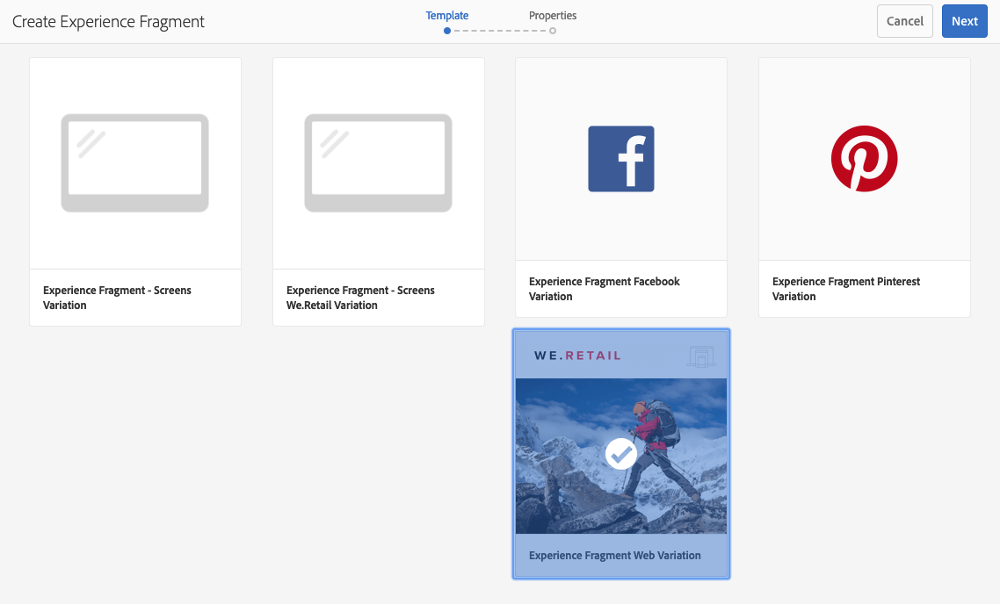

# Fragmentos de experiência{#experience-fragments}

No Adobe Experience Manager (AEM), um fragmento de experiência é um grupo de um ou mais componentes, incluindo conteúdo e layout, que podem ser referenciados nas páginas. Eles podem conter qualquer componente.

Um fragmento de experiência:

* Faz parte de uma experiência (página).
* Pode ser usado em várias páginas (com base em modelos editáveis).
* É baseado em um modelo (somente editável) para definir a estrutura e os componentes.
* Esse modelo é usado para criar a *página raiz* do Fragmento de experiência.
* É composto de um ou mais componentes, com layout, em um sistema de parágrafos.
* Pode conter outros fragmentos de experiência.
* Podem ser combinados com outros componentes (incluindo outros Fragmentos de experiência) para formar uma página completa (experiência).
* Uma ou mais variações podem ser criadas, com base na página raiz.
* Essas variações podem compartilhar conteúdo e/ou componentes.
* Pode ser dividida em blocos de construção que poderão ser usados em várias variações do fragmento.

Use os Fragmentos de experiência:

* Se um autor quiser reutilizar partes (um fragmento de uma experiência) de uma página, ele precisará copiar e colar esse fragmento. Criar e manter essa experiências de copiar/colar é um processo demorado e pode causar erros feitos pelo usuário. Os fragmentos de experiência eliminam a necessidade de copiar/colar.
* Para dar suporte ao caso de uso de CMS headless. Os autores desejam usar o AEM somente para criação, não para entrega ao cliente. Um ponto de contato ou sistema de terceiros consumiria essa experiência e a entregaria para o usuário final.
* Com o [Gerenciamento de vários sites (MSM)](/help/sites-administering/msm.md); o como um Fragmento de experiência faz parte de uma página. Isso se aplica aos fragmentos individuais e às pastas em que eles residem.

>[!NOTE]
>
>O acesso de gravação para fragmentos de experiência exige que a conta de usuário seja registrada no grupo:
>
>    `experience-fragments-editors`
>
>Entre em contato com o administrador do sistema se tiver algum problema.

## Quando usar fragmentos de experiência?   {#when-should-you-use-experience-fragments}

Fragmentos de experiência devem ser usados:

* Sempre que quiser reutilizar as experiências.

   * Experiências que serão reutilizadas com conteúdo igual ou semelhante

* Ao usar o AEM como uma plataforma de entrega de conteúdo para terceiros.

   * Qualquer solução que queira usar AEM como plataforma de entrega de conteúdo
   * Incorporação de conteúdo em pontos de contato de terceiros

* Se você tiver uma experiência com diferentes variações ou representações.

   * Variações específicas de canal ou contexto
   * Experiências que fazem sentido agrupar (por exemplo, uma campanha com diferentes experiências entre canais)

* Quando você usar o Comércio omnichannel.

   * Compartilhando conteúdo comercial em [redes sociais](/help/sites-developing/experience-fragments.md#social-variations) canais em escala
   * Tornar pontos de contato transacionais

## Organizar os Fragmentos de experiência {#organizing-your-experience-fragments}

Recomenda-se:
* usar pastas para organizar os Fragmentos de experiência,

* [configurar os modelos permitidos nessas pastas](#configure-allowed-templates-folder).

A criação de pastas permite:

* criar uma estrutura significativa para os Fragmentos de experiência; por exemplo, de acordo com a classificação

  >[!NOTE]
  >
  >Não é necessário alinhar a estrutura dos Fragmentos de experiência com a estrutura de página do site.

* [alocar os modelos permitidos no nível da pasta](#configure-allowed-templates-folder)

  >[!NOTE]
  >
  >Você pode usar o [editor de modelos](/help/sites-authoring/templates.md) para criar seu próprio modelo.

O projeto WKND estrutura alguns Fragmentos de experiência de acordo com `Contributors`. A estrutura usada também ilustra a maneira como outros recursos, como o Gerenciamento de vários sites (incluindo cópias de idiomas), podem ser usados.

Consulte:

`http://localhost:4502/aem/experience-fragments.html/content/experience-fragments/wknd/language-masters/en/contributors/kumar-selveraj/master`

## Criação e configuração de uma pasta para os Fragmentos de experiência {#creating-and-configuring-a-folder-for-your-experience-fragments}

Para criar e configurar uma pasta para os Fragmentos de experiência, recomenda-se:

1. [Criar uma pasta](/help/sites-authoring/managing-pages.md#creating-a-new-folder).

1. [Configurar os modelos de Fragmento de experiência permitidos para essa pasta](#configure-allowed-templates-folder).

>[!NOTE]
>
>Também é possível configurar os [Modelos permitidos para sua instância](#configure-allowed-templates-instance), mas esse método **não** é recomendado, pois os valores podem ser substituídos na atualização.

### Configurar os Modelos permitidos para sua Pasta {#configure-allowed-templates-folder}

>[!NOTE]
>
>Esse é o método recomendado para especificar os **Modelos permitidos**, pois os valores não serão substituídos na atualização.

1. Acesse a pasta **Fragmentos de experiência** necessária.

1. Selecione a pasta e depois as **Propriedades**.

1. Especifique a expressão regular para recuperar os modelos necessários no campo **Modelos permitidos**.

   Por exemplo:
   `/conf/(.*)/settings/wcm/templates/experience-fragment(.*)?`

   Consulte:
   `http://localhost:4502/mnt/overlay/cq/experience-fragments/content/experience-fragments/folderproperties.html/content/experience-fragments/wknd`

   

   >[!NOTE]
   >
   >Consulte [Modelos para fragmentos de experiência](/help/sites-developing/experience-fragments.md#templates-for-experience-fragments) para obter mais detalhes.

1. Selecione **Salvar e fechar**.

### Configurar os Modelos permitidos para sua Instância {#configure-allowed-templates-instance}

>[!CAUTION]
>
>Não é recomendável alterar os **Modelos permitidos** usando esse método, pois os modelos especificados podem ser substituídos na atualização.
>
>Use esta caixa de diálogo apenas para fins informativos.

1. Acesse o console **Fragmentos de experiência** necessário.

1. Selecione **Opções de configuração**:

   

1. Especifique os modelos necessários na caixa de diálogo **Configurar fragmentos de experiência**:

   

   >[!NOTE]
   >
   >Consulte [Modelos para fragmentos de experiência](/help/sites-developing/experience-fragments.md#templates-for-experience-fragments) para obter mais detalhes.

1. Selecione **Salvar**.

## Criação de um fragmento de experiência {#creating-an-experience-fragment}

Para criar um fragmento de experiência:

1. Selecione Fragmentos de experiência na Navegação global.

   

1. Navegue até a pasta desejada e selecione **Criar**.

   

1. Selecione **Fragmento de experiência** para abrir o assistente **Criar fragmento de experiência**.

   Selecione o **modelo** obrigatório e, em seguida, clique em **Avançar**:

   

1. Insira as **Propriedades** do **Fragmento de experiência**.

   É obrigatório ter um **título**. Se o **Nome** for deixado em branco, ele será derivado do **Título**.

   

   >[!NOTE]
   >
   >As tags do modelo do fragmento de experiência não serão unidas com tags nesta página raiz do fragmento de experiência.
   >
   >Elas são completamente separadas.

1. Clique em **Criar**.

   Uma mensagem será exibida. Selecione:

   * **Concluído** para retornar ao console

   * **Abrir** para abrir o editor de fragmento

## Edição de seu fragmento de experiência {#editing-your-experience-fragment}

O Editor de fragmento de experiência oferece recursos semelhantes ao editor de páginas normal.

>[!NOTE]
>
>Consulte [Editar conteúdo da página](/help/sites-authoring/editing-content.md) para obter mais informações sobre como usar o editor de páginas.

O exemplo de procedimento a seguir ilustra como criar um teaser de um produto:

1. Arraste e solte um **Teaser** do [Navegador de Componentes](/help/sites-authoring/author-environment-tools.md#components-browser).

   

1. Selecione **[Configurar](/help/sites-authoring/editing-content.md#edit-configure-copy-cut-delete-paste)** na barra de ferramentas do componente.
1. Adicione o **Ativo** e defina as **Propriedades** conforme necessário.
1. Confirme as definições com **Concluído** (ícone de marca de verificação).
1. Adicione mais componentes conforme necessário.

## Criação de uma variação de Fragmento de experiência {#creating-an-experience-fragment-variation}

É possível criar variações do Fragmento de experiência, dependendo das suas necessidades:

1. Abra o fragmento para [edição](/help/sites-authoring/experience-fragments.md#editing-your-experience-fragment).
1. Abra a guia **Variações**.

   

1. **Criar** permite criar:

   * **Variação**
   * **Variação como [live-copy](/help/sites-administering/msm.md#live-copies)**.

     >[!NOTE]
     >
     >Criar uma variação inicial como Live Copy herdará o título usando a Source da Live Copy como a variação principal.

1. Defina as propriedades necessárias:

   * **Modelo**
   * **Título**
   * **Nome**; se deixado em branco, ele será derivado do Título
   * **Descrição**
   * **Tags de variação**

   

1. Confirme com **Concluído** (ícone de marca de verificação), a nova variação será mostrada no painel:

   

## Usar seu fragmento de experiência {#using-your-experience-fragment}

Agora você poderá usar seu fragmento de experiência ao criar suas páginas:

1. Abra qualquer página para edição.

   >[!NOTE]
   >
   >A página deve ser baseada em um modelo editável.

   Por exemplo: [https://localhost:4502/editor.html/content/we-retail/language-masters/en/products/men.html](https://localhost:4502/editor.html/content/we-retail/language-masters/en/products/men.html)

1. Crie uma instância do componente Fragmento de experiência arrastando o componente do navegador Componentes para o sistema de parágrafos da página:

   

1. Adicione o Fragmento de experiência real à ocorrência de componente:

   * Arraste o fragmento necessário do Navegador Assets e solte no componente
   * Selecione **Configurar** na barra de ferramentas do componente e especifique o fragmento a ser usado, confirme com **Concluído** (marca de seleção)

   

   >[!NOTE]
   >
   >Editar, na barra de ferramentas do componente, opera como um atalho para abrir o fragmento no editor de fragmentos.

## Blocos de construção {#building-blocks}

Selecione um ou mais componentes para criar um bloco de construção para reciclagem no seu fragmento:

### Criar um bloco de construção {#creating-a-building-block}

Para criar um Bloco de Construção:

1. No editor de Fragmento de experiência, selecione os componentes que deseja reutilizar:

   

1. Na barra de ferramentas dos componentes, selecione **Converter em bloco de construção**:

   

1. Insira o nome do **Bloco de construção** e confirme com **Converter**:

   

1. O **Bloco de Construção** é mostrado na guia e pode ser selecionado no sistema de parágrafos:

   

#### Gerenciar um bloco de construção {#managing-a-building-block}

O bloco de construção está visível na guia **Blocos de construção**. Para cada bloco, as seguintes ações estarão disponíveis:

* Acesse o mestre: abra a variação da página raiz em uma nova guia
* Renomear
* Excluir

#### Usar um bloco de construção {#using-a-building-block}

Arraste o bloco de construção para o sistema de parágrafo de qualquer fragmento, como com qualquer componente.

## Detalhes do Fragmento de experiência {#details-of-your-experience-fragment}

Os detalhes do fragmento podem ser vistos:

1. Os detalhes são mostrados em todas as exibições do console **Fragmentos de experiência**, com a de **Exibição em lista**, incluindo detalhes de uma [exportação para o Target](/help/sites-administering/experience-fragments-target.md):

   

1. Ao abrir as **Propriedades** do fragmento de experiência:

   

   As propriedades estão disponíveis em várias guias:

   >[!CAUTION]
   >
   >Essas guias são exibidas quando você abre **Propriedades** no console Fragmentos de experiência.
   >
   >
   >Se você clicar em **Abrir propriedades** ao editar um Fragmento de experiência, as [Propriedades da página](/help/sites-authoring/editing-page-properties.md) apropriadas serão exibidas.

   

   * **Básico**

      * **Título** - obrigatório

      * **Descrição**
      * **Tags**
      * **Número total de variantes** - somente informações

      * **Número de variantes da Web** - somente informações
      * **Número de variantes que não fazem parte da Web** - inf **somente formatação**

      * **Número de páginas usando esse fragmento** - somente informações

   * **Cloud Services**

      * **Configuração na nuvem**
      * **Configurações do Cloud Service**
      * **ID da página do Facebook**
      * **Quadro do Pinterest**

   * **Referências**

      * Uma lista de referências.

   * **Status da rede social**

      * Detalhes de variações de redes sociais.

## A representação HTML simples {#the-plain-html-rendition}

Usando o seletor `.plain.` no URL, você poderá acessar a representação HTML simples a partir do navegador.

>[!NOTE]
>
>Embora isso esteja diretamente disponível no navegador, [o objetivo principal é permitir que outros aplicativos (por exemplo, aplicativos da Web de terceiros, implementações móveis personalizadas) acessem o conteúdo do fragmento de experiência diretamente, usando apenas o URL](/help/sites-developing/experience-fragments.md#the-plain-html-rendition).

## Exportar fragmentos de experiência {#exporting-experience-fragments}

Por padrão, os fragmentos de experiência são entregues no formato HTML. Isso pode ser usado por canais do AEM e de terceiros.

Para exportar para o Adobe Target, também é possível usar o JSON. Consulte [Integração do Target com os Fragmentos de experiência](/help/sites-administering/experience-fragments-target.md) para obter informações completas.
