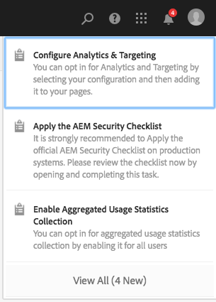
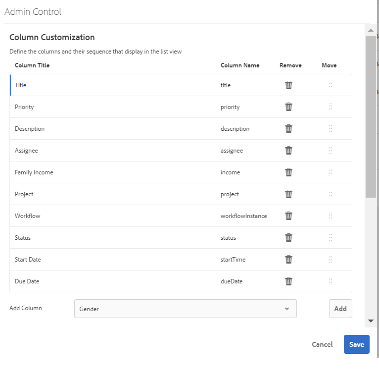
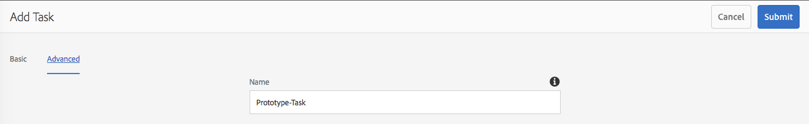

# Sua caixa de entrada{#your-inbox}

Você pode receber notificações de diversas áreas do AEM, incluindo fluxos de trabalho e projetos; por exemplo, sobre:

* Tarefas:

   * elas também podem ser criadas em vários pontos da interface do usuário do AEM, por exemplo, em **Projetos**,
   * podem ser o produto de uma etapa de fluxo de trabalho **Criar tarefa** ou **Criar tarefa do projeto**.

* Fluxos de trabalhos:

   * itens de trabalho que representam as ações que devem ser executadas no conteúdo da página;

      * estes são o produto de etapas do fluxo de trabalho **Participante**
   * itens de falha, para permitir que os administradores tentem novamente a etapa que falhou.

Você recebe essas notificações em sua própria caixa de entrada, onde você pode visualizá-las e executar a ação necessária.

>[!NOTE]
>
>O AEM pronto para uso vem pré-carregado com tarefas administrativas atribuídas ao grupo de usuários administradores. Para obter detalhes, consulte [Tarefas administrativas prontas para uso](#out-of-the-box-administrative-tasks).

>[!NOTE]
>
>Para obter mais informações sobre os tipos de item, consulte também:
>
>* [Projetos](/help/sites-authoring/touch-ui-managing-projects.md)
>* [Projetos - trabalhar com tarefas](/help/sites-authoring/task-content.md)
>* [Fluxos de trabalhos](/help/sites-authoring/workflows.md)
>* [Forms](/help/forms/home.md)

>

## Caixa de entrada no cabeçalho {#inbox-in-the-header}

De qualquer um dos consoles, o número atual de itens em sua caixa de entrada é mostrado no cabeçalho. O indicador também pode ser aberto para fornecer acesso rápido às páginas que requerem ações ou acesso à caixa de entrada:

>[!NOTE]
>
>Algumas ações também serão mostradas na [exibição de cartão do recurso apropriado](/help/sites-authoring/basic-handling.md#card-view).

## Tarefas administrativas prontas para uso  {#out-of-the-box-administrative-tasks}

O AEM pronto para uso vem pré-carregado com quatro tarefas atribuídas ao grupo de usuários do administrador.

* [Configurar Analytics e Targeting](/help/sites-administering/opt-in.md)
* [Aplicar a lista de verificação de segurança do AEM](/help/sites-administering/security-checklist.md)
* Permitir coleta de dados estatísticos de uso agregados
* [Configurar HTTPS](/help/sites-administering/ssl-by-default.md)

## Abrir a Caixa de entrada   {#opening-the-inbox}

Para abrir a caixa de entrada de notificação do AEM:

1. Clique/toque no indicador na barra de ferramentas.

1. Selecione **Exibir todos**. A **Caixa de entrada do AEM** será aberta. A caixa de entrada mostra itens de fluxos de trabalho, projetos e tarefas.
1. A exibição padrão é [Exibição em lista](#inbox-list-view), mas você também pode alternar para [Exibição de calendário](#inbox-calendar-view). Isso é feito com o seletor de visualização (barra de ferramentas, parte superior direita).

   Para ambas as exibições você também pode definir [Configurações de exibição](#inbox-view-settings); as opções disponíveis dependem da exibição atual.

   

>[!NOTE]
>
>A caixa de entrada funciona como um console, portanto, use [Navegação global](/help/sites-authoring/basic-handling.md#global-navigation) ou [Pesquisar](/help/sites-authoring/search.md) para navegar para outro local quando terminar.

### Caixa de entrada - exibição de lista {#inbox-list-view}

Essa exibição lista todos os itens, juntamente com informações principais relevantes:

### Caixa de entrada - Exibição de calendário {#inbox-calendar-view}

Essa exibição apresenta itens de acordo com sua posição no calendário e a exibição precisa selecionada:

É possível:

* selecionar uma exibição específica; **Linha do tempo**, **Coluna**, **Lista**

* especificar as tarefas a serem exibidas de acordo com **Agendamento**; **Todos**, **Planejado**, **Em andamento**, **Vencimento em breve**, **Vencido**

* abra o detalhamento para obter mais informações sobre um item
* selecione um intervalo de datas para focalizar na exibição:

### Inbox - Settings {#inbox-view-settings}

Para ambas as exibições (Lista e Calendário), você pode definir configurações:

* **Exibição de calendário**

   Para a **Exibição de calendário** é possível configurar:

   * **Agrupar por**
   * **Agendamento** ou **Nenhum**
   * **Tamanho do cartão**

   

* **Exibição de lista**

   Para a **Exibição de lista**, você pode configurar o mecanismo de classificação:

   * **Classificar campo**
   * **Ordem de classificação**

   

### Caixa de entrada - Controle de administrador {#inbox-admin-control}

A opção Controle de administrador permite que os administradores:

* Personalizar as colunas da Caixa de entrada do AEM

* Personalizar o texto e o logotipo do cabeçalho

* Controlar a exibição de links de navegação disponíveis no cabeçalho

A opção Controle de administrador está visível somente para os membros do `administrators` grupo ou do `workflow-administrators` grupo.

* **Personalização** da coluna: Personalize uma Caixa de entrada do AEM para alterar o título padrão de uma coluna, reordenar a posição de uma coluna e exibir colunas adicionais com base nos dados de um fluxo de trabalho.
   * **Adicionar Coluna**: Selecione uma coluna para adicionar na Caixa de entrada do AEM.
   * **Editar coluna**: Passe o mouse sobre o título da coluna e toque no ícone de  para inserir o nome de exibição da coluna.
   * **Excluir coluna**: Toque no ícone  para excluir a coluna da Caixa de entrada do AEM.
   * **Mover coluna**: Arraste o ícone  para mover uma coluna para uma nova posição na Caixa de entrada do AEM.

   

* **Personalização da marca**

   * **Personalizar o texto do cabeçalho:** Especifique o texto a ser exibido no cabeçalho para substituir o texto de **Adobe Experience Manager** padrão.

   * **Personalizar logotipo:** Especifique a imagem a ser exibida no cabeçalho como logotipo. Carregue uma imagem no Gerenciamento de ativos digitais (DAM) e consulte-a no campo.

* **Navegação do usuário**
   * **Ocultar opções de navegação:** Selecione essa opção para ocultar as opções de navegação disponíveis no cabeçalho. As opções de navegação incluem links para outras soluções, link Ajuda e as opções de criação disponíveis ao tocar no logotipo ou texto do Adobe Experience Manager.
* **Salvar:** Toque/clique nesta opção para salvar as configurações.

## Realizar ação em um item {#taking-action-on-an-item}

>[!NOTE]
>
>Embora seja possível selecionar mais de um item, ações só podem ser executadas em um item de cada vez.

1. Para executar uma ação em um item, selecione a miniatura do item apropriado. Os ícones de ações aplicáveis a esse item serão mostrados na barra de ferramentas:

   

   As ações são apropriadas ao item e incluem:

   * **Concluir** ação; por exemplo, uma tarefa ou um item de fluxo de trabalho.
   * **Atribuir novamente**/**Delegar** um item.
   * **Abrir** um item; dependendo do tipo de item, essa ação pode:

      * mostrar as propriedades do item
      * abrir um painel ou um assistente apropriado para uma futura ação
      * abrir a documentação relacionada
   * **Recuar** para uma etapa anterior.
   * Visualizar a carga de um fluxo de trabalho.
   * Criar um projeto a partir do item.

   >[!NOTE]
   >
   >Para obter mais informações, consulte:
   >
   >* Itens de fluxo de trabalho - [ participar de fluxos de trabalho](/help/sites-authoring/workflows-participating.md)

1. Dependendo do item selecionado, uma ação será iniciada; por exemplo:

   * uma caixa de diálogo apropriada para a ação será aberta.
   * um assistente de ação será iniciado.
   * uma página de documentação será aberta.

   Por exemplo, **Atribuir novamente** abrirá uma caixa de diálogo:

   

   Se uma caixa de diálogo, um assistente ou uma página de documentação tiver sido aberta, é possível:

   * Confirmar a ação apropriada; por exemplo Atribuir novamente.
   * Cancelar a ação.
   * Voltar usando a tecla Backspace; por exemplo, se um assistente de ação ou uma página de documentação tiverem sido abertos, você poderá retornar à Caixa de entrada.

## Criação de uma tarefa {#creating-a-task}

Na caixa de entrada, você pode criar tarefas:

1. Selecione **Criar**, **Tarefa**.
1. Preencha os campos necessários nas guias **Básicas** e **Avançadas**. Somente o **Título** é obrigatório, todos os demais são opcionais:

   * **Básico**:

      * **Título**
      * **Projeto**
      * **Destinatário**
      * **Conteúdo;** semelhante a Carga, essa é uma referência da tarefa a um local no repositório
      * **Descrição**
      * **Prioridade da tarefa**
      * **Data inicial**
      * **Data de vencimento**

   

   * **Avançado**

      * **Nome**: this will be used to form the URL; if blank it will be based on the **Title**.

   

1. Selecione **Enviar**.

## Criação de um projeto   {#creating-a-project}

Para determinadas tarefas, você pode criar um [Projeto](/help/sites-authoring/projects.md) com base nessa tarefa:

1. Toque ou clique na miniatura para selecionar a tarefa apropriada.

   >[!NOTE]
   >
   >Somente tarefas criadas usando a opção **Criar** da **Caixa de entrada** podem ser usadas para criar um projeto.
   >
   >Itens de trabalho (de um fluxo de trabalho) não podem ser usado para criar um projeto.

1. Selecione **Criar projeto** na barra de ferramentas para abrir o assistente.
1. Selecione o modelo apropriado e, em seguida, clique em **Avançar**.
1. Especifique as propriedades necessárias:

   * **Básico**

      * **Título**
      * **Descrição**
      * **Data inicial**
      * **Data de vencimento**
      * **Usuário** e função
   * **Avançado**

      * **Nome**
   >[!NOTE]
   >
   >Consulte [Criação de um projeto](/help/sites-authoring/touch-ui-managing-projects.md#creating-a-project) para obter as informações completas.

1. Selecione **Criar** para confirmar a ação.

## Filtrar itens na Caixa de entrada do AEM {#filtering-items-in-the-aem-inbox}

Você pode filtrar os itens listados:

1. Abra a **Caixa de entrada do AEM**.

1. Abra o seletor de filtro:

   

1. É possível filtrar os itens listados de acordo com uma variedade de critérios, muitos dos quais pode ser refinados; por exemplo:

   

   >[!NOTE]
   >
   >Com [Configurações de exibição](#inbox-view-settings) você também pode configurar a ordem de classificação ao usar a [Exibição de lista](#inbox-list-view).

