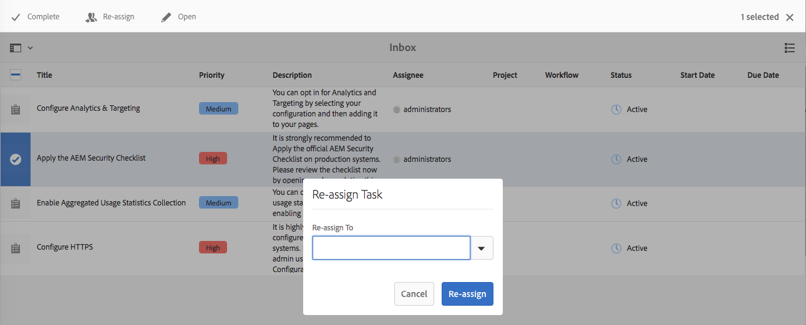
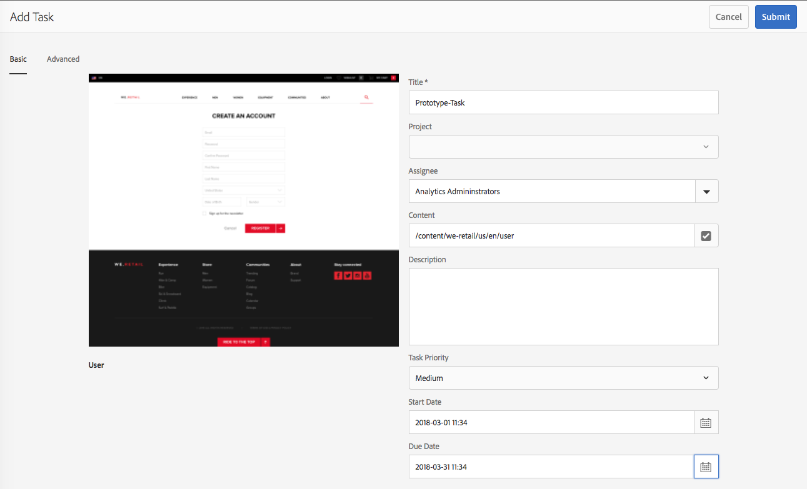

# Sua caixa de entrada{#your-inbox}

Você pode receber notificações de várias áreas do AEM, incluindo fluxos de trabalho e projetos; por exemplo, sobre:

* Tarefas:

   * também podem ser criadas em vários pontos da interface do usuário AEM, por exemplo, em **Projetos**,
   * eles podem ser o produto de um workflow **Criar tarefa** ou **Criar tarefa de projeto** etapa.

* Fluxos de trabalhos:

   * itens de trabalho que representam as ações que devem ser executadas no conteúdo da página;

      * estes são o produto de um fluxo de trabalho **Participante** etapas

   * itens de falha, para permitir que os administradores tentem novamente a etapa que falhou.

Você recebe essas notificações em sua própria caixa de entrada, onde pode visualizá-las e executar ações.

>[!NOTE]
>
>O AEM pronto para uso vem pré-carregado com tarefas administrativas atribuídas ao grupo de usuários administrador. Consulte [Tarefas administrativas prontas para uso](#out-of-the-box-administrative-tasks) para obter detalhes.

>[!NOTE]
>
>Para obter mais informações sobre os tipos de item, consulte também:
>
>* [Projetos](/help/sites-authoring/touch-ui-managing-projects.md)
>* [Projetos: trabalhar com tarefas](/help/sites-authoring/task-content.md)
>* [Fluxos de trabalhos](/help/sites-authoring/workflows.md)
>* [Forms](/help/forms/using/introduction-aem-forms.md)
>

## Caixa de entrada no cabeçalho {#inbox-in-the-header}

Em qualquer um dos consoles, o número atual de itens na sua caixa de entrada é mostrado no cabeçalho. O indicador também pode ser aberto para fornecer acesso rápido às páginas que exigem ações ou acesso à caixa de entrada:

>[!NOTE]
>
>Algumas ações também serão mostradas na [exibição de cartão do recurso apropriado](/help/sites-authoring/basic-handling.md#card-view).

## Tarefas administrativas prontas para uso  {#out-of-the-box-administrative-tasks}

O AEM pronto para uso vem pré-carregado com quatro tarefas atribuídas ao grupo de usuários administrador.

* [Configurar Analytics e Targeting](/help/sites-administering/opt-in.md)
* [Aplicar a lista de verificação de segurança do AEM](/help/sites-administering/security-checklist.md)
* Habilitar coleta de dados estatísticos de uso agregados
* [Configurar HTTPS](/help/sites-administering/ssl-by-default.md)

## Abrir a Caixa de entrada   {#opening-the-inbox}

Para abrir a caixa de entrada de notificação do AEM:

1. Clique no indicador na barra de ferramentas.

1. Selecione **Exibir todos**. A variável **Caixa de entrada AEM** é aberto. A caixa de entrada mostra itens de fluxos de trabalho, projetos e tarefas.
1. A exibição padrão é [Exibição em lista](#inbox-list-view), mas você também pode alternar para [Exibição de calendário](#inbox-calendar-view). Isso é feito com o seletor de visualização (barra de ferramentas, parte superior direita).

   Para ambas as exibições também é possível definir [Configurações de exibição](#inbox-view-settings); as opções disponíveis dependem da exibição atual.

   

>[!NOTE]
>
>A caixa de entrada funciona como um console, portanto, use [Navegação global](/help/sites-authoring/basic-handling.md#global-navigation) ou [Pesquisar](/help/sites-authoring/search.md) para navegar para outro local quando terminar.

### Caixa de entrada - exibição de lista {#inbox-list-view}

Essa exibição lista todos os itens, juntamente com as principais informações relevantes:

### Caixa de entrada - Exibição de calendário {#inbox-calendar-view}

Esta exibição apresenta os itens de acordo com sua posição no calendário e a exibição precisa selecionada:

É possível:

* selecionar uma exibição específica; **Linha do tempo**, **Coluna**, **Lista**

* especificar as tarefas a serem exibidas de acordo com **Agendar**; **Todos**, **Planejado**, **Em andamento**, **Vencimento em breve**, **Vencido**

* fazer drill-down para obter informações mais detalhadas sobre um item
* selecione um intervalo de datas para focalizar na exibição:

### Caixa de entrada - configurações {#inbox-view-settings}

Para ambas as visualizações (Lista e Calendário), é possível definir certas configurações:

* **Exibição de calendário**

  Para a **visualização de Calendário**, você pode configurar:

   * **Agrupar por**
   * **Agendamento** ou **Nenhum**
   * **Tamanho do cartão**

  

* **Exibição de lista**

  Para a **visualização de Lista**, você pode configurar o mecanismo de classificação:

   * **Classificar campo**
   * **Ordem de classificação**

  

### Caixa de entrada - Controle de administração {#inbox-admin-control}

A opção Admin Control permite que os administradores:

* Personalizar as colunas da Caixa de entrada do AEM

* Personalizar o texto e o logotipo do cabeçalho

* Controlar a exibição de links de navegação disponíveis no cabeçalho

A opção Admin Control está visível somente para os membros da `administrators` ou `workflow-administrators` grupo.

* **Personalização da coluna**: personalize uma caixa de entrada AEM para alterar o título padrão de uma coluna, reordenar a posição de uma coluna e exibir colunas adicionais com base nos dados de um fluxo de trabalho.
   * **Adicionar coluna**: selecione uma coluna para adicionar à Caixa de entrada AEM.
   * **Editar Coluna**: Passe o mouse sobre o título da coluna e selecione  ícone para inserir um nome de exibição de coluna.
   * **Excluir coluna**: selecione a variável  ícone para excluir a coluna da Caixa de entrada AEM.
   * **Mover Coluna**: arraste o  ícone para mover uma coluna para uma nova posição na Caixa de entrada AEM.

  

* **Personalização da marca**

   * **Personalizar texto de cabeçalho:** Especifique o texto a ser exibido no cabeçalho para substituir o padrão **Adobe Experience Manager** texto.

   * **Personalizar logotipo:** Especifique a imagem a ser exibida no cabeçalho como logotipo. Carregue uma imagem no Gerenciamento de ativos digitais (DAM) e consulte essa imagem no campo.

* **Navegação do usuário**
   * **Ocultar opções de navegação:** Selecione essa opção para ocultar as opções de navegação disponíveis no cabeçalho. As opções de navegação incluem links para outras soluções, o link Ajuda e as opções de criação disponíveis ao tocar no logotipo ou texto do Adobe Experience Manager.
* **Salvar:** Clique nessa opção para salvar as configurações.

## Realizar ação em um item {#taking-action-on-an-item}

>[!NOTE]
>
>Embora seja possível selecionar mais de um item, ações só podem ser executadas em um item de cada vez.

1. Para realizar uma ação em um item, selecione a miniatura do item apropriado. Os ícones das ações aplicáveis a esse item são mostrados na barra de ferramentas:

   

   As ações são apropriadas ao item e incluem:

   * **Concluído** ação; por exemplo, uma tarefa ou item de workflow.
   * **Reatribuir**/**Delegar** um item.
   * **Abertura** um item; dependendo do tipo de item, essa ação pode:

      * mostrar as propriedades do item
      * abrir um painel ou assistente apropriado para executar outras ações
      * abrir documentação relacionada

   * **Retroceder** para uma etapa anterior.
   * Visualizar a carga de um fluxo de trabalho.
   * Crie um projeto a partir do item.

   >[!NOTE]
   >
   >Para obter mais informações, consulte:
   >
   >* Itens de fluxo de trabalho - [participar de fluxos de trabalho](/help/sites-authoring/workflows-participating.md)

1. Dependendo do item selecionado, uma ação será iniciada; por exemplo:

   * uma caixa de diálogo apropriada para a ação será aberta.
   * um assistente de ação será iniciado.
   * uma página de documentação será aberta.

   Por exemplo, **Reatribuir** abre uma caixa de diálogo:

   

   Se uma caixa de diálogo, um assistente ou uma página de documentação tiver sido aberta, é possível:

   * Confirme a ação apropriada; por exemplo, Reatribuir.
   * Cancelar a ação.
   * Seta para trás; por exemplo, se um assistente de ação ou uma página de documentação tiver sido aberta, você poderá retornar à Caixa de entrada.

## Criação de uma tarefa {#creating-a-task}

Na caixa de entrada, é possível criar tarefas:

1. Selecione **Criar**, depois **Tarefa**.
1. Preencha os campos necessários no **Básico** e **Avançado** guias; somente o **Título** é obrigatório, todos os outros são opcionais:

   * **Básico**:

      * **Título**
      * **Projeto**
      * **Destinatário**
      * **Conteúdo**; semelhante a Carga, essa é uma referência da tarefa a um local no repositório
      * **Descrição**
      * **Prioridade da tarefa**
      * **Data inicial**
      * **Data de vencimento**

   

   * **Avançado**

      * **Nome**: isso é usado para formar o URL; se estiver vazio, será baseado no **Título**.

   

1. Selecione **Enviar**.

## Criação de um projeto   {#creating-a-project}

Para determinadas tarefas, você pode criar um [Projeto](/help/sites-authoring/projects.md) com base nessa tarefa:

1. Selecione a tarefa apropriada tocando/clicando na miniatura.

   >[!NOTE]
   >
   >Somente tarefas criadas usando a opção **Criar** da **Caixa de entrada** podem ser usadas para criar um projeto.
   >
   >Itens de trabalho (de um fluxo de trabalho) não podem ser usados para criar um projeto.

1. Selecione **Criar projeto** na barra de ferramentas para abrir o assistente.
1. Selecione o modelo obrigatório e clique em **Próximo**.
1. Especifique as propriedades necessárias:

   * **Básico**

      * **Título**
      * **Descrição**
      * **Data inicial**
      * **Data de vencimento**
      * **Usuário** e função

   * **Avançado**

      * **Nome**

   >[!NOTE]
   >
   >Consulte [Criar um projeto](/help/sites-authoring/touch-ui-managing-projects.md#creating-a-project) para obter todas as informações.

1. Selecione **Criar** para confirmar a ação.

## Filtrar itens na Caixa de entrada do AEM {#filtering-items-in-the-aem-inbox}

Você pode filtrar os itens listados:

1. Abra a **Caixa de entrada do AEM**.

1. Abra o seletor de filtro:

   

1. Você pode filtrar os itens listados de acordo com uma variedade de critérios, muitos dos quais podem ser refinados; por exemplo:

   

   >[!NOTE]
   >
   >Com [Configurações de exibição](#inbox-view-settings) você também pode configurar a ordem de classificação ao usar a [Exibição de lista](#inbox-list-view).
