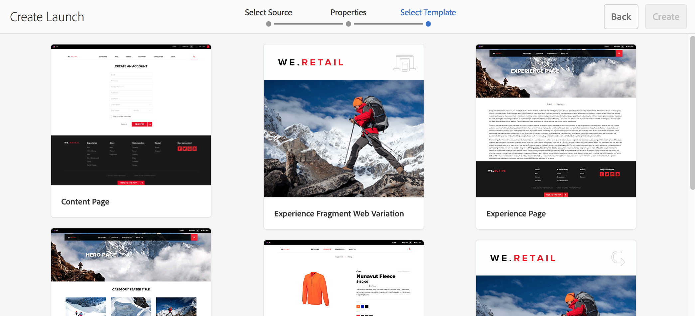
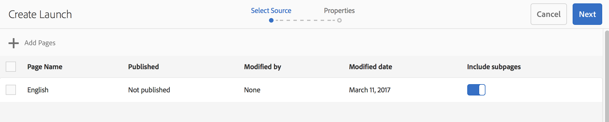

# Criação de lançamentos{#creating-launches}

Crie um lançamento para permitir a atualização de uma nova versão de páginas da web existentes para ativação futura. Ao criar o Lançamento, especifique um título e a página de origem:

* The title appears in the [References](/help/sites-authoring/author-environment-tools.md#references) rail, from where authors can access them to work on them.
* As páginas secundárias da página de origem são incluídas no lançamento por padrão. Você pode usar apenas a página de origem, se desejar.
* Por padrão, a [Live Copy](/help/sites-administering/msm.md) atualiza automaticamente as páginas de lançamento conforme as páginas de origem são alteradas. Você pode especificar que uma cópia estática seja criada para evitar alterações automáticas.

Opcionalmente, é possível especificar a **Data de lançamento** (e a hora) para definir quando as páginas de lançamento devem ser promovidas e ativadas. However the **Launch Date** only operates in combination with the **Production Ready** flag (see [Editing a Launch Configuration](/help/sites-authoring/launches-editing.md#editing-a-launch-configuration)); for the actions to actually occur automatically, both must be set.

## Criação de um lançamento {#creating-a-launch}

É possível criar um lançamento do console Sites ou Lançamentos:

1. Abra o console **Sites** ou **Lançamentos**.

   >[!NOTE]
   >
   >Ao usar o console **Sites**, é normal navegar até o local da página de origem, mas isso não é obrigatório, pois você pode navegar para selecionar **Iniciar origem** no assistente.

1. Dependendo do console que está usando:

   * **Lançamentos**:

      1. Selecione **Criar lançamento** na barra de ferramentas para abrir o assistente.
   * **Sites**:

      1. Selecione **Criar** na barra de ferramentas para abrir a caixa de seleção.
      1. Aqui, selecione **Criar lançamento** para abrir o assistente.
   >[!NOTE]
   >
   >No console **Sites**, também é possível usar o [modo de seleção](/help/sites-authoring/basic-handling.md#viewing-and-selecting-resources) para selecionar uma página antes de selecionar **Criar**.
   >
   >Esta ação utilizará a página selecionada como a página de origem inicial.

1. Na etapa **Selecionar origem**, é necessário **Adicionar páginas**. É possível selecionar várias páginas, especificando o caminho de cada uma delas:

   * Navegue até o local necessário.
   * Selecione as páginas de origem e confirme-as (marca de verificação).
   Repita conforme necessário.

   

   >[!NOTE]
   >
   >Para adicionar páginas e/ou ramificações a um lançamento, elas devem estar em um site (ou seja, abaixo de uma raiz de nível superior comum).
   >
   >Se o site contém raízes de idioma abaixo do nível superior, as páginas e as ramificações de um lançamento devem estar abaixo de uma raiz de idioma comum.

1. Para cada entrada, é possível especificar:

   * **Incluir subpáginas**:

      * Especifique se você deseja criar o lançamento com ou sem as páginas secundárias.  Por padrão, essas subpáginas são incluídas.
   Continue com **Próximo**.

   

1. Na etapa **Propriedades** do assistente, é possível especificar:

   * **Título do lançamento**: o nome do lançamento. O nome deve ser significativo para os autores.
   * **com conteúdo existente**: o conteúdo original será usado para criar o lançamento.
   * **usar um novo modelo para substituir a página**: consulte[ Criar lançamento com o novo modelo](#create-launch-with-new-template) para obter mais detalhes.
   * **Herdar dados online de página fonte:** selecione essa opção para atualizar automaticamente o conteúdo das páginas de lançamento quando as páginas de origem forem alteradas. This option achieves this by making the launch a [live copy](/help/sites-administering/msm.md).

      Por padrão, esta opção é selecionada.

   * **Data de lançamento**: a data e a hora em que a cópia de lançamento deve ser ativada (dependendo do sinalizador de **Pronto para produção**; consulte [Lançamentos - a ordem dos eventos](/help/sites-authoring/launches.md#launches-the-order-of-events)).
   

1. Use **Criar** para concluir o processo e criar seu novo lançamento. A caixa de diálogo de confirmação irá perguntar se deseja abrir o lançamento imediatamente.

   Se retornar ao console (com a opção **Concluído**), poderá visualizar (e acessar) seu lançamento:

   * o [****console Lançamentos](/help/sites-authoring/launches.md#the-launches-console)
   * das [**Referências **no console** Sites **](/help/sites-authoring/launches.md#launches-in-references-sites-console)

### Criar lançamento com o novo modelo {#create-launch-with-new-template}

Ao [criar um lançamento](/help/sites-authoring/launches-creating.md#create-launch-with-new-template), é possível escolher se deseja usar um novo modelo:

**utilizando um novo modelo para substituir a página**

>[!CAUTION]
>
>Essa opção está disponível apenas ao criar um lançamento no console **Sites**. Não está disponível ao criar um lançamento no console **Lançamentos**.

Selecionar isso irá:

* atualizar as outras opções disponíveis,
* incluir uma nova etapa, que permite selecionar o modelo obrigatório.

>[!CAUTION]
>
>Como um modelo diferente foi usado, a nova página estará em branco. Devido a uma estrutura de página diferente, nenhum conteúdo será copiado.
>
>Este mecanismo pode ser usado para alterar o modelo de uma [página existente](/help/sites-authoring/managing-pages.md#creating-a-new-page), embora a perda de conteúdo deva ser levada em consideração.

### Criação de um lançamento aninhado {#creating-a-nested-launch}

Criar um lançamento aninhado (um lançamento dentro de outro) permite criar um lançamento a partir de um lançamento existente, de modo os autores possam aproveitar as alterações feitas, em vez de ter que fazer as mesmas alterações várias vezes para cada lançamento.

>[!NOTE]
>
>Consulte também [Promover um lançamento aninhado](/help/sites-authoring/launches-promoting.md#promoting-a-nested-launch).

#### Criação de um lançamento aninhado - Console Lançamentos {#creating-a-nested-launch-launches-console}

Creating a nested launch from the **Launches** console is basically the same as creating any other form of launch, with the exception that you need to navigate to the launches branch `/content/launches`:

1. No console **Lançamentos** selecione **Criar**.
1. Select **Add Pages**, then navigate to the launches branch by specifying `/content/launches` in the filter. Selecione o lançamento necessário e confirme com **Selecionar**:

   

1. Continue com **Próximo** e preencha as **Propriedades** como faria com qualquer outro lançamento.

   

#### Criação de um lançamento aninhado - Console Sites {#creating-a-nested-launch-sites-console}

Para criar um lançamento aninhado no console **Sites**, com base em um lançamento existente:

1. Acesse [Lançamento a partir de Referências (console Sites)](/help/sites-authoring/launches.md#launches-in-references-sites-console) para mostrar as ações disponíveis.
1. Selecione **Criar lançamento** para abrir o assistente (a etapa **Selecionar fonte** será ignorada, pois a origem já foi selecionada).

1. Insira o **Título do lançamento** e todos os outros detalhes necessários (como com um lançamento normal).

1. Use **Criar** para concluir o processo e criar seu novo lançamento. A caixa de diálogo de confirmação irá perguntar se deseja abrir o lançamento imediatamente.

   If you select **Done**, you are returned to the **References** rail of the **Sites** console, if you select the appropriate page your new launch is shown.

### Exclusão de um lançamento {#deleting-a-launch}

É possível excluir um lançamento do console [Lançamentos](/help/sites-authoring/launches.md#the-launches-console):

* Selecione o lançamento, tocando/clicando na miniatura.
* A barra de ferramentas será exibida; selecione Excluir.
* Confirme a ação.

>[!CAUTION]
>
>Excluir um lançamento removerá o próprio lançamento e qualquer lançamento descendente aninhado.

