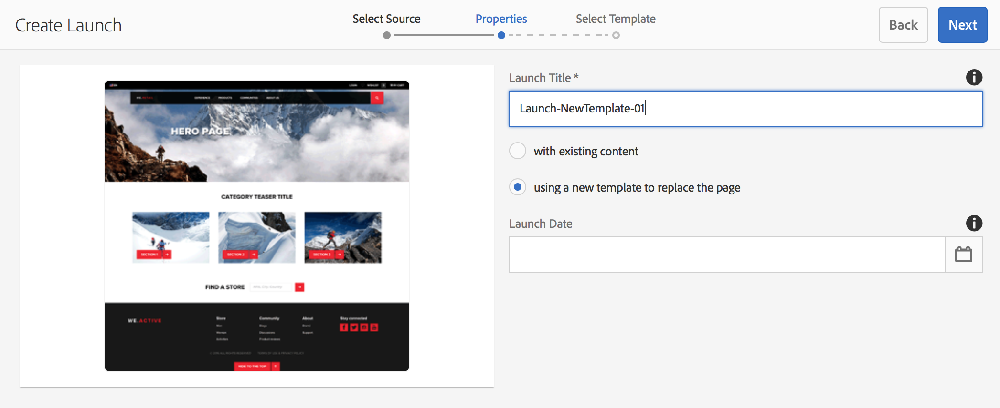

# Criar lançamentos{#creating-launches}

Crie um lançamento para permitir a atualização de uma nova versão de páginas da Web para ativação futura. Ao criar a inicialização, especifique um título e a página de origem:

* O título é exibido no painel [Referências](/help/sites-authoring/author-environment-tools.md#references), onde os autores podem acessá-lo para trabalhar nele.
* As páginas secundárias da página de origem são incluídas no lançamento por padrão. Você pode usar somente a página de origem, se desejar.
* Por padrão, [Live Copy](/help/sites-administering/msm.md) atualiza automaticamente as páginas de lançamento à medida que as páginas de origem são alteradas. É possível especificar que uma cópia estática seja criada para impedir alterações automáticas.

Como opção, especifique a **Data de inicialização** (e a hora) para definir quando as páginas de inicialização devem ser promovidas e ativadas. No entanto, a **Data de inicialização** só funciona em combinação com o sinalizador **Pronto para produção** (consulte [Editar uma configuração de inicialização](/help/sites-authoring/launches-editing.md#editing-a-launch-configuration)); para que as ações realmente ocorram automaticamente, ambas devem ser definidas.

## Criação de um lançamento {#creating-a-launch}

É possível criar um lançamento nos consoles do Sites ou do Lançamentos:

1. Abra o console **Sites** ou **Inicializações**.

   >[!NOTE]
   >
   >Ao usar o console do **Sites** é comum navegar para o local da página de origem, mas isso não é obrigatório, pois é possível navegar ao selecionar a opção **Origem do lançamento** no assistente.

1. Dependendo do console usado:

   * **Inicializações**:

      1. Selecione **Criar lançamento** na barra de ferramentas para abrir o assistente.

   * **Sites**:

      1. Selecione **Criar** na barra de ferramentas para abrir a caixa de seleção.
      1. Em seguida selecione **Criar lançamento** para abrir o assistente.

   >[!NOTE]
   >
   >No console **Sites**, também é possível usar o [modo de seleção](/help/sites-authoring/basic-handling.md#viewing-and-selecting-resources) para selecionar uma página antes de selecionar **Criar**.
   >
   >Esta ação utilizará a página selecionada como a página de origem inicial.

1. Na etapa **Selecionar origem**, é necessário **Adicionar páginas**. É possível selecionar várias páginas, especificando o caminho de cada uma delas:

   * Navegue até o local necessário.
   * Selecione as páginas de origem e confirme-as (marca de seleção).

   Repita conforme necessário.

   

   >[!NOTE]
   >
   >Para adicionar páginas e/ou ramificações a um lançamento, elas devem estar em um site; ou seja, abaixo de uma raiz de nível superior comum.
   >
   >Se um site contiver raízes de idioma abaixo do nível superior, as páginas e ramificações para um lançamento deverão estar abaixo de uma raiz de idioma comum.
   >
   >Se você tentar criar uma inicialização com uma página principal ou secundária no caminho de origem, ela falhará e retornará o erro &quot;O destino já existe em :path para a página&quot;.

1. Para cada entrada, é necessário especificar se deseja:

   * **Incluir subpáginas**:

      * Especifique se você deseja criar a inicialização com ou sem as páginas secundárias.  Por padrão, essas subpáginas são incluídas.

   Continue clicando em **Próximo**.

   

1. Na etapa **Propriedades** do assistente, é possível especificar:

   * **Título do lançamento**: o nome do lançamento. O nome deve ser significativo para os autores.
   * **com conteúdo já existente**: o conteúdo original será usado para criar o lançamento.
   * **usar um novo modelo para substituir a página**: consulte [Criar inicialização com um novo modelo](#create-launch-with-new-template) para obter mais detalhes.
   * **Herdar dados online da página de origem:** selecione essa opção para atualizar automaticamente o conteúdo das páginas de inicialização quando as páginas de origem forem alteradas. Essa opção faz isso transformando a inicialização em uma [live copy](/help/sites-administering/msm.md).

     Por padrão, esta opção é selecionada.

   * **Data da inicialização**: a data e a hora em que a cópia de inicialização deve ser ativada (dependendo do sinalizador de **Pronto para produção**; consulte [Inicializações - a ordem dos eventos](/help/sites-authoring/launches.md#launches-the-order-of-events)).

   

1. Clique em **Criar** para concluir o processo e criar a seu novo lançamento. A caixa de diálogo de confirmação perguntará se você deseja abrir o lançamento imediatamente.

   Se você retornar ao console (com **Concluído**) será possível ver (e acessar) seu lançamento por meio de:

   * o [**** console Lançamentos](/help/sites-authoring/launches.md#the-launches-console)
   * o [**Referências** no **Sites** console](/help/sites-authoring/launches.md#launches-in-references-sites-console)

### Criar inicialização com um novo modelo {#create-launch-with-new-template}

Quando [criação de uma inicialização](/help/sites-authoring/launches-creating.md#create-launch-with-new-template) é possível selecionar se deseja usar um novo modelo com a opção: **uso de um novo modelo para substituir a página**

>[!CAUTION]
>
>Essa opção está disponível apenas ao criar uma inicialização no console **Sites**. Não está disponível ao criar uma inicialização no console **Inicializações**.

Selecionar isso irá:

* atualizar as outras opções disponíveis,
* inclua uma nova etapa, na qual você possa selecionar o modelo necessário.

>[!CAUTION]
>
>Como um modelo diferente é usado, a nova página ficará vazia. Devido à estrutura de página diferente, nenhum conteúdo será copiado.
>
>Esse mecanismo pode ser usado para alterar o modelo de uma [página já existente](/help/sites-authoring/managing-pages.md#creating-a-new-page), embora a perda de conteúdo deva ser considerada.

### Criação de um lançamento aninhado {#creating-a-nested-launch}

A criação de um lançamento aninhado (um lançamento dentro de outro) oferece a capacidade de criar um lançamento a partir de outro já existente, para que os autores possam aproveitar as alterações já feitas, em vez de precisar fazer as mesmas alterações várias vezes para cada lançamento.

>[!NOTE]
>
>Consulte também [Promover uma inicialização aninhada](/help/sites-authoring/launches-promoting.md#promoting-a-nested-launch).

#### Criação de uma inicialização aninhada - Console Inicializações {#creating-a-nested-launch-launches-console}

A criação de uma inicialização aninhada no console **Inicializações** segue basicamente o mesmo processo de criação de qualquer outra forma de inicialização, com a exceção de que você precisa acessar a ramificação de inicializações `/content/launches`:

1. No console **Inicializações**, selecione **Criar**.
1. Selecione **Adicionar páginas** e navegue até a ramificação de inicializações especificando `/content/launches` no filtro. Selecione a inicialização necessária e confirme com **Selecionar**:

   

1. Continuar com **Próxima** e conclua o **Propriedades** como em qualquer outro lançamento.

   

#### Criação de uma inicialização aninhada - Console Sites {#creating-a-nested-launch-sites-console}

Para criar uma inicialização aninhada no console **Sites**, com base em uma inicialização existente:

1. Acesse [Inicialização a partir de Referências (console Sites)](/help/sites-authoring/launches.md#launches-in-references-sites-console) para mostrar as ações disponíveis.
1. Selecione **Criar inicialização** para abrir o assistente (como a origem já foi selecionada, ele ignorará a etapa **Selecionar origem**).

1. Insira o **Título da inicialização** e todos os outros detalhes necessários (como em uma inicialização normal).

1. Clique em **Criar** para concluir o processo e criar a seu novo lançamento. A caixa de diálogo de confirmação perguntará se você deseja abrir o lançamento imediatamente.

   Ao selecionar **Concluído**, você retornará ao painel **Referências** do console **Sites**. Ao selecionar a página apropriada, a nova inicialização será exibida.

### Exclusão de um lançamento {#deleting-a-launch}

É possível excluir um lançamento a partir do [console do Lançamentos](/help/sites-authoring/launches.md#the-launches-console):

* Selecione o lançamento tocando/clicando na miniatura.
* A barra de ferramentas aparecerá. Selecione Excluir.
* Confirme a ação.

>[!CAUTION]
>
>Excluir um lançamento removerá o próprio além de qualquer lançamento descendente aninhado.
