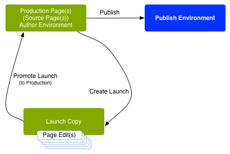
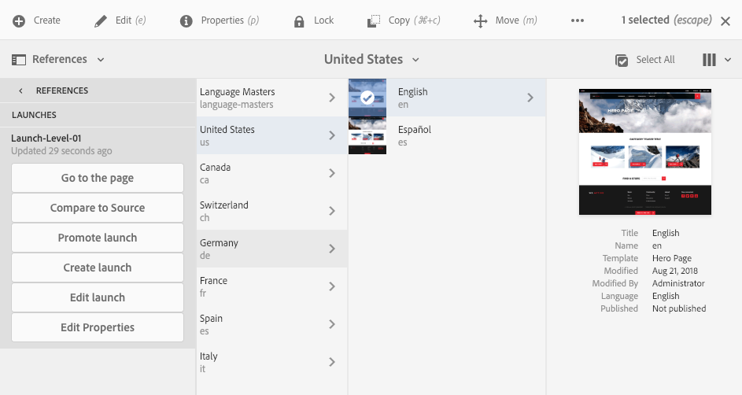

# Lançamentos{#launches}

Os lançamentos permitem desenvolver conteúdo com eficiência para uma versão futura.

Uma *Inicialização* é criada para permitir que você faça alterações na preparação de uma publicação futura, ao mesmo tempo em que mantém suas páginas atuais. Isso significa que você está editando duas versões ao mesmo tempo: páginas publicadas no momento e uma versão dessas páginas a serem publicadas posteriormente. Quando essa hora chegar, você poderá substituir as páginas originais e publicar a nova versão.

Você cria uma *Inicialização* e, depois de editar e atualizar as páginas da *Inicialização*, *promove* de volta para a *Source*. Você pode então ativar estas *páginas do Source* (nível superior). A promoção duplica o conteúdo do lançamento de volta às páginas de origem e pode ser feita manual ou automaticamente (dependendo dos campos definidos ao criar e editar o lançamento).

Por exemplo, as páginas de produtos sazonais da loja online são atualizadas trimestralmente para que os produtos em destaque se alinhem à temporada atual. Para se preparar para a próxima atualização trimestral, é possível criar um lançamento das páginas da Web apropriadas. Ao longo do trimestre, as seguintes alterações são acumuladas na cópia do lançamento:

* Alterações nas páginas de origem que ocorrem como resultado de tarefas de manutenção normais. Essas alterações são duplicadas automaticamente nas páginas de lançamento.
* Edições realizadas diretamente nas páginas de lançamento como preparação para o próximo trimestre.

Quando o próximo trimestre chegar, você promoverá as páginas de lançamento para poder publicar as páginas de origem (mantendo o conteúdo atualizado). É possível promover todas as páginas ou apenas aquelas que você modificou.

Os lançamentos também podem ser:

* Criados para várias ramificações raiz. Embora você possa criar o lançamento para todo o site (e fazer as alterações lá), isso pode ser inviável, pois todo o site precisaria ser copiado. Quando centenas ou até milhares de páginas estão envolvidas, os requisitos e o desempenho do sistema seriam afetados pela ação de cópia e, posteriormente, pelas comparações necessárias para as tarefas de promoção.
* Aninhados (um lançamento dentro de outro) para oferecer a capacidade de criar um lançamento a partir de outro já existente, de modo que os autores possam aproveitar as alterações já feitas em vez de precisar fazer as mesmas alterações várias vezes para cada lançamento.

Esta seção descreve como criar, editar e promover (e, se necessário, [excluir](/help/sites-authoring/launches-creating.md#deleting-a-launch)) as páginas de inicialização de dentro do console do Sites ou [do console Inicializações](#the-launches-console):

* [Criação de Lançamentos](/help/sites-authoring/launches-creating.md)
* [Edição de Lançamentos](/help/sites-authoring/launches-editing.md)
* [Promoção de Lançamentos](/help/sites-authoring/launches-promoting.md)

## Lançamentos - a Ordem dos eventos {#launches-the-order-of-events}

Os lançamentos permitem desenvolver com eficiência o conteúdo de uma versão futura de uma ou mais páginas da Web ativadas.

Os lançamentos permitem:

* Crie uma cópia das páginas de origem:

   * A cópia é sua inicialização.
   * As páginas de origem de nível superior são conhecidas como **Produção**.

      * As páginas de origem podem ser obtidas de várias ramificações (separadas).

  

* Edite a configuração do lançamento:

   * Adicionar ou remover páginas e/ou ramificações do/ao lançamento.
   * Edite as propriedades do lançamento; como **Título**, **Data de Lançameto**, sinalizador **Pronto para produção**.

* É possível promover e publicar o conteúdo manual ou automaticamente:

   * Manualmente:

      * Promover o conteúdo do seu lançamento de volta para o **Destino** (páginas de origem) quando estiver pronto para ser publicado.
      * Publicar o conteúdo das páginas de origem (após promover de volta).
      * Promover todas as páginas ou somente as páginas modificadas.

   * Automaticamente - isso envolve o seguinte:

      * O campo **Data de lançamento** (**Data de ativação**):**** pode ser definida ao criar ou editar um lançamento.

      * O sinalizador **Pronto para produção** : só pode ser definido ao editar um lançamento.
      * Se o sinalizador **Pronto para Produção** estiver definido, a inicialização será promovida automaticamente para as páginas de produção na **Inicialização**(**Ao Vivo**) **data** especificada. Após a promoção, as páginas de produção são publicadas automaticamente.\
        Se nenhuma data tiver sido definida, o sinalizador não terá efeito.

* Atualize suas páginas de origem e de lançamento em paralelo:

   * As alterações nas páginas de origem são implementadas automaticamente na cópia do lançamento (se configurada como herança, ou seja, como uma live copy).
   * As alterações na sua cópia de lançamento podem ser feitas sem interromper essas atualizações automáticas ou as páginas de origem.

  

* [Criar uma inicialização aninhada](/help/sites-authoring/launches-creating.md#creating-a-nested-launch) - um lançamento dentro de outro:

   * A origem é um lançamento já existente.
   * É possível [promover um lançamento aninhado](/help/sites-authoring/launches-promoting.md#promoting-a-nested-launch) para qualquer destino. Pode ser um lançamento principal ou as páginas de origem de nível superior (Produção).

  

  >[!CAUTION]
  >
  >Excluir um lançamento removerá o próprio lançamento e qualquer lançamento descendente aninhado.

>[!NOTE]
>
>Criar e editar lançamentos requer direitos de acesso a `/content/launches`, bem como ao grupo padrão `content-authors`.
>
>Entre em contato com o administrador do sistema se tiver algum problema.

>[!CAUTION]
>
>Não há suporte para a reorganização de componentes em uma página do Launch.
>
>Quando a página for promovida, qualquer alteração de conteúdo será refletida, mas as posições do componente não serão alteradas.

## O console de lançamentos {#the-launches-console}

O console Lançamentos fornece uma visão geral dos lançamentos e permite que você execute ações nos listados. O console pode ser acessado das seguintes maneiras:

* No console de **Ferramentas**: **Ferramentas**, **Sites**, **Lançamentos**.

* Ou diretamente com [https://localhost:4502/libs/launches/content/launches.html](https://localhost:4502/libs/launches/content/launches.html)

## Lançamentos em referências (console do Sites) {#launches-in-references-sites-console}

1. No console do **Sites** navegue até a origem do(s) lançamento(s).
1. Abra o painel **Referências** e selecione a página de origem.
1. Selecione **Lançamentos**. Os lançamentos existentes serão listados:

   

1. Clique no lançamento apropriado. A lista de ações possíveis será exibida:

   
