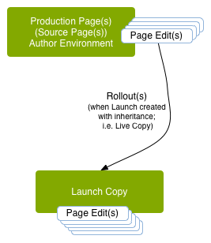

# Lançamentos{#launches}

Os lançamentos permitem desenvolver conteúdo com eficiência para uma versão futura.

Um lançamento é criado para permitir que você faça modificações prontas para futuras publicações (mantendo suas páginas atuais). Após editar e atualizar suas páginas de lançamento, você as promove à origem e ativa as páginas de origem (nível superior). A promoção duplica o conteúdo da inicialização de volta às páginas de origem e pode ser feita manual ou automaticamente (dependendo dos campos definidos ao criar e editar a inicialização).

Por exemplo, as páginas de produtos sazonais da loja online são atualizadas trimestralmente para que os produtos em destaque se alinhem à temporada atual. Para se preparar para a próxima atualização trimestral, é possível criar uma inicialização das páginas da Web apropriadas. Ao longo do trimestre, as seguintes alterações são acumuladas na cópia de lançamento:

* Alterações nas páginas de origem que ocorrem como resultado de tarefas de manutenção normais. Essas alterações são duplicadas automaticamente nas páginas de inicialização.
* Edições realizadas diretamente nas páginas de lançamento como preparação para o próximo trimestre.

Quando o próximo trimestre chegar, você promoverá as páginas de lançamento para poder publicar as páginas de origem (mantendo o conteúdo atualizado). É possível promover todas as páginas ou apenas aquelas que você modificou.

Os lançamentos também podem ser:

* Criado para várias ramificações raiz. Embora você possa criar o lançamento para todo o site (e fazer as alterações lá), isso pode ser impraticável, pois todo o site precisa ser copiado. Quando centenas ou até milhares de páginas estão envolvidas, os requisitos e o desempenho do sistema são afetados pela ação de cópia e, posteriormente, pelas comparações necessárias para as tarefas de promoção.
* Aninhado (um lançamento dentro de um lançamento) para oferecer a capacidade de criar um lançamento a partir de um lançamento existente, de modo que os autores possam aproveitar as alterações já feitas, em vez de precisar fazer as mesmas alterações várias vezes para cada lançamento.

Esta seção descreve como criar, editar e promover (e, se necessário, [excluir](/help/sites-authoring/launches-creating.md#deleting-a-launch)) iniciar páginas no console do Sites ou [o console Inicializações](#the-launches-console):

* [Criação de Lançamentos](/help/sites-authoring/launches-creating.md)
* [Edição de Lançamentos](/help/sites-authoring/launches-editing.md)
* [Promoção de Lançamentos](/help/sites-authoring/launches-promoting.md)

## Inicializações - a ordem dos eventos {#launches-the-order-of-events}

Os lançamentos permitem desenvolver com eficiência o conteúdo de uma versão futura de uma ou mais páginas da Web ativadas.

Os lançamentos permitem:

* Crie uma cópia das páginas de origem:

   * A cópia é sua inicialização.
   * As páginas de origem de nível superior são conhecidas como **Produção**.

      * As páginas de origem podem ser obtidas de várias ramificações (separadas).

   

* Edite a configuração do lançamento:

   * Adicionar ou remover páginas e/ou ramificações da inicialização.
   * Edite as propriedades do lançamento; como **Título**, **Data de Lançameto**, sinalizador **Pronto para produção**.

* É possível promover e publicar o conteúdo manual ou automaticamente:

   * Manualmente:

      * Promova o conteúdo do seu lançamento para a **Target** (páginas de origem) quando estiver pronto para ser publicado.
      * Publique o conteúdo das páginas de origem (após promover de volta).
      * Promover todas as páginas ou somente as páginas modificadas.
   * Automaticamente - isso envolve o seguinte:

      * O campo **Data de lançamento** (**Data de ativação**):**** pode ser definida ao criar ou editar um lançamento.

      * A variável **Pronto para produção** sinalizador: só pode ser definido ao editar um lançamento.
      * Se a variável **Pronto para produção** for definido, a inicialização será promovida automaticamente para as páginas de produção no **Launch**(**Ao vivo**) **data**. Após a promoção, as páginas de produção são publicadas automaticamente.\
         Se nenhuma data tiver sido definida, o sinalizador não terá efeito.

* Atualize suas páginas de origem e de lançamento em paralelo:

   * As alterações nas páginas de origem são implementadas automaticamente na cópia de lançamento (se configurada como herança, ou seja, como uma live copy).
   * As alterações na sua cópia de lançamento podem ser feitas sem interromper essas atualizações automáticas ou as páginas de origem.

   

* [Criar uma inicialização aninhada](/help/sites-authoring/launches-creating.md#creating-a-nested-launch) - um lançamento dentro de um lançamento:

   * A origem é um lançamento existente.
   * Você pode [promover uma inicialização aninhada](/help/sites-authoring/launches-promoting.md#promoting-a-nested-launch) para qualquer destino; pode ser uma inicialização principal ou as páginas de origem de nível superior (Produção).

   

   >[!CAUTION]
   >
   >Excluir um lançamento removerá o próprio lançamento e qualquer lançamento descendente aninhado.

>[!NOTE]
>
>Criar e editar lançamentos requer direitos de acesso a `/content/launches`, bem como ao grupo padrão `content-authors`.
>
>Entre em contato com o administrador do sistema se você tiver algum problema.

>[!CAUTION]
>
>Não há suporte para a reorganização de componentes em uma página do Launch.
>
>Quando a página for promovida, qualquer alteração de conteúdo será refletida, mas as posições do componente não serão alteradas.

### O console Lançamentos {#the-launches-console}

O console Lançamentos fornece uma visão geral dos lançamentos e permite que você execute ações nos listados. O console pode ser acessado das seguintes maneiras:

* No console de **Ferramentas**: **Ferramentas**, **Sites**, **Lançamentos**.

* Ou diretamente com [https://localhost:4502/libs/launches/content/launches.html](https://localhost:4502/libs/launches/content/launches.html)

## Lançamentos em referências (console Sites) {#launches-in-references-sites-console}

1. No **Sites** navegue até a origem do(s) lançamento(s).
1. Abra o **Referências** e selecione a página de origem.
1. Selecionar **Lançamentos**, os lançamentos existentes serão listados:

   

1. Toque/clique no lançamento apropriado. A lista de ações possíveis será exibida:

   
