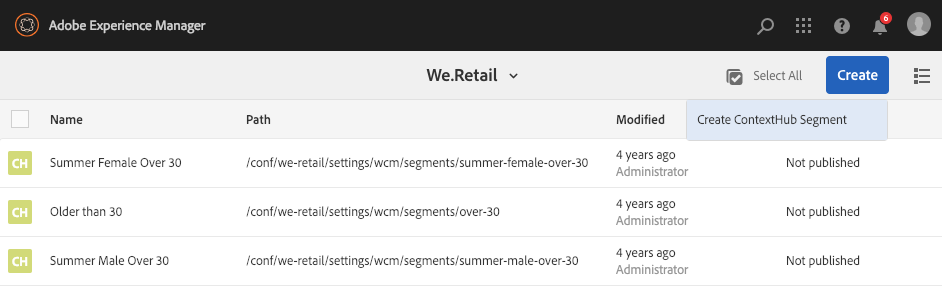

# Gerenciamento de públicos{#managing-audiences}

O console de Públicos permite criar, organizar e gerenciar públicos da sua conta do Adobe Target ou gerenciar segmentos do ContextHub ou Contexto do Cliente:

* Adicionar públicos-alvo - públicos-alvo da Adobe Target ou segmentos do ContextHub.
* Gerencie públicos-alvo.

Um público-alvo, chamado *segmento* no ContextHub e no ClientContext, é uma classe de visitantes definida por critérios específicos, que determina quem vê uma atividade direcionada. Ao direcionar uma atividade, você pode selecionar públicos-alvo diretamente no processo de Direcionamento ou criar mais no console Públicos-alvo.

No console Públicos-alvo , os públicos-alvo são organizados por marca.

Os públicos-alvo estão disponíveis no modo Direcionar para [criação de conteúdo direcionado](/help/sites-authoring/content-targeting-touch.md), onde você também pode criar públicos-alvo (mas deve criar públicos-alvo do Adobe Target no console Públicos-alvo ). Os públicos-alvo criados no modo Direcionar são exibidos no console Públicos-alvo .

Os públicos-alvo são exibidos com um rótulo descrevendo o tipo de público-alvo definido:

* CH - Segmento do ContextHub
* CC - Segmento do contexto do cliente
* AT - Público-alvo da Adobe Target

## Criação de um segmento do ContextHub no console Públicos-alvo {#creating-a-contexthub-segment-in-the-audiences-console}

Você pode criar um segmento do ContextHub no console Públicos-alvo ou durante o processo de direcionamento.

Para criar um segmento do ContextHub no console Públicos-alvo:

1. No console Navegação, clique ou toque em **Personalização**. Clique ou toque em **Públicos**.
1. Toque ou clique em **Criar segmento do ContextHub**.

   

1. Na caixa de diálogo **Novo segmento do ContextHub**, insira um título e ajuste o reforço e clique em **Criar**. Seu novo segmento do ContextHub aparece na lista de públicos-alvo.

   >[!NOTE]
   >
   >Classifique a lista modificada ao tocar ou clicar em **Modificado** para classificar por ordem decrescente para ver qualquer público recém-criado.

Para obter mais detalhes sobre como criar segmentos usando o ContextHub, consulte o [Configuração da segmentação com o ContextHub](/help/sites-administering/segmentation.md) documentação.

## Criação de um público-alvo da Adobe Target usando o console Público-alvo {#creating-an-adobe-target-audience-using-the-audience-console}

Você pode criar públicos-alvo do Adobe Target diretamente no AEM usando o console Públicos-alvo .

Os públicos-alvo são definidos por regras que determinam quem está incluído em uma atividade de direcionamento. Uma definição de público-alvo pode incluir várias regras, e cada regra pode incluir vários parâmetros.

Quando você usa mais de uma regra, elas são combinadas pelo operador boolean AND, o que significa que qualquer membro do público-alvo em potencial deve atender a todas as condições definidas para ser incluído na atividade. Por exemplo, se você definir uma regra de AND e uma regra de navegador, apenas os visitantes que usarem o SO definido e o navegador definido serão incluídos na atividade.

>[!NOTE]
>
>Se você não vir **Criar público-alvo **no **Criar** , você não tem as permissões necessárias para criar um público-alvo. Você precisa de permissões de gravação em **/etc/segmentation** para criar públicos-alvo. Por padrão, os autores de conteúdo do grupo têm permissões de gravação.

Para criar um público-alvo do Adobe Target:

1. No console Navegação, clique ou toque em **Personalização**. Clique ou toque em **Públicos**.

   

1. No console Públicos-alvo , toque ou clique em **Criar** e, em seguida** Crie o público-alvo**.

   

1. No **Configuração do Adobe Target** , selecione a configuração de destino e toque ou clique em **OK**.
1. Na área Regra 1 , toque ou clique no tipo de atributo e insira quaisquer informações de atributo nos campos disponíveis. Quando terminar, selecione a marca de seleção à direita do atributo para salvá-lo. Consulte [Atributos e suas opções](#attributes-and-their-options) para obter informações sobre todos os atributos.
1. Clique em **Adicionar regra** para adicionar outra regra. Insira quantas regras forem necessárias. As regras são combinadas com o operador boolean AND, o que significa que o público-alvo deve atender a todos os requisitos de cada regra para ser elegível para uma atividade.
1. Toque ou clique em **Próximo**.
1. Insira um nome para o público-alvo e toque ou clique em **Salvar**.
1. Toque ou clique em **Salvar**. Seu público-alvo está listado na lista Público-alvo.

### Atributos e suas opções {#attributes-and-their-options}

Você pode criar regras de direcionamento para cada um dos seguintes atributos:

| **Atributo** | **Descrição** | **Para obter mais informações** |
|---|---|---|
| **Móvel** | Direcione dispositivos móveis com base em parâmetros como dispositivo móvel, tipo de dispositivo, fornecedor de dispositivo, dimensões de tela (por pixels), e muito mais. | Consulte [Documentação para dispositivos móveis](https://experienceleague.adobe.com/docs/target/using/audiences/create-audiences/categories-audiences/mobile.html?lang=pt-BR) no Adobe Target. |
| **Personalizado** | Parâmetros personalizados são parâmetros mbox. Se você passar algum parâmetro de mbox para mboxes, ou usar a função targetPageParams, esses parâmetros aparecerão aqui para uso em públicos-alvo. | Consulte [Documentação de parâmetros personalizados](https://experienceleague.adobe.com/docs/target/using/audiences/create-audiences/categories-audiences/custom-parameters.html?lang=pt-BR) no Adobe Target. |
| **OS** | Você pode direcionar os visitantes que usam um determinado sistema operacional. | Direcione usuários que estejam usando Linux®, Macintosh ou Windows. |
| **Páginas do site** | Direcione visitantes que estão em uma página específica ou têm um parâmetro específico de mbox. | Consulte [Documentação das páginas do site](https://experienceleague.adobe.com/docs/target/using/audiences/create-audiences/categories-audiences/site-pages.html?lang=pt-BR) no Adobe Target. |
| **Navegador** | Você pode direcionar os usuários que utilizam um determinado navegador ou determinadas opções de navegador quando visitam sua página. | Consulte [Documentação das opções do navegador](https://experienceleague.adobe.com/docs/target/using/audiences/create-audiences/categories-audiences/browser.html?lang=pt-BR?lang=en) no Adobe Target. |
| **Perfil do visitante** | Direcione visitantes que atendem a parâmetros de perfil específicos. | Consulte [Documentação do perfil do visitante](https://experienceleague.adobe.com/docs/target/using/audiences/visitor-profiles/visitor-profile.html?lang=pt-BR) no Adobe Target. |
| **Fontes de tráfego** | Direcione visitantes com base no mecanismo de pesquisa ou página de aterrissagem de referência para o site. | Consulte [Documentação das origens de tráfego](https://experienceleague.adobe.com/docs/target/using/audiences/create-audiences/categories-audiences/traffic-sources.html?lang=pt-BR) no Adobe Target. |

## Modificação de um público-alvo no console Públicos-alvo {#modifying-an-audience-in-the-audiences-console}

>[!NOTE]
>
>Você só pode editar públicos-alvo do Adobe Target que foram criados na mesma instância de AEM em que está editando. Públicos-alvo criados em diferentes ambientes de AEM não podem ser editados.

É possível editar qualquer público-alvo do ContextHub ou do ClientContext no console Públicos-alvo. Você também pode editar públicos-alvo da Adobe Target, mas somente aqueles que foram criados no AEM:

1. No console Navegação, clique ou toque em **Personalização**. Clique ou toque em **Públicos**.
1. Toque ou clique no ícone ao lado do segmento do ContextHub ou do ClientContext que você deseja editar e toque ou clique em **Editar**.
1. Faça edições no editor de segmentos. Consulte [Contexto do cliente](/help/sites-administering/campaign-segmentation.md) ou [ContextHub](/help/sites-developing/ch-configuring.md) documentação.
