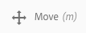

# Criar e organizar páginas{#creating-and-organizing-pages}

Esta seção descreve como criar e gerenciar páginas com o Adobe Experience Manager (AEM) para depois [criar o conteúdo](/help/sites-authoring/editing-content.md) nessas páginas.

>[!NOTE]
>
>Sua conta precisa de [direitos de acesso apropriados ](/help/sites-administering/security.md) e [permissões](/help/sites-administering/security.md#permissions) para realizar ações nas páginas, como criar, copiar, mover, editar, excluir.
>
>Caso encontre algum problema, sugerimos que você entre em contato com o administrador do sistema.

>[!NOTE]
>
>Há vários [atalhos de teclado](/help/sites-authoring/keyboard-shortcuts.md) que você pode usar no console Sites que tornam a organização das suas páginas mais eficiente.

## Organizar seu site {#organizing-your-website}

Como um autor, você precisará organizar o seu site dentro do AEM. Isto implica criar e nomear suas páginas de conteúdo, de modo que:

* Você pode encontrá-las facilmente no ambiente de criação
* Os visitantes do seu site possam navegar facilmente por elas no ambiente de publicação

Você também pode usar [pastas](#creating-a-new-folder) para ajudar a organizar o seu conteúdo.

A estrutura de um site pode ser considerada como uma estrutura em árvore que armazena suas páginas de conteúdo. Os nomes dessas páginas de conteúdo são usadas para formar os URLs, ao passo que o título é mostrado quando o conteúdo da página é visualizado.

The following shows an example from the We.Retail site, where a hiking shorts page ( `desert-sky-shorts`) is accessed:

* ambiente do autor
   `https://localhost:4502/editor.html/content/we-retail/us/en/products/equipment/hiking/desert-sky-shorts.html`

* Ambiente de publicação
   `https://localhost:4503/content/we-retail/us/en/products/equipment/hiking/desert-sky-shorts.html`

Depending on the configuration of your instance, use of `/content` might be optional on the publish environment.

```xml
 /content
 /we-retail
  /us
   /en
    /products
     /equipment
      /hiking
       /desert-sky-shorts
       /hiking-poles
       /...
      /running...
      /surfing...
      /...
     /seasonal...
     /...
    /about-us
    /experience
    /...
   /es...
  /de...
  /fr...
  /...
 /...
```

Esta estrutura pode ser visualizada do console **Sites**, onde é possível [navegar através das páginas do seu site](/help/sites-authoring/basic-handling.md#navigating) e executar ações nas páginas. Você também pode criar novos sites e [páginas](#creating-a-new-page).

De qualquer ponto, você pode visualizar a ramificação ascendente da navegação estrutural na barra do cabeçalho:


### Convenções de nomenclatura da página {#page-naming-conventions}

Ao criar uma nova página, existem dois campos principais:

* **[Título](#title)**:

   * O título é exibido ao usuário no console, na parte superior do conteúdo da página ao editar.
   * Esse campo é obrigatório.

* **[Nome](#name)**:

   * Usado para gerar o URI.
   * A entrada do usuário para este campo é opcional. Se não for especificado, o nome é derivado do título. Consulte a seguinte seção [Restrições de nome de página e práticas recomendadas](/help/sites-authoring/managing-pages.md#page-name-restrictions-and-best-practices) para obter detalhes.

#### Restrições de nome de página e práticas recomendadas {#page-name-restrictions-and-best-practices}

O **Título** da página e o **Nome** podem ser criados separadamente, mas estão relacionados:

* Ao criar uma página, somente o campo **Título** é obrigatório. Se nenhum **Nome** for fornecido na criação da página, o AEM gerará um nome a partir dos primeiros 64 caracteres do título (observando o conjunto definido abaixo). Somente os primeiros 64 caracteres são usados para dar suporte à prática recomendada de nomes de página curtos.

* Se um nome de página for especificado manualmente pelo autor, o limite de 64 caracteres não se aplicará. Contudo, outras limitações técnicas no comprimento de nome de página poderão ser aplicadas.

>[!NOTE]
>
>Ao definir um nome de página, um princípio básico é manter o nome da página curto, mas tão expressivo e memorável quanto possível para facilitar a compreensão do leitor. Consulte o [guia de estilo W3C](https://www.w3.org/Provider/Style/TITLE.html) no elemento `title`para obter mais informações.

>Lembre-se também de que alguns navegadores (por exemplo, versões mais antigas do IE) só podem aceitar URLs de até um determinado comprimento, por isso também há um motivo técnico para manter os nomes de página curtos.
>
Ao criar uma nova página, o AEM [validará o nome da página de acordo com as convenções](/help/sites-developing/naming-conventions.md) impostas pelo AEM e JCR.

Os caracteres mínimos permitidos são:

* &#39;a&#39; a &#39;z&#39;
* &#39;A&#39; a &#39;Z&#39;
* &#39;0&#39; a &#39;9&#39;
* `_` (sublinhado)
* `-` (hífen/sinal de menos)

Detalhes completos sobre todos os caracteres permitidos podem ser encontrados nas [convenções de nomenclatura](/help/sites-developing/naming-conventions.md).

>[!NOTE]
Se o AEM estiver em execução em uma [implantação do gerente de persistência do MongoMK](/help/sites-deploying/recommended-deploys.md), os nomes de página serão limitados a 150 caracteres.

#### Título {#title}

Caso forneça apenas um **Título** de página ao criar uma nova página, o AEM vai derivar o **Nome**[ de página desta cadeia de caracteres e validá-lo de acordo com as convenções impostas pelo AEM e JCR. ](/help/sites-developing/naming-conventions.md) A **Title** field containing invalid characters will be accepted, but the name derived will have the invalid characters subsituted. Por exemplo:

| Título | Nome derivado |
|---|---|
| Schön | schoen.html |
| SC%&amp;*ç+ | sc—c-.html |

#### Nome {#name}

Quando você fornecer um **Nome** de página ao criar uma nova página, o AEM vai validar o nome de acordo com as convenções impostas pelo AEM e JCR. [](/help/sites-developing/naming-conventions.md) Não é possível enviar caracteres inválidos no campo **Nome**. Quando o AEM detecta caracteres inválidos, o campo é destacado com uma mensagem explicativa.


>[!NOTE]
Evite usar um código de duas letras, conforme definido por ISO-639-1 como um nome de página, a menos que seja uma raiz de idioma.
Consulte [Preparação de conteúdo para tradução](/help/sites-administering/tc-prep.md) para obter mais informações.

### Modelos {#templates}

No AEM, um modelo especifica um tipo especializado de página. Um modelo será usado como a base para a criação de qualquer página nova.

O modelo define a estrutura de uma página; incluindo uma imagem em miniatura e outras propriedades. Por exemplo, você pode ter modelos separados para páginas de produtos, mapas de sites e informações de contato. Os modelos são compostos de [componentes](#components).

O AEM vem com vários modelos predefinidos. Os modelos disponíveis dependem do site individual. Os campos principais são:

* **Título** O título exibido na página da Web resultante.

* **Nome** Usado ao nomear a página.

* **Modelo** Uma lista de modelos disponíveis para uso ao gerar a nova página.

>[!NOTE]
Se configurado na instância,[ os autores de modelo poderão criá-los com o Editor de modelo](/help/sites-authoring/templates.md).

### Componentes {#components}

Components are the elements provided by AEM so that you can add specific types of content. AEM comes with a range of [out-of-the-box components](/help/sites-authoring/default-components-console.md) that provide comprehensive functionality. These include:

* Texto
* Imagem
* Slideshow
* Vídeo
* E muito mais

Depois de criar e abrir uma página, é possível[ adicionar conteúdo usando os componentes](/help/sites-authoring/editing-content.md#insertinganewparagraph), que estão disponíveis [no navegador de componentes](/help/sites-authoring/author-environment-tools.md#componentbrowser).

>[!NOTE]
O console [Componentes](/help/sites-authoring/default-components-console.md) fornece uma visão geral dos componentes na instância.

## Gerenciamento de páginas {#managing-pages}

### Criar uma nova página {#creating-a-new-page}

A menos que todas as páginas tenham sido criadas para você com antecedência, antes que possa começar a criar conteúdo, é necessário criar uma página:

1. Open the Sites console (for example, [https://localhost:4502/sites.html/content](https://localhost:4502/sites.html/content)).
1. Navegue até o local onde deseja criar a nova página.
1. Abra o seletor suspenso usando **Criar** na barra de ferramentas e, em seguida, selecione **Página** na lista:

   

1. A partir do primeiro estágio do assistente, você pode:

   * Selecionar o modelo que deseja usar para criar a nova página, em seguida, clicar/tocar em **Próximo** para prosseguir.

   * **Cancelar** para suspender o processo.

   

1. A partir do último estágio do assistente, você pode:

   * Usar as três guias para inserir as [propriedades de página](/help/sites-authoring/editing-page-properties.md) que deseja atribuir à nova página, em seguida, clicar/tocar em **Criar** para realmente criar a página.

   * Usar **Voltar** para voltar à seleção do modelo.

   Os campos principais são:

   * **Título**:

      * É exibido ao usuário e é obrigatório.
   * **Nome**:

      * Usado para gerar o URI. Se não for especificado, o nome é derivado do título.
      * Se você fornecer um **Nome** de página ao criar uma nova página, o AEM vai [ validar o nome de acordo com as convenções](/help/sites-developing/naming-conventions.md) impostas pelo AEM e JCR.

      * **Não é possível enviar caracteres inválidos** no campo **Nome**. Quando o AEM detecta caracteres inválidos, o campo será destacado e uma mensagem explicativa será exibida para indicar os caracteres que precisam ser removidos/substituídos.
   >[!NOTE]
   Consulte [Convenções de nomenclatura da página](#page-naming-conventions).

   A informação mínima exigida para criar uma nova página é o **Título**.

   

1. Use **Criar** para concluir o processo e criar a sua nova página. A caixa de diálogo de confirmação perguntará se você deseja **Abrir** a página imediatamente ou voltar para o console (**concluído**):

   

   >[!NOTE]
   Caso crie uma página usando um nome que já existe no local, o sistema vai gerar automaticamente uma variação do nome, ao anexar um número. Por exemplo, se `winter` já existir, uma nova página se tornará `winter0`.

1. Caso volte ao console, você verá em sua nova página:

   

>[!CAUTION]
Assim que uma página tiver sido criada, seu modelo não poderá ser alterado, a menos que você [crie um lançamento com um novo modelo; ](/help/sites-authoring/launches-creating.md#create-launch-with-new-template)porém, o conteúdo existente será perdido.

### Abrir uma página para edição {#opening-a-page-for-editing}

Após criar uma página ou navegar para uma página existente (no console), você pode abri-la para edição:

1. Abra o console **Sites**.
1. Navegue até que você encontre a página que deseja editar.
1. Selecione sua página usando:

   * [Ações rápidas](/help/sites-authoring/basic-handling.md#quick-actions)
   * [Modo de seleção](/help/sites-authoring/basic-handling.md#navigatingandselectionmode) e a barra de ferramentas

   E, em seguida, selecione o ícone **Editar**:

   

1. A página será aberta e aqui é possível [editar a página](/help/sites-authoring/editing-content.md#touchoptimizedui) conforme necessário.

>[!NOTE]
Navegar para outras páginas do editor de páginas só é possível no modo de visualização, pois os links não estão ativos no modo de Edição...

### Copiar e colar uma página    {#copying-and-pasting-a-page}

É possível copiar uma página e todas as respectivas subpáginas para um novo site:

1. No console **Sites**, navegue até que você encontre a página que deseja copiar.
1. Selecione sua página usando:

   * [Ações rápidas](/help/sites-authoring/basic-handling.md#quick-actions)
   * [Modo de seleção](/help/sites-authoring/basic-handling.md#navigatingandselectionmode) e a barra de ferramentas

   E, em seguida, o ícone **Copiar** página:

   

   >[!NOTE]
   Caso esteja no modo de seleção, este é encerrado automaticamente assim que a página for copiada.

1. Navegue até o local para a nova cópia da página.
1. O ícone **Colar** está disponível com uma seta suspensa à direita:

   

   Você pode:
   * Selecionar o próprio ícone **Colar**: uma cópia da página original e qualquer página secundária serão criadas neste local.
   * Selecione a seta suspensa para revelar a opção **Colar sem filhos**. Será criada uma cópia da página original neste local; páginas secundárias não serão copiadas.

   >[!NOTE]
   Se você copiar a página para um local onde uma página com o mesmo nome que a original já existe, o sistema gera automaticamente uma variação do nome ao anexar um número. Por exemplo, se `winter` já existir, `winter` se tornará `winter1`.

### Mover ou renomear uma página {#moving-or-renaming-a-page}

>[!NOTE]
A opção Renomear uma página também está sujeita às [Convenções de nomenclatura da página](#page-naming-conventions) ao especificar o nome da nova página.

>[!NOTE]
Uma página só pode ser movida para um local onde o modelo no qual a página se baseia está permitido. See [Template Availability](/help/sites-developing/templates.md#template-availability) for more information.

O procedimento para mover ou renomear uma página é basicamente o mesmo e é realizado pelo mesmo assistente. Com este assistente você pode:

* Renomear uma página sem movê-la.
* Mover a página sem renomeá-la.
* Mover e renomear ao mesmo tempo.

O AEM oferece a funcionalidade de atualizar os links internos que se referem à página que está sendo renomeada/movida. Isso pode ser feito página por página para proporcionar uma flexibilidade total.

1. Navegue até que você encontre a página que deseja mover.
1. Selecione sua página usando:

   * [Ações rápidas](/help/sites-authoring/basic-handling.md#quick-actions)
   * [Modo de seleção](/help/sites-authoring/basic-handling.md#navigatingandselectionmode) e a barra de ferramentas

   E, em seguida, selecione o ícone **Mover** página:

   

   Isto abrirá o assistente de página para movimento.

1. No estágio **Renomear** do assistente, é possível:

   * Especifique o nome que deseja para a página após movê-la, em seguida, clique/toque em **Próximo** para prosseguir.

   * **Cancelar** para suspender o processo.

   

   O nome da página pode permanecer o mesmo se você estiver somente movendo a página.

   >[!NOTE]
   Se você mover uma página para um local onde uma página com o mesmo nome já existe, o sistema gera automaticamente uma variação do nome ao anexar um número. Por exemplo, se `winter` já existir, `winter` se tornará `winter1`.

1. No estágio **Selecionar destino** do assistente, é possível:

   * Use a [exibição de coluna](/help/sites-authoring/basic-handling.md#column-view) para navegar até o novo local da página:

      * Para selecionar o destino, clique em sua miniatura.
      * Clique em **Avançar** para continuar.
   * Use **Voltar** para voltar às especificações do nome de página.

   >[!NOTE]
   Por padrão, o pai da página que você está movendo/renomeando será selecionado como o destino.

   

   >[!NOTE]
   Se você mover uma página para um local onde uma página com o mesmo nome já existe, o sistema gera automaticamente uma variação do nome ao anexar um número. Por exemplo, se `winter` já existir, `winter` se tornará `winter1`.

1. Se a página estiver vinculada ou referenciada, ou tiver sido publicada, os detalhes serão listados na etapa **Ajustar/Republicar**.

   Você pode indicar o que deve ser ajustado e/ou republicado, conforme necessário.

   >[!NOTE]
   Se a página não estiver vinculada nem referenciada, essa etapa não estará disponível.

   

1. Selecionar **Mover** concluirá o processo e moverá/renomeará sua página, conforme apropriado.

>[!NOTE]
Se a página já tiver sido publicada, movê-la automaticamente desfará a publicação. Por padrão, ela será publicadas novamente quando o movimento for concluído, mas isso pode ser alterado ao desmarcar o campo **Republicar** na etapa **Ajustar/Republicar**.

>[!NOTE]
Caso a página não seja mencionada de alguma maneira, então a etapa **Ajustar/republicar** será ignorada.

### Excluir uma página {#deleting-a-page}

1. Navegue até que você possa visualizar a página que deseja excluir.
1. Use o [modo de seleção ](/help/sites-authoring/basic-handling.md#viewing-and-selecting-resources) para selecionar a página pretendida, em seguida, use **Excluir** na barra de ferramentas:

   

   >[!NOTE]
   Como uma precaução de segurança, o ícone de **Excluir página** não está disponível como uma ação rápida.

1. Uma caixa de diálogo irá pedir confirmação, use:

   * **Cancelar** para suspender a ação
   * **Excluir** para confirmar a ação:

      * Se a página não possui referências, a página será excluída.
      * Caso a página tenha referências, uma caixa de mensagem vai informá-lo de que **Uma ou mais páginas são mencionadas.** Você pode selecionar **Forçar exclusão** ou **Cancelar**.

>[!NOTE]
Se uma página já estiver publicada, sua publicação será automaticamente removida antes da exclusão.

### Bloquear uma página {#locking-a-page}

Você pode [bloquear/desbloquear uma página](/help/sites-authoring/editing-content.md#locking-a-page) em um console ou ao editar uma página individual. Informações sobre se uma página está bloqueada são exibidas em ambos os locais.

 

### Criação de uma nova pasta {#creating-a-new-folder}

Você pode criar pastas para ajudar a organizar seus arquivos e páginas.

>[!NOTE]
As pastas também estão sujeitas às [Convenções de nomenclatura da página](#page-naming-conventions) ao especificar o nome da nova pasta.

>[!CAUTION]
* Pastas só podem ser criadas diretamente em **Sites** ou em outras pastas. Eles não podem ser criadas em uma página.
* As ações padrão de mover, copiar, colar, excluir, publicar, cancelar a publicação e exibir/editar propriedades podem ser executadas em uma pasta.
* As pastas não estão disponíveis para seleção em uma live copy.


1. Abra o console **Sites** e navegue até o local desejado.
1. Para abrir a lista de opções, selecione **Criar** na barra de ferramentas
1. Selecione **Pasta** para abrir a caixa de diálogo. Aqui você pode inserir o **Nome** e o **Título**:

   

1. Selecione **Criar** para criar a pasta.
