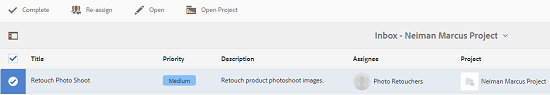
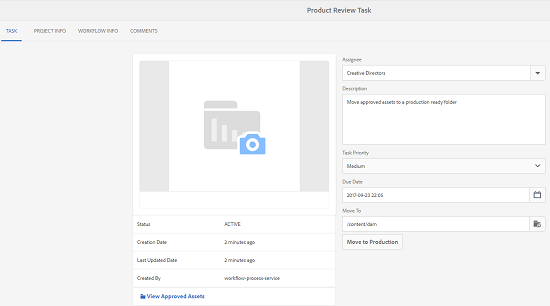

# Integração do Creative Project e do PIM {#creative-project-and-pim-integration}

Se você é um profissional de marketing ou criativo, pode usar as ferramentas do Creative Project no Adobe Experience Manager (AEM) para gerenciar fotografias de produtos relacionadas ao comércio eletrônico e processos criativos associados na organização.

Você pode usar o Creative Project para simplificar as seguintes tarefas no fluxo de trabalho da sessão de fotos:

* Gerar uma solicitação de sessão fotográfica
* Carregamento de uma sessão fotográfica
* Colaborar em uma sessão fotográfica
* Empacotando ativos aprovados

>[!NOTE]
>
>Consulte [Funções de Usuário do Projeto para obter informações](/help/sites-authoring/projects.md#user-roles-in-a-project) sobre como atribuir funções de usuário e fluxos de trabalho a determinados tipos de usuários.

## Fluxos de trabalho de sessão fotográfica do produto  {#exploring-product-photo-shoot-workflows}

O Creative Project fornece vários modelos de projeto para atender a diversos requisitos do projeto. O modelo do **Projeto de sessão fotográfica do produto** está disponível imediatamente. Esse modelo inclui fluxos de trabalho de sessão fotográfica que permitem iniciar e gerenciar solicitações de sessão fotográfica do produto. Ele também inclui uma série de tarefas que permitem obter imagens digitais para produtos por meio de processos apropriados de revisão e aprovação.

## Criar um projeto de sessão fotográfica do produto {#create-a-product-photo-shoot-project}

1. No console **Projetos**, clique em **Criar** e escolha **Criar Projeto** na lista.

   

1. Na página **Criar Projeto**, selecione o modelo **Projeto de sessão fotográfica do produto** e clique em **Avançar**.

   

1. Insira os detalhes do projeto, incluindo o título, a descrição e a data de vencimento. Adicione usuários e atribua várias funções a eles. Você também pode adicionar uma miniatura para o projeto.

   

1. Clique em **Criar**. Uma mensagem de confirmação notifica que o projeto foi criado.
1. Clique em **Concluído** para retornar ao console **Projetos**. Como alternativa, clique em **Abrir** para exibir os ativos no projeto.

## Iniciando o trabalho em um projeto de sessão fotográfica do produto {#starting-work-in-a-product-photo-shoot-project}

Para iniciar uma solicitação de sessão de fotos, clique em um projeto e em **Adicionar trabalho** na página de detalhes do projeto para iniciar um fluxo de trabalho.


Um **Projeto de sessão fotográfica do produto** inclui os seguintes fluxos de trabalho prontos para uso:

* Fluxo de trabalho de **Sessão de Fotos do Produto (Integração do Commerce)**: este fluxo de trabalho usa a integração comercial com o sistema PIM (gerenciamento de informações do produto) para gerar automaticamente uma lista de captura para os produtos selecionados (hierarquia). Você pode visualizar os dados do produto como parte dos metadados do ativo depois que o fluxo de trabalho for concluído.
* **Fluxo de trabalho de sessão fotográfica do produto**: este fluxo de trabalho permite fornecer uma lista de captura em vez de depender da integração do comércio. Ele mapeia as imagens carregadas para um arquivo CSV na pasta de ativos do projeto.

Use o fluxo de trabalho **Sessão fotográfica do produto (Integração do Commerce)** para mapear ativos de imagem com os produtos no AEM. Este fluxo de trabalho usa a integração comercial para vincular as imagens aprovadas aos dados existentes do produto no local `/etc/commerce`.

O fluxo de trabalho **Sessão de Fotos do Produto (Integração do Commerce)** inclui as seguintes tarefas:

* Criar lista de captura
* Carregar a sessão fotográfica
* Retocar a sessão fotográfica
* Revisar e Aprovar
* Mover para Tarefa de produção

Se as informações do produto não estiverem disponíveis no AEM, use o fluxo de trabalho **Sessão fotográfica do produto** para mapear ativos de imagem com os produtos com base nos detalhes carregados em um arquivo CSV. O arquivo CSV deve conter informações básicas do produto, como ID do produto, categoria e descrição. O fluxo de trabalho busca ativos aprovados para os produtos.

Esse workflow inclui as seguintes tarefas:

* Carregar Lista de captura
* Carregar a sessão fotográfica
* Retocar a sessão fotográfica
* Revisar e Aprovar
* Mover para Tarefa de produção

É possível personalizar esse workflow usando a opção de configurações do workflow.

Ambos os fluxos de trabalho incluem etapas para vincular produtos a seus ativos aprovados. Cada workflow inclui as seguintes etapas:

* Configuração do workflow: descreve as opções para personalizar o workflow
* Iniciar um fluxo de trabalho de projeto: explica como iniciar uma sessão fotográfica de produto
* Detalhes das tarefas do fluxo de trabalho: fornece detalhes das tarefas disponíveis no fluxo de trabalho

## Monitoramento do progresso do projeto {#tracking-project-progress}

Você pode acompanhar o progresso de um projeto monitorando as tarefas ativas/concluídas em um projeto.

Use o seguinte para monitorar o progresso de um projeto:

* Cartão de tarefa
* Lista de tarefas

O cartão de tarefas descreve o progresso geral do projeto. Ela aparecerá na página de detalhes do projeto somente se o projeto tiver qualquer tarefa relacionada. O cartão de tarefas exibe o status de conclusão atual do projeto com base no número de tarefas concluídas. Não inclui tarefas futuras.

O cartão de tarefas fornece os seguintes detalhes:

* Porcentagem de tarefas ativas
* Porcentagem de tarefas concluídas


A lista de tarefas fornece informações detalhadas sobre a tarefa de fluxo de trabalho ativa no momento para o projeto. Para exibir a lista, clique no cartão de tarefa. A lista de tarefas também exibe metadados como data de início, data de vencimento, destinatário, prioridade e status da tarefa.


## Configuração do fluxo de trabalho {#workflow-configuration}

Esta tarefa envolve atribuir etapas de fluxo de trabalho aos usuários com base em suas funções.

Para configurar o fluxo de trabalho da **Sessão fotográfica do produto**:

1. Navegue até **Ferramentas** > **Fluxos de Trabalho** e selecione o bloco **Modelos** para abrir a página **Modelos de Fluxo de Trabalho**.
1. Selecione o fluxo de trabalho **Sessão fotográfica do produto** e o ícone **Editar** na barra de ferramentas para abri-lo no modo de edição.

   

1. Na página **Fluxo de trabalho de sessão de fotos do produto**, abra uma tarefa de projeto. Por exemplo, abra a tarefa **Carregar Lista de captura**.

   

1. Clique na guia **Tarefa** para configurar o seguinte:

   * Nome da tarefa
   * Usuário padrão (função) que recebe a tarefa
   * Prioridade padrão da tarefa, que é exibida na lista de tarefas do usuário
   * Descrição da tarefa a ser exibida quando o destinatário abrir a tarefa
   * Data de vencimento de uma tarefa, que é calculada com base na hora em que a tarefa foi iniciada

1. Clique em **OK** para salvar as definições de configuração.

Você pode configurar as tarefas adicionais para o fluxo de trabalho **Sessão fotográfica do produto** de maneira semelhante.

Siga as mesmas etapas para configurar as tarefas no **Fluxo de Trabalho da Sessão Fotográfica do Produto (Integração do Commerce)**.

## Iniciar um fluxo de trabalho de projeto {#starting-a-project-workflow}

Esta seção descreve como integrar o gerenciamento de informações do produto ao seu projeto criativo.

1. Navegue até um projeto de sessão fotográfica do produto e clique no ícone **Adicionar trabalho** no cartão **Fluxos de trabalho**.
1. Selecione o cartão de fluxo de trabalho **Sessão fotográfica do produto (Commerce Integration)** para iniciar o fluxo de trabalho **Sessão fotográfica do produto (Commerce Integration)**. Se as informações do produto não estiverem disponíveis em `/etc/commerce`, selecione o fluxo de trabalho **Sessão de Fotos do Produto** e inicie o fluxo de trabalho **Sessão de Fotos do Produto**.

   

1. Clique em **Avançar** para iniciar o fluxo de trabalho no projeto.
1. Insira os detalhes do workflow na próxima página.

   

1. Clique em **Enviar** para iniciar o fluxo de trabalho de sessão fotográfica. A página de detalhes do projeto de sessão fotográfica é exibida.

   

### Detalhes de tarefas de fluxo de trabalho {#workflow-tasks-details}

O fluxo de trabalho de sessão fotográfica inclui várias tarefas. Cada tarefa é atribuída a um grupo de usuários com base na configuração definida para a tarefa.

#### Criar tarefa da lista de captura {#create-shot-list-task}

A tarefa **Criar Lista de Captura** permite que o proprietário do projeto selecione produtos para os quais as imagens são necessárias. Com base na opção selecionada pelo usuário, é gerado um arquivo CSV que contém informações básicas do produto.

1. Na pasta do projeto, clique no botão de reticências no canto inferior direito do [Cartão de Tarefas](#tracking-project-progress) para exibir o item da tarefa no fluxo de trabalho.

   

1. Selecione a tarefa **Criar Lista de Captura** e clique no ícone **Abrir** na barra de ferramentas.

   

1. Revise os detalhes da tarefa e clique no botão **Criar lista de captura**.

   

1. Selecione produtos para os quais existem dados de produto sem imagens associadas.

   

1. Clique no botão **Adicionar à lista de captura** para criar um arquivo CSV que contenha uma lista de todos esses produtos. Uma mensagem confirma que a lista de captura foi criada para os produtos selecionados. Clique em **Fechar** para concluir o fluxo de trabalho.

1. Depois de criar uma lista de captura, o link **Exibir lista de captura** é exibido. Para adicionar mais produtos à lista de captura, clique em **Adicionar à lista de captura**. Nesse caso, os dados são anexados à lista de captura criada inicialmente.

   

1. Clique em **Exibir Lista de captura** para exibir a nova lista de captura.

   

   Para editar os dados existentes ou adicionar novos dados, clique em **Editar** na barra de ferramentas. Somente os campos **Produto &#x200B;** e **Descrição** são editáveis.

   

   Depois de atualizar o arquivo, clique em **Salvar** na barra de ferramentas para salvar o arquivo.

1. Depois de adicionar os produtos, clique no ícone **Concluir** na página de detalhes da tarefa **Criar Lista de Captura** para marcar a tarefa como concluída. Você pode adicionar um comentário opcional.

A conclusão da tarefa introduz as seguintes alterações no projeto:

* As Assets correspondentes à hierarquia de produto são criadas em uma pasta com o mesmo nome do título do workflow.
* Os metadados dos ativos tornam-se editáveis usando o console Assets, mesmo antes de o fotógrafo fornecer as imagens.
* É criada uma pasta de sessão fotográfica que armazena as imagens fornecidas pelo fotógrafo. A pasta de sessão fotográfica contém subpastas para cada entrada de produto na lista de captura.

### Carregar tarefa da lista de captura {#upload-shot-list-task}

Essa tarefa faz parte do fluxo de trabalho da Sessão fotográfica do produto. Você executa esta tarefa se as informações do produto não estiverem disponíveis no AEM. Nesse caso, você faz upload de uma lista de produtos em um arquivo CSV para o qual os ativos de imagem são necessários. Com base nos detalhes no arquivo CSV, você mapeia ativos de imagem com os produtos. O arquivo deve ser um arquivo CSV chamado `shotlist.csv`.

Use o link **Exibir Lista de Captura** no cartão do projeto no procedimento anterior para baixar um arquivo CSV de amostra. Revise o arquivo de amostra para saber o conteúdo normal de um arquivo CSV.

A lista de produtos ou o arquivo CSV pode conter campos como **Categoria, Produto, Id, Descrição** e **Caminho**. O campo **Id** é obrigatório e contém a ID do produto. Os outros campos são opcionais.

Um produto pode pertencer a uma categoria específica. A categoria do produto pode ser listada no CSV abaixo da coluna **Categoria**. O campo **Produto** contém o nome do produto. No campo **Descrição**, digite a descrição do produto ou as instruções para o fotógrafo.

1. Na pasta do projeto, clique no botão de reticências no canto inferior direito do [Cartão de Tarefas](#tracking-project-progress) para exibir a lista de tarefas no fluxo de trabalho.
1. Selecione a tarefa **Carregar Lista de Captura** e clique no ícone **Abrir** na barra de ferramentas.

   

1. Revise os detalhes da tarefa e clique no botão **Carregar lista de captura**.

   

1. Clique no botão **Carregar Lista de captura** para carregar o arquivo CSV. O fluxo de trabalho reconhece esse arquivo como uma origem a ser usada para extrair dados do produto para a próxima tarefa.
1. Carregue um arquivo CSV contendo informações do produto no formato apropriado. O link **Exibir Assets** Carregada aparece sob o cartão depois que o arquivo CSV é carregado.

   

   Clique no ícone **Concluir** para concluir a tarefa.

1. Clique no ícone **Concluir** para concluir a tarefa.

### Carregar tarefa de sessão fotográfica {#upload-photo-shoot-task}

Se você for um Editor, é possível carregar capturas para os produtos listados no arquivo **shotlist.csv** que foi criado ou carregado na tarefa anterior.

O nome das imagens a serem carregadas deve começar com `<ProductId_>`, onde `ProductId` é referenciado a partir do campo **Id** no arquivo `shotlist.csv`. Por exemplo, para um produto na lista de captura com **Id** `397122`, você carregaria arquivos com os nomes `397122_highcontrast.jpg`, `397122_lowlight.png` e assim por diante.

Você pode fazer upload das imagens diretamente ou fazer upload de um arquivo ZIP que contenha as imagens. Com base em seus nomes, as imagens são colocadas dentro das respectivas pastas de produtos dentro da pasta de sessão fotográfica.

1. Na pasta do projeto, clique no botão de reticências no canto inferior direito do [Cartão de Tarefa](#tracking-project-progress) para exibir o item da tarefa no fluxo de trabalho.
1. Selecione a tarefa **Carregar sessão fotográfica** e clique no ícone **Abrir** na barra de ferramentas.

   

1. Clique em **Carregar sessão fotográfica** e carregue as imagens da sessão fotográfica.
1. Clique no ícone **Concluir** na barra de ferramentas para concluir a tarefa.

### Retocar tarefa de sessão fotográfica {#retouch-photo-shoot-task}

Se você tiver direitos de edição, execute a tarefa **Retocar a sessão fotográfica** para editar as imagens carregadas na pasta de sessão fotográfica.

1. Na pasta do projeto, clique no botão de reticências no canto inferior direito do [Cartão de Tarefa](#tracking-project-progress) para exibir o item da tarefa no fluxo de trabalho.
1. Selecione a tarefa **Retocar a sessão fotográfica** e clique no ícone **Abrir** na barra de ferramentas.

   

1. Clique no link **Exibir Assets Carregada** na página **Retocar Captura de Fotos** para procurar as imagens carregadas.

   

   Se necessário, edite as imagens usando um aplicativo do Adobe Creative Cloud.

   

1. Clique no ícone **Concluir** na barra de ferramentas para concluir a tarefa.

### Revisar e Aprovar Tarefa {#review-and-approve-task}

Nesta tarefa, você analisa as imagens de sessão fotográfica carregadas por um fotógrafo e marca as imagens como aprovadas para uso.

1. Na pasta do projeto, clique no botão de reticências no canto inferior direito do [Cartão de Tarefa](#tracking-project-progress) para exibir o item da tarefa no fluxo de trabalho.
1. Selecione a tarefa **Revisar e Aprovar** e clique no ícone **Abrir** na barra de ferramentas.

   

1. Na página **Revisar e aprovar**, atribua a tarefa de revisão a uma função e clique em **Revisar** para começar a revisar as imagens de produto carregadas.

   

1. Selecione uma imagem de produto e clique no ícone **Aprovar** na barra de ferramentas para marcá-la como aprovada. Depois de aprovar uma imagem, um banner aprovado é exibido sobre ela.

   

1. Clique em **Concluído**. As imagens aprovadas são vinculadas aos ativos vazios que foram criados.

Você pode excluir alguns produtos sem nenhuma imagem. Mais tarde, você pode revisitar a tarefa e marcá-la como concluída.

Você pode navegar até os ativos do projeto usando a interface do usuário do Assets e verificar as imagens aprovadas.

Clique no próximo nível para exibir os produtos de acordo com a hierarquia de dados do produto.

O Creative Project associa ativos aprovados ao produto referenciado. Os metadados do ativo são atualizados com a referência do produto e as informações básicas na guia **Dados do produto**, em propriedades do ativo. Eles são exibidos na seção Metadados do ativo AEM.

>[!NOTE]
>
>No **fluxo de trabalho de sessão fotográfica do produto** (sem integração comercial), as imagens aprovadas não estão associadas a produtos.

### Mover para Tarefa de produção {#move-to-production-task}

Essa tarefa move os ativos aprovados para a pasta pronta para produção para disponibilizá-los para uso.

1. Na pasta do projeto, clique no botão de reticências no canto inferior direito do [Cartão de Tarefa](#tracking-project-progress) para exibir o item da tarefa no fluxo de trabalho.
1. Selecione a tarefa **Mover para Produção** e clique no ícone **Abrir** na barra de ferramentas.

   

1. Para exibir os ativos aprovados para a sessão fotográfica antes de movê-los para a pasta pronta para produção, clique no link **Exibir Assets Aprovada** abaixo da miniatura do projeto na página de tarefas **Mover para Produção**.

   

1. Insira o caminho da pasta pronta para produção no campo **Mover para**.

   

1. Clique em **Mover para produção**. Feche a mensagem de confirmação. Os ativos são movidos para o caminho mencionado e um conjunto de rotação é criado automaticamente para os ativos aprovados para cada produto com base na hierarquia de pastas.

1. Clique no ícone **Concluir** na barra de ferramentas. O fluxo de trabalho é concluído quando a última etapa é marcada como concluída.

## Exibição de metadados de ativos DAM {#viewing-dam-asset-metadata}

Após a aprovação, os ativos são vinculados aos produtos correspondentes. A [Página de Propriedades](/help/assets/manage-assets.md#editing-properties) dos ativos aprovados agora tem uma guia adicional **Dados do Produto** (informações do produto vinculadas). Essa guia exibe os detalhes do produto, o número SKU e outros detalhes relacionados ao produto que vinculam o ativo. Clique no ícone **Editar** para atualizar uma propriedade de ativo. As informações relacionadas ao produto permanecem somente leitura.

Clique no link exibido para navegar até a respectiva página de detalhes do produto no console do produto ao qual o ativo está associado.

## Personalizar os fluxos de trabalho da sessão fotográfica do projeto {#customizing-the-project-photo-shoot-workflows}

Você pode personalizar os fluxos de trabalho da **Sessão de Fotos do Projeto** com base em suas necessidades. Essa é uma tarefa opcional com base em funções que você executa para definir o valor de uma variável no projeto. Posteriormente, você pode usar o valor configurado para chegar a uma decisão.

1. Clique no logotipo do AEM e navegue até **Ferramentas** > **Fluxo de Trabalho** > **Modelos** para abrir a página **Modelos de Fluxo de Trabalho**.
1. Selecione o fluxo de trabalho **Sessão fotográfica do produto (Integração do Commerce)** ou a **Sessão fotográfica do produto** e clique em **Editar** na barra de ferramentas para abrir o fluxo de trabalho no modo de edição.
1. Abra o painel lateral e localize a etapa **Criar tarefa de projeto baseada em função** e arraste-a para o fluxo de trabalho.

   

1. Abra a etapa **Tarefa baseada em função**.
1. Na guia **Tarefa**, forneça um nome para a tarefa que será exibida na lista de tarefas. Você também pode atribuir a tarefa a uma função, definir a prioridade padrão, fornecer uma descrição e especificar o horário de vencimento da tarefa.

   

1. Na guia **Roteamento**, especifique as ações da tarefa. Para adicionar várias ações, clique no link **Adicionar item**.

   

1. Depois de adicionar as opções, clique em **OK** para adicionar as alterações à etapa.

1. De volta à janela **Modelo de Fluxo de Trabalho**, clique em **Sincronizar** para salvar as alterações de todo o fluxo de trabalho. Tocar ou clicar em **OK** para a etapa não salva as alterações no fluxo de trabalho. Para salvar as alterações no fluxo de trabalho, clique em **Sincronizar**.

1. Abra o painel lateral e localize o fluxo de trabalho **Ir para a etapa** e arraste-o para o fluxo de trabalho.

1. Abra a tarefa **Ir para** e clique na guia **Processo**.

1. Selecione a **Etapa de Destino** para ir e especificar que a **Expressão de Roteamento** é um script ECMA. Em seguida, forneça o seguinte código no campo **Script**:

   ```javascript
   function check() {
   
   if (workflowData.getMetaDataMap().get("lastTaskAction","") == "Reject All") {
   
   return true
   
   }
   
   // set copywriter user in metadata
   
   var previousId = workflowData.getMetaDataMap().get("lastTaskCompletedBy", "");
   
   workflowData.getMetaDataMap().put("copywriter", previousId);
   
   return false;
   
   }
   ```

   >[!TIP]
   >
   >Para obter detalhes sobre script nas etapas do fluxo de trabalho, consulte [Definindo uma Regra para uma Divisão OR](/help/sites-developing/workflows-models.md).

   

1. Clique em **OK**.

1. Clique em **Sincronizar** para salvar o fluxo de trabalho.

Uma nova tarefa agora aparece depois que a [Tarefa Mover para Produção](#move-to-production-task) é concluída e é atribuída ao proprietário.

O usuário com a função **Proprietário** pode concluir a tarefa e selecionar uma ação (da lista de ações adicionadas nas configurações da etapa do fluxo de trabalho) na lista da janela pop-up de comentários.

>[!NOTE]
>
>Quando você inicia um servidor, o servlet de lista de tarefas do Project armazena em cache os mapeamentos entre tipos de tarefas e URLs definidos em `/libs/cq/core/content/projects/tasktypes`. Você pode então executar a sobreposição usual e adicionar tipos de tarefa personalizados colocando-os em `/apps/cq/core/content/projects/tasktypes`.
