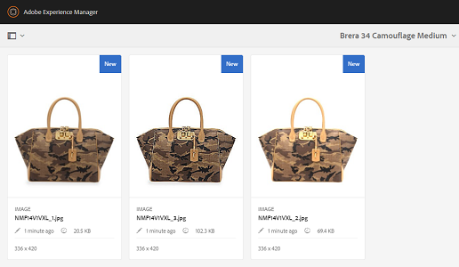
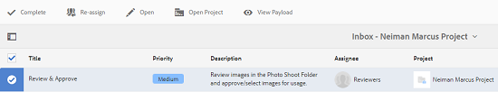

# Integração com o Creative Project e o PIM {#creative-project-and-pim-integration}

Se você for um profissional de marketing ou um profissional criativo, poderá usar as ferramentas do Projeto criativo no Adobe Experience Manager (AEM) para gerenciar fotografias de produtos relacionados ao comércio eletrônico e processos criativos associados em sua organização.

Você pode usar o Creative Project para simplificar as seguintes tarefas no fluxo de trabalho de sessão fotográfica:

* Gerar uma solicitação de sessão de fotos
* Fazer upload de uma sessão de fotos
* Colaborar em uma sessão de fotos
* Agrupar ativos aprovados

>[!NOTE]
>
>Consulte [Funções de usuário do projeto](/help/sites-authoring/projects.md#user-roles-in-a-project) para obter informações sobre como atribuir funções de usuário e fluxos de trabalho a determinados tipos de usuários.

## Fluxos de trabalho de sessão fotográfica do produto  {#exploring-product-photo-shoot-workflows}

O Projeto de criação fornece vários modelos de projeto para atender a diferentes requisitos de projeto. O modelo de **Projeto de sessão fotográfica do produto** está disponível e pronto para uso. Esse modelo inclui os fluxos de trabalho de sessão fotográfica que permitem iniciar e gerenciar solicitações de sessão fotográfica do produto. Também inclui uma série de tarefas que permitem obter imagens digitais dos produtos por meio de processos de aprovação e análise adequados.

## Criar um projeto de sessão fotográfica do produto {#create-a-product-photo-shoot-project}

1. No **Projetos** , toque ou clique **Criar** e escolha **Criar projeto** na lista.

   

1. No **Criar projeto** selecione o **Projeto de sessão fotográfica do produto** modelo e toque ou clique **Próximo**.

   

1. Insira os detalhes do projeto, incluindo o título, a descrição e o prazo. Adicione usuários e atribua funções variadas a eles. Também é possível adicionar uma miniatura para o projeto.

   

1. Toque ou clique em **Criar**. Uma mensagem de confirmação notifica que o projeto foi criado.
1. Toque ou clique **Concluído** para retornar ao **Projetos** console. Como alternativa, toque ou clique em **Abrir** para visualizar os ativos no projeto.

## Iniciar o trabalho em um projeto de sessão fotográfica do produto {#starting-work-in-a-product-photo-shoot-project}

Para iniciar uma solicitação de sessão fotográfica, toque ou clique em um projeto e toque ou clique em **Adicionar trabalho** na página de detalhes do projeto para iniciar um fluxo de trabalho.


A **Projeto de sessão fotográfica do produto** O inclui os seguintes fluxos de trabalho prontos para uso:

* **Fluxo de trabalho de Sessão fotográfica do produto (integração com o Commerce)**: Esse fluxo de trabalho utiliza a integração do Commerce com o sistema de gerenciamento de informações de produtos (PIM) para gerar automaticamente uma lista de capturas para os produtos selecionados (hierarquia). É possível visualizar os dados do produto como parte dos metadados de ativo após a conclusão do fluxo de trabalho.
* **Fluxo de trabalho de sessão fotográfica do produto**: Esse workflow permite fornecer uma lista de capturas em vez de depender da integração com o Commerce. Mapeia as imagens enviadas por upload para um arquivo CSV na pasta de ativos do projeto.

Use o **Sessão fotográfica do produto (integração com o Commerce)** fluxo de trabalho para mapear ativos de imagem com os produtos no AEM. Esse fluxo de trabalho utiliza a integração do Commerce para vincular as imagens aprovadas aos dados existentes do produto no local `/etc/commerce`.

O **Sessão fotográfica do produto (integração com o Commerce)** O fluxo de trabalho inclui as seguintes tarefas:

* Criar lista de capturas
* Fazer upload da sessão fotográfica
* Retocar a sessão fotográfica
* Analisar e aprovar
* Mover para Tarefa de produção

Se as informações do produto não estiverem disponíveis no AEM, use a variável **Sessão fotográfica do produto** fluxo de trabalho para mapear ativos de imagem com os produtos com base nos detalhes carregados em um arquivo CSV. O arquivo CSV deve conter informações básicas sobre o produto, como a ID do produto, a categoria e a descrição. O fluxo de trabalho coleta ativos aprovados para os produtos.

Esse fluxo de trabalho inclui as seguintes tarefas:

* Carregar lista de captura
* Fazer upload da sessão fotográfica
* Retocar a sessão fotográfica
* Analisar e aprovar
* Mover para Tarefa de produção

Para personalizar esse fluxo de trabalho, use a opção de configurações do fluxo de trabalho.

Ambos os fluxos de trabalho incluem etapas para vincular produtos aos respectivos ativos aprovados. Cada fluxo de trabalho inclui as seguintes etapas:

* Configuração de fluxo de trabalho: descreve as opções para personalizar o fluxo de trabalho
* Iniciar um fluxo de trabalho de projeto: Explica como iniciar uma sessão fotográfica do produto
* Detalhes das tarefas do fluxo de trabalho: fornece os detalhes das tarefas disponíveis no fluxo de trabalho

## Rastrear o andamento do projeto {#tracking-project-progress}

É possível controlar o andamento de um projeto monitorando as tarefas ativas/concluídas em um projeto.

Use o seguinte para monitorar o andamento de um projeto:

* Cartão de tarefas
* Lista de tarefas

O cartão de tarefas descreve o progresso geral do projeto. Ele aparece na página de detalhes do projeto somente se o projeto tiver tarefas relacionadas. O cartão de tarefas exibe o status de conclusão atual do projeto com base no número de tarefas concluídas. Não inclui tarefas futuras.

O cartão de tarefas fornece os seguintes detalhes:

* Porcentagem de tarefas ativas
* Porcentagem de tarefas concluídas


A lista de tarefas fornece informações detalhadas sobre a tarefa de fluxo de trabalho atualmente ativa para o projeto. Para exibir a lista, toque ou clique no cartão de tarefas. A lista de tarefas também exibe metadados como data de início, data de vencimento, destinatário, prioridade e status da tarefa.


## Configuração do fluxo de trabalho {#workflow-configuration}

Essa tarefa envolve a atribuição de etapas de fluxo de trabalho a usuários com base em suas respectivas funções.

Para configurar o fluxo de trabalho de **Sessão fotográfica do produto**:

1. Navegar para **Ferramentas** > **Fluxos de trabalho** e toque em **Modelos** bloco para abrir o **Modelos de fluxo de trabalho** página.
1. Selecione o **Sessão fotográfica do produto** e toque em **Editar** ícone na barra de ferramentas para abri-lo no modo de edição.

   

1. No **Fluxo de trabalho de sessão fotográfica do produto** abra uma tarefa do projeto. Por exemplo, abra a tarefa **Fazer upload da lista de capturas**.

   

1. Toque ou clique no botão **Tarefa** para configurar o seguinte:

   * Nome da tarefa
   * O usuário padrão (função) que recebe a tarefa
   * Prioridade padrão da tarefa, que é exibida na lista de tarefas do usuário
   * Descrição da tarefa a ser exibida quando o responsável abre a tarefa
   * Prazo da tarefa, que é calculado com base na hora que a tarefa foi iniciada

1. Clique em **OK** para salvar as configurações.

Você pode configurar as tarefas adicionais para a variável **Sessão fotográfica do produto** fluxo de trabalho de maneira semelhante.

Execute as mesmas etapas para configurar as tarefas no **Fluxo de trabalho de Sessão fotográfica do produto (integração com o Commerce)**.

## Iniciar um fluxo de trabalho de projeto {#starting-a-project-workflow}

Essa seção descreve como integrar o gerenciamento de informações do produto ao seu projeto de criação.

1. Navegue até um projeto de sessão fotográfica do produto e toque ou clique no botão **Adicionar trabalho** no ícone na **Fluxos de trabalho** cartão.
1. Selecione o **Sessão fotográfica do produto (integração com o Commerce)** cartão de fluxo de trabalho para iniciar o **Sessão fotográfica do produto (integração com o Commerce)** fluxo de trabalho. Se as informações do produto não estiverem disponíveis em `/etc/commerce`, selecione o **Sessão fotográfica do produto** e inicie o **Sessão fotográfica do produto** fluxo de trabalho.

   

1. Toque ou clique **Próximo** para iniciar o fluxo de trabalho no projeto.
1. Insira os detalhes do fluxo de trabalho na próxima página.

   

1. Toque ou clique **Enviar** para iniciar o fluxo de trabalho de sessão fotográfica. A página de detalhes do projeto de sessão fotográfica será exibida.

   

### Detalhes das tarefas do fluxo de trabalho {#workflow-tasks-details}

O fluxo de trabalho de sessão fotográfica inclui várias tarefas. Cada tarefa é atribuída a um grupo de usuários com base na configuração definida para a tarefa.

#### Tarefa Criar lista de capturas {#create-shot-list-task}

A tarefa **Criar lista de capturas** permite ao proprietário do projeto selecionar os produtos para os quais imagens são necessárias. Com base na opção selecionada pelo usuário, um arquivo CSV é gerado e contém informações básicas sobre o produto.

1. Na pasta do projeto, toque ou clique no botão de reticências na parte inferior direita do [Cartão de tarefas](#tracking-project-progress) para exibir o item de tarefa no workflow.

   

1. Selecione o **Criar lista de capturas** e toque/clique no botão **Abrir** ícone na barra de ferramentas.

   

1. Confira os detalhes da tarefa e toque/clique no botão **Criar lista de capturas**.

   

1. Selecione produtos para os quais existem dados sem imagens associadas.

   

1. Toque ou clique no botão **Adicionar À Lista De Capturas** para criar um arquivo CSV que contenha uma lista de todos esses produtos. Uma mensagem confirma que a lista de capturas foi criada para os produtos selecionados. Clique em **Fechar** para concluir o fluxo de trabalho.

1. Depois de criar uma lista de capturas, o link **Exibir lista de capturas** é mostrado. Para adicionar mais produtos à lista de capturas, toque ou clique em **Adicionar à lista de capturas**. Nesse caso, os dados são adicionados à lista de capturas inicialmente criada.

   

1. Toque ou clique **Exibir lista de capturas** para visualizar a nova lista de capturas.

   

   Para editar os dados existentes ou adicionar novos dados, toque/clique em **Editar** na barra de ferramentas. Somente o **Produto **e **Descrição** são editáveis.

   

   Depois de atualizar o arquivo, toque ou clique em **Salvar** na barra de ferramentas para salvar o arquivo.

1. Depois de adicionar os produtos, toque ou clique no botão **Concluído** no ícone na **Criar lista de capturas** página de detalhes da tarefa para marcar a tarefa como concluída. É possível adicionar um comentário opcional.

A conclusão da tarefa apresenta as seguintes alterações no projeto:

* Os ativos que correspondem à hierarquia do produto são criados em uma pasta com o mesmo nome que o título do fluxo de trabalho.
* Os metadados dos ativos poderão ser editados usando o console Assets, mesmo antes de o fotógrafo fornecer as imagens.
* Uma pasta de sessão fotográfica é criada e armazena as imagens fornecidas pelo fotógrafo. A pasta da sessão fotográfica contém subpastas para cada entrada de produto na lista de capturas.

### Tarefa Fazer upload da lista de capturas {#upload-shot-list-task}

Essa tarefa faz parte do fluxo de trabalho de Sessão fotográfica do produto. Execute essa tarefa se as informações sobre o produto não estiverem disponíveis no AEM. Nesse caso, você faz upload de uma lista de produtos em um arquivo CSV para os quais itens de imagem são obrigatórios. Com base nos detalhes no arquivo CSV, você mapeia ativos de imagem com os produtos. O arquivo deve ser um arquivo CSV chamado `shotlist.csv`.

Use o link **Exibir lista de capturas** no cartão do projeto no procedimento anterior para baixar um arquivo CSV de amostra. Revise o arquivo de amostra para conhecer o conteúdo comum de um arquivo CSV.

A lista de produtos ou o arquivo CSV podem conter campos, como **Categoria, ID do produto, Descrição** e **Caminho**. O campo **Id** é obrigatório e contém a ID do produto. Os outros campos são opcionais.

Um produto pode pertencer a uma categoria específica. A categoria do produto pode ser listada no arquivo CSV abaixo da coluna **Categoria**. O campo **Produto** contém o nome do produto. No campo **Descrição**, digite a descrição do produto ou instruções para o fotógrafo.

1. Na pasta do projeto, toque ou clique no botão de reticências na parte inferior direita do [Cartão de tarefas](#tracking-project-progress) para exibir a lista de tarefas no workflow.
1. Selecione o **Fazer upload da lista de capturas** e toque ou clique no botão **Abrir** ícone na barra de ferramentas.

   

1. Revise os detalhes da tarefa e toque ou clique no botão **Fazer upload da lista de capturas** botão.

   

1. Toque ou clique no botão **Fazer upload da lista de capturas** para fazer upload do arquivo CSV. O fluxo de trabalho reconhece este arquivo como uma fonte de extração de dados do produto para a tarefa seguinte.
1. Faça upload de um arquivo CSV contendo as informações sobre o produto no formato apropriado. O **Exibir ativos carregados** é exibido abaixo do cartão após o upload do arquivo CSV.

   

   Clique no botão **Concluído** para concluir a tarefa.

1. Toque/clique no botão **Concluído** para concluir a tarefa.

### Tarefa Fazer upload da sessão fotográfica {#upload-photo-shoot-task}

Se você for um Editor, poderá fazer upload de capturas para os produtos listados na **shotlist.csv** arquivo criado ou carregado na tarefa anterior.

O nome das imagens a serem carregadas deve começar com `<ProductId_>` em que `ProductId` é referenciado do **Id** no campo `shotlist.csv` arquivo. Por exemplo, para um produto na lista de capturas com **Id** `397122`, você carregaria arquivos com nomes `397122_highcontrast.jpg`, `397122_lowlight.png`e assim por diante.

É possível fazer upload das imagens diretamente ou fazer upload de um arquivo zip que contém as imagens. Com base em seus nomes, as imagens são colocadas dentro das respectivas pastas de produto dentro da pasta da sessão fotográfica.

1. Na pasta do projeto, toque ou clique no botão de reticências na parte inferior direita do [Cartão de tarefas](#tracking-project-progress) para exibir o item de tarefa no workflow.
1. Selecione o **Fazer upload da sessão fotográfica** e toque ou clique no botão **Abrir** ícone na barra de ferramentas.

   

1. Toque ou clique **Fazer upload da sessão fotográfica** e faça upload das imagens da sessão fotográfica.
1. Toque ou clique no botão **Concluído** ícone na barra de ferramentas para concluir a tarefa.

### Tarefa Retocar a sessão fotográfica {#retouch-photo-shoot-task}

Se você tiver direitos de edição, execute o **Retocar sessão fotográfica** tarefa para editar as imagens carregadas na pasta da sessão fotográfica.

1. Na pasta do projeto, toque ou clique no botão de reticências na parte inferior direita da [Cartão de tarefas](#tracking-project-progress) para exibir o item de tarefa no workflow.
1. Selecione o **Retocar sessão fotográfica** e toque/clique no botão **Abrir** ícone na barra de ferramentas.

   

1. Toque ou clique no botão **Exibir ativos carregados** no **Retocar sessão fotográfica** para navegar pelas imagens carregadas.

   

   Se necessário, edite as imagens usando um aplicativo da Adobe Creative Cloud.

   

1. Toque ou clique no botão **Concluído** ícone na barra de ferramentas para concluir a tarefa.

### Tarefa Analisar e aprovar {#review-and-approve-task}

Nesta tarefa, você analisa as imagens da sessão fotográfica carregadas por um fotógrafo e as marca como aprovadas para o uso.

1. Na pasta do projeto, toque ou clique no botão de reticências na parte inferior direita do [Cartão de tarefas](#tracking-project-progress) para exibir o item de tarefa no workflow.
1. Selecione o **Revisar e aprovar** e toque ou clique no botão **Abrir** ícone na barra de ferramentas.

   

1. No **Revisar e aprovar** atribua a tarefa de revisão a uma função e toque ou clique em **Revisão** para começar a revisar as imagens de produto carregadas.

   

1. Selecione uma imagem de produto e toque ou clique no botão **Aprovar** ícone na barra de ferramentas para marcá-lo como aprovado. Após aprovar uma imagem, um banner de aprovação será exibido sobre ela.

   

1. Toque ou clique **Concluído**. As imagens aprovadas são vinculadas aos ativos em branco que foram criados.

Você pode deixar alguns produtos sem uma imagem. Posteriormente, é possível retornar à tarefa e marcá-la como concluída.

É possível navegar pelos ativos do projeto usando a interface Assets e verificar as imagens aprovadas.

Toque ou clique no próximo nível para exibir os produtos de acordo com a hierarquia de dados do produto.

O Projeto de criação associa os ativos aprovados ao produto referenciado. Os metadados do ativo são atualizados com a referência e as informações básicas do produto na guia **Dados do produto** nas propriedades do ativo em que aparecem na seção Metadados dos ativos do AEM.

>[!NOTE]
>
>No **Fluxo de trabalho de Sessão fotográfica do produto** (sem integração com o Commerce), as imagens aprovadas não têm associação com produtos.

### Mover para Tarefa de produção {#move-to-production-task}

Essa tarefa move os ativos aprovados para a pasta pronta para produção a fim de torná-los disponíveis para uso.

1. Na pasta do projeto, toque ou clique no botão de reticências na parte inferior direita do [Cartão de tarefas](#tracking-project-progress) para exibir o item de tarefa no workflow.
1. Selecione o **Mover para produção** e toque ou clique no botão **Abrir** ícone na barra de ferramentas.

   

1. Para ver os ativos aprovados para a sessão fotográfica antes de movê-los para a pasta pronta para produção, clique no link **Exibir ativos aprovados** abaixo da miniatura do projeto na página de tarefa **Mover para produção**.

   

1. Insira o caminho da pasta pronta para produção no **Mover para** campo.

   

1. Toque ou clique **Mover para produção**. Feche a mensagem de confirmação. Os ativos são movidos para o caminho mencionado e um conjunto de rotação é criado automaticamente para os ativos aprovados para cada produto com base na hierarquia de pastas.

1. Toque/clique no ícone **Concluído** na barra de ferramentas. O fluxo de trabalho é concluído quando a última etapa é marcada como concluída.

## Exibir metadados do ativo DAM {#viewing-dam-asset-metadata}

Depois de aprovados, os ativos são vinculados aos produtos correspondentes. A [Página de propriedades](/help/assets/manage-assets.md#editing-properties) dos ativos aprovados agora tem uma guia adicional de **Dados do produto** (vinculada às informações do produto). Este guia exibe os detalhes do produto, o número SKU e outros detalhes relacionados ao produto vinculados ao ativo. Toque ou clique no botão **Editar** ícone para atualizar uma propriedade do ativo. As informações relacionadas aos produtos permanecem somente leitura.

Toque ou clique no link exibido para navegar até a respectiva página de detalhes do produto no console do produto ao qual o ativo está associado.

## Personalizar os fluxos de trabalho da sessão fotográfica do projeto {#customizing-the-project-photo-shoot-workflows}

Você pode personalizar o **Sessão fotográfica do projeto** fluxos de trabalho com base em suas necessidades. Esta é uma tarefa opcional com base na função que você executa para definir o valor de uma variável dentro do projeto. Posteriormente, é possível usar o valor configurado para chegar a uma decisão.

1. Clique ou toque no logotipo do AEM e navegue até **Ferramentas** > **Fluxo de trabalho** > **Modelos** para abrir o **Modelos de fluxo de trabalho** página.
1. Selecione o **Sessão fotográfica do produto (integração com o Commerce)** ou **Sessão fotográfica do produto** e clique ou toque em **Editar** na barra de ferramentas para abrir o fluxo de trabalho no modo de edição.
1. Abra o painel lateral e localize o **Criar função com base na tarefa do projeto** e arraste-a para o workflow.

   

1. Abra o **Tarefa baseada na função** etapa.
1. No **Tarefa** , forneça um nome para a tarefa que será exibida na lista de tarefas. Você também pode atribuir a tarefa a uma função, definir a prioridade padrão, fornecer uma descrição e especificar um horário em que a tarefa deve ser concluída.

   

1. No **Roteamento** , especifique as ações da tarefa. Para adicionar várias ações, toque ou clique no botão **Adicionar item** link .

   

1. Depois de adicionar as opções, clique em **OK** para adicionar as alterações na etapa .

1. De volta ao **Modelo de fluxo de trabalho** toque ou clique na janela **Sincronizar** para salvar as alterações de todo o fluxo de trabalho. Tocar ou clicar **OK** para a etapa não salva as alterações no fluxo de trabalho. Para salvar as alterações no fluxo de trabalho, toque ou clique em **Sincronizar**.

1. Abra o painel lateral e localize o **Etapa Ir para** e arraste-o para o workflow.

1. Abra o **Ir para** e toque ou clique no botão **Processo** guia .

1. Selecione o **Etapa do Target** para acessar e especificar que a variável **Expressão de Roteamento** é o script ECMA. Em seguida, forneça o seguinte código no **Script** campo :

   ```javascript
   function check() {
   
   if (workflowData.getMetaDataMap().get("lastTaskAction","") == "Reject All") {
   
   return true
   
   }
   
   // set copywriter user in metadata
   
   var previousId = workflowData.getMetaDataMap().get("lastTaskCompletedBy", "");
   
   workflowData.getMetaDataMap().put("copywriter", previousId);
   
   return false;
   
   }
   ```

   >[!TIP]
   >
   >Para obter detalhes sobre o script em etapas do fluxo de trabalho, consulte [Definição de uma regra para uma divisão OR](/help/sites-developing/workflows-models.md).

   

1. Toque ou clique **OK**.

1. Toque ou clique **Sincronizar** para salvar o workflow.

Uma nova tarefa surge depois da [Mover para a tarefa Produção](#move-to-production-task) está concluído e é atribuído ao proprietário.

O usuário no **Proprietário** A função pode concluir a tarefa e selecionar uma ação (da lista de ações adicionadas nas configurações da etapa do fluxo de trabalho) na lista no pop-up de comentários.

>[!NOTE]
>
>Quando você inicia um servidor, o servlet da lista de tarefas do Projeto armazena em cache os mapeamentos entre os tipos de tarefas e os URLs definidos em `/libs/cq/core/content/projects/tasktypes`. Você pode executar a sobreposição normal e adicionar tipos de tarefa personalizados, posicionando-os em `/apps/cq/core/content/projects/tasktypes`.
