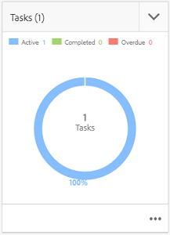

# Integração com o Creative Project e o PIM{#creative-project-and-pim-integration}

Se você for um profissional de marketing ou criativo, poderá usar as ferramentas da Creative Project na Adobe Experience Manager (AEM) para gerenciar a fotografia de produtos relacionados ao comércio eletrônico e processos criativos associados em sua organização.

Em particular, é possível usar o Projeto de criação para simplificar as seguintes tarefas em seu fluxo de trabalho de sessão fotográfica:

* Gerar uma solicitação de sessão de fotos
* Fazer upload de uma sessão de fotos
* Colaborar em uma sessão de fotos
* Agrupar ativos aprovados

>[!NOTE]
>
>Consulte [Funções de usuário do projeto](/help/sites-authoring/projects.md#user-roles-in-a-project) para obter informações sobre como atribuir funções de usuário e fluxos de trabalho a determinados tipos de usuários.

## Explorar fluxos de trabalho de sessão fotográfica do produto  {#exploring-product-photo-shoot-workflows}

O Projeto de criação fornece vários modelos de projeto para atender a diferentes requisitos de projeto. O modelo de **Projeto de sessão fotográfica do produto** está disponível e pronto para uso. Esse modelo inclui os fluxos de trabalho de sessão fotográfica que permitem iniciar e gerenciar solicitações de sessão fotográfica do produto. Também inclui uma série de tarefas que permitem obter imagens digitais dos produtos por meio de processos de aprovação e análise adequados.

O modelo inclui os seguintes fluxos de trabalho:

* **Fluxo de trabalho de Sessão fotográfica do produto (integração com o Commerce)**: esse fluxo de trabalho utiliza a integração do Commerce com o sistema de gerenciamento de informações de produtos (PIM) para gerar automaticamente uma lista de capturas dos produtos selecionados (hierarquia). É possível visualizar os dados do produto como parte dos metadados de ativo após a conclusão do fluxo de trabalho.
* **Fluxo de trabalho de Sessão fotográfica do produto**: esse fluxo de trabalho permite fornecer uma lista de capturas em vez de depender da integração com o Commerce. Mapeia as imagens enviadas por upload para um arquivo CSV na pasta de ativos do projeto.

>[!NOTE]
>
>O arquivo CSV que é enviado por upload na tarefa Fazer upload da lista de capturas do fluxo de trabalho de Sessão fotográfica do produto deve ter o nome de arquivo shotlist.csv.

## Criar um projeto de Sessão fotográfica do produto {#create-a-product-photo-shoot-project}

1. In the **Projects** console, tap/click **Create** and then choose **Create Project** from the list.

   

1. Na página **Criar projeto**, selecione o modelo de projeto de sessão fotográfica e toque/clique em **Próximo**.

   

1. Insira os detalhes do projeto, incluindo o título, a descrição e o prazo. Adicione usuários e atribua funções variadas a eles. Também é possível adicionar uma miniatura para o projeto.

   

1. Toque/clique em **Criar**. Uma mensagem de confirmação notifica que o projeto foi criado.
1. Tap/click **Done** to return to the **Projects** console. Alternatively, tap/click **Open** to view the assets within the photoshoot project.

## Iniciar o trabalho em um projeto de sessão fotográfica do produto {#starting-work-in-a-product-photo-shoot-project}

Para iniciar uma solicitação de sessão fotográfica, toque ou clique em um projeto e toque/clique em **Adicionar trabalho** na página de detalhes do projeto para iniciar um fluxo de trabalho.


Um Projeto de sessão fotográfica do produto inclui os seguintes fluxos de trabalho prontos para uso:

* Fluxo de trabalho de sessão fotográfica do produto (integração com o Commerce)
* Fluxo de trabalho Sessão fotográfica do produto

Use o fluxo de trabalho de Sessão fotográfica do produto (integração com o Commerce) para mapear ativos de imagem com os produtos do AEM. Esse fluxo de trabalho utiliza a integração do Commerce para vincular as imagens aprovadas aos dados existentes do produto no local */etc/commerce*.

O fluxo de trabalho da Foto do produto (Integração de comércio) inclui as seguintes tarefas:

* Criar lista de capturas
* Fazer upload da sessão fotográfica
* Retocar a sessão fotográfica
* Analisar e aprovar
* Mover para Tarefa de produção

Se as informações sobre o produto não estiverem disponíveis no AEM, use o fluxo de trabalho de Sessão fotográfica do produto para mapear ativos de imagem aos produtos com base nos detalhes em um arquivo CSV que você envia por upload. O arquivo CSV deve conter informações básicas sobre o produto, como a ID do produto, a categoria e a descrição. O fluxo de trabalho coleta ativos aprovados para os produtos.

Esse fluxo de trabalho inclui as seguintes tarefas:

* Fazer upload da lista de capturas
* Fazer upload da sessão fotográfica
* Retocar a sessão fotográfica
* Analisar e aprovar
* Mover para Tarefa de produção

Para personalizar esse fluxo de trabalho, use a opção de configurações do fluxo de trabalho.

Ambos os fluxos de trabalho incluem etapas para vincular produtos aos respectivos ativos aprovados. Cada fluxo de trabalho inclui as seguintes etapas:

* Configuração de fluxo de trabalho: descreve as opções para personalizar o fluxo de trabalho
* Iniciar um fluxo de trabalho de projeto: explica como iniciar uma Sessão fotográfica do produto
* Detalhes das tarefas do fluxo de trabalho: fornece os detalhes das tarefas disponíveis no fluxo de trabalho

## Rastrear o andamento do projeto {#tracking-project-progress}

É possível controlar o andamento de um projeto monitorando as tarefas ativas/concluídas em um projeto.

Use o seguinte para monitorar o andamento de um projeto:

* **Cartão de tarefas**

* **Lista de tarefas**

O cartão de Tarefa descreve o progresso geral do projeto. Ele é exibido na página Detalhes do projeto somente se o projeto tiver tarefas relacionadas. O Cartão de tarefas exibe o status de conclusão atual do projeto com base no número de tarefas concluídas. Não inclui tarefas futuras.

O Cartão de tarefas fornece os seguintes detalhes:

* Porcentagem de tarefas ativas
* Porcentagem de tarefas concluídas


A Lista de tarefas fornece informações detalhadas sobre a tarefa atualmente ativa no fluxo de trabalho do projeto. Para exibir a lista, toque/clique no Cartão de tarefas. A Lista de tarefas também exibe metadados como a data de início, o prazo, o responsável, a prioridade e o status da tarefa.


## Configuração do fluxo de trabalho {#workflow-configuration}

Essa tarefa envolve a atribuição de etapas de fluxo de trabalho a usuários com base em suas respectivas funções.

Para configurar o fluxo de trabalho de **Sessão fotográfica do produto**:

1. Navigate to **Tools** > **Workflows**, and then tap the **Models** tile to open the **Workflow Models** page.
1. Select the **Product Photo Shoot** workflow, and the tap the **Edit** icon from the toolbar to open it in edit mode.

   

1. In the **Product Photo Shoot Workflow** page, open a project task. Por exemplo, abra a tarefa **Fazer upload da lista de capturas**.

   

1. Clique na guia **Tarefa** para configurar o seguinte:

   * Nome da tarefa
   * O usuário padrão (função) que recebe a tarefa
   * Prioridade padrão da tarefa, que é exibida na lista de tarefas do usuário
   * Descrição da tarefa a ser exibida quando o responsável abre a tarefa
   * Prazo da tarefa, que é calculado com base na hora que a tarefa foi iniciada

1. Clique em **OK** para salvar as configurações.

   Da mesma forma, é possível configurar as seguintes tarefas para o fluxo de trabalho de **Sessão fotográfica do produto**:

   * Fazer upload da sessão fotográfica
   * Retocar sessão fotográfica do produto
   * Análise da sessão fotográfica
   * Mover para produção

   Perform a similar procedure to configure the tasks in the **Product Photo Shoot (Commerce Integration) workflow**.

Essa seção descreve como integrar o gerenciamento de informações do produto ao seu projeto de criação.

## Iniciar um fluxo de trabalho de projeto {#starting-a-project-workflow}

1. Navigate to a Product Photo Shoot project, and tap/click the **Add Work** icon on the **Workflows** card.
1. Selecione o cartão de fluxo de trabalho de **Sessão fotográfica do produto (integração com o Commerce)** para iniciar o fluxo de trabalho de Sessão fotográfica do produto (integração com Commerce). If the product information isn&#39;t available under /etc/commerce, select the **Product Photo Shoot** workflow and start the Product Photo Shoot workflow.

   

1. Toque/clique em **Avançar** para iniciar o fluxo de trabalho no projeto.
1. Insira os detalhes do fluxo de trabalho na próxima página.

   

   Clique em **Enviar** para iniciar o fluxo de trabalho de sessão fotográfica. A página de detalhes do projeto de sessão fotográfica será exibida.

   

### Detalhes das tarefas do fluxo de trabalho {#workflow-tasks-details}

O fluxo de trabalho de sessão fotográfica inclui várias tarefas. Cada tarefa é atribuída a um grupo de usuários com base na configuração definida para a tarefa.

#### Tarefa Criar lista de capturas {#create-shot-list-task}

A tarefa **Criar lista de capturas** permite ao proprietário do projeto selecionar os produtos para os quais imagens são necessárias. Com base na opção selecionada pelo usuário, um arquivo CSV é gerado e contém informações básicas sobre o produto.

1. In the project folder, tap/click the ellipses in the [Tasks Card](#tracking-project-progress) to view the task item in the workflow.

   

1. Select the **Create Shot List** task, and then tap/click the **Open** icon from the toolbar.

   

1. Confira os detalhes da tarefa e toque/clique no botão **Criar lista de capturas**.

   

1. Selecione produtos para os quais existem dados sem imagens associadas.

   

1. Tap/click the **Add To Shotlist** icon to create a CSV file that contains a list of all such products. Uma mensagem confirma que a lista de capturas foi criada para os produtos selecionados. Clique em **Fechar** para concluir o fluxo de trabalho.
1. Depois de criar uma lista de capturas, o link **Exibir lista de capturas** é mostrado. To add more products to the shot list, tap/click **Add to Shot List**. Nesse caso, os dados são adicionados à lista de capturas inicialmente criada.

   

1. Toque/clique em **Exibir lista de capturas** para ver a nova lista de capturas.

   

   Para editar os dados existentes ou adicionar novos dados, toque/clique em **Editar** na barra de ferramentas. Only the **Product **and **Description** fields are editable.

   

   After you update the file, tap/click **Save** on toolbar to save the file.

1. After adding the products, tap/click the **Complete** icon on the **Create Shot List **task details page to mark the task as completed. É possível adicionar um comentário opcional.

   A conclusão da tarefa apresenta as seguintes alterações no projeto:

   * Os ativos que correspondem à hierarquia do produto são criados em uma pasta com o mesmo nome que o título do fluxo de trabalho.
   * Os metadados dos ativos poderão ser editados usando o console Assets, mesmo antes de o fotógrafo fornecer as imagens.
   * Uma pasta Sessão fotográfica é criada e armazena as imagens fornecidas pelo fotógrafo. A pasta da Sessão fotográfica contém subpastas para cada entrada de produto na Lista de capturas.

   Para o fluxo de trabalho de Sessão fotográfica do produto (sem integração com o Commerce), a primeira tarefa é Fazer upload da lista de capturas. Toque/clique em **Fazer upload da lista de capturas** para fazer upload de um arquivo **shotlist.csv.** O arquivo CSV deve conter a ID do produto. Os outros campos são opcionais. Use-os para mapear ativos a produtos.

### Tarefa Fazer upload da lista de capturas {#upload-shot-list-task}

Essa tarefa faz parte do fluxo de trabalho de Sessão fotográfica do produto. Execute essa tarefa se as informações sobre o produto não estiverem disponíveis no AEM. Nesse caso, você faz upload de uma lista de produtos em um arquivo CSV para os quais itens de imagem são obrigatórios. Com base nos detalhes no arquivo CSV, você mapeia ativos de imagem com os produtos.

Use o link **Exibir lista de capturas** no cartão do projeto no procedimento anterior para baixar um arquivo CSV de amostra. Revise o arquivo de amostra para conhecer o conteúdo comum de um arquivo CSV.

A lista de produtos ou o arquivo CSV podem conter campos, como **Categoria, ID do produto, Descrição** e **Caminho**. O campo **Id** é obrigatório e contém a ID do produto. Os outros campos são opcionais.

Um produto pode pertencer a uma categoria específica. A categoria do produto pode ser listada no arquivo CSV abaixo da coluna **Categoria**. O campo **Produto** contém o nome do produto. No campo **Descrição**, digite a descrição do produto ou instruções para o fotógrafo.

>[!NOTE]
>
>The name of images to be uploaded should start with &quot;**&lt;ProductId>_&quot;** where Product ID is referenced from the **Id** field in the *shotlist.csv* file. For example, for a product in the shot list with **Id 397122**, you can upload files with names **397122_highcontrast.jpg**, **397122_lowlight.png**, and so on.

1. In the project folder, tap/click the ellipses in the [Tasks Card](#tracking-project-progress) to view the list of tasks in the workflow.
1. Select the **Upload Shot List** task, and then tap/click the **Open** icon from the toolbar.

   

1. Review the task details and then tap/click the **Upload Shot List** button.

   

1. Tap/click the **Upload Shot List** button to upload the CSV file with filename shotlist.csv. O fluxo de trabalho reconhece este arquivo como uma fonte de extração de dados do produto para a tarefa seguinte.
1. Faça upload de um arquivo CSV contendo as informações sobre o produto no formato apropriado. The **View Uploaded Assets** link appears under the card after the CSV file is uploaded.

   

   Click the **Complete** icon to complete the task.

1. Tap/click the **Complete** icon to complete the task.

### Tarefa Fazer upload da sessão fotográfica {#upload-photo-shoot-task}

If you are an Editor, you can upload shots for the products listed in the **shotlist.csv** file that is created or uploaded in the previous task.

The name of images to be uploaded should begin with **&quot;&lt;productId>_&quot;** where Product ID is referenced from the **Id** field in the **shotlist.csv** file. Por exemplo, para um produto com **ID 397122** na lista de capturas, é possível fazer upload de arquivos com os nomes **397122_highcontrast.jpg**, **397122_lowlight.png** e assim por diante.

É possível fazer upload das imagens diretamente ou fazer upload de um arquivo zip que contém as imagens. Com base em seus nomes, as imagens são colocadas dentro das respectivas pastas do produto na pasta **Sessão fotográfica**.

1. Under the project folder, tap/click the ellipses in the [Task Card](#tracking-project-progress) to view the task item in the workflow.
1. Select the **Upload Photo Shoot** task, and then tap/click the **Open** icon from the toolbar.

   

1. Tap/click **Upload Photo Shoot** and upload the photo shoot images.
1. Toque/clique no ícone **Concluído** na barra de ferramentas para concluir a tarefa.

### Tarefa Retocar a sessão fotográfica {#retouch-photo-shoot-task}

Se você tiver direitos de edição, execute a tarefa Retocar a sessão fotográfica para editar as imagens enviadas por upload para a pasta da Sessão fotográfica.

1. Under the project folder, tap/click the ellipses in the [Task Card](#tracking-project-progress) to view the task item in the workflow.
1. Select the **Retouch Photo Shoot** task, and then tap/click the **Open** icon from the toolbar.

   

1. Tap/click the **View Uploaded Assets** link in the **Retouch Photo Shoot** page to browse the uploaded images.

   

   Se necessário, edite as imagens usando um aplicativo da Adobe Creative Cloud.

   

1. Toque/clique no ícone **Concluído** na barra de ferramentas para concluir a tarefa.

### Tarefa Analisar e aprovar {#review-and-approve-task}

Nesta tarefa, você analisa as imagens da sessão fotográfica carregadas por um fotógrafo e as marca como aprovadas para o uso.

1. Under the project folder, tap/click the ellipses in the [Task Card](#tracking-project-progress) to view the task item in the workflow.
1. Select the **Review &amp; Approve** task, and then tap/click the **Open** icon from the toolbar.

   

1. In the **Review &amp; Approve** page, assign the review task to role, for example Reviewers, and then tap/click **Review **to start reviewing the uploaded product images.

   

1. Selecione uma imagem do produto e toque/clique no ícone Aprovar na barra de ferramentas para marcá-la como aprovada.

   

   Após aprovar uma imagem, um banner de aprovação será exibido sobre ela.

   >[!NOTE]
   Você pode deixar alguns produtos sem uma imagem. Posteriormente, é possível retornar à tarefa e marcá-la como concluída.

1. Toque/clique em **Concluído**. As imagens aprovadas são vinculadas aos ativos em branco que foram criados.

É possível navegar pelos ativos do projeto usando a interface Assets e verificar as imagens aprovadas.

Toque/clique no próximo nível para exibir os produtos de acordo com a hierarquia de dados do produto.

O Projeto de criação associa os ativos aprovados ao produto referenciado. Os metadados do ativo são atualizados com a referência e as informações básicas do produto na guia **Dados do produto** nas propriedades do ativo em que aparecem na seção Metadados dos ativos do AEM.

>[!NOTE]
No Fluxo de trabalho de Sessão fotográfica do produto (sem integração com o Commerce), as imagens aprovadas não têm nenhuma associação com produtos.

### Mover para Tarefa de produção {#move-to-production-task}

Essa tarefa move os ativos aprovados para a pasta pronta para produção a fim de torná-los disponíveis para uso.

1. Under the project folder, tap/click the ellipses in the [Task Card](#tracking-project-progress) to view the task item in the workflow.
1. Select the **Move to Production** task, and then tap/click the **Open** icon from the toolbar.

   

1. Para ver os ativos aprovados para a sessão fotográfica antes de movê-los para a pasta pronta para produção, clique no link **Exibir ativos aprovados** abaixo da miniatura do projeto na página de tarefa **Mover para produção**.

   

1. Enter the path of the production-ready folder in the **Move To** field.

   

   Tap/click **Move to Production**. Feche a mensagem de confirmação. Os ativos são movidos para o caminho mencionado e um grupo de rotação é criado automaticamente para os ativos aprovados para cada produto com base na hierarquia da pasta.

1. Toque/clique no ícone **Concluído** na barra de ferramentas. O fluxo de trabalho é concluído quando a última etapa é marcada como concluída.

## Exibir metadados do ativo DAM {#viewing-dam-asset-metadata}

Depois de aprovados, os ativos são vinculados aos produtos correspondentes. A [Página de propriedades](/help/assets/manage-assets.md#editing-properties) dos ativos aprovados agora tem uma guia adicional de **Dados do produto** (vinculada às informações do produto). Este guia exibe os detalhes do produto, o número SKU e outros detalhes relacionados ao produto vinculados ao ativo. Toque/clique no ícone **Editar** para atualizar uma propriedade do ativo. As informações relacionadas aos produtos permanecem somente leitura.

Toque/clique no link exibido para navegar para a respectiva página de detalhes do produto no console ao qual o ativo está associado.

## Personalizar os fluxos de trabalho da sessão fotográfica do projeto {#customizing-the-project-photo-shoot-workflows}

É possível personalizar os fluxos de trabalho da Sessão fotográfica do projeto com base em requisitos. Esta é uma tarefa opcional com base na função que você executa para definir o valor de uma variável dentro do projeto. Posteriormente, é possível usar o valor configurado para chegar a uma decisão.

1. Click/tap the AEM logo, and then navigate to **Tools** > **Workflow** > **Models** to open the Workflow Models page.
1. Selecione o fluxo de trabalho da **Sessão fotográfica do produto (integração com o Commerce)** ou o fluxo de trabalho da **Sessão fotográfica do produto** e toque/clique em **Editar** na barra de ferramentas para abrir o fluxo de trabalho no modo de edição.
1. Abra as tarefas dos **Projetos** no sidekick e arraste a etapa **Criar função baseada na tarefa do projeto** para o fluxo de trabalho.

   

1. Open the **Role Based Task** step.
1. No guia **Tarefas**, forneça um nome para a tarefa que será exibido na lista **Tarefa**. Você também pode atribuir a tarefa a uma função, definir a prioridade padrão, fornecer uma descrição e especificar um horário em que a tarefa deve ocorrer.

   

1. Na guia **Roteamento**, especifique as ações da tarefa. Para adicionar várias ações, toque/clique no link **Adicionar item **4.

   

1. After adding the options click **OK** to add the changes to the step.

   >[!NOTE]
   Tapping/clicking **OK** does not save the changes in the workflow. Para salvar as alterações no fluxo de trabalho, toque/clique em **Salvar**.

1. Open the **Workflow** tasks from side kick, and add a **Goto** task.
1. Abra a tarefa **Ir para** e toque/clique na guia **Processar**.
1. Especifique o seguinte código na caixa **Script**:

```
   function check() {

   if (workflowData.getMetaDataMap().get("lastTaskAction","") == "Reject All") {

   return true

   }

   // set copywriter user in metadata

   var previousId = workflowData.getMetaDataMap().get("lastTaskCompletedBy", "");

   workflowData.getMetaDataMap().put("copywriter", previousId);

   return false;

   }
```

>[!NOTE]
For details around scripting in workflow steps, see [Defining a Rule for an OR Split](/help/sites-developing/workflows-models.md).


1. Tap/click **OK**.

1. Tap/click **Save** to save the workflow.

   

1. A new Project owner acceptance task now comes up after the [Move to Production task](#move-to-production-task) is completed and is assigned to the owner.

   O usuário na função de proprietário pode concluir a tarefa e selecionar uma ação (da lista de ações adicionadas nas configurações de etapa do fluxo de trabalho) na lista de comentários pop-up.

   

   Selecione a opção adequada e clique em **Concluído** para executar a **Etapa Ir para** no fluxo de trabalho.

>[!NOTE]
When you start a server, the Project task list servlet caches the mappings between task types and URLs defined under `/libs/cq/core/content/projects/tasktypes`. You can then perform the usual overlay and add custom task types by placing them under `/apps/cq/core/content/projects/tasktypes`.

