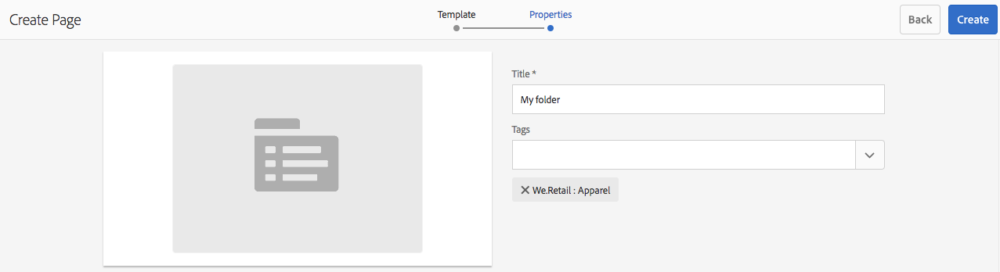

# Criação e gerenciamento de ofertas{#creating-and-managing-offers}

Use o console Ofertas para criar ofertas que você possa [usar em experiências de atividades](/help/sites-authoring/content-targeting-touch.md). A criação de ofertas no console Ofertas economiza tempo quando várias experiências exigem a mesma oferta:

* Crie a oferta uma única vez na biblioteca e use-a em várias experiências das suas atividades de marca.
* Altere a oferta na biblioteca e a alteração afetará todas as experiências que a utilizam.

O console Ofertas organiza as ofertas por marca. Cada marca contém uma biblioteca de ofertas que podem ser usadas nas experiências dela. Use pastas para definir uma estrutura hierárquica para organizar ofertas em cada biblioteca. Uma estrutura de pastas lógica permite que os autores encontrem ofertas facilmente navegando. As ferramentas de marcação e pesquisa também permitem que os autores encontrem ofertas.

## Adição de uma marca usando o console Ofertas {#add-a-brand-using-the-offers-console}

Crie uma marca à qual suas ofertas serão associadas. Abra uma marca no console Ofertas para acessar sua biblioteca de ofertas, onde você pode criar pastas e ofertas.

Ao criar uma marca usando o console Ofertas, ela também aparece no [Console Atividades](/help/sites-authoring/activitylib.md) onde é possível adicionar e administrar as atividades da marca.

1. No console Navegação, clique em **Personalização** > **Ofertas**.

   

1. Clique em **Criar** e depois **Criar** **Marca**.
1. Selecione o modelo da marca e clique em **Próxima**.
1. Digite um título para a marca conforme você queira que ele seja exibido nos consoles de Ofertas e Atividades. Também é possível digitar ou selecionar uma ou mais tags para associar à marca.
1. Clique em **Criar**.

## Adição de uma pasta a uma biblioteca de ofertas {#add-a-folder-to-an-offer-library}

Adicione uma pasta à biblioteca de ofertas de uma marca para organizar e armazenar ofertas. É possível criar uma pasta abaixo da marca ou abaixo de outras pastas.

1. No console de Ofertas, abra o local em que deseja criar a pasta. Por exemplo, abra a marca para criar uma pasta de nível superior ou abra outra pasta na biblioteca.
1. Clique em **Criar** > **Criar pasta ou oferta**.

   

1. Selecione **Pasta** e clique em **Avançar**.
1. Digite o título que você atribuir para a exibição da pasta na biblioteca de ofertas e digite ou selecione tags.

   

1. Clique em **Criar**.

## Adição de uma oferta a uma biblioteca de ofertas {#add-an-offer-to-an-offer-library}

Adicione uma oferta à biblioteca de ofertas de uma marca para que ela possa ser adicionada às experiências da marca. Ao adicionar uma oferta, um título deve ser fornecido. Também é possível associar a oferta a uma ou mais tags para aprimorar a pesquisa.

Após criar a oferta, você pode abri-la para criar o conteúdo.

1. No console Ofertas, abra o local em que deseja criar a oferta. Por exemplo, abra a marca para criar uma oferta de nível superior ou abra uma pasta na biblioteca.
1. Clique em **Criar** > **Criar pasta ou oferta**.

   

1. Selecione o **Página de oferta** e clique em **Próxima**.
1. Digite um título para a oferta e, opcionalmente, selecione ou digite uma ou mais tags para associar à oferta e clique em **Criar**.
1. Na caixa de diálogo de confirmação, para abrir a oferta para edição, clique em **Abrir página**.

## Edição de uma oferta {#editing-an-offer}

Abra uma oferta e edite o conteúdo conforme deseja que ele seja exibido nas experiências que a utilizam. Ao editar uma oferta usada em alguma experiência, suas alterações aparecerão nessas experiências.

É possível abrir uma oferta a partir de uma pasta em uma biblioteca de ofertas ou a partir dos resultados da pesquisa. Também é possível abrir uma oferta a partir de uma experiência que a usa.

1. No console Ofertas, clique no ícone ao lado da oferta e clique em **Editar**.
1. Adicione componentes à oferta e edite seu conteúdo como de costume.

## Exclusão de uma oferta {#deleting-an-offer}

Exclua uma oferta quando ela não for mais necessária. Ao tentar excluir uma oferta usada em uma experiência, será necessário confirmar a exclusão. A confirmação exclui a oferta e a remove das experiências.

É possível excluir uma oferta ao visualizar o conteúdo da pasta em uma biblioteca de ofertas ou em resultados de pesquisa.

1. No console Ofertas, clique no ícone ao lado da oferta e clique em **Excluir**.

   Selecione a oferta e clique em **Excluir**.

1. Na caixa de diálogo exibida, clique em **Excluir** para confirmar a exclusão.
1. Se a oferta for usada em uma ou mais experiências, uma caixa de diálogo será exibida para indicar que a oferta é referenciada:

   * Para excluir a oferta e removê-la das experiências, clique em **Forçar Exclusão**.
   * Para manter a oferta, clique em **Cancelar**.

## Pesquisando Ofertas {#searching-for-offers}

Pesquise ofertas de qualquer marca usando palavras-chave para corresponder ao título.

Os critérios de pesquisa atuais aparecem ao lado dos resultados da pesquisa. Você também pode classificar os resultados por coluna em ordem crescente ou decrescente. É possível executar uma pesquisa em qualquer pasta de qualquer biblioteca de ofertas. Os resultados da pesquisa são os mesmos independentemente da pasta atual.

Para pesquisar ofertas:

1. Na parte superior do console Ofertas, clique no ícone de lupa. Por padrão, a pesquisa é limitada a ofertas.
1. Digite sua palavra-chave para pesquisar por ofertas. Selecione uma nos resultados.
