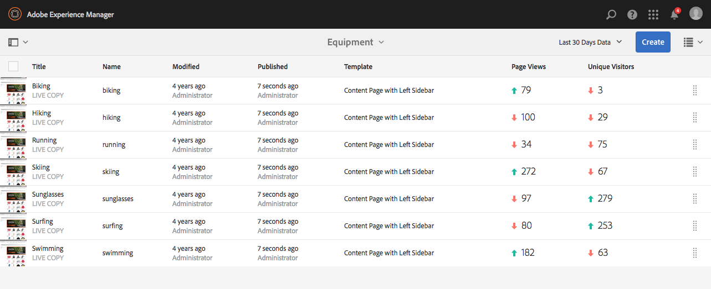

# Visualização de dados de análise de página{#seeing-page-analytics-data}

Use os dados de análise da página para medir a eficácia do conteúdo da página.

## Analytics visível no Console {#analytics-visible-from-the-console}

Os dados de análise da página são exibidos em [Exibição de lista](/help/sites-authoring/basic-handling.md#list-view) do console Sites. Quando as páginas são exibidas no formato de lista, as seguintes colunas estão disponíveis por padrão:

* Exibições da página
* Visitantes únicos
* Tempo na página

Cada coluna mostra um valor para o período de relatório atual e também indica se o valor aumentou ou diminuiu desde o período de relatório anterior. Os dados exibidos são atualizados a cada 12 horas.

>[!NOTE]
>
>Para alterar o período de atualização, [configurar o intervalo de importação](/help/sites-administering/adobeanalytics-connect.md#configuring-the-import-interval).

1. Abra o **Sites** console; por exemplo [http://localhost:4502/sites.html/content](http://localhost:4502/sites.html/content)
1. Na extremidade direita da barra de ferramentas (canto superior direito), clique ou toque no ícone para selecionar **Exibição de lista** (o ícone mostrado dependerá do [exibição atual](/help/sites-authoring/basic-handling.md#viewing-and-selecting-resources)).

1. Novamente, na extremidade direita da barra de ferramentas (canto superior direito), clique ou toque no ícone e selecione **Configurações de exibição**. A variável **Configurar colunas** será aberta. Faça as alterações necessárias e confirme com **Atualizar**.

   

### Seleção do Período de Geração de Relatórios {#selecting-the-reporting-period}

Selecione o período do relatório para o qual os dados do Analytics aparecem no console Sites:

* Dados dos últimos 30 dias
* Dados dos últimos 90 dias
* Dados deste ano

O período atual do relatório aparece na barra de ferramentas do console Sites (à direita da barra de ferramentas superior). Use o menu suspenso para selecionar o período de relatório necessário.

### Configuração de Colunas de Dados Disponíveis {#configuring-available-data-columns}

Os membros do grupo de usuários de administradores de análises podem configurar o console Sites para permitir que os autores vejam colunas adicionais do Analytics.

>[!NOTE]
>
>Quando uma árvore de páginas contém páginas secundárias associadas a diferentes configurações de nuvem do Adobe Analytics, não é possível definir colunas de dados disponíveis para as páginas.

1. Na Exibição em lista, use os seletores de exibições (à direita da barra de ferramentas) e selecione **Configurações de exibição** e depois **Adicionar dados personalizados do Analytics**.

   

1. Selecione as métricas que deseja expor aos autores no console Sites e clique em **Adicionar**.

   As colunas exibidas são recuperadas do Adobe Analytics.

   

### Abrindo insights de conteúdo em sites {#opening-content-insights-from-sites}

Abertura [Content Insight](/help/sites-authoring/content-insights.md) no console Sites para investigar mais a eficácia da página.

1. No console do Sites, selecione a página da qual deseja ver os Insights de conteúdo.
1. Na barra de ferramentas, clique no ícone Analytics e Recommendations.

   

## Análises visíveis no Editor de páginas (Activity Map) {#analytics-visible-from-the-page-editor-activity-map}

>[!NOTE]
>
>Isso será mostrado se a variável [O Activity Map foi configurado](/help/sites-administering/adobeanalytics-connect.md#configuring-for-the-activity-map) para o seu site.

>[!NOTE]
>
>Os dados da Activity Map são obtidos do Adobe Analytics.

Quando o site tiver sido [configurado para Adobe Analytics](/help/sites-administering/adobeanalytics-connect.md), você pode usar o [Activity Map de modo](/help/sites-authoring/author-environment-tools.md#page-modes) para visualizar dados relevantes. Por exemplo:

### Acessar o Activity Map {#accessing-the-activity-map}

Depois de selecionar o [Activity Map](/help/sites-authoring/author-environment-tools.md#page-modes) , você será solicitado a inserir suas credenciais da Adobe Analytics.

A variável **Analytics** a barra de ferramentas flutuante é exibida; aqui você pode:

* alterar o formato da barra de ferramentas usando as setas duplas (**>>**)
* Alternar Detalhes da página (ícone de olho)
* Defina as configurações de Activity Map ( ícone cog)
* Selecione a análise que será exibida (vários seletores suspensos)
* Saia do Activity Map e feche a barra de ferramentas (x)

### Selecionar o Analytics para mostrar {#selecting-the-analytics-to-show}

Você pode selecionar os dados analíticos a serem mostrados e como eles devem ser exibidos, usando os vários critérios:

* **Padrão**/**Ao vivo**

* tipo de evento
* grupo de usuários
* **Bolhas**/**Gradiente**/**Ganhadores e perdedores**/**Desligado**

* período a ser exibido

### Configuração do Activity Map {#configuring-the-activity-map}

Use o **Exibir configurações** ícone para abrir o **Configurações do Activity Map** diálogo.

A variável **Configurações do Activity Map** A caixa de diálogo fornece uma variedade de opções em três guias:

* Geral

   * Conjunto de relatórios
   * Nome da Página
   * Idioma
   * Sobreposições de Rótulo com
   * Tamanho da fonte do rótulo
   * Cor do gradiente
   * Cor da bolha
   * Gradiente colorido com base em
   * Transparência do gradiente

* Padrão

   * Exibição (tipo e número de links)
   * Ocultar as sobreposições para links que não receberam visitas

* Online

   * Exibir os principais (ganhadores ou perdedores)
   * Excluir % inferior
   * Atualização automática (dados e período)
