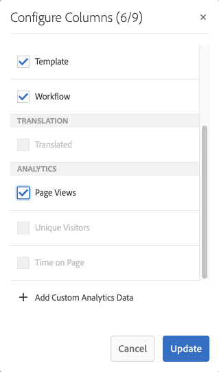

# Visualizar dados de análise de página{#seeing-page-analytics-data}

Use dados de análise de página para avaliar a eficácia do conteúdo da página.

## Análise visível do console {#analytics-visible-from-the-console}

Dados de análise de página são exibidos na [Visualização de lista](/help/sites-authoring/basic-handling.md#list-view) do console Sites. Quando as páginas são exibidas em formato de lista, as seguintes colunas estão disponíveis por padrão:

* Exibições da página
* Visitantes únicos
* Tempo na página

Cada coluna mostra um valor para o período de relatório atual e também indica se o valor aumentou ou diminuiu em relação ao período do relatório anterior. Os dados exibidos são atualizados a cada 12 horas.

>[!NOTE]
>
>Para alterar o período de atualização, [configure o intervalo de importação](/help/sites-administering/adobeanalytics-connect.md#configuring-the-import-interval).

1. Abra o console **Sites**; por exemplo [https://localhost:4502/sites.html/content](https://localhost:4502/sites.html/content)
1. Na extremidade direita da barra de ferramentas (canto superior direito), clique ou toque no ícone para selecionar **Visualização de lista** (o ícone mostrado dependerá da [visualização atual](/help/sites-authoring/basic-handling.md#viewing-and-selecting-resources)).

1. Novamente, na extremidade direita da barra de ferramentas (canto superior direito), clique ou toque no ícone e selecione **Configurações de exibição**. A caixa de diálogo **Configurar colunas** será aberta. Faça as alterações necessárias e confirme com **Atualizar**.

   

### Seleção do período de relatório {#selecting-the-reporting-period}

Selecione o período de relatório para o qual os dados de Analítica devem aparecer no console Sites:

* Dados dos últimos 30 dias
* Dados dos últimos 90 dias
* Dados deste ano

O período do relatório atual aparece na barra de ferramentas do console Sites (à direita da barra de ferramentas superior). Use o menu suspenso para selecionar o período de relatório necessário.

### Configurar colunas de dados disponíveis {#configuring-available-data-columns}

Os membros do grupo de usuários análise-administradores podem configurar o console Sites para permitir que os autores vejam colunas de análise adicionais.

>[!NOTE]
>
>Quando uma árvore de páginas contém páginas secundárias associadas a diferentes configurações de nuvem do Adobe Analytics, você não pode configurar as colunas de dados disponíveis para as páginas.

1. Na Visualização da Lista, use os seletores de visualização (à direita da barra de ferramentas), selecione **Configurações de Visualização** e **Adicionar dados personalizados do Analytics**.

   

1. Selecione as métricas que deseja expor aos autores do console Sites e clique em **Adicionar**.

   As colunas que aparecem são recuperadas do Adobe Analytics.

   

### Abrir Content Insight do Sites {#opening-content-insights-from-sites}

Abra [Content Insight](/help/sites-authoring/content-insights.md) no console Sites para investigar a eficácia da página.

1. No console Sites, selecione a página para da qual você deseja ver os Content Insights.
1. Na barra de ferramentas, clique no ícone Analytics e Recomendações.

   

## Análise visível do Editor de página (Mapa de atividades)  {#analytics-visible-from-the-page-editor-activity-map}

>[!CAUTION]
>
>Devido a alterações de segurança na API do Adobe Analytics, não é mais possível usar a versão do Activity Map incluída no AEM.
>
>O plug-in [ActivityMap fornecido pela Adobe Analytics](https://docs.adobe.com/content/help/br/analytics/analyze/activity-map/getting-started/get-started-users/activitymap-install.html) agora deve ser usado.
