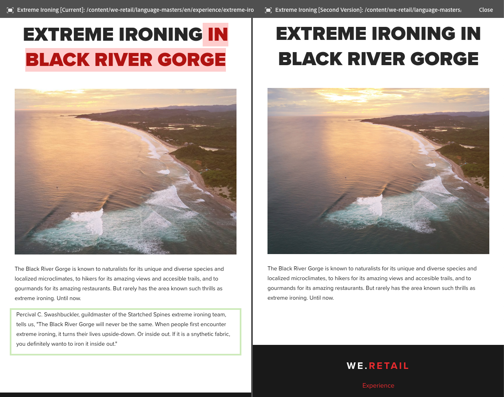

# Diferencial de páginas  {#page-diff}

## Introdução {#introduction}

A criação de conteúdo é um processo iterativo. A criação com eficiência requer a capacidade de ver o que foi alterado de uma iteração para outra. Visualizar uma versão da página e, em seguida, a outra é ineficiente e sujeita a erros. Um autor deseja poder comparar facilmente a página atual lado a lado com a outra versão.

O recurso de diferencial de páginas permite a comparação conveniente lado a lado de duas páginas com suas diferenças destacadas.

>[!TIP]
>
>Consulte [Desenvolvimento e diff de página](/help/sites-developing/pagediff.md#operation-details) para obter mais detalhes técnicos sobre este recurso.

## Utilização {#use}

O diferencial lado a lado pode comparar o seguinte:

* [Versões](/help/sites-authoring/working-with-page-versions.md#comparing-a-version-with-current-page) - versão anterior de uma página com seu estado atual
* [Live Copies](/help/sites-administering/msm-livecopy.md#comparing-a-live-copy-page-with-a-blueprint-page) - Live Copy com blueprint
* [Lançamentos](/help/sites-authoring/launches-editing.md#comparing-a-launch-page-to-its-source-page) - lançamento com sua origem
* [Cópias de idioma](/help/sites-administering/tc-manage.md#comparing-language-copies) - uma página antes e depois da (nova) tradução

Consulte os respectivos tópicos sobre como iniciar o diferencial nesses contextos.

### Apresentação das diferenças   {#presentation-of-differences}

Independentemente do conteúdo sendo comparado, a apresentação do diferencial permanece a mesma.

* O conteúdo selecionado quando você iniciou o diferencial é exibido à esquerda (o ponto de entrada do diferencial).
* O conteúdo a ser comparado é exibido à direita (ou seja, aquele com o qual o conteúdo selecionado será comparado).

Por exemplo, ao comparar versões, a versão atual é exibida à esquerda e a versão anterior é exibida à direita.

A origem de ambas as páginas é claramente exibida na barra de cabeçalho na parte superior da janela do navegador.

O recurso diferencial detecta alterações no nível do componente e do HTML. Os itens alterados serão realçados com cores diferentes.

**Alterações de componente**

* Verde-claro - Componente adicionado
* Rosa - Componente removido

**Alterações no HTML**

* Verde-escuro - HTML adicionado
* Vermelho - HTML removido

>[!NOTE]
>
>Ao comparar cópias em idiomas diferentes, o realce é desativado, pois em uma tradução tudo é alterado e o realce não traria benefício algum.

### Tela cheia e ao sair   {#fullscreen-and-exiting}

Para se concentrar em um conteúdo específico, você pode clicar no ícone de tela inteira para qualquer &quot;lado&quot; da comparação lado a lado, ampliando o conteúdo até o tamanho da janela do navegador.

O lado selecionado preencherá a janela inteira, mas a barra permanecerá no topo, permitindo que você alterne entre as duas páginas.

Você também pode optar por fechar a visualização em tela cheia clicando no ícone Saída da tela cheia.

É possível sair do diferencial lado a lado a qualquer momento clicando no botão Fechar no cabeçalho.

## Limitações   {#limitations}

Há algumas situações em que o recurso de diferencial de páginas pode não detectar uma diferença conforme esperado.

* Ao comparar versões e inicializações, o diferencial não leva em conta componentes dinâmicos como navegações estruturais, menus, listas de produtos ou logotipos (componentes que dependem da estrutura do site para renderizar seu conteúdo).
* Para versões, o diferencial não recria a política de controle de acesso e as relações com a Live Copy.
* Se uma página for movida, não será mais possível fazer uma comparação com nenhuma versão feita antes da movimentação.

   * Se você tiver problemas com um diferencial, verifique a [Linha do tempo](/help/sites-authoring/basic-handling.md#timeline) da página para ver se ela foi movida.

>[!NOTE]
>
>As versões não podem ser comparadas entre si. Somente a versão atual pode ser comparada com outras versões da página. A versão atual é sempre a versão realçada com alterações.

>[!NOTE]
>
>Para obter mais detalhes sobre a operação do mecanismo diff da página, bem como limitações que podem afetar o diff da página, consulte a [documentação do desenvolvedor](/help/sites-developing/pagediff.md) deste recurso.
