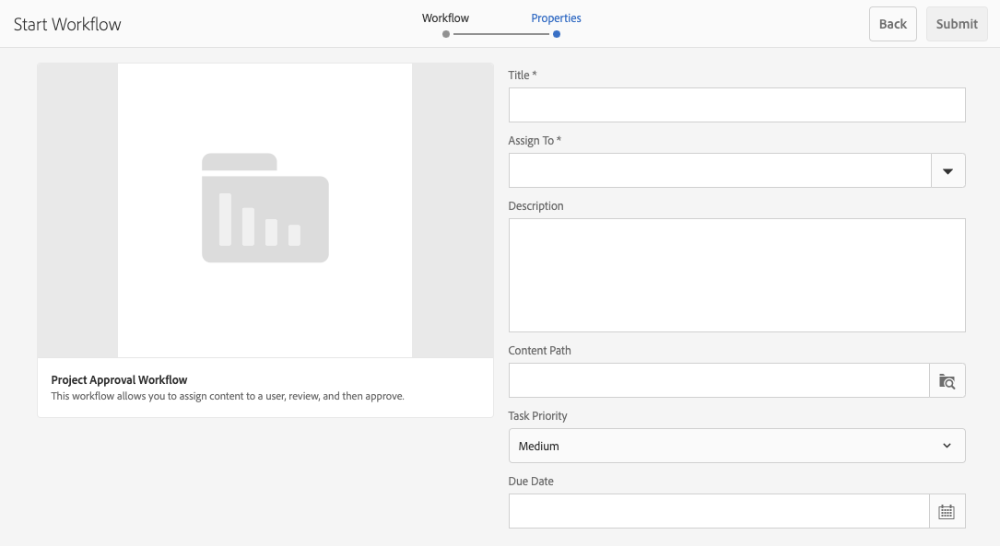

# Trabalhar com fluxos de trabalho de projeto {#working-with-project-workflows}

Os fluxos de trabalho de projeto disponíveis prontos para uso incluem o seguinte:

* **Fluxo de trabalho para aprovação de projeto** - Esse fluxo de trabalho permite atribuir conteúdo a um usuário, bem como analisá-lo e aprová-lo.
* **Solicitar inicialização** - um fluxo de trabalho que solicita uma inicialização.
* **Solicitar página de aterrissagem** - esse fluxo de trabalho solicita uma página de aterrissagem.
* **Solicitar email** - Fluxo de trabalho para solicitar um email.
* **Sessão fotográfica do produto e sessão fotográfica do produto (Commerce)** - Mapeia ativos com produtos
* **Criar e traduzir cópia do DAM e Criar cópia no idioma de destino do DAM** - cria binários, metadados e tags traduzidos para arquivos e pastas.

Dependendo do modelo de projeto selecionado, há determinados fluxos de trabalho disponíveis:

|   | **Projeto simples** | **Projeto de mídia** | **Projeto de sessão fotográfica do produto** | **Projeto de tradução** |
|---|:-:|:-:|:-:|:-:|
| Solicitar cópia |  | x |  |  |
| Sessão fotográfica do produto |  | x | x |  |
| Sessão fotográfica do produto (Commerce) |  |  | x |  |
| Aprovação de Projeto | x |  |  |  |
| Solicitar inicialização | x |  |  |  |
| Solicitar página de aterrissagem | x |  |  |  |
| Solicitar email | x |  |  |  |
| Criar cópia no idioma de destino do DAM&amp;ast; |  |  |  | x |
| Criar e traduzir cópia no idioma de destino do DAM;&amp;ast; |  |  |  | x |

>[!NOTE]
>
>&amp;ast; Esses fluxos de trabalho não são iniciados no bloco **Fluxo de trabalho** em Projetos. Consulte [Criando Cópias de Idioma para o Assets.](/help/sites-administering/tc-manage.md)

As etapas para iniciar e concluir fluxos de trabalho são as mesmas, independentemente do fluxo de trabalho escolhido. Somente as etapas são alteradas.

Um fluxo de trabalho é iniciado diretamente em Projetos (exceto para Criar cópia no idioma de destino do DAM ou Criar e Traduzir cópia no idioma de destino do DAM). Informações sobre quaisquer tarefas pendentes em um projeto estão listadas no bloco **Tarefas**. As notificações para tarefas que precisam ser concluídas são exibidas ao lado do ícone do usuário.

Para obter mais informações sobre como trabalhar com fluxos de trabalho no AEM, consulte os seguintes documentos:

* [Participar de fluxos de trabalho](/help/sites-authoring/workflows-participating.md)
* [Aplicação de fluxos de trabalho a páginas](/help/sites-authoring/workflows-applying.md)
* [Configuração de fluxos de trabalho](/help/sites-administering/workflows.md)

Esta seção descreve os fluxos de trabalho disponíveis para Projetos.

## Solicitar fluxo de trabalho de cópia {#request-copy-workflow}

Esse fluxo de trabalho permite solicitar um manuscrito de um usuário e depois aprová-lo. Para iniciar o workflow de cópia da solicitação:

1. Em um projeto de mídia, clique na divisa para baixo na parte superior direita do bloco **Fluxos de Trabalho** e selecione **Iniciar Fluxo de Trabalho**.
1. No assistente de fluxo de trabalho, selecione **Solicitar cópia** e clique em **Avançar**.
1. Insira um título de manuscrito e um breve resumo do que você está solicitando. Se aplicável, insira uma contagem de palavras de destino, uma prioridade de tarefa e uma data de vencimento.

   

1. Clique em **Enviar**.

O fluxo de trabalho é iniciado. A tarefa aparece no cartão **Tarefas**.

## Fluxo de trabalho da sessão fotográfica do produto {#product-photo-shoot-workflow}

Os fluxos de trabalho da **Sessão de Fotos do Produto** (comerciais e sem comércio) são abordados detalhadamente no documento [Projetos do Creative](/help/sites-authoring/managing-product-information.md)

## Fluxo de trabalho para aprovação do projeto {#project-approval-workflow}

No fluxo de trabalho **Aprovação de projeto**, você atribui o conteúdo a um usuário, revisa-o e aprova-o.

1. Em um projeto simples, clique na divisa para baixo na parte superior direita do bloco **Fluxos de Trabalho** e selecione **Iniciar Fluxo de Trabalho**.
1. No assistente de fluxo de trabalho, selecione **Fluxo de Trabalho para Aprovação de Projeto** e clique em **Avançar**.
1. Insira um título e selecione a quem atribuí-lo. Se aplicável, insira uma descrição, o caminho do conteúdo, uma prioridade pra tarefa e um prazo.

   

1. Clique em **Enviar**.

O fluxo de trabalho é iniciado. A tarefa aparece no cartão **Tarefas**.

## Solicitar fluxo de trabalho de inicialização {#request-launch-workflow}

Esse fluxo de trabalho permite solicitar um lançamento.

1. Em um projeto simples, clique na divisa para baixo na parte superior direita do bloco **Fluxos de Trabalho** e selecione **Iniciar Fluxo de Trabalho**.
1. No assistente de fluxo de trabalho, selecione **Solicitar fluxo de trabalho de inicialização** e clique em **Avançar**.
1. Insira um título para lançamento e forneça o caminho de origem de lançamento. Também é possível adicionar uma descrição e uma data de ativação, se aplicável. Selecione Herdar dados ativos da página de origem ou excluir subpáginas, dependendo de como deseja que o lançamento se comporte.

   

1. Clique em **Enviar**.

O fluxo de trabalho é iniciado. O fluxo de trabalho aparece na lista **Fluxos de trabalho**.

## Solicitar fluxo de trabalho da página de aterrissagem {#request-landing-page-workflow}

Esse fluxo de trabalho permite solicitar uma landing page.

1. Em um projeto simples, clique na divisa para baixo na parte superior direita do bloco **Fluxos de Trabalho** e selecione **Iniciar Fluxo de Trabalho**.
1. No assistente de fluxo de trabalho, selecione **Solicitar página de aterrissagem** e clique em **Avançar**.
1. Insira um título para a página de aterrissagem e o caminho principal. Se aplicável, insira uma data de ativação ou escolha um arquivo para a landing page.

   

1. Clique em **Enviar**.

O fluxo de trabalho é iniciado. A tarefa aparece no cartão **Tarefas**.

## Solicitar fluxo de trabalho de email {#request-email-workflow}

Esse workflow permite solicitar um email. É o mesmo fluxo de trabalho que aparece no bloco **Emails**.

1. Em um projeto simples, clique na divisa para baixo na parte superior direita do bloco **Fluxos de Trabalho** e selecione **Iniciar Fluxo de Trabalho**.
1. No assistente de fluxo de trabalho, selecione **Solicitar email** e clique em **Avançar**.
1. Insira um título de email e os caminhos da campanha e do template. Além disso, você pode fornecer um nome, uma descrição e uma data de ativação.

   

1. Clique em **Enviar**.

O fluxo de trabalho é iniciado. A tarefa aparece no cartão **Tarefas**.

## Criar (e traduzir) fluxo de trabalho de cópia no idioma de destino para ativos {#create-and-translate-language-copy-workflow-for-assets}

Os fluxos de trabalho **Criar Cópia de Idioma** e **Criar e Traduzir Cópia de Idioma** são abordados detalhadamente no documento [Criação de Cópias de Idioma para o Assets.](/help/assets/translation-projects.md)
