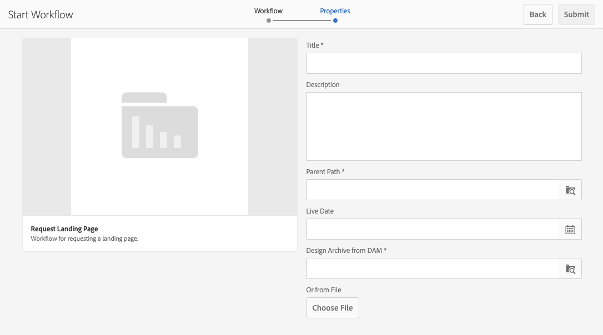

# Trabalhar com fluxos de trabalho de projeto {#working-with-project-workflows}

Os fluxos de trabalho de projeto disponíveis para uso imediato incluem os seguintes:

* **Fluxo de trabalho de aprovação do projeto** - Esse workflow permite atribuir conteúdo a um usuário, revisar e aprovar.
* **Solicitar lançamento** - Um fluxo de trabalho que solicita um lançamento.
* **Solicitar página de aterrissagem** - Esse workflow solicita uma landing page.
* **Solicitar email** - Fluxo de trabalho para solicitar um email.
* **Sessão fotográfica do produto e Sessão fotográfica do produto (Comércio)** - Mapeia ativos com produtos
* **Criar e traduzir cópia DAM e Criar cópia de idioma DAM** - Cria binários, metadados e tags traduzidos para ativos e pastas.

Dependendo de qual modelo de projeto você selecionar, certos fluxos de trabalho estarão disponíveis:

|  | **Projeto simples** | **Projeto de mídia** | **Projeto de sessão fotográfica do produto** | **Projeto de tradução** |
|---|:-:|:-:|:-:|:-:|
| Solicitar cópia |  | x |  |  |
| Sessão fotográfica do produto |  | x | x |  |
| Sessão fotográfica do produto (Comércio) |  |  | x |  |
| Aprovação de projeto | x |  |  |  |
| Solicitar lançamento | x |  |  |  |
| Solicitar página de aterrissagem | x |  |  |  |
| Solicitar email | x |  |  |  |
| Criar Cópia de Idioma DAM &amp;; |  |  |  | x |
| Criar e traduzir cópia de idioma DAM; |  |  |  | x |

>[!NOTE]
>
>&amp;ast; Esses workflows não são iniciados do **Fluxo de trabalho** em Projetos. Consulte [Criação de cópias de idioma para ativos.](/help/sites-administering/tc-manage.md)

As etapas para iniciar e concluir fluxos de trabalho são as mesmas, independentemente do fluxo de trabalho escolhido. Apenas as etapas mudam.

Você inicia um fluxo de trabalho diretamente em Projetos (exceto para Criar cópia de idioma DAM ou Criação e tradução DAM da cópia de idioma). Informações sobre quaisquer tarefas pendentes em um projeto são listadas no bloco **Tarefas**. Notificações de tarefas que precisam ser concluídas aparecem ao lado do ícone de usuário.

Para obter mais informações sobre como trabalhar com fluxos de trabalho no AEM, consulte os seguintes documentos:

* [Participar de fluxos de trabalho](/help/sites-authoring/workflows-participating.md)
* [Aplicação de fluxos de trabalho a páginas](/help/sites-authoring/workflows-applying.md)
* [Configuração de fluxos de trabalho](/help/sites-administering/workflows.md)

Esta seção descreve os fluxos de trabalho disponíveis para Projetos.

## Solicitar fluxo de trabalho de cópia {#request-copy-workflow}

Esse fluxo de trabalho permite solicitar um manuscrito de um usuário e depois aprová-lo. Para iniciar o fluxo de trabalho Solicitar cópia:

1. Em um projeto de mídia, toque ou clique na divisa para baixo na parte superior direita da variável **Fluxos de trabalho** bloco e selecione **Iniciar fluxo de trabalho**.
1. No assistente de fluxo de trabalho, selecione **Solicitar cópia** e clique em **Próximo**.
1. Insira um título de manuscrito e um breve resumo do que você está solicitando. Se aplicável, insira uma contagem de palavras de destino, uma prioridade de tarefa e uma data de vencimento.

   

1. Clique em **Enviar**.

O fluxo de trabalho é iniciado. A tarefa é exibida no **Tarefas** cartão.

## Fluxo de trabalho Sessão fotográfica do produto {#product-photo-shoot-workflow}

O **Sessão fotográfica do produto** os workflows (comércio e sem comércio) são abordados detalhadamente no documento [Projetos criativos](/help/sites-authoring/managing-product-information.md)

## Fluxo de trabalho para aprovação do projeto {#project-approval-workflow}

No **Aprovação de projeto** , você atribui conteúdo a um usuário, revisa e depois aprova o conteúdo.

1. Em um projeto simples, toque ou clique na divisa para baixo na parte superior direita do **Fluxos de trabalho** bloco e selecione **Iniciar fluxo de trabalho**.
1. No assistente de fluxo de trabalho, selecione **Fluxo de trabalho de aprovação do projeto** e clique em **Próximo**.
1. Insira um título e selecione a quem ele deve ser atribuído. Se aplicável, insira uma descrição, um caminho de conteúdo, uma prioridade de tarefa e uma data de vencimento.

   

1. Clique em **Enviar**.

O fluxo de trabalho é iniciado. A tarefa é exibida no **Tarefas** cartão.

## Fluxo de trabalho Solicitar lançamento {#request-launch-workflow}

Esse fluxo de trabalho permite solicitar um lançamento.

1. Em um projeto simples, toque ou clique na divisa para baixo na parte superior direita do **Fluxos de trabalho** bloco e selecione **Iniciar fluxo de trabalho**.
1. No assistente de fluxo de trabalho, selecione **Fluxo de trabalho Solicitar lançamento** e clique em **Próximo**.
1. Insira um título para o lançamento e forneça o caminho da origem de lançamento. Você também pode adicionar uma descrição e uma data de colocação ao vivo, se aplicável. Selecione Herdar dados online de página fonte ou Excluir subpáginas, dependendo de como você deseja que o lançamento se comporte.

   

1. Clique em **Enviar**.

O fluxo de trabalho é iniciado. O fluxo de trabalho é exibido no **Fluxos de trabalho** lista.

## Solicitar fluxo de trabalho da página de aterrissagem {#request-landing-page-workflow}

Esse fluxo de trabalho permite solicitar uma página de aterrissagem.

1. Em um projeto simples, toque ou clique na divisa para baixo na parte superior direita do **Fluxos de trabalho** bloco e selecione **Iniciar fluxo de trabalho**.
1. No assistente de fluxo de trabalho, selecione **Solicitar página de aterrissagem** e clique em **Próximo**.
1. Insira um título para sua página de destino e o caminho pai. Se aplicável, insira uma data de colocação ao vivo ou escolha um arquivo para sua página de aterrissagem.

   

1. Clique em **Enviar**.

O fluxo de trabalho é iniciado. A tarefa é exibida no **Tarefas** cartão.

## Fluxo de trabalho Solicitar email {#request-email-workflow}

Esse fluxo de trabalho permite solicitar um email. É o mesmo fluxo de trabalho que aparece no bloco **Emails**.

1. Em um projeto simples, toque ou clique na divisa para baixo na parte superior direita do **Fluxos de trabalho** bloco e selecione **Iniciar fluxo de trabalho**.
1. No assistente de fluxo de trabalho, selecione **Solicitar email** e clique em **Próximo**.
1. Insira um título de email, bem como os caminhos da campanha e do modelo. Além disso, você pode fornecer um nome, uma descrição e uma data de colocação ao vivo.

   

1. Clique em **Enviar**.

O fluxo de trabalho é iniciado. A tarefa é exibida no **Tarefas** cartão.

## Criar (e Traduzir) fluxo de trabalho de cópia de idioma para ativos {#create-and-translate-language-copy-workflow-for-assets}

O **Criar Cópia de Idioma** e **Criar e traduzir cópia de idioma** os fluxos de trabalho são abordados detalhadamente no documento [Criação de cópias de idioma para ativos.](/help/assets/translation-projects.md)
