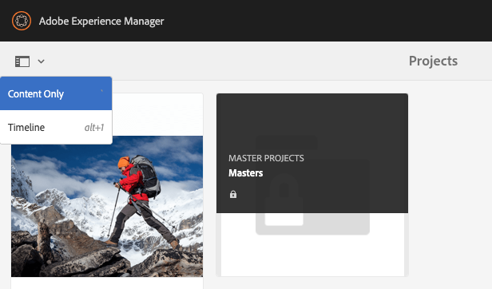

# Projetos {#projects}

Projetos permitem agrupar recursos em uma entidade. Um ambiente comum e compartilhado facilita o gerenciamento dos seus projetos. Os tipos de recursos que você pode associar a um projeto são chamados de Mosaicos no AEM. Blocos podem incluir informações do projeto e da equipe, ativos, workflows e outros tipos de informações, conforme descrito detalhadamente em [Blocos de projeto.](#project-tiles)

Como usuário, você pode:

* Criar e excluir projetos
* Associar pastas de conteúdo e recursos a um projeto
* Remover links de conteúdo do projeto

## Requisitos de acesso {#access-requirements}

Projeta um recurso de AEM padrão e não requer configuração adicional.

No entanto, para que os usuários em projetos vejam outros usuários/grupos ao usar Projetos, como ao criar projetos, criar tarefas/fluxos de trabalho ou visualizar e gerenciar a equipe, esses usuários precisam ter acesso de leitura em `/home/users` e `/home/groups`.

A maneira mais fácil de fazer isso é dar **projects-users** acesso de leitura de grupo para `/home/users` e `/home/groups`.

## Console Projetos {#projects-console}

O console Projetos é onde você acessa e gerencia seus projetos no AEM.

O console Projetos é semelhante a outros consoles no AEM, permitem várias ações em projetos individuais e ajustam a visualização dos projetos.

### Alternar o modo {#modes}

Você pode usar o seletor do painel para alterar entre os modos do console.

#### Somente conteúdo {#content-only}

Somente conteúdo é o modo padrão ao abrir o console. Ele mostrará todos os seus projetos.

#### Linha do tempo {#timeline}

A exibição de linha do tempo permite selecionar um projeto individual e exibir uma atividade nele. Use o seletor do painel ou a tecla de atalho `alt+1` para alterar para essa visualização.

### Alternar visualização {#views}

Você pode usar o seletor de exibições para alterar entre a exibição de projetos como blocos grandes (o padrão), para exibi-los como uma lista ou em um calendário.

### Filtrar a visualização {#filter}

Você pode usar o filtro para alternar entre todos os projetos e somente aqueles que estão ativos.

### Seleção e visualização de projetos {#selecting}

Selecione um projeto passando o mouse sobre o bloco do projeto e clicando na marca de seleção.

Visualize os detalhes de um projeto clicando nele para detalhar.

### Criar novos projetos {#creating}

Clique em **Criar** para adicionar um novo projeto.

## Blocos de Projetos {#project-tiles}

Os projetos são compostos de diferentes tipos de informações que você deseja gerenciar em conjunto. Essas informações são representadas por diferentes **Mosaicos**.

Você pode ter os seguintes blocos associados ao seu projeto.

* [Assets](#assets)
* [Coleções de ativos](#asset-collections)
* [Experiências](#experiences)
* [Links](#links)
* [Informações do projeto](#project-info)
* [Equipe](#team)
* [Páginas de aterrissagem](#landing-pages)
* [Emails](#emails)
* [Fluxos de trabalhos](#workflows)
* [Lançamentos](#launches)
* [Tarefas](#tasks)

Clique no menu suspenso na parte superior direita de qualquer bloco para adicionar mais dados ao bloco.

Clique no botão de reticências na parte inferior direita de qualquer bloco para abrir os dados do bloco em seu console associado.

### Ativos {#assets}

No bloco **Assets**, você pode reunir todos os ativos que você usa para um projeto específico.

Você faz o upload de recursos diretamente no bloco.

### Coleções de ativos {#asset-collections}

Semelhante a ativos, você pode adicionar [coleções de ativos](/help/assets/manage-collections.md) diretamente ao seu projeto. Você define coleções no Assets.

Adicione uma coleção ao clicar em **Adicionar coleção** e selecionar a coleção apropriada na lista.

### Experiências {#experiences}

O **Experiências** bloco permite adicionar um aplicativo móvel, site ou publicação ao projeto.

Os ícones indicam que tipo de experiência é representada.

* Site
* Aplicativo móvel

### Links {#links}

O **Links** O bloco permite associar links externos ao seu projeto.

Você pode nomear o link com um nome fácil de reconhecer, além de alterar a miniatura.

### Informações do projeto {#project-info}

O **Informações do projeto** O bloco fornece informações gerais sobre o projeto, incluindo uma descrição, status do projeto (inativo ou ativo), uma data de vencimento e membros. Além disso, você pode adicionar uma miniatura de projeto, que é exibida na página principal de Projetos.

### Tarefa de tradução {#translation-job}

O **Tarefa de tradução** é onde você inicia uma tradução e também vê o status de suas traduções.

Para configurar sua tradução, consulte o documento [Criar projetos de tradução.](/help/assets/translation-projects.md)

### Equipe {#team}

Nesse bloco, você pode especificar os membros da equipe do projeto. Ao editar, você pode inserir o nome do membro da equipe e atribuir a função do usuário.

É possível adicionar e excluir membros da equipe. Além disso, você pode editar a [função de usuário](#userroles) atribuída ao membro da equipe.

### Páginas de aterrissagem {#landing-pages}

O bloco **** Páginas de aterrissagem permite que você solicite uma nova páginas de aterrissagem.

Este fluxo de trabalho é descrito no documento[Crie um fluxo de trabalho de Landing page .](/help/sites-authoring/projects-with-workflows.md#request-landing-page-workflow)

### Emails {#emails}

O bloco **Emails** ajuda você a gerenciar solicitações de email. Ele inicia o **Solicitação de email** fluxo de trabalho.

Mais informações são descritas em [Fluxo de trabalho Solicitar email](/help/sites-authoring/projects-with-workflows.md#request-email-workflow).

### Fluxos de trabalhos {#workflows}

Você pode iniciar fluxos de trabalho para o seu projeto. Se algum workflow estiver em execução, seu status será exibido na variável **Fluxos de trabalho** mosaico.

Dependendo do projeto que você criar, há diferentes fluxos de trabalho disponíveis.

Eles estão descritos em [Trabalhar com fluxos de trabalho de projeto](/help/sites-authoring/projects-with-workflows.md).

### Lançamentos {#launches}

O **Lançamentos** o mosaico mostra todas as inicializações que foram solicitadas com um [Fluxo de trabalho Solicitar lançamento .](/help/sites-authoring/projects-with-workflows.md)

### Tarefas {#tasks}

Tarefas permitem monitorar o status de qualquer tarefa relacionada ao projeto, incluindo fluxos de trabalho. As tarefas são abordadas em detalhes em [Trabalhar com tarefas](/help/sites-authoring/task-content.md).

## Modelos de projeto {#project-templates}

Os modelos servem de base para iniciar o projeto. AEM fornece esses templates de projeto padrão.

* **Projeto de mídia** - Este é um projeto de exemplo de referência para atividades relacionadas à mídia. Ele inclui várias funções de projeto relacionadas à mídia e também inclui fluxos de trabalho relacionados ao conteúdo de mídia.
* **[Projeto de sessão fotográfica do produto](/help/sites-authoring/managing-product-information.md)** - Esta é uma amostra de referência para o gerenciamento de fotografias de produtos relacionados ao comércio eletrônico.
* **[Projeto de tradução](/help/sites-administering/translation.md)** - Esta é uma amostra de referência para o gerenciamento de atividades relacionadas à tradução. Ele inclui funções básicas e inclui fluxos de trabalho para gerenciar traduções.
* **Projeto simples** - Trata-se de uma amostra de referência para os projetos que não se enquadrem noutras categorias. Ele inclui três funções básicas e quatro fluxos de trabalho gerais de AEM.

Com base no modelo selecionado, você tem diferentes opções disponíveis no projeto, como funções de usuário e fluxos de trabalho fornecidos.

## Funções de usuário em um projeto {#user-roles-in-a-project}

As diferentes funções de usuário são definidas no modelo do projeto e são usadas por dois motivos principais:

1. Permissões: As funções de usuário se encaixam em uma das três categorias listadas: observador, editor, proprietário. Por exemplo, um fotógrafo ou redator terá os mesmos privilégios de um editor. As permissões determinam o que um usuário pode fazer com o conteúdo em um projeto.
1. Fluxos de trabalho: Os fluxos de trabalho determinam quem recebe tarefas em um projeto. As tarefas podem ser associadas a uma função de projeto. Por exemplo, uma tarefa pode ser atribuída a fotógrafos para que todos os membros da equipe que tenham a função de fotógrafo a recebam.

Todos os projetos oferecem suporte às seguintes funções padrão, para permitir que você administre permissões de segurança e controle.

| Função | Descrição | Permissões | Associação de Grupo |
|---|---|---|---|
| Observador | Um usuário nessa função pode visualizar detalhes do projeto, incluindo seu status. | Permissões somente leitura em um projeto | `workflow-users` grupo |
| Editor | Um usuário nessa função pode fazer o upload e a edição do conteúdo de um projeto. | Acesso de leitura e gravação em um projeto, metadados associados e ativos relacionados Privilégios para fazer upload de uma lista de capturas, sessão de fotos e revisar e aprovar ativos Permissão de gravação em `/etc/commerce` Modificar permissão em um projeto específico | `workflow-users` grupo |
| Proprietário | Um usuário nessa função pode criar um projeto, iniciar o trabalho em um projeto e mover os ativos aprovados para a pasta de produção. Todas as outras tarefas no projeto também podem ser visualizadas e executadas pelo proprietário. | Permissão de gravação em `/etc/commerce` | `dam-users` grupo para criar um projeto `project-administrators` para criar um projeto e mover ativos |

Para projetos criativos, também são fornecidas funções adicionais, como fotógrafos. Você pode usar essas funções para derivar funções personalizadas para um projeto específico.

### Criação automática de grupo {#auto-group-creation}

Ao criar o projeto e adicionar usuários às várias funções, os grupos associados ao projeto são criados automaticamente para gerenciar as permissões associadas.

Por exemplo, um projeto chamado Myproject teria três grupos: **Proprietários do Myproject**, **Editores do Myproject**, **Observadores do Myproject**.

Se o projeto for excluído, esses grupos só serão excluídos se você selecionar a opção apropriada [ao excluir o projeto.](/help/sites-authoring/touch-ui-managing-projects.md#deleting-a-project) Um administrador também pode excluir manualmente os grupos em **Ferramentas** > **Segurança** > **Grupos**.

## Recursos adicionais {#additional-resources}

Para obter mais detalhes sobre o uso de projetos, consulte os seguintes documentos adicionais:

* [Gerenciamento de projetos](/help/sites-authoring/touch-ui-managing-projects.md)
* [Trabalhar com tarefas](/help/sites-authoring/task-content.md)
* [Trabalhar com fluxos de trabalho de projeto](/help/sites-authoring/projects-with-workflows.md)
* [Integração com o Creative Project e o PIM](/help/sites-authoring/managing-product-information.md)
