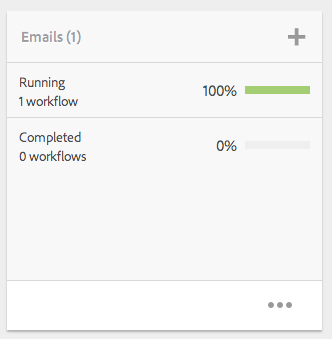

# Projetos{#projects}

Projetos permitem agrupar recursos em uma entidade. Um ambiente comum e compartilhado facilita o gerenciamento dos seus projetos. Os tipos de recursos que você pode associar a um projeto são chamados de Mosaicos no AEM. Tiles may include project and team information, assets, workflows, and other types of information, as described in detail in [Project Tiles.](#project-tiles)

>[!CAUTION]
>
>For users in projects to see other users/groups while using Projects functionality like creating projects, creating tasks/workflows, seeing and managing the team, those users need to have read access on **/home/users** and **/home/groups**. The easiest way to implement this is to give the **projects-users** group read access to **/home/users** and**/home/groups**.

Como usuário, você pode fazer o seguinte:

* Criar projetos
* Associar pastas de conteúdo e recursos a um projeto
* Excluir projetos
* Remover links de conteúdo do projeto

Consulte os seguintes tópicos adicionais:

* [Gerenciamento de projetos](/help/sites-authoring/touch-ui-managing-projects.md)
* [Trabalhar com tarefas](/help/sites-authoring/task-content.md)
* [Trabalhar com fluxos de trabalho de projeto](/help/sites-authoring/projects-with-workflows.md)
* [Integração com o Creative Project e o PIM](/help/sites-authoring/managing-product-information.md)

## Console Projetos {#projects-console}

O console Projetos é onde você acessa e gerencia seus projetos no AEM.

* Selecione **Linha do tempo** e, em seguida, um projeto para visualizar sua linha do tempo.
* Clique/toque em **Selecionar** para entrar no modo de seleção.
* Clique em **Criar** para adicionar projetos.
* **Alternar projetos ativos** permite alternar entre todos os projetos e somente aqueles que estão ativos.
* **Exibir visualização de estatísticas** permite ver estatísticas de projeto referentes a conclusões de tarefas.

## Blocos de Projetos {#project-tiles}

Com Projetos, você associa diferentes tipos de informações aos seus projetos. Esses informações são chamadas de **Blocos**. Cada um dos blocos e o tipo de informação que eles contêm estão descritos nesta seção.

Você pode ter os seguintes blocos associados ao seu projeto. Cada um está descrito nas seções a seguir:

* Ativos e coleções de ativos
* Experiências
* Links
* Informações do projeto
* Equipe
* Páginas de aterrissagem
* Emails
* Fluxos de trabalhos
* Lançamentos
* Tarefas

### Assets {#assets}

No bloco **Assets**, você pode reunir todos os ativos que você usa para um projeto específico.

Você faz o upload de recursos diretamente no bloco. Além disso, é possível criar Definições de imagem, Grupos de rotação ou Conjuntos de mix de mídia com o complemento Mídia dinâmica.

### Coleções de ativos {#asset-collections}

Semelhante a ativos, você pode adicionar [coleções de ativos](/help/assets/managing-collections-touch-ui.md) diretamente ao seu projeto. Você define coleções no Assets.

Adicione uma coleção clicando em **Adicionar coleção** e selecionando a coleção apropriada na lista.

### Experiências {#experiences}

O bloco **Experiências** permite adicionar um aplicativo para dispositivos móveis, um site ou uma publicação ao projeto.

Os ícones indicam que tipo de experiência é representada: site, aplicativo móvel ou publicação. Adicione experiências ao clicar no sinal + ou em **Adicionar experiência** e selecionar o tipo de experiência.

Selecione o caminho para as miniaturas e, se aplicável, altere a miniatura da experiência. As experiências são agrupadas no bloco **Experiências.**

### Links {#links}

O bloco Links permite associar links externos ao seu projeto.

Você pode nomear o link com um nome fácil de reconhecer, além de alterar a miniatura.

### Informações do projeto {#project-info}

O bloco Informações do projeto fornece informações gerais sobre o projeto, incluindo uma descrição, o status do projeto (inativo ou ativo), uma data de vencimento e membros. Além disso, você pode adicionar uma miniatura de projeto, que é exibida na página principal de Projetos.

Os membros da equipe podem ser atribuídos a esse bloco e excluídos dele (ou ter suas funções alteradas), bem como do bloco Equipe.

### Tarefa de tradução {#translation-job}

O bloco Tarefa de tradução é onde você inicia uma tradução e visualiza o status das suas traduções. Para configurar sua tradução, consulte [Criação de projetos de tradução](/help/assets/translation-projects.md).

Click the ellipsis at the bottom of the **Translation Job** card to view the assets in the translation workflow. A lista de tarefas de tradução também exibe entradas para metadados e tags de ativos. Essas entradas indicam que metadados e tags de ativos também são traduzidos.

### Equipe {#team}

Nesse bloco, você pode especificar os membros da equipe do projeto. Ao editar, você pode inserir o nome do membro da equipe e atribuir a função do usuário.

É possível adicionar e excluir membros da equipe. Além disso, você pode editar a [função de usuário](#userroles) atribuída ao membro da equipe.

### Páginas de aterrissagem {#landing-pages}

O bloco **Páginas de aterrissagem** permite que você solicite uma nova páginas de aterrissagem.

Esse fluxo de trabalho é descrito em [Criar um fluxo de trabalho de Página de aterrissagem](/help/sites-authoring/projects-with-workflows.md#request-landing-page-workflow).

### Emails {#emails}

O bloco **Emails** ajuda você a gerenciar solicitações de email. Ele inicia o fluxo de trabalho Solicitar email.

Mais informações são descritas em [Fluxo de trabalho Solicitar email](/help/sites-authoring/projects-with-workflows.md#request-email-workflow).

### Fluxos de trabalhos {#workflows}

Você pode atribuir seu projeto para seguir certos fluxos de trabalho. Se algum fluxo de trabalho estiver em execução, seu status será exibido no bloco **Fluxos de trabalho**, em Projetos.

Você pode atribuir seu projeto para seguir certos fluxos de trabalho. Dependendo do projeto escolhido, você tem fluxos de trabalho diferentes disponíveis.

Eles estão descritos em [Trabalhar com fluxos de trabalho de projeto](/help/sites-authoring/projects-with-workflows.md).

### Lançamentos {#launches}

O bloco Lançamentos mostra todos os lançamentos que foram solicitados com um [fluxo de trabalho Solicitar lançamento](/help/sites-authoring/projects-with-workflows.md).

### Tarefas {#tasks}

Tarefas permitem monitorar o status de qualquer tarefa relacionada ao projeto, incluindo fluxos de trabalho. Tasks are covered in detail at [Working with Tasks](/help/sites-authoring/task-content.md).

## Modelos de projeto {#project-templates}

O AEM acompanha três modelos diferentes prontos para uso:

* Um projeto simples - uma amostra de referência para quaisquer projetos que não se encaixem em outras categorias (um catch-all). Ele inclui três funções básicas (Proprietários, Editores e Observadores) e quatro fluxos de trabalho (Aprovação de projeto, Solicitar lançamento, Solicitar página de aterrissagem e Solicitar email).
* Um projeto de mídia - um exemplo de projeto de referência para atividades relacionadas à mídia. Ele inclui várias funções de projeto relacionadas a mídia (Fotógrafos, Editores, Redatores, Designers, Proprietários e Observadores). Também inclui dois fluxos de trabalho relacionados a conteúdo de mídia - Solicitar cópia (para solicitar e revisar texto) e Sessão fotográfica do produto (para gerenciar fotos relacionadas ao produto)
* [Projeto](/help/sites-authoring/managing-product-information.md) fotográfico do produto - uma amostra de referência para gerenciar fotos de produtos relacionados ao comércio eletrônico. Ele inclui funções para Fotógrafos, Editores, Retocadores de foto, Proprietários, Diretores criativos, Comerciantes de mídia social, Diretores de marketing, Revisores e Observadores.
* [Um projeto de tradução](/help/sites-administering/translation.md) - Uma amostra de referência para o gerenciamento de atividades relacionadas a tradução. Ele inclui três funções básicas (Proprietários, Editores e Observadores). Também inclui dois fluxos de trabalho que são acessados na interface de usuário de Fluxos de trabalho.

Com base no modelo selecionado, você tem diferentes opções disponíveis, principalmente em relação a funções de usuário e fluxos de trabalho.

## Funções de usuário em um projeto {#user-roles-in-a-project}

As diferentes funções de usuário são definidas em um modelo de Projeto e são usadas por dois motivos principais:

1. Permissões. As funções do usuário se enquadram em uma das três categorias listadas: Observador, Editor, Proprietário. Por exemplo, um Fotógrafo ou Redator terá os mesmos privilégios de um Editor. As permissões determinam o que um usuário pode fazer com o conteúdo em um projeto.
1. Fluxos de trabalhos. Os fluxos de trabalho determinam recebe tarefas em um projeto. As tarefas podem ser associadas a uma função de projeto. Por exemplo, uma tarefa pode ser atribuída a Fotógrafos, de forma que todos os membros da equipe com a função Fotógrafo a recebam.

Todos os projetos oferecem suporte às seguintes funções padrão, para permitir que você administre permissões de segurança e controle:

<table>
 <tbody>
  <tr>
   <td>
<strong>Função</strong>
 </td>
   <td>
<strong>Descrição</strong>
 </td>
   <td>
<strong>Permissões </strong>
 </td>
   <td>
<strong>Associação de Grupo</strong>
 </td>
  </tr>
  <tr>
   <td>
Observador
 </td>
   <td>
Um usuário nessa função pode visualizar detalhes do projeto, incluindo seu status.
 </td>
   <td>
Permissões somente leitura em um projeto
 </td>
   <td>
grupo de usuários de fluxo de trabalho
 </td>
  </tr>
  <tr>
   <td>
Editor
 </td>
   <td>
Um usuário nessa função pode fazer o upload e a edição do conteúdo de um projeto.
 
 
 </td>
   <td>
    <ul>
     <li>Acesso Ler e gravar em um projeto, metadados associados e ativos relacionados.</li>
     <li>Privilégios para fazer upload de uma lista de fotos ou uma sessão de fotos e para rever e aprovar ativos</li>
     <li>Permissão de gravação em /etc/commerce</li>
     <li>Ter permissão para modificar em um projeto específico</li>
    </ul> </td>
   <td>
grupo de usuários de fluxo de trabalho
 </td>
  </tr>
  <tr>
   <td>
Proprietário
 </td>
   <td>
Um usuário nessa função pode iniciar um projeto. Um proprietário pode criar um projeto, iniciar um trabalho em um projeto e também mover ativos aprovados para a pasta Produção. Além disso, todas as outras tarefas no projeto também podem ser visualizadas e executadas pelo proprietário.
 </td>
   <td>
    <ul>
     <li>Permissão de gravação em /etc/commerce</li>
    </ul> </td>
   <td>
    <ul>
     <li>Grupo de usuários do DAM (para criar um projeto)</li>
     <li>grupo de administradores de projeto (para poder mover ativos)</li>
    </ul> </td>
  </tr>
 </tbody>
</table>

Para projetos de criação, também são fornecidas funções adicionais, por exemplo, Fotógrafos. Você pode usar essas funções para derivar funções personalizadas para um projeto específico.

>[!NOTE]
>
>Ao criar o projeto e adicionar usuários às várias funções, os grupos associados ao projeto são criados automaticamente para gerenciar as permissões associadas. Por exemplo, um projeto chamado Myproject teria três grupos: **Proprietários do Myproject**, **Editores do Myproject**, **Observadores do Myproject**. No entanto, se o projeto for excluído, esses grupos não serão excluídos automaticamente. Um administrador precisa excluir manualmente os grupos em **Ferramentas** > **Segurança** > **Grupos**.
