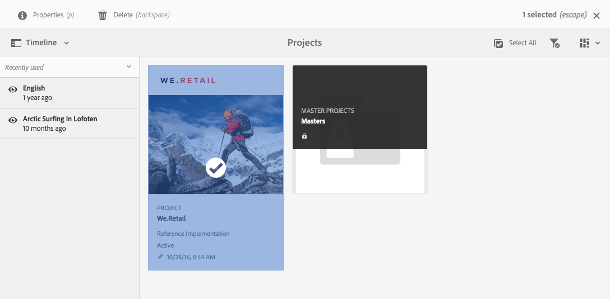
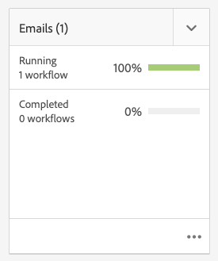

# Projetos {#projects}

Os projetos permitem agrupar recursos em uma entidade. Um ambiente comum e compartilhado facilita o gerenciamento de projetos. Os tipos de recursos que podem ser associados a um projeto são chamados no AEM de Blocos. Blocos podem incluir informações do projeto e da equipe, ativos, workflows e outros tipos de informações, conforme descrito detalhadamente em [Blocos de projeto.](#project-tiles)

Como usuário, você pode:

* Criar e excluir projetos
* Associar pastas de conteúdo e ativos a um projeto
* Remover links de conteúdo de projetos

## Requisitos de acesso {#access-requirements}

Projeta um recurso AEM padrão e não requer nenhuma configuração adicional.

No entanto, para que os usuários em projetos possam ver outros usuários/grupos enquanto usam Projetos, como ao criar projetos, criar tarefas/fluxos de trabalho ou exibir e gerenciar a equipe, eles precisam ter acesso de leitura a `/home/users` e `/home/groups`.

A maneira mais fácil de fazer isso é dar a **projetos-usuários** acesso de leitura do grupo a `/home/users` e `/home/groups`.

## Console de projetos {#projects-console}

O console de projetos é onde você acessa e gerencia os projetos no AEM.

O console de Projetos é semelhante a outros consoles no AEM, permite várias ações em projetos individuais e ajusta a visualização dos projetos.

### Alternar o modo {#modes}

Você pode usar o seletor de painéis para alterar entre modos de console.

#### Somente conteúdo {#content-only}

Somente conteúdo é o modo padrão ao abrir o console. Ele mostrará todos os seus projetos.

#### Linha do tempo {#timeline}

A exibição da linha do tempo permite selecionar um projeto individual e exibir a atividade nele. Usar o seletor do painel ou a tecla de atalho `alt+1` para alterar para esta exibição.

### Alternar a exibição {#views}

Você pode usar o seletor de exibições para alterar a exibição de projetos como blocos grandes (o padrão), para exibi-los como uma lista ou em um calendário.

### Filtrar sua visualização {#filter}

Você pode usar o filtro para alternar entre todos os projetos e somente aqueles que estão ativos.

### Seleção e visualização de projetos {#selecting}

Selecione um projeto, passando o mouse sobre o bloco do projeto e clicando na marca de seleção.

Exibir os detalhes de um projeto clicando nele para detalhar seus detalhes.

### Criação de novos projetos {#creating}

Clique em **Criar** para adicionar um novo projeto.

## Blocos do projeto {#project-tiles}

Os projetos são compostos de diferentes tipos de informações que você deseja gerenciar em conjunto. Essas informações são representadas por diferentes **Ladrilhos**.

Você pode ter os seguintes mosaicos associados ao seu projeto.

* [Assets](#assets)
* [Coleções de ativos](#asset-collections)
* [Experiências](#experiences)
* [Links](#links)
* [Informações do projeto](#project-info)
* [Equipe](#team)
* [Página de destino](#landing-pages)
* [Emails](#emails)
* [Fluxos de trabalhos](#workflows)
* [Lançamentos](#launches)
* [Tarefas](#tasks)

Clique no menu suspenso na parte superior direita de qualquer bloco para adicionar mais dados a ele.

Clique no botão de reticências na parte inferior direita de qualquer bloco para abrir os dados do bloco no console associado.

### Ativos {#assets}

No bloco **Ativos**, é possível coletar todos os ativos que você usa para um projeto específico.

Você faz upload de ativos diretamente no bloco.

### Coleções de ativos {#asset-collections}

Semelhante aos ativos, você pode adicionar [Coleções de ativos](/help/assets/manage-collections.md) diretamente ao seu projeto. As coleções são definidas em Ativos.

Adicione uma coleção ao clicar em **Adicionar coleção** e selecionar a coleção apropriada na lista.

### Experiências {#experiences}

A variável **Experiências** o bloco permite adicionar um aplicativo móvel, site ou publicação ao projeto.

Os ícones indicam que tipo de experiência é representada.

* Site da Web
* Aplicativo móvel

### Links {#links}

A variável **Links** o bloco permite associar links externos ao projeto.

É possível nomear o link com um nome fácil de reconhecer, além de alterar a miniatura.

### Informações do projeto {#project-info}

A variável **Informações do Projeto** o bloco fornece informações gerais sobre o projeto, incluindo uma descrição, o status do projeto (inativo ou ativo), uma data de vencimento e os membros. Além disso, você pode adicionar uma miniatura do projeto, exibida na página de Projetos principal.

### Tarefa de tradução {#translation-job}

A variável **Tarefa de tradução** o bloco é onde você inicia uma tradução e também onde você vê o status das suas traduções.

Para configurar a tradução, consulte o documento [Criação de projetos de tradução.](/help/assets/translation-projects.md)

### Equipe {#team}

Neste bloco, é possível especificar os membros da equipe do projeto. Ao editar, você pode inserir o nome do membro da equipe e atribuir a função de usuário.

É possível adicionar e excluir membros da equipe. Além disso, você pode editar a [função de usuário](#userroles) atribuída ao membro da equipe.

### Página de destino {#landing-pages}

A variável **Landing Pages** O bloco permite solicitar uma nova página de aterrissagem.

Esse workflow é descrito no documento[Crie um fluxo de trabalho de landing page.](/help/sites-authoring/projects-with-workflows.md#request-landing-page-workflow)

### Emails {#emails}

A variável **Emails** O bloco ajuda a gerenciar solicitações de email. Ele inicia o **Solicitação de email** fluxo de trabalho.

Mais informações estão descritas na seção [Solicitar fluxo de trabalho de email.](/help/sites-authoring/projects-with-workflows.md#request-email-workflow)

### Fluxos de trabalhos {#workflows}

Você pode iniciar fluxos de trabalho para seu projeto. Se algum workflow estiver em execução, seu status será exibido no **Fluxos de trabalho** bloco.

Dependendo do projeto criado, há fluxos de trabalho diferentes disponíveis.

Elas são descritas em [Trabalhar com fluxos de trabalho de projeto.](/help/sites-authoring/projects-with-workflows.md)

### Lançamentos {#launches}

A variável **Lançamentos** O bloco mostra todas as inicializações solicitadas com um [Solicitar fluxo de trabalho do Launch.](/help/sites-authoring/projects-with-workflows.md)

### Tarefas {#tasks}

O bloco Tarefas permite monitorar o status de qualquer tarefa relacionada ao projeto, incluindo fluxos de trabalho. As tarefas são abordadas em detalhes em [Trabalhar com tarefas](/help/sites-authoring/task-content.md).

## Modelos de projeto {#project-templates}

Os modelos servem como base para iniciar o projeto. O AEM fornece esses modelos de projeto padrão.

* **Projeto de mídia** - Este é um projeto de amostra de referência para atividades de mídia. Ele inclui várias funções de projeto relacionadas à mídia e também fluxos de trabalho relacionados ao conteúdo de mídia.
* **[Projeto de sessão de fotos do produto](/help/sites-authoring/managing-product-information.md)** - Esta é uma amostra de referência para o gerenciamento de fotografias de produtos relacionadas a comércio eletrônico.
* **[Projeto de tradução](/help/sites-administering/translation.md)** - Esta é uma amostra de referência para o gerenciamento de atividades relacionadas a tradução. Ele inclui funções básicas e fluxos de trabalho para gerenciar a tradução.
* **Projeto simples** - Esta é uma amostra de referência para qualquer projeto que não se encaixe em outras categorias. Ele inclui três funções básicas e quatro fluxos de trabalho gerais de AEM.

Com base no modelo selecionado, você tem opções diferentes disponíveis no projeto, como as funções de usuário e os fluxos de trabalho fornecidos.

## Funções de usuário em um projeto {#user-roles-in-a-project}

As diferentes funções de usuário são definidas no modelo de projeto e são usadas por dois motivos principais:

1. Permissões: as funções do usuário se encaixam em uma das três categorias listadas: observador, editor, proprietário. Por exemplo, um fotógrafo ou redator terá os mesmos privilégios de um editor. As permissões determinam o que um usuário pode fazer com o conteúdo de um projeto.
1. Fluxos de trabalho: os fluxos de trabalho determinam quem recebe as tarefas em um projeto. As tarefas podem ser associadas a uma função de projeto. Por exemplo, uma tarefa pode ser atribuída a fotógrafos para que todos os membros da equipe com a função de fotógrafo recebam a tarefa.

Todos os projetos oferecem suporte às seguintes funções padrão para permitir que você administre permissões de segurança e controle.

| Função | Descrição | Permissões | Associação de Grupo |
|---|---|---|---|
| Observador | Um usuário nesta função pode visualizar detalhes do projeto, incluindo o status. | Permissões somente leitura em um projeto | `workflow-users` grupo |
| Editor | Um usuário nesta função pode fazer upload e editar o conteúdo de um projeto. | Acesso de leitura e gravação em um projeto, metadados associados e ativos relacionados Privilégios para fazer upload de uma lista de captura, sessão de fotos e revisar e aprovar ativos Permissão de gravação em `/etc/commerce` Modificar permissões em um projeto específico | `workflow-users` grupo |
| Proprietário | Um usuário com essa função pode criar um projeto, iniciar um trabalho em um projeto e mover ativos aprovados para a pasta de produção. Todas as outras tarefas no projeto também podem ser visualizadas e executadas pelo proprietário. | Permissão de gravação em `/etc/commerce` | `dam-users` grupo para poder criar um projeto `projects-administrators` para poder criar um projeto e mover ativos |

Para projetos criativos, também são fornecidas funções adicionais, como fotógrafos. Você pode usar essas funções para derivar funções personalizadas para um projeto específico.

### Criação automática de grupo {#auto-group-creation}

Ao criar o projeto e adicionar usuários às várias funções, os grupos associados ao projeto são criados automaticamente para gerenciar as permissões associadas.

Por exemplo, um projeto chamado Myproject teria três grupos **Proprietários do Myproject**, **Editores do Myproject**, **Observadores do Myproject**.

Se o projeto for excluído, esses grupos só serão excluídos se você selecionar a opção apropriada [ao excluir o projeto.](/help/sites-authoring/touch-ui-managing-projects.md#deleting-a-project) Um administrador também pode excluir manualmente os grupos em **Ferramentas** > **Segurança** > **Grupos**.

## Recursos adicionais {#additional-resources}

Para obter mais detalhes sobre o uso de projetos, consulte os seguintes documentos adicionais:

* [Gerenciamento de projetos](/help/sites-authoring/touch-ui-managing-projects.md)
* [Trabalhar com tarefas](/help/sites-authoring/task-content.md)
* [Trabalhar com fluxos de trabalho de projeto](/help/sites-authoring/projects-with-workflows.md)
* [Integração do Creative Project e do PIM](/help/sites-authoring/managing-product-information.md)
