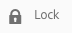

# Guia rápido para a criação de páginas{#quick-guide-to-authoring-pages}

Esses procedimentos servem como um guia rápido (de alto nível) para as ações principais de criação de conteúdo no AEM.

Eles:

* Não são destinados a uma abordagem ampla.
* Fornecem links para a documentação detalhada.

Para obter os detalhes completos sobre a criação com o AEM, consulte:

* [Primeiros passos para autores](/help/sites-authoring/first-steps.md)
* [Criar páginas](/help/sites-authoring/page-authoring.md)

## Algumas dicas rápidas {#a-few-quick-hints}

Antes de fornecer a visão geral das especificações, veja uma pequena coleção de dicas gerais que vale a pena ter em mente.

### Console de sites {#sites-console}

* **Criar**

   * Este botão está disponível em vários consoles, as opções apresentadas são sensíveis ao contexto, por isso podem variar de acordo com o cenário.

* Reorganização de páginas em uma pasta

   * Isso pode ser feito na [Exibição de lista](/help/sites-authoring/basic-handling.md#list-view). As alterações serão aplicadas e estarão visíveis em outras exibições.

#### Criação de página {#page-authoring}

* Links de navegação

   * ***Os links não estão disponíveis para navegação*** quando você estiver no modo de **Edição**. Para navegar pelos links, é necessário [Visualizar a página](/help/sites-authoring/editing-content.md#previewing-pages) usando:

      * [Modo de visualização](/help/sites-authoring/editing-content.md#preview-mode)
      * [Exibir como publicado](/help/sites-authoring/editing-content.md#view-as-published)

* As versões não são iniciadas/criadas pelo editor de página; agora isso é feito no console Sites (por meio da opção **Criar** ou da [Linha do Tempo](/help/sites-authoring/basic-handling.md#timeline) de um recurso selecionado).

>[!NOTE]
>
>Há vários atalhos do teclado que podem facilitar a experiência de criação.
>
>* [Atalhos de teclado ao editar páginas](/help/sites-authoring/page-authoring-keyboard-shortcuts.md)
>* [Atalhos de teclado para Consoles](/help/sites-authoring/keyboard-shortcuts.md)

>

### Encontrar a sua página {#finding-your-page}

Há vários aspectos para localizar uma página; você pode navegar e/ou pesquisar:

1. Abra o console **Sites** (usando a opção **Sites** na [Navegação global](/help/sites-authoring/basic-handling.md#global-navigation) - isso é acionado (menu suspenso) ao selecionar o link do Adobe Experience Manager (parte superior esquerda).

1. Navegue para baixo na árvore, tocando/clicando na página apropriada. A forma como os recursos da página são apresentados depende da exibição usada ([Cartão, Lista ou Coluna](/help/sites-authoring/basic-handling.md#viewing-and-selecting-resources)):

   

1. Navegue até a árvore usando a [ navegação estrutural do cabeçalho](/help/sites-authoring/basic-handling.md#theheaderwithbreadcrumbs), o que permite retornar ao local selecionado:

   

1. Você também pode [Pesquisar](/help/sites-authoring/search.md) por uma página. Selecione sua página nos resultados mostrados.

   

### Criar uma nova página {#creating-a-new-page}

Para [criar uma nova página](/help/sites-authoring/managing-pages.md#creating-a-new-page):

1. [Navegue até o local onde deseja criar a nova página.](#finding-your-page)
1. Use o ícone **Criar** e selecione **Página** na lista:

   

1. Isso abrirá o assistente que vai guiá-lo na coleta das informações necessárias ao [criar sua nova página](/help/sites-authoring/managing-pages.md#creating-a-new-page). Siga as instruções na tela.

### Selecionar sua página para mais ações   {#selecting-your-page-for-further-action}

Você pode selecionar uma página para executar ações. A seleção de uma página atualizará automaticamente a barra de ferramentas para que as ações pertinentes a esse recurso sejam mostradas.

A forma de selecionar uma página dependerá da exibição usada no console:

1. Exibição de coluna:

   * Toque/clique na miniatura do recurso desejado - a miniatura será sobreposta com uma marca de verificação para mostrar que a opção foi selecionada.

1. Exibição de lista:

   * Toque/clique na miniatura do recurso desejado - a miniatura será sobreposta com uma marca de verificação para mostrar que a opção foi selecionada.

1. Exibição de cartão:

   * Entre no modo de seleção, [selecionando o recurso desejado](/help/sites-authoring/basic-handling.md#viewingandselectingyourresources) com:

      * Dispositivo móvel: tocar e segurar
      * Área de trabalho: a [ação rápida](/help/sites-authoring/basic-handling.md#quick-actions) - ícone de marca de verificação:

   

   * O cartão será sobreposto como uma marca de verificação para mostrar que a página foi selecionada.
   >[!NOTE]
   >
   >No modo de seleção, o ícone **Selecionar** (uma marca de verificação) será alterado para o ícone **Desmarcar** (uma marca de cruz).

### Ações rápidas (apenas a exibição de cartão/desktop) {#quick-actions-card-view-desktop-only}

As [ações rápidas](/help/sites-authoring/basic-handling.md#quick-actions) estão disponíveis:

1. [Navegue até a página](#finding-your-page) que deseja realizar a ação.
1. Passe o mouse sobre o cartão que representa o recurso desejado; as ações rápidas serão mostradas: 

   

### Editar o seu conteúdo da página {#editing-your-page-content}

Para editar sua página:

1. [Navegue até a página](#finding-your-page) que deseja editar.
1. [Abra a página para edição](/help/sites-authoring/managing-pages.md#opening-a-page-for-editing) usando o ícone Editar (lápis):

   

   Essa opção pode ser acessada com:

   * As [Ações rápidas (apenas a exibição de cartão/área de trabalho) ](#quick-actions-card-view-desktop-only) do recurso adequado.
   * A barra de ferramenta quando a sua [página é selecionada](#selectiingyourpageforfurtheraction).

1. Quando o editor for aberto, é possível:

   * [Adicionar um novo componente para a página](/help/sites-authoring/editing-content.md#inserting-a-component):

      * abrindo o painel lateral
      * selecionando a guia componentes (o [navegador de componentes](/help/sites-authoring/author-environment-tools.md#components-browser))
      * arrastando o componente desejado para a página.

      O painel lateral pode ser aberto (ou fechado) com:
   

   * [Edite o conteúdo de um componente existente](/help/sites-authoring/editing-content.md#edit-configure-copy-cut-delete-paste) na página:

      * Abra a barra de ferramentas do componente com um toque ou clique. Use o ícone **Editar** (lápis) para abrir a caixa de diálogo.
      * Abra o editor no local para o componente com a opção de tocar e segurar ou dê um clique duplo lento. As ações disponíveis serão exibidas (para alguns componentes isso será uma seleção limitada).
      * Para visualizar todas as ações disponíveis entre no modo de tela cheia usando:

   

   * [Configurar as propriedades de um componente existente](/help/sites-authoring/editing-content.md#component-edit-dialog)

      * Abra a barra de ferramentas do componente com um toque ou clique. Use o ícone **Configurar** (chave) para abrir a caixa de diálogo.
   * [Mover um componente](/help/sites-authoring/editing-content.md#moving-a-component):

      * Arraste o componente desejado para sua nova localização.
      * Abra a barra de ferramentas do componente com um toque ou clique. Use os ícones **Cortar** e **Colar** conforme necessário.
   * [Copiar (e Colar)](/help/sites-authoring/editing-content.md#edit-configure-copy-cut-delete-paste) um componente:

      * Abra a barra de ferramentas do componente com um toque ou clique. Use os ícones **Copiar** e **Colar** conforme necessário.
   >[!NOTE]
   >
   >Você pode **Colar** os componentes na mesma página ou em uma diferente. Ao colar em uma página diferente que já foi aberta antes da operação de cortar/copiar, essa página precisará de uma atualização. 

   * [Excluir](/help/sites-authoring/editing-content.md#edit-configure-copy-cut-delete-paste) um componente:

      * Abra a barra de ferramentas do componente com um toque ou clique, em seguida, use o ícone **Excluir**.
   * [Adicionar anotações](/help/sites-authoring/annotations.md#annotations) à página:

      * Selecione o modo **Anotar** (ícone de balão). Adicione anotações usando o ícone **Adicionar anotação** (mais). Saia do modo de anotação usando o X na parte superior direita.

   

   * [Visualizar uma página](/help/sites-authoring/editing-content.md#preview-mode) (para verificar como ela será exibida no ambiente de publicação)

      * Selecione **Visualização** na barra de ferramentas.
   * Retornar para o modo de edição (ou selecionar outro modo), usando o seletor suspenso **Editar**.

   >[!NOTE]
   >
   >Para navegar usando os links no conteúdo, você deve usar o [Modo de visualização](/help/sites-authoring/editing-content.md#preview-mode).

### Editar as propriedades da página    {#editing-the-page-properties}

Existem dois métodos (principais) [para editar as propriedades da página](/help/sites-authoring/editing-page-properties.md):

* No console **Sites**:

   1. [Navegue até a página](#finding-your-page) que deseja publicar.
   1. Selecione o ícone **Propriedade** por meio de:

      * As [Ações rápidas (apenas a exibição de cartão/área de trabalho) ](#quick-actions-card-view-desktop-only) do recurso adequado.
      * A barra de ferramenta quando a sua [página é selecionada](#selectiingyourpageforfurtheraction).

   

   1. As propriedades da página serão exibidas. É possível fazer atualizações conforme necessário, em seguida, usar a opção Salvar para continuar

* Ao [editar a sua página](#editing-your-page-content):

   1. Abra o menu **Informações da página**.
   1. Selecione **Abrir propriedades** para abrir a caixa de diálogo para editar as propriedades.

   

### Publicar sua página (ou desfazer a publicação) {#publishing-your-page-or-unpublishing}

Existem dois métodos principais [para publicar a sua página](/help/sites-authoring/publishing-pages.md) (e também de desfazer a publicação):

* No console **Sites**:

   1. [Navegue até a página](#finding-your-page) que deseja publicar.
   1. Selecione o ícone **Publicação rápida** por meio de:

      * As [Ações rápidas (apenas a exibição de cartão/área de trabalho) ](#quick-actions-card-view-desktop-only) do recurso adequado.
      * A barra de ferramentas quando a sua [página é selecionada](#selectiingyourpageforfurtheraction) (também fornece o acesso à opção [Publicar mais tarde](/help/sites-authoring/publishing-pages.md#main-pars-title-12)).

   

* Ao [editar a sua página](#editing-your-page-content):

   1. Abra o menu **Informações da página**.
   1. Selecione **Publicar página**. 

   

* Desfazer a publicação de uma página do console só pode ser feito por meio da opção **Gerenciar publicação**, que está disponível somente na barra de ferramentas (não pelas ações rápidas).

   A opção **Cancelar publicação da página** ainda está disponível por meio do menu **Informações da página** no editor.

   

   Consulte [Publicação de páginas](/help/sites-authoring/publishing-pages.md#unpublishing-pages) para obter mais informações.

### Mover, copiar e colar ou excluir sua página    {#move-copy-and-paste-or-delete-your-page}

Essas ações podem ser acionadas por:

1. [Navegue até a página](#finding-your-page) que deseja mover, copiar e colar ou excluir.
1. Selecione o ícone copiar (e colar), mover ou excluir, conforme necessário, usando:

   * As [Ações rápidas (apenas a exibição de cartão/área de trabalho) ](#quick-actions-card-view-desktop-only) do recurso desejado.
   * A barra de ferramenta quando a sua [página é selecionada](#selecting-your-page-for-further-action).

   Em seguida, depende da sua ação:

   * Copiar:

      * Em seguida, será necessário navegar até o novo local e colar.
   * Mover:

      * Isso abrirá o assistente para coletar as informações necessárias para mover a página. Siga as instruções na tela.
   * Exclua:

      * Você receberá uma solicitação para confirmar a ação.
   >[!NOTE]
   >
   >A opção Excluir não está disponível como uma Ação rápida.

### Bloquear sua página (em seguida, desbloquear) {#locking-your-page-then-unlocking}

[Bloquear uma página](/help/sites-authoring/editing-content.md#locking-a-page) impede que outros autores trabalhem nela enquanto você estiver trabalhando. O ícone/botão Bloquear (e Desbloquear) pode ser encontrado:

* A barra de ferramenta quando a sua [página é selecionada](#selecting-your-page-for-further-action).
* O [menu suspenso Informações da página](#editing-the-page-properties) ao editar uma página.
* A barra de ferramentas da página ao editar uma página (quando a página estiver bloqueada)

Por exemplo, o ícone de bloqueio tem a seguinte aparência:

### Acessar as referências da página {#accessing-page-references}

[O acesso rápido às referências ](/help/sites-authoring/author-environment-tools.md#references) para/de uma página estão disponíveis no Trilho de referências.

1. Selecione a **Referências** usando o ícone da barra de ferramentas (antes ou depois de [selecionar a página](#selecting-your-page-for-further-action)): 

   

   Uma lista de tipos de referência será exibida:

   

1. Toque/clique no tipo de referência desejado para mostrar mais detalhes e (conforme o caso) realizar novas ações.

### Criar uma versão da sua página    {#creating-a-version-of-your-page}

Para criar uma [versão](/help/sites-authoring/working-with-page-versions.md) da página:

1. Para abrir o painel Linha do tempo, selecione **[Linha do tempo](/help/sites-authoring/basic-handling.md#timeline)** usando o ícone da barra de ferramentas (antes ou depois de [selecionar a página](#selecting-your-page-for-further-action)): 

   

1. Toque/clique na seta para cima na parte inferior direita da coluna Linha do tempo para exibir os botões extras; incluindo **Salvar como versão**.

   

1. Selecione **Salvar como versão**, em seguida, **Criar**.

### Restaurar/comparar uma versão da sua página {#restoring-comparing-a-version-of-your-page}

O mesmo mecanismo básico é usado ao restaurar e/ou comparar as versões da sua página:

1. Selecione a **[Linha do tempo](/help/sites-authoring/basic-handling.md#timeline)** usando o ícone da barra de ferramentas (antes ou depois de [selecionar a página](#selecting-your-page-for-further-action)): 

   

   Se uma versão da sua página já foi salva, ela será listada na Linha do tempo.

1. Toque/clique na versão que você deseja restaurar - essa opção exibirá botões de ação adicionais:

   * **Reverter para essa versão**

      * A versão será restaurada.
   * **Mostrar diferenças**

      * A página será aberta com as diferenças (entre as duas versões) destacadas.
