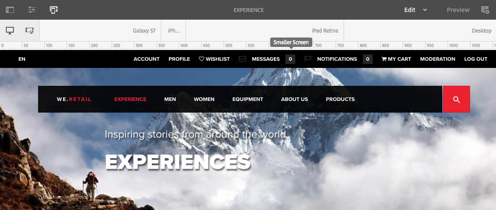
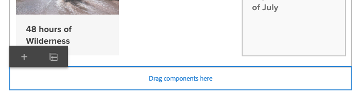

# Layout responsivo  {#responsive-layout}

O AEM permite ter um layout responsivo em suas páginas usando o componente **Contêiner de layout.**

Este componente fornece um sistema de parágrafo que permite posicionar os componentes dentro de uma grade responsiva. Esta grade pode reorganizar o layout de acordo com o dispositivo/tamanho e formato da janela. O componente é utilizado em conjunto com o modo de [**Layout**,](/help/sites-authoring/responsive-layout.md#defining-layouts-layout-mode) que permite criar e editar o seu layout responsivo dependendo do dispositivo.

O contêiner de layout:

* Fornece encaixe horizontal na grade, em conjunto com a capacidade de posicionar os componentes lado a lado na grade e definir quando devem se recolher/refluir.
* Usa pontos de interrupção predefinidos (por exemplo para smartphone, tablet etc.) para permitir que você defina o comportamento obrigatório do conteúdo para dispositivos/orientações relacionados.

   * Por exemplo, você pode personalizar o tamanho do componente ou se o componente pode ser visto em dispositivos específicos.

* Podem ser aninhados para permitir o controle da coluna.

O usuário pode então ver como o conteúdo será processado para dispositivos específicos, usando o emulador.

>[!CAUTION]
>
>Embora o componente do contêiner de layout esteja disponível na interface do usuário clássica, as suas funcionalidades estão disponíveis apenas na interface do usuário habilitada para toque.

O AEM permite um layout responsivo para suas páginas usando uma combinação de mecanismos:

* Componente [**Contêiner de layout**](#adding-a-layout-container-and-its-content-edit-mode)

   Este componente está disponível no [navegador de componentes](/help/sites-authoring/author-environment-tools.md#components-browser) e fornece um sistema de parágrafo de grade para que você possa adicionar e posicionar componentes em uma grade responsiva. Ele também pode ser definido como o sistema de parágrafos padrão na sua página.

* [**Modo de layout**](/help/sites-authoring/responsive-layout.md#defining-layouts-layout-mode)

   Depois que o contêiner de layout é posicionado na página, você pode usar o modo **Layout** para posicionar conteúdo na grade responsiva.

* [**Emulador**](#selecting-a-device-to-emulate)
Permite criar e editar sites responsivos que reorganizam o layout de acordo com o tamanho do dispositivo ou da janela, redimensionando componentes interativamente. O usuário pode observar como o conteúdo será renderizado utilizando o Emulador.

Com estes mecanismos de grade responsivos você pode:

* Usar pontos de interrupção para definir layouts de conteúdo diferentes com base na largura do dispositivo (relacionado ao tipo e à orientação do dispositivo).
* Usar os mesmos pontos de interrupção e layouts de conteúdo para certificar-se de que o conteúdo responde ao tamanho da janela do navegador no desktop.
* Usar o alinhamento com a grade para permitir colocar componentes na grade, redimensionar como necessário e definir quando devem ser recolhidos/refluir para ficarem lado a lado ou acima/abaixo.
* Ocultar componentes de layouts específicos de dispositivos.
* Executar o controle da coluna.

Dependendo do projeto, o Contêiner de layout pode ser usado como o sistema de parágrafo padrão para suas páginas, ou como um componente disponível para ser adicionado à sua página por meio do navegador componente (ou ambos).

>[!NOTE]
>
>A Adobe fornece uma [documentação de GitHub](https://adobe-marketing-cloud.github.io/aem-responsivegrid/) do layout responsivo como uma referência que pode ser fornecida para desenvolvedores front-end permitindo que usem a grade do AEM fora do AEM, por exemplo, ao criar modelos HTML estáticos para um site futuro do AEM.

>[!NOTE]
>
>O uso dos mecanismos acima é habilitado pela configuração no modelo. Consulte [Configurando o layout responsivo](/help/sites-administering/configuring-responsive-layout.md) para obter mais informações.

## Definições de layout, emulação de dispositivo e pontos de interrupção {#layout-definitions-device-emulation-and-breakpoints}

Ao criar o conteúdo do seu site, você quer garantir que o conteúdo seja exibido apropriadamente no dispositivo usado para exibi-lo.

O AEM permite que você defina layouts dependendo da largura do dispositivo:

* O emulador permite que você emule esses layouts em vários dispositivos. Além do tipo de dispositivo, a orientação, selecionada pela opção **Girar dispositivo**, pode afetar o ponto de interrupção selecionado à medida que a largura muda.
* Os pontos de interrupção são pontos que separam as definições de layout.

   * Eles definem efetivamente a largura máxima (em pixels) de qualquer dispositivo com um layout específico.
   * Normalmente, os pontos de interrupção são válidos para alguns dispositivos, dependendo da largura das telas.
   * O alcance do ponto de interrupção se estende da esquerda até o próximo ponto de interrupção.
   * Não é possível selecionar um ponto de interrupção específico, pois o ponto de interrupção apropriado é selecionado quando você seleciona um dispositivo e uma orientação.

O dispositivo **Desktop** sem uma largura específica e que está relacionado ao ponto de interrupção padrão (isto é, todos os itens acima do último ponto de interrupção configurado).

>[!NOTE]
>
>Seria possível definir pontos de interrupção para cada dispositivo individual, mas isso aumentaria consideravelmente o trabalho necessário para a definição e a manutenção do layout.

Ao usar o emulador, é possível selecionar um dispositivo específico para emulação e definição de layout, sendo que o ponto de interrupção também será selecionado. Quaisquer alterações de layout efetuadas serão aplicáveis a outros dispositivos em que o ponto de interrupção se aplica, isto é, quaisquer dispositivos posicionados à esquerda do marcador do ponto de interrupção ativo, mas antes do próximo marcador do ponto de interrupção.

Por exemplo, com a seleção do dispositivo **iPhone 6 Plus** (definido com largura de 540 pixels) para emulação e layout, o ponto de interrupção **Celular** (definido como 768 pixels) também será ativado. Quaisquer mudanças de layout efetuadas para o **iPhone 6** serão aplicáveis a outros dispositivos no ponto de interrupção **Celulares**, como o **iPhone 5** (definido como 320 pixels).

## Selecionar um dispositivo para emular {#selecting-a-device-to-emulate}

1. Abra a página para edição. Por exemplo:

   `http://localhost:4502/editor.html/content/we-retail/us/en/experience.html`

1. Selecione o ícone **Emulador** na barra de ferramentas superior:

   

1. A barra de ferramentas do emulador abre.

   

   A barra de ferramentas do emulador exibe opções adicionais de layout:

   * **Girar dispositivo** - permite que você gire um dispositivo de orientação vertical (retrato) para a orientação horizontal (paisagem) e vice-versa.

    

   * **Selecionar dispositivo** - defina um dispositivo específico para emular de uma lista (consulte a próxima etapa para obter detalhes)

   

1. Para selecionar um dispositivo específico a fim de emulá-lo, é possível:

   * Use o ícone Selecionar dispositivo e selecione em um seletor suspenso.
   * Toque/clique no indicador do dispositivo na barra de ferramentas do emulador.

   

1. Depois que um dispositivo específico é selecionado, você pode: 

   * Visualizar o marcador ativo do dispositivo selecionado, como **iPad.**
   * Visualizar o marcador ativo do [ponto de interrupção apropriado](/help/sites-authoring/responsive-layout.md#layout-definitions-device-emulation-and-breakpoints) como **Tablet.**

   

   * A linha pontilhada azul representa a *dobra* referente ao dispositivo selecionado (aqui, um **iPhone 6**).

   

   * A dobra também pode ser considerada a linha de quebra de página (não confundir com [pontos de interrupção ](/help/sites-authoring/responsive-layout.md#layout-definitions-device-emulation-and-breakpoints)) para o conteúdo. Isso é exibido para praticidade em mostrar que parte do conteúdo será vista pelo usuário no dispositivo antes da rolagem de página.
   * A linha para a dobra não será exibida se a altura do dispositivo que está sendo emulado for maior do que o tamanho da tela.
   * A dobra é mostrada para a conveniência do autor e não é mostrada na página publicada.

## Adicionar um contêiner de layout e seu conteúdo (Modo de edição) {#adding-a-layout-container-and-its-content-edit-mode}

Um **Contêiner de layout** é um sistema de parágrafos que:

* Contém outros componentes.
* Define o layout.
* Responde às alterações.

>[!NOTE]
>
>Se ainda não estiver disponível, o **Contêiner de layout** deve ser ativado [explicitamente em um sistema/página de parágrafos](/help/sites-administering/configuring-responsive-layout.md) (por exemplo, quando você usar [**o modo** Design](/help/sites-authoring/default-components-designmode.md)).

1. O **Contêiner de layout** está disponível como um componente padrão no [Navegador de componentes](/help/sites-authoring/author-environment-tools.md#components-browser). Aqui, você pode arrastá-lo até o local desejado na página, onde verá o espaço reservado **Arrastar componentes aqui**.
1. Em seguida, você pode adicionar componentes ao contêiner de layout. Esses componentes contêm o conteúdo real:

   

## Selecionar e executar ações em um contêiner de layout (modo Editar) {#selecting-and-taking-action-on-a-layout-container-edit-mode}

Assim como em outros componentes, você pode selecionar e executar ações (recortar, copiar ou excluir) em um Contêiner de layout (no modo **Editar**):

>[!CAUTION]
>
>Como o contêiner de layout é um sistema de parágrafos, com a exclusão do componente a grade do layout e todos os componentes (e seu conteúdo) no contêiner são excluídos.

1. Se você tocar ou passar o mouse sobre o espaço reservado da grade, o menu de ação será exibido.

   

   É preciso selecionar a opção **Pai**.

   

1. Se o componente de layout estiver aninhado, selecionar a opção **Pai** apresenta uma seleção suspensa, que permite que você selecione o contêiner aninhado do layout ou seus pais.

   Quando você passa o mouse sobre os nomes de contêiner na lista suspensa, os contornos correspondentes serão exibidos na página.

   * O menor contêiner aninhado do layout será contornado em preto.
   * O segundo menor contêiner aninhado do layout estará em um cinza escuro.
   * Cada contêiner sucessivo será destacado por uma sombra mais clara de cinza.

   

1. Essa ação destacará a grade inteira e seu conteúdo. A barra de ferramentas da ação será exibida e aqui você pode selecionar uma ação, como **Excluir.**

   

## Definição de layouts (modo Layout) {#defining-layouts-layout-mode}

>[!NOTE]
>
>Você pode definir um layout separado para cada [ponto de interrupção](#layout-definitions-device-emulation-and-breakpoints) (como determinado pelo tipo e pela orientação do dispositivo emulado).

Para configurar o layout de uma grade responsiva implementada com o Contêiner de layout, use o modo **Layout**.

O modo **Layout** pode ser iniciado de duas maneiras.

* Ao usar o [modo de menu na barra de ferramentas](/help/sites-authoring/author-environment-tools.md#page-modes) e escolher o modo **Layout**

   * Selecione o modo **Layout** da mesma maneira que você alternaria para o modo de **Edição** ou o modo de **Segmentação**.
   * O modo **Layout** permanece persistente e você não sai do modo **Layout** até que você selecione outro modo por meio do seletor de modo.

* Ao [editar um componente individual.](/help/sites-authoring/editing-content.md#edit-component-layout)

   * Ao usar a opção **Layout** no menu de ações rápidas do componente, é possível alternar para o modo **Layout**.
   * O modo **Layout** é mantido ao editar o componente e é revertido para o modo de **Edição** quando o foco muda para outro componente.

No modo de layout, é possível executar várias ações em uma grade:

* Redimensione os componentes do conteúdo usando os pontos azuis. O redimensionamento sempre se ajusta à grade. A grade do fundo será exibida quando você redimensionar para auxiliar no alinhamento:

   

   >[!NOTE]
   >
   >As proporções e as taxas são mantidas quando os componentes como **Imagens** são redimensionados.

* Clique/toque em um componente de conteúdo, a barra de ferramenta permite que você:

   * **Pai**

      Permite que você selecione o componente de container de layout inteiro para executar ações em todo o processo.

   * **Flutuar até a nova linha**

      O componente será movido para uma nova linha, dependendo do espaço disponível na grade.

   * **Ocultar componente**

      O componente ficará invisível (pode ser restaurado da barra de ferramentas do container de layout).
   

* No modo **Layout**, você pode tocar/clicar em **Arrastar componentes aqui** para selecionar o componente inteiro. Isso mostrará a barra de ferramentas para este modo.

   A barra de ferramentas tem opções diferentes, dependendo do status do componente de layout e componentes que pertencem a ela. Por exemplo:

   * **Pai** - seleciona o componente do pai.

   

   * **Mostrar componentes**  ocultos - revelar todos os componentes ou os individuais. O número indica quantos componentes ocultos existem atualmente.o contador mostra quantos componentes estão ocultos.

   

   * **Reverter layout do ponto de interrupção** - reverte para o layout padrão. Ou seja, nenhum layout personalizado será imposto.

   

   * **Flutuar para uma nova linha** - move o componente uma posição acima, se o espaço permitir.

   

   * **Ocultar componente** - oculta o componente atual.

   

   >[!NOTE]
   >
   >No exemplo acima, as ações flutuar e ocultar estão disponíveis porque este Contêiner de layout está aninhado em um Contêiner de layout pai.

   * **Mostrar**
componentesSelecione os componentes principais para mostrar a barra de ferramentas de ação com o 
**Mostrar** opção de componentes ocultos. Neste exemplo, dois componentes estão ocultos.
   

   Selecionar a opção **Mostrar componentes ocultos** exibirá em azul os componentes que estão ocultos no momento em suas posições originais.

   

   Selecionar **Restaurar tudo** revelará todos os componentes ocultos.

