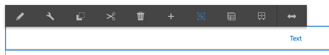

# Uso do Editor de rich text para criar conteúdo {#use-rich-text-editor-to-author-content}

O Editor de Rich Text (RTE) é um elemento básico fundamental para inserir conteúdo textual no AEM. É a base de vários componentes, incluindo:

* Texto
* Imagem de texto
* Tabela

## Edição no local {#in-place-editing}

Selecionar um componente baseado em texto com um único toque ou clique revelará a [barra de ferramentas de componentes](/help/sites-authoring/editing-content.md#edit-configure-copy-cut-delete-paste) como com qualquer componente.

Tocar/clicar mais uma vez, ou selecionar inicialmente o componente com um toque/clique duplo lento abrirá a edição no local, que possui sua própria barra de ferramentas. Aqui, você pode editar o conteúdo e efetuar alterações básicas na formatação.

Essa barra de ferramentas fornece as seguintes opções:

* **Formato**: permite que você defina Negrito, Itálico e Sublinhado.
* **Listas**: com este recurso, você pode criar listas com marcadores ou numeradas, ou definir o recuo.
* **Hiperlink**
* **Desvincular**
* **Tela cheia**
* **Fechar**
* **Salvar**

## Edição em tela cheia {#full-screen-editing}

Para componentes baseados em texto, toque no modo de tela cheia na barra de ferramentas  abre o editor de rich text e oculta o restante do conteúdo da página.

O modo de tela cheia exibe todas as opções configuradas que podem ser usadas para criação. A disponibilidade é opções [depende da configuração](/help/sites-administering/rich-text-editor.md).

Outras opções do editor de Rich Text incluem:

* **Âncora**: crie uma âncora no texto para a qual você poderá mais tarde vincular ou fazer referência.
* **Alinhar texto à esquerda**
* **Centralizar texto**
* **Alinhar texto à direita**

Feche o modo de tela cheia clicando no ícone Minimizar.

>[!NOTE]
>
>Copiar listas aninhadas do Microsoft Word para o RTE pode gerar resultados inconsistentes e exigir ajuste manual após colar o texto no RTE.
