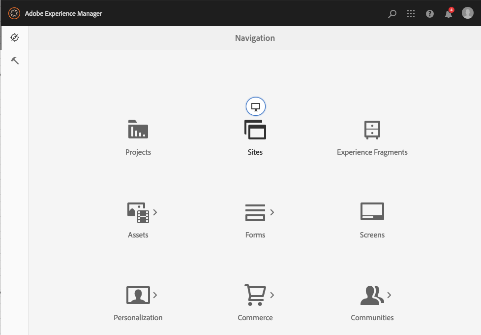

# Selecionar sua interface do usuário{#selecting-your-ui}

Embora a interface habilitada para toque seja agora a interface padrão e a paridade de recursos tenha sido praticamente atingida com a administração e a edição dos sites, podem haver situações em que o usuário deseja alternar para a [interface clássica](/help/sites-classic-ui-authoring/classicui.md). Há várias opções para fazer isso.

>[!NOTE]
>
>Para obter detalhes sobre o status da paridade de recursos com a IU clássica, consulte o documento [Paridade de recursos da interface de usuário de toque](/help/release-notes/touch-ui-features-status.md).

Há vários locais em que você pode definir qual interface de usuário deve ser usada:

* [Configuração da interface de usuário padrão para a sua instância](#configuring-the-default-ui-for-your-instance) Isso definirá a interface de usuário padrão a ser exibida no login do usuário, embora o usuário possa substituí-la e selecionar uma interface de usuário diferente para a sua conta ou sessão atual.

* [Definir a interface de criação clássica para a sua conta](/help/sites-authoring/select-ui.md#setting-classic-ui-authoring-for-your-account) Isso definirá a interface a ser usada por padrão ao editar páginas, embora o usuário possa substituir esta configuração e selecionar uma interface diferente pra sua conta ou sessão atual.

* [Na alternância da sessão atual para a interface clássica](#switching-to-classic-ui-for-the-current-session)
Essa opção altera a sessão atual para a interface clássica.

* No caso da [criação de página, o sistema faz certas substituições em relação à interface](#ui-overrides-for-the-editor).

>[!CAUTION]
>
>Várias opções para alternar para a interface do usuário clássica não estão disponíveis imediatamente, elas devem ser configuradas especificamente para sua instância.
>
>Consulte [Ativando o acesso à interface clássica](/help/sites-administering/enable-classic-ui.md) para obter mais informações.

>[!NOTE]
>
>As instâncias atualizadas de uma versão anterior manterão a interface clássica para a criação de página.
>
>Após a atualização, a criação de página não será alternada automaticamente para a interface habilitada para toque, mas você pode configurá-la usando a [configuração OSGi](/help/sites-deploying/configuring-osgi.md) do **Serviço de modo de interface de criação do WCM** ( `AuthoringUIMode` serviço). Consulte [Substituições da interface do usuário para o Editor](#ui-overrides-for-the-editor).

## Configuração da interface de usuário padrão para a sua instância {#configuring-the-default-ui-for-your-instance}

Um administrador do sistema pode configurar a interface do usuário que é vista na inicialização e logon usando um [Mapeamento de raiz](/help/sites-deploying/osgi-configuration-settings.md#daycqrootmapping).

Isso pode ser substituído pelos padrões do usuário ou configurações de sessão.

## Definir a interface de criação clássica para a sua conta {#setting-classic-ui-authoring-for-your-account}

Cada usuário pode acessar suas [preferências de usuário](/help/sites-authoring/user-properties.md#userpreferences) para definir se desejam usar a interface clássica para a criação de página (em vez da interface padrão).

Isso pode ser substituído pelas configurações de sessão.

## Alternando para interface clássica para a sessão atual  {#switching-to-classic-ui-for-the-current-session}

Usando a interface habilitada para toque, os usuários de desktop podem querer reverter para a interface clássica (somente desktop). Há vários métodos de alternar para a interface de usuário clássica na sessão atual:

* **Links de navegação**

   >[!CAUTION]
   >
   >Essa opção para alternar para a interface do usuário clássica não estão disponíveis imediatamente, elas devem ser configuradas especificamente para sua instância.
   >
   >
   >Consulte [Ativando o acesso à interface clássica](/help/sites-administering/enable-classic-ui.md) para obter mais informações.

   Se isso for habilitado, será exibido um ícone (símbolo de monitor) sempre que você passar o mouse sobre um console aplicável. Tocar/clicar nesse link abrirá a localização apropriada na UI clássica.

   Por exemplo, os links dos **Sites** para **siteadmin**: 

   

* **URL**

   A interface clássica pode ser acessada usando o URL da tela de boas-vindas em `welcome.html`. Por exemplo:

   `https://localhost:4502/welcome.html`

   >[!NOTE]
   >
   >A interface habilitada para toque pode ser acessada via `sites.html`. Por exemplo:
   >
   >
   >`https://localhost:4502/sites.html`

### Alternando para interface clássica ao editar uma página {#switching-to-classic-ui-when-editing-a-page}

>[!CAUTION]
>
>Essa opção para alternar para a interface do usuário clássica não estão disponíveis imediatamente, elas devem ser configuradas especificamente para sua instância.
>
>Consulte [Ativando o acesso à interface clássica](/help/sites-administering/enable-classic-ui.md) para obter mais informações.

Se habilitada, a opção **Abrir a interface do usuário clássica** estará disponível na caixa de diálogo **Informações da página**:

### UI Overrides for the Editor {#ui-overrides-for-the-editor}

As configurações definidas por um usuário ou administrador de sistema podem ser substituídas pelo sistema, em caso de criação de página.

* Durante a criação de páginas:

   * O uso do editor clássico é forçado ao acessar a página usando `cf#` no URL. Por exemplo:
      `https://localhost:4502/cf#/content/geometrixx/en/products/triangle.html`

   * O uso do editor habilitado para toque é forçado ao usar `/editor.html` no URL ou ao usar um dispositivo de toque. Por exemplo:
      `https://localhost:4502/editor.html/content/geometrixx/en/products/triangle.html`

* Qualquer ação forçada é temporária e válida somente para a sessão do navegador

   * Um conjunto de cookies será definido dependendo se o recurso ativado por toque ( `editor.html`) ou clássico ( `cf#`) for usado.

* Ao abrir as páginas com o `siteadmin`, serão feitas verificações relacionadas à existência de:

   * Um cookie
   * Uma preferência de usuário
   * Se nenhum dos dois existir, as definições feitas na [configuração OSCi](/help/sites-deploying/configuring-osgi.md) do **Serviço de modo da interface de criação do WCM** (`AuthoringUIMode`serviço do ) ) serão o padrão.

>[!NOTE]
>
>Caso [um usuário já tenha definido uma preferência para a criação de página](#settingthedefaultauthoringuiforyouraccount), isso não será substituído pela alteração da propriedade do OSGi.

>[!CAUTION]
>
>Devido ao uso de cookies, conforme já discutido, nenhuma das ações abaixo é recomendável:
>
>* Editar manualmente o URL - Um URL não padrão pode resultar em uma situação desconhecida e em falta de funcionalidade.
>* Ter ambos os editores abertos ao mesmo tempo - Por exemplo, em janelas separadas.

