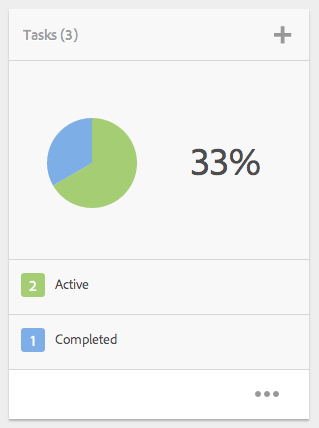

# Trabalhar com tarefas{#working-with-tasks}

Tarefas representam itens de trabalho a serem realizados no conteúdo. Quando você recebe uma tarefa, ela aparece na sua Caixa de entrada de fluxos de trabalho. Itens de tarefa têm um valor de tarefa na coluna Tipo.

Tarefas também são usadas em projetos para determinar o nível de integridade das tarefas atuais, incluindo tarefas de fluxo de trabalho.

## Rastrear o andamento do projeto {#tracking-project-progress}

É possível monitorar o andamento do projeto por meio da análise de tarefas ativas/concluídas dentro de um projeto representado pelo mosaico de **Tarefas**. O andamento do projeto pode ser determinado por:

* **Bloco de tarefas:** um progresso geral do projeto é representado no Bloco de tarefas disponível na página Detalhes do projeto.

* **Lista de tarefas:** ao clicar no bloco Tarefa, uma lista de tarefas é exibida. Essa lista contém informações detalhadas sobre todas as tarefas relacionadas ao projeto.

Ambos listam as tarefas do fluxo de trabalho e as tarefas criadas diretamente no Mosaico de **tarefas**.

### Mosaico de tarefas  {#task-tile}

Se um projeto estiver relacionado a alguma tarefa, um Mosaico de tarefas será exibido dentro do projeto. O Mosaico de tarefas mostra o status atual do projeto. Isso é baseado nas tarefas existentes dentro do fluxo de trabalho e não inclui tarefas que serão geradas no futuro, conforme o fluxo de trabalho progride. As informações a seguir estão visíveis no mosaico de tarefas:

* Porcentagem de tarefas concluídas
* Porcentagem de tarefas ativas
* Porcentagem de tarefas vencidas

### Visualizar ou modificar as tarefas de um projeto {#viewing-or-modifying-the-tasks-in-a-project}

Além de monitorar o andamento, é possível ver mais informações sobre o projeto ou modificá-lo.

#### Lista de tarefas  {#task-list}

Clique nas reticências (...) no Mosaico de tarefas para exibir a lista de tarefas relacionadas ao projeto. As tarefas são divididas por fluxos de trabalho principais. Os detalhes da tarefa são exibidos, juntamente com os metadados, como prazo, responsável, prioridade e status.

#### Detalhes da tarefa {#task-details}

Para obter mais informações sobre uma tarefa específica, na Lista de tarefas, toque/clique na tarefa para abrir os **Detalhes da tarefa**.

### Visualizar e modificar comentários da tarefa {#viewing-and-modifying-task-comments}

Nos detalhes da Tarefa, é possível editar ou adicionar comentários. Além disso, todos os comentários em um projeto podem ser vistos na área de Comentários.

### Adicionar tarefas {#adding-tasks}

É possível adicionar novas tarefas a projetos. Essas tarefas são exibidas no Mosaico de tarefas e estão disponíveis na caixa de entrada de Notificações para realizar ações.

Para adicionar uma tarefa:

1. No projeto, no bloco **Tarefas**, toque/clique no ícone +. A janela **Adicionar tarefa** é aberta.
1. Insira as informações sobre a tarefa. O título da tarefa e o grupo ao qual ela foi atribuída são obrigatórios. Informações adicionais como o caminho do conteúdo, a descrição, a prioridade da tarefa e o prazo são opcionais. Além disso, é possível selecionar a guia **Avançado** para inserir o nome da tarefa, que será usado para nomear o URL.

   

1. Toque/clique em **Criar**.

## Trabalhar com tarefas na caixa de entrada  {#working-with-tasks-in-the-inbox}

Também é possível acessar as tarefas na Caixa de entrada. Na caixa de entrada, é possível abrir o conteúdo para implementar as alterações necessárias. Quando concluído, você define o status da tarefa para Concluído. As tarefas também são exibidas na caixa de entrada quando são atribuídas a um grupo de usuários ao qual você pertence. Neste caso, qualquer membro do grupo de realizar o trabalho e concluir a tarefa.

Para concluir a tarefa, selecione-a e clique em **Concluído**. Adicione as informações à tarefa e clique em **Concluído**. Consulte [Sua caixa de entrada](/help/sites-authoring/inbox.md) para obter mais informações.

