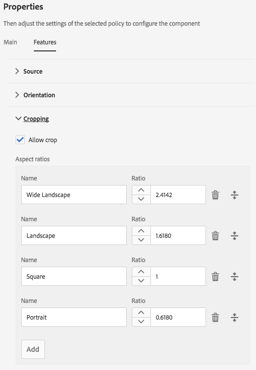
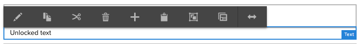
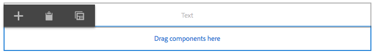
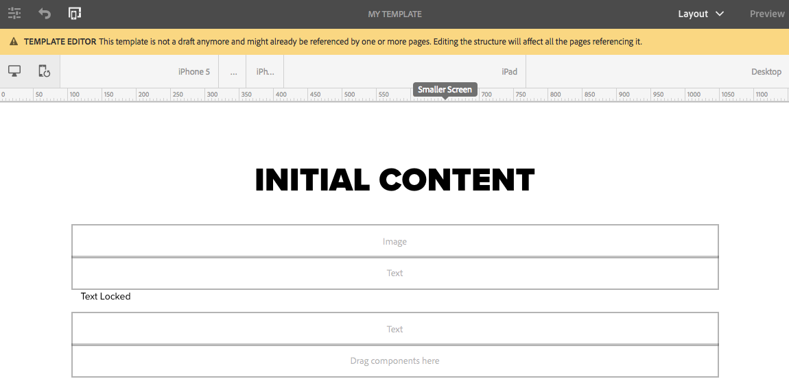
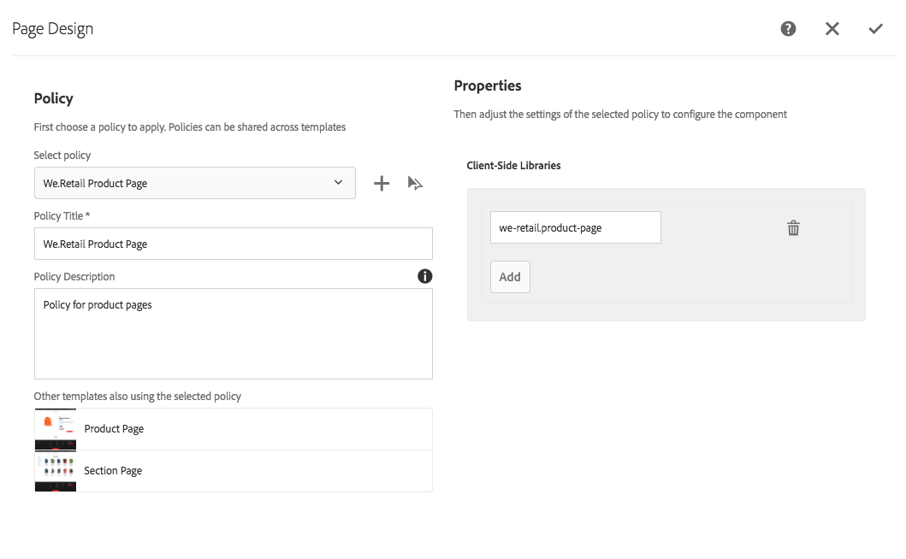
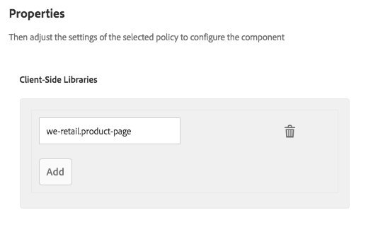
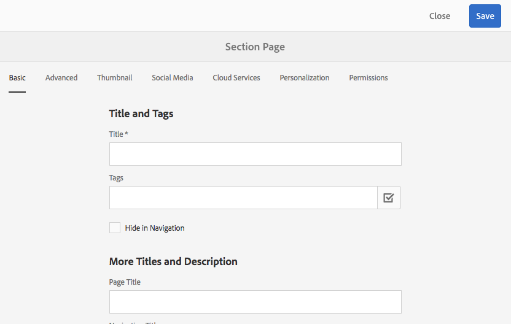

# Criação de modelos de páginas  {#creating-page-templates}

Ao criar uma página, é necessário selecionar um modelo, que é usado como base para criação da nova página. O modelo define a estrutura da página resultante, todo conteúdo inicial e os componentes que podem ser usados.

Com o **Editor de modelos**, criar e manter modelos não é mais uma tarefa somente para desenvolvedores. Um tipo de usuário avançado, chamado de **autor de modelo**, também pode ser envolvido. Os desenvolvedores ainda são necessários para configurar o ambiente, criar bibliotecas de clientes e criar os componentes a serem usados, mas uma vez que essas noções básicas estejam em vigor, o **autor do modelo** terá a flexibilidade de criar e configurar modelos sem um projeto de desenvolvimento.

O **Console de Modelos** permite que os autores de modelo:

* Criar um modelo ou copiar um modelo existente.
* Gerencie o ciclo de vida do modelo.

O **Editor de Modelos** permite que os autores de modelo:

* Adicione componentes ao modelo e posicione-os em uma grade responsiva.
* Pré-configurar os componentes.
* Defina quais componentes podem ser editados nas páginas criadas com o modelo.

Este documento explica como um **autor do modelo** pode usar o console de modelos e o editor para criar e gerenciar modelos editáveis.

Para obter informações detalhadas sobre como os modelos editáveis funcionam a um nível técnico, consulte o documento do desenvolvedor [Modelos de página - Editáveis](/help/sites-developing/page-templates-editable.md).

>[!NOTE]
>
>O **Editor de modelos** não oferece suporte para direcionamento diretamente no nível do modelo. As páginas criadas com base em um modelo editável podem ser direcionadas, mas os modelos em si não podem.

>[!CAUTION]
>
>Páginas e modelos criados com o **Console de modelos** não devem ser usados com a interface clássica, e esse uso não é suportado.

## Antes de começar {#before-you-start}

>[!NOTE]
>
>Um administrador precisa configurar uma pasta de modelo no **Navegador de configurações** e aplicar permissões apropriadas antes que um autor de modelo possa criar um modelo nessa pasta.

É importante considerar os seguintes pontos antes de iniciar:

* A criação de um modelo requer colaboração. Por este motivo, a [Função](#roles) é indicada para cada tarefa.

* Dependendo de como sua instância está configurada, o AEM agora fornece [dois tipos básicos de modelo](/help/sites-authoring/templates.md#editable-and-static-templates). Isso não afeta a maneira como você realmente [usa um modelo para criar uma página](#using-a-template-to-create-a-page), mas afeta o tipo de modelo que você pode criar e como uma página se relaciona com seu modelo.

### Funções {#roles}

A criação de um modelo usando o **Console de Modelos** e o **Editor de Modelos** requer a colaboração entre as seguintes funções:

* **Administrador**:

   * Cria uma nova pasta de modelos requer direitos de `admin`.

   * Essas tarefas também podem ser realizadas por um desenvolvedor

* **Desenvolvedor**:

   * Concentra-se nos detalhes técnicos/internos
   * Precisa de experiência com o ambiente de desenvolvimento.
   * Fornece ao autor do modelo as informações necessárias. 

* **Autor do modelo**:

   * Esse é um autor específico, membro do grupo `template-authors`

      * Isso atribui os privilégios e permissões necessários. 

   * Pode configurar o uso de componentes e outros detalhes de alto nível que exigem:

      * Algum conhecimento técnico

         * Por exemplo, usar padrões ao definir caminhos.

      * Informações técnicas do desenvolvedor.

Devido à natureza de algumas tarefas, como a criação de uma pasta, é necessário um ambiente de desenvolvimento, o que requer conhecimento/experiência.

As tarefas detalhadas neste documento são listadas com a função responsável por executá-las.

### Modelos editáveis e estáticos {#editable-and-static-templates}

O AEM agora oferece dois tipos básicos de modelos:

* [Modelos editáveis](/help/sites-authoring/templates.md#creatingandmanagingnewtemplates)

   * Pode ser [criado](#creatinganewtemplate) e [editado](#editingatemplate) por autores de modelos usando o console e o editor **Modelo**. O console **Modelo** está acessível na seção **Geral** do console **Ferramentas**.

   * Após a criação da nova página, uma conexão dinâmica é mantida entre a página e o modelo. Isso significa que as alterações na estrutura do modelo e/ou no conteúdo bloqueado serão refletidas em qualquer página criada com esse modelo. As alterações no conteúdo desbloqueado (ou seja, inicial) não serão refletidas.
   * Use políticas de conteúdo, que você pode definir no editor de modelo, para manter as propriedades de design. O modo de design no editor de páginas não é mais usado para modelos editáveis.

* Modelos estáticos

   * Modelos estáticos estão disponíveis para várias versões do AEM.
   * Eles são [fornecidos pelos seus desenvolvedores](/help/sites-developing/page-templates-static.md), portanto, não podem ser criados ou editados por autores.
   * São copiados para criar a nova página, mas não existe conexão dinâmica após isso (embora o nome do modelo seja registrado para fins de informação).
   * Use o [Modo de Design](/help/sites-authoring/default-components-designmode.md) para manter as propriedades de design.
   * Como a edição de modelos estáticos é uma tarefa exclusiva de um desenvolvedor, consulte o documento do desenvolvedor [Modelos de página - Estáticos](/help/sites-developing/page-templates-static.md) para obter mais informações.

Por definição, o console de modelo e o editor de modelo permitem apenas a criação e a edição de modelos editáveis. Portanto, este documento se concentra exclusivamente em modelos editáveis.

### Utilização de um modelo para criar uma página {#using-a-template-to-create-a-page}

Ao usar um modelo para [criar uma página](/help/sites-authoring/managing-pages.md#creating-a-new-page), não há diferença visível e nenhuma indicação entre modelos estáticos e editáveis. Para o autor da página, o processo é transparente.

## Criação e gerenciamento de modelos {#creating-and-managing-templates}

Ao criar um modelo editável, você:

* Use o console **Modelo**. Isso está disponível na seção **Geral** do console **Ferramentas**.

   * Ou diretamente em: [https://localhost:4502/libs/wcm/core/content/sites/templates.html/conf](https://localhost:4502/libs/wcm/core/content/sites/templates.html/conf)

* É possível [criar uma pasta para os modelos](#creating-a-template-folder-admin) se necessário
* [Criar um modelo](#creatinganewtemplateauthor), inicialmente vazio

* [Definir propriedades adicionais](#definingtemplatepropertiesauthor) para o modelo, se necessário
* [Editar o modelo](#editingtemplates) para definir o:

   * [Estrutura](#editingatemplatestructureauthor) - conteúdo predefinido que não pode ser alterado nas páginas criadas com o modelo.
   * [Conteúdo inicial](#editing-a-template-initial-content-author) - conteúdo predefinido que pode ser alterado nas páginas criadas com o modelo.
   * [Layout](#editingatemplatelayoutauthor) - para um intervalo de dispositivos.
   * [Estilos](/help/sites-authoring/style-system.md) - defina os estilos a serem usados com o modelo e seus componentes.

* [Habilitar o modelo](#enablingatemplateauthor) para uso ao criar uma página
* [Permitir o modelo](#allowing-a-template-author) para a página ou ramificação necessária do seu site
* [Publicar o modelo](#publishingatemplateauthor) para torná-lo disponível no ambiente de publicação

>[!NOTE]
>
>Os **Modelos permitidos** geralmente são predefinidos quando seu site for inicialmente configurado.

>[!CAUTION]
>
>Nunca insira qualquer informação que precise ser [internacionalizada](/help/sites-developing/i18n.md) em um modelo. Para fins de internalização, os [recursos de localização dos Componentes principais](https://experienceleague.adobe.com/docs/experience-manager-core-components/using/get-started/localization.html?lang=pt-BR) são recomendados.

### Criação de uma pasta de modelo - Administrador {#creating-a-template-folder-admin}

Uma pasta de modelo deve ser criada para que o projeto mantenha seus modelos específicos de projetos. Esta é uma tarefa de administrador e está descrita no documento [Modelos de página - Editáveis](/help/sites-developing/page-templates-editable.md#template-folders).

### Criação de um novo modelo - Autor do modelo {#creating-a-new-template-template-author}

1. Abra o **Console de Modelos** (em **Ferramentas >** **Geral**) e navegue até a pasta necessária.

   >[!NOTE]
   >
   >Em uma instância padrão do AEM, a pasta **global** já existe no console modelo. Isso mantém modelos padrão e atua como um fallback se nenhuma política e/ou tipo de modelo for localizado na pasta atual.
   >
   >
   >É uma prática recomendada usar uma [pasta de modelo criada para o seu projeto](/help/sites-developing/page-templates-editable.md#template-folders).

1. Selecione **Criar**, em seguida **Criar modelo** para abrir o assistente.

1. Escolha um **Tipo de modelo** e clique em **Próximo**.

   >[!NOTE]
   >
   >Os tipos de modelo são layouts predefinidos de modelos e podem ser considerados como modelos para um modelo. Eles são predefinidos pelos desenvolvedores ou pelo administrador do sistema. Mais informações podem ser encontradas no documento do desenvolvedor [Modelos de página - Editáveis](/help/sites-developing/page-templates-editable.md#template-type).

1. Conclua os **Detalhes do modelo**:

   * **Nome do modelo**
   * **Descrição**

1. Selecione **Criar**. Uma confirmação é exibida, selecione **Abrir** para começar a [editar o modelo](#editingatemplate) ou **Concluído** para retornar ao console do modelo.

   >[!NOTE]
   >
   >Quando um modelo novo for criado, ele será marcado como **Rascunho** no console. Isso indica que ainda não está disponível para uso por autores da página.

### Definir propriedades do modelo - Autor do modelo   {#defining-template-properties-template-author}

Um modelo pode ter as seguintes propriedades:

* Imagem

   * Imagem a ser usada como [miniatura do modelo](/help/sites-authoring/templates.md#template-thumbnail-image) para auxiliar na seleção, como no assistente de Criar página.

      * Pode ser enviado
      * Pode ser gerado com base no conteúdo do modelo

* Título

   * Um título usado para identificar o modelo, como no assistente de **Criar página**.

* Descrição

   * Uma descrição opcional para fornecer mais informações sobre o modelo e seu uso, que pode ser vista, por exemplo, no assistente **Criar página**.

Para exibir e/ou editar as propriedades:

1. No **console Modelos**, selecione o modelo.
1. Selecione **Propriedades da exibição** na barra de ferramentas ou nas opções rápidas para abrir a caixa de diálogo.
1. Agora você pode exibir ou editar as propriedades do modelo.

>[!NOTE]
>
>Os modelos são ferramentas eficientes para simplificar o fluxo de trabalho de criação de página. No entanto, usar modelos em excesso pode sobrecarregar os autores e tornar confusa a criação da página. Uma boa regra geral é manter o número de modelos abaixo de 100.
>
>A Adobe não recomenda ter mais de 1000 modelos devido a possíveis impactos no desempenho.

>[!NOTE]
>
>O status de um modelo (rascunho, habilitado ou desabilitado) é exibido no console.

#### Imagem em miniatura do modelo {#template-thumbnail-image}

Para definir a miniatura do modelo:

1. Edite as propriedades do modelo.
1. Escolha se deseja fazer upload de uma miniatura ou gerá-la a partir do conteúdo do modelo.

   * Para carregar uma miniatura, clique em **Carregar imagem**
   * Se quiser gerar uma miniatura, clique em **Gerar visualização**

1. Para ambos os métodos, uma pré-visualização da miniatura será exibida.

   Se não for satisfatório, clique em **Limpar** para carregar outra imagem ou gerar novamente a miniatura.

1. Quando estiver satisfeito com a miniatura, clique em **Salvar e fechar**.

### Ativar e permitir um modelo - Autor do modelo   {#enabling-and-allowing-a-template-template-author}

Para poder usar um modelo ao criar uma página é necessário:

* [Habilitar o modelo](#enablingatemplate) para disponibilizá-lo para o uso na criação de páginas.
* [Permitir o modelo](#allowingatemplate) para especificar as ramificações de conteúdo nas quais o modelo pode ser usado.

#### Habilitar um modelo - Autor do modelo {#enabling-a-template-template-author}

Um modelo pode ser habilitado ou desabilitado para torná-lo disponível ou indisponível no assistente de **Criar Página**.

>[!CAUTION]
>
>Quando um modelo estiver ativado, um aviso será exibido quando um autor do modelo começar a atualizar mais o modelo. Isso é para informar ao usuário que o modelo pode ter sido referenciado, de modo que qualquer alteração pode afetar as páginas que lhe fazem referência.

1. No **console Modelos**, selecione o modelo.
1. Selecione **Habilitar** ou **Desabilitar** da barra de ferramentas e depois na caixa de diálogo de confirmação.
1. Agora você pode usar seu modelo ao [criar uma página](/help/sites-authoring/managing-pages.md#creating-a-new-page), embora provavelmente queira [editar o modelo](#editingatemplate) de acordo com seus próprios requisitos.

>[!NOTE]
>
>O status de um modelo (rascunho, habilitado ou desabilitado) é exibido no console.

#### Ativar um modelo - Autor {#allowing-a-template-author}

Um modelo pode ser disponibilizado ou indisponibilizado para determinadas ramificações de página.

1. Abra as [Propriedades da página](/help/sites-authoring/editing-page-properties.md) da página raiz da ramificação onde deseja que o modelo fique disponível.

1. Abra a guia **Avançado**.

1. Em **Configurações de Modelo**, use **Adicionar campo** para especificar os caminhos para seu(s) modelo(s).

   O caminho pode ser explícito ou usar padrões. Por exemplo:

   `/conf/<your-folder>/settings/wcm/templates/.*`

   A ordem dos caminhos é irrelevante, todos os caminhos serão verificados e todos os modelos serão recuperados.

   >[!NOTE]
   >
   >Se a lista **Modelos permitidos** estiver vazia, a árvore será ascendente até que um valor/lista seja encontrado.
   >
   >
   >Consulte [Disponibilidade de modelos](/help/sites-developing/templates.md#template-availability) - os princípios para modelos permitidos permanecem inalterados.

1. Clique em **Salvar** para salvar as alterações nas propriedades da página.

>[!NOTE]
>
>Geralmente os modelos permitidos são predefinidos para todo o site quando configurado.

### Publicar um modelo - Autor do modelo {#publishing-a-template-template-author}

À medida que o modelo for referenciado quando a página for renderizada, o modelo totalmente configurado precisará ser publicado, para estar disponível no ambiente de publicação.

1. No **console Modelos**, selecione o modelo.
1. Selecione **Publicar** na barra de ferramentas para abrir o assistente.
1. Selecione as **Políticas do conteúdo** para ser publicado em tandem.

1. Selecione **Publicar** na barra de ferramentas para concluir a ação.

## Editar modelos - Autores do modelo   {#editing-templates-template-authors}

Ao criar ou editar um modelo, há vários aspectos que você pode definir. A edição de modelos é semelhante à criação de página.

Os seguintes aspectos de um modelo podem ser editados:

* [Estrutura](#editingatemplatestructure)

  Os componentes adicionados aqui não podem ser movidos/removido das páginas resultantes pelos autores da página. Se quiser que os autores de página possam adicionar e remover componentes de páginas resultantes, será necessário adicionar um sistema de parágrafo ao modelo.

  Quando os componentes estiverem bloqueados, é possível adicionar conteúdo, que não pode ser editado por autores da página. É possível desbloquear componentes para permitir a definição do [Conteúdo inicial](#editingatemplateinitialcontent).

  >[!NOTE]
  >
  >No modo estrutura, os componentes principais de um componente desbloqueado não podem ser movidos, recortados ou excluídos.

* [Conteúdo inicial](#editingatemplateinitialcontent)

  Quando um componente tiver sido desbloqueado, é possível definir o conteúdo inicial que será copiado para páginas resultantes, criado a partir do modelo. Esses componentes desbloqueados podem ser editados nas páginas resultantes.

  >[!NOTE]
  >
  >No modo de **conteúdo inicial**, e nas páginas resultantes, qualquer componente desbloqueado que tenha uma página principal acessível (ou seja, componentes dentro de um container de layout) pode ser excluído.

* [Layout](#editingatemplatelayout)

  Aqui você pode predefinir o layout do modelo para os formatos de dispositivo necessários. O modo **Layout** de criação do modelo tem a mesma funcionalidade que o modo [**Layout** da criação de página](/help/sites-authoring/responsive-layout.md#defining-layouts-layout-mode).

* [Políticas da página](#editingatemplatepagepolicies)

  Em políticas de página, é possível conectar políticas de página predefinidas à página. Essas políticas da página definem as várias configurações de design.

* [Estilos](/help/sites-authoring/style-system.md)

  O sistema de estilos permite ao autor do modelo definir classes de estilo na política de conteúdo de um componente para que autores de conteúdo possam selecioná-las ao editarem o componente em uma página. Esses estilos podem ser variações visuais alternativas de um componente, tornando-o mais flexível.

  Consulte a [documentação do Style System](/help/sites-authoring/style-system.md) para obter mais informações.

O seletor de **Modo** na barra de ferramentas permite selecionar e editar o aspecto apropriado do modelo:

* [Estrutura](#editingatemplatestructure)
* [Conteúdo inicial](#editingatemplateinitialcontent)
* [Layout](#editingatemplatelayout)

Enquanto a opção **Política de Página** no menu **Informações de Página** permite [selecionar as políticas de página necessárias](#editingatemplatepagepolicies):

>[!CAUTION]
>
>Se um autor começar a editar um modelo que já foi habilitado, um aviso será exibido. Isso é para informar ao usuário que o modelo pode ter sido referenciado, de modo que qualquer alteração pode afetar as páginas que lhe fazem referência.

### Editar um modelo - Estrutura - Autor do modelo {#editing-a-template-structure-template-author}

No modo **Estrutura** você define os componentes e o conteúdo para o modelo, a política do modelo e seus componentes.

* Os componentes definidos na estrutura do modelo não podem ser movidos em uma página resultante nem excluídos de qualquer página resultante.
* Se desejar que os autores de página possam adicionar e remover componentes, adicione um sistema de parágrafo ao modelo.
* Os componentes podem ser desbloqueados e bloqueados novamente para permitir que você defina [conteúdo inicial](#editingatemplateinitialcontent).

* As políticas de design dos componentes e página são definidas.

No modo **Estrutura** do editor de modelo:

* **Adicionar componentes**

  Existem vários mecanismos para adicionar componentes ao modelo:

   * No navegador de **Componentes** no painel lateral.
   * Usando a opção **Inserir Componente** (ícone **+**) disponível na barra de ferramentas dos componentes que já estão no modelo ou a caixa **Arraste componentes para cá**.

   * Ao arrastar um ativo (no navegador de **Ativos** no painel lateral) diretamente no modelo para gerar o componente adequado no local.

  Após adicionado, cada componente é marcado com:

   * Uma borda
   * Um marcador para mostrar o tipo de componente
   * Um marcador para mostrar quando o componente foi desbloqueado

  >[!NOTE]
  >
  >Ao adicionar um componente de **Título** pronto ao modelo, ele conterá **estrutura** de texto padrão.
  >
  >
  >Se você alterar isso e adicionar seu próprio texto, esse texto atualizado será usado quando uma página for criada a partir do modelo.
  >
  >
  >Se deixar o texto padrão (estrutura) como está, o título será padrão para o nome da página subsequente.

  >[!NOTE]
  >
  >Embora não seja idêntico, adicionar componentes e ativos a um modelo tem muitas coisa em comum com as ações semelhantes ao [criar a página](/help/sites-authoring/editing-content.md).

* **Ações do componente**

  Execute ações nos componentes uma vez que eles tenham sido adicionados ao modelo. Cada instância individual tem uma barra de ferramentas que permite acessar as ações disponíveis. A barra de ferramentas depende do tipo de componente.

  

  Além disso, ela pode ser dependente das ações executadas como quando uma política foi associada ao componente, o ícone de configuração de design é disponibilizado.

* **Editar e configurar**

  Com essas duas ações você pode adicionar conteúdo aos seus componentes.

* **Borda para indicar a Estrutura**

  Ao trabalhar no modo **Estrutura** uma borda laranja indica o componente selecionado no momento. Uma linha pontilhada também indica o componente principal.

  Por exemplo, na captura de tela abaixo, o componente **Texto** está selecionado, em um **Contêiner de layout** (responvegrid).

  

* **Política e propriedades (Geral)**

  As políticas de conteúdo (ou design) definem as propriedades de design de um componente. Por exemplo, os componentes disponíveis ou as dimensões mínima/máxima. Elas são aplicáveis ao modelo (e às páginas criadas com ele).

  Crie uma política de conteúdo ou selecione uma existente para um componente. Isso permite que você defina os detalhes do design.

   

  A janela de configuração é dividida em dois.

   * Do lado esquerdo da caixa de diálogo, em **Política**, você tem a capacidade de selecionar uma política existente.
   * Do lado direito da caixa de diálogo, em **Propriedades**, você pode definir as propriedades específicas ao tipo de componente.

  As propriedades disponíveis dependem do componente selecionado. Por exemplo, para um componente de texto, as propriedades definem as opções de copiar e colar, de formatação e de estilo de parágrafo, entre outras opções.

  ***Política***

  As políticas de conteúdo (ou design) definem as propriedades de design de um componente. Por exemplo, os componentes disponíveis ou as dimensões mínima/máxima. Elas são aplicáveis ao modelo (e às páginas criadas com ele).

  Em **Política** é possível selecionar uma política existente para aplicar ao componente por meio da lista suspensa.

  

  Uma nova política pode ser adicionada ao selecionar o botão adicionar ao lado da lista suspensa **Selecionar política**. Um novo título deve ser especificado no campo **Título da política**.

  

  A política existente selecionada na lista suspensa **Selecionar política** pode ser copiada como uma nova política usando o botão copiar ao lado do menu suspenso. Um novo título deve ser especificado no campo **Título da política**. Por padrão, a política copiada será denominada **Cópia de X**, onde X é o título da política copiada.

  

  É opcional uma descrição da política no campo **Descrição da política**.

  Na seção **Outros modelos que também utilizam a política selecionada**, você pode ver qual modelo utiliza a política selecionada na lista suspensa **Selecionar política**.

  

  >[!NOTE]
  >
  >Se vários componentes do mesmo tipo forem adicionados como conteúdo inicial, a mesma política se aplica a todos os componentes. Isto espelha a mesma restrição no [**Modo de Design** para modelos estáticos](/help/sites-authoring/default-components-designmode.md).

  ***Propriedades***

  No cabeçalho **Propriedades**, é possível definir as configurações do componente. O cabeçalho tem duas guias:

   * Principal
   * Recursos

  *Principal*

  Na guia **Principal**, as configurações mais importantes do componente são definidas.

  Por exemplo, para um componente de imagem, as larguras permitidas podem ser definidas juntamente com a ativação de carregamento lento.

  Se uma configuração permitir várias configurações, clique no botão **Adicionar** para adicionar outra configuração.

  

  Para remover uma configuração, clique no botão **Excluir** localizado à direita da configuração.

  Para remover uma configuração, clique no botão **&#x200B; Excluir &#x200B;**.

  

  *Recursos*

  A guia **Recursos** permite habilitar ou desabilitar recursos adicionais do componente.

  Por exemplo, para um componente de imagem, é possível definir as proporções de corte, as orientações de imagem permitidas e se os uploads são permitidos.

  

  >[!CAUTION]
  >
  >Observe que no AEM, as proporções de corte estão definidas como **altura/largura**. Isso difere da definição convencional de largura/altura e é feita por motivos de compatibilidade legal. Os usuários da criação de página não estarão cientes de qualquer diferença desde que você defina o **Nome** claramente, uma vez que este é exibido na interface do usuário.

  >[!NOTE]
  >
  >[As políticas de conteúdo para componentes que implementam o editor de rich text](/help/sites-administering/rich-text-editor.md#main-pars-header-206036638) só podem ser definidas para opções disponibilizadas pelo RTE, por meio das configurações da interface. [&#128279;](/help/sites-administering/rich-text-editor.md#main-pars_header_206036638) [&#128279;](/help/sites-administering/rich-text-editor.md#main-pars_header_206036638)

* **Política e Propriedades (Contêiner de Layout)**

  As configurações de política e propriedades de um container de layout são semelhantes ao uso geral, mas com algumas diferenças.

  >[!NOTE]
  >
  >A configuração de uma política é obrigatória para componentes de contêiner, pois permite definir componentes que estarão disponíveis no contêiner.

  A janela de configuração é dividida em duas, assim como no uso geral da janela.

  ***Política***

  As políticas de conteúdo (ou design) definem as propriedades de design de um componente. Por exemplo, os componentes disponíveis ou as dimensões mínima/máxima. Elas são aplicáveis ao modelo (e às páginas criadas com ele).

  Em **Política** é possível selecionar uma política existente para aplicar ao componente por meio da lista suspensa. Isso funciona exatamente da mesma forma que a janela de uso geral.

  ***Propriedades***

  No cabeçalho **Propriedades**, é posível escolher quais componentes estão disponíveis para o container de layout e definir suas configurações. O cabeçalho tem três guias:

   * Componentes permitidos
   * Componentes padrão
   * Configurações responsivas

  *Componentes permitidos*

  Na guia **Componentes permitidos**, você define quais componentes estão disponíveis para o container de layout.

   * Os componentes são agrupados por seus grupos de componentes, que podem ser expandidos e recolhidos.
   * Um grupo inteiro pode ser selecionado ou desmarcados, marcando ou desmarcando o nome do grupo.
   * Um sinal de menos representa pelo menos um, mas não todos os itens em um grupo estão selecionados.
   * Há uma pesquisa disponível para filtrar um componente por nome.
   * As contagens listadas à direita do nome do grupo de componentes representam o número total de componentes selecionados nesses grupos, independentemente do filtro.

  

  *Componentes padrão*

  Na guia **Componentes padrão**, você define quais componentes são associados automaticamente a determinados tipos de mídia para que, quando um autor arrastar um ativo do navegador de ativos, o AEM saiba com qual componente associá-lo. Observe que somente os componentes com zonas para soltar estão disponíveis para essa configuração.

  Clique em **Adicionar mapeamento** para adicionar um componente totalmente novo e um mapeamento de tipo MIME.

  Selecione um componente na lista e clique em **Adicionar tipo** para adicionar outro tipo MIME a um componente já mapeado. Clique no ícone **Excluir** para remover a um tipo MIME.

  

  *Configurações responsivas*

  Na guia **Configurações responsivas**, é possível configurar o número de colunas na grade resultante do container de layout.

* **Desbloquear/bloquear componentes**

  Você desbloqueia/bloqueia componentes para definir se o conteúdo está disponível para alteração no modo **Conteúdo inicial**.

  Quando um componente tiver sido desbloqueado:

   * Um indicador de cadeado aberto é mostrado na borda.
   * A barra de ferramentas do componente será ajustada de acordo.
   * Qualquer conteúdo já inserido não será mais exibido no modo **Estrutura**.

      * O conteúdo já inserido é considerado conteúdo inicial e é visível apenas no modo **Conteúdo inicial**.

   * Os pais do componente desbloqueado não podem ser movidos, recortados ou excluídos.

  

  Isso inclui desbloquear componentes de contêiner para que outros componentes possam ser adicionados, no modo **Conteúdo inicial** ou nas páginas resultantes. Se você já tiver adicionado componentes/conteúdo ao contêiner antes de desbloqueá-lo, eles não serão mais exibidos quando estiverem no modo **Estrutura**, mas serão exibidos no modo **Conteúdo inicial**. No **modo Estrutura**, somente o componente de container será exibido com a lista de **Componentes permitidos**.

  

  Para economizar espaço, o contêiner de layout não é expandido para acomodar a lista de componentes permitidos. Em vez disso, o container se torna uma lista rolável.

  Os componentes configuráveis são mostrados com um ícone de **Política**, no qual você pode tocar ou clicar para editar a política e as propriedades desse componente.

  

* **Relação com Páginas Existentes**

  Se a estrutura for atualizada depois de criar as páginas baseadas no modelo, então essas páginas refletirão as alterações no modelo. Um aviso é exibido na barra de ferramentas para lembrá-lo desse fato, junto com caixas de diálogo de confirmação.

  

### Editar um modelo - Conteúdo inicial - Criação {#editing-a-template-initial-content-author}

O modo **Conteúdo inicial** é usado para definir o conteúdo que aparecerá quando uma página for criada pela primeira vez com base no modelo. O conteúdo inicial poderá ser posteriormente editado pelos autores de página.

Embora todo o conteúdo criado no modo **Estrutura** seja visível no **Conteúdo inicial**, somente os componentes que foram desbloqueados podem ser selecionados e editados.

>[!NOTE]
>
>O modo **Conteúdo inicial** pode ser visto como um modo de edição para páginas criadas com esse modelo. Sendo assim, as políticas não estão definidas no modo **Conteúdo inicial**, mas no modo [**Estrutura**](/help/sites-authoring/templates.md#editing-a-template-structure-template-author).

* Os componentes desbloqueados que estão disponíveis para edição são marcados. Quando selecionados, eles têm uma borda azul:

  

* Os componentes desbloqueados têm uma barra de ferramentas, permitindo editar e configurar o conteúdo:

  

* Se um componente do contêiner foi desbloqueado (no modo **estrutura**), você pode adicionar novos componentes ao contêiner (no modo **Conteúdo inicial**). Os componentes adicionados no modo **Conteúdo inicial** podem ser movidos para ou excluído das páginas resultantes.

  Você pode adicionar o componente utilizando a área **Arraste componentes até aqui** ou a opção **Inserir novo componente** na barra de ferramentas do contêiner apropriado.

   

* Se o conteúdo inicial do modelo for atualizado depois que as páginas forem criadas com base no modelo, então essas páginas não serão afetadas por alterações no conteúdo inicial no modelo.

>[!NOTE]
>
>O conteúdo inicial se destina à preparação de componentes e do layout da página que servem como ponto de partida para a criação do conteúdo. Ele não se destina a ser o conteúdo real que permaneceria como está. Por esse motivo, o conteúdo inicial não pode ser traduzido.
>
>Se você precisar incluir texto traduzível no modelo, como em cabeçalhos ou rodapés, poderá usar os recursos de [localização dos componentes principais](https://experienceleague.adobe.com/docs/experience-manager-core-components/using/get-started/localization.html?lang=pt-BR).

### Editar um modelo - Layout - Autor do modelo {#editing-a-template-layout-template-author}

É possível definir o layout do modelo para um intervalo de dispositivos. O [Layout responsivo](/help/sites-authoring/responsive-layout.md) para modelos funciona como na criação de página.

>[!NOTE]
>
>As modificações no layout serão refletidas no modo **Conteúdo inicial**, mas nenhuma alteração será vista no modo **Estrutura**.

### Editar um modelo - Design da página - Autor/desenvolvedor do modelo {#editing-a-template-page-design-template-author-developer}

O design da página, incluindo as bibliotecas do lado do cliente e as políticas de página necessárias, é mantido na opção **Design da página** do menu **Informações da página**.

Para acessar a caixa de diálogo **Design da Página**:

1. No **Editor de Modelos**, selecione **Informações da Página** na barra de ferramentas e **Design da Página** para abrir a caixa de diálogo.
1. A caixa de diálogo **Design da Página** é aberta e dividida em duas seções:

   * A metade esquerda define as [políticas da página](/help/sites-authoring/templates.md#page-policies)
   * A metade direita define as [propriedades da página](/help/sites-authoring/templates.md#page-properties)

   

#### Políticas da página {#page-policies}

É possível aplicar uma política de conteúdo ao modelo ou às páginas resultantes. Isso define a política de conteúdo do sistema de parágrafo principal na página.

* É possível selecionar uma política existente para a página na lista suspensa **Selecionar política**.

  

  Uma nova política pode ser adicionada ao selecionar o botão adicionar ao lado da lista suspensa **Selecionar política**. Um novo título deve ser especificado no campo **Título da política**.

  

  A política existente selecionada na lista suspensa **Selecionar política** pode ser copiada como uma nova política usando o botão copiar ao lado do menu suspenso. Um novo título deve ser especificado no campo **Título da política**. Por padrão, a política copiada será denominada **Cópia de X**, onde X é o título da política copiada.

  

* Defina um título para a política no campo **Título da política**. É necessário que a política tenha um título para que possa ser facilmente selecionada na lista suspensa **Selecionar política**.

  

* É opcional uma descrição da política no campo **Descrição da política**.
* Na seção **Outros modelos que também utilizam a política selecionada**, você pode ver qual modelo utiliza a política selecionada na lista suspensa **Selecionar política**.

  

#### Propriedades da página {#page-properties}

Usando as propriedades de página, é possível definir as bibliotecas do lado do cliente necessárias usando a caixa de diálogo **Design da página**. Essas bibliotecas do lado do cliente incluem folhas de estilo e o javascript a serem carregados com o modelo e as páginas criadas com esse modelo.

* Especifique as bibliotecas do lado do cliente que deseja aplicar às páginas criadas com este modelo. Inserção do nome de uma biblioteca no campo de texto na seção **Bibliotecas do lado do cliente**.

  

* Se as várias bibliotecas forem necessárias, clique no botão Adicionar para adicionar um campo de texto extra para o nome da biblioteca.

  

  Adicione quantos campos de texto forem necessário para suas bibliotecas do lado do cliente.

  

* Defina a posição relativa das bibliotecas conforme necessário, ao arrastar os campos usando a alça de arrastar.

  

>[!NOTE]
>
>Embora o autor do modelo possa especificar a política de página no modelo, ele deve obter detalhes das bibliotecas do lado do cliente apropriadas do desenvolvedor.

### Editar um modelo - Propriedades da página inicial - Criação {#editing-a-template-initial-page-properties-author}

Usando a opção **Propriedades da página inicial**, é possível definir as [propriedades de página](/help/sites-authoring/editing-page-properties.md) iniciais a ser usadas ao criar páginas resultantes.

1. No editor de modelo, selecione **Informações da página** na barra de ferramentas, em seguida **Propriedades da página inicial** para abrir a caixa de diálogo.

1. Na caixa de diálogo, é possível definir as propriedades que deseja aplicar às páginas criadas com esse modelo.

   

1. Confirme suas definições com **Concluído**.

## Práticas recomendadas   {#best-practices}

Ao criar modelos, você deve considerar:

1. O impacto das alterações no modelo depois que as páginas tiverem sido criadas a partir dele.

   Esta é uma lista das diferentes operações possíveis nos modelos, juntamente com como elas afetam as páginas criadas a partir deles:

   * Alterações na estrutura:

      * Elas são aplicadas imediatamente às páginas resultantes.
      * A publicação do modelo alterado ainda é necessária para que os visitantes vejam as alterações.

   * Alterações nas políticas de conteúdo e configurações de design:

      * Elas se aplicam imediatamente às páginas resultantes.
      * A publicação das alterações é necessária para que os visitantes vejam as alterações.

   * Alterações no conteúdo inicial:

      * Elas se aplicam somente às páginas criadas após as alterações no modelo.

   * As alterações no layout dependem se o componente modificado faz parte de:

      * Somente estrutura - aplicado imediatamente
      * Possui conteúdo inicial - somente em páginas criadas após a alteração

   Tenha muito cuidado quando:

   * Bloquear ou desbloquear componentes em modelos habilitados.
   * Isso pode ter efeitos colaterais, pois as páginas podem já está usando-os. Normalmente:

      * Desbloquear componentes (que foram bloqueados) não aparecerá nas páginas existentes.
      * Bloquear os componentes (que eram editáveis) ocultará esse conteúdo para que não seja exibido nas páginas.

   >[!NOTE]
   >
   >O AEM emite avisos explícitos ao alterar o status de bloqueio de componentes em modelos que não são mais rascunhos.

1. [Criar suas próprias pastas](#creatingatemplatefolderdeveloper) para modelos específicos do site.
1. [Publicar seus modelos](#publishingatemplateauthor) a partir do console **Modelos**.
