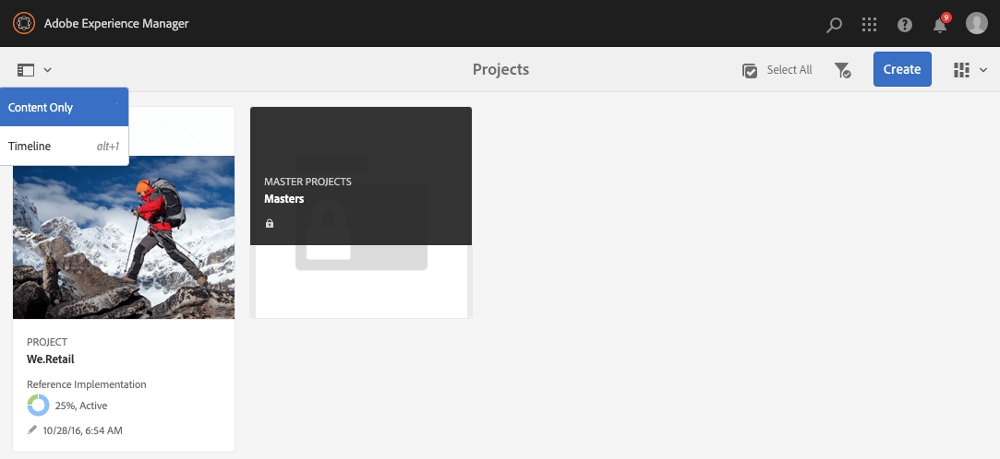

# Gerenciamento de projetos {#managing-projects}

No **Projetos** , você acessa e gerencia seus projetos.

Usando o console, você pode criar um projeto, associar recursos ao projeto e também excluir um projeto ou links de recursos.

## Requisitos de acesso {#access-requirements}

Projeta um recurso de AEM padrão e não requer configuração adicional.

No entanto, para que os usuários em projetos vejam outros usuários/grupos ao usar Projetos, como ao criar projetos, criar tarefas/fluxos de trabalho ou visualizar e gerenciar a equipe, esses usuários precisam ter acesso de leitura em `/home/users` e `/home/groups`.

A maneira mais fácil de fazer isso é dar **projects-users** acesso de leitura de grupo para `/home/users` e `/home/groups`.

## Criação de um projeto {#creating-a-project}

Siga estas etapas para criar um novo projeto.

1. No **Projetos** , toque ou clique **Criar** para abrir o **Criar projeto** assistente.
1. Selecione um modelo e clique em **Próximo**. Saiba mais sobre os modelos de projeto padrão [aqui.](/help/sites-authoring/projects.md#project-templates)

   

1. Defina as **Título** e **Descrição** e adicione uma **Miniatura** imagem, se necessário. Você também adiciona ou exclui os usuários e os grupos aos quais pertencem.

   

1. Toque/clique em **Criar**. A confirmação pergunta se você deseja abrir o novo projeto ou retornar ao console.

O procedimento para criar um projeto é o mesmo para todos os modelos de projeto. A diferença entre os tipos de projetos está relacionada com as [funções de usuário](/help/sites-authoring/projects.md) e [fluxos de trabalho.](/help/sites-authoring/projects-with-workflows.md)

### Associar recursos ao seu projeto {#associating-resources-with-your-project}

Os projetos permitem agrupar recursos em uma única entidade para gerenciá-los como um todo. Portanto, é necessário associar recursos ao projeto. Esses recursos são agrupados no projeto como **Mosaicos**. Os tipos de recursos que você pode adicionar são descritos nos [Mosaicos do projeto](/help/sites-authoring/projects.md#project-tiles).

Para associar recursos ao projeto:

1. Abra o projeto do console **Projetos**.
1. Toque/clique em **Adicionar mosaico** e selecione o mosaico que deseja vincular ao projeto. É possível selecionar vários tipos de mosaicos.

   

1. Toque/clique em **Criar**. O recurso é vinculado ao seu projeto e a partir de agora é possível acessá-lo do próprio projeto.

### Adicionar itens a um mosaico {#adding-items-to-a-tile}

Em alguns mosaicos, é possível adicionar mais de um item. Por exemplo, é possível ter mais de um fluxo de trabalho ou experiência em execução simultaneamente.

Para adicionar itens a um bloco:

1. Em **Projetos**, navegue até o projeto e clique no ícone de divisa para baixo na parte superior direita do bloco ao qual deseja adicionar um item e selecione a opção apropriada.

   * A opção depende do tipo de bloco. Por exemplo, pode ser **Criar tarefa** para **Tarefas** mosaico ou **Iniciar fluxo de trabalho** para **Fluxos de trabalho** mosaico.

   

1. Adicione o item ao mosaico da mesma maneira que ao criar um novo mosaico. Os mosaicos do projeto são descritos[ aqui.](/help/sites-authoring/projects.md#project-tiles)

## Exibindo informações do projeto {#viewing-project-info}

O principal objetivo dos projetos é agrupar as informações associadas num único local, de modo a torná-las mais acessíveis e acionáveis. Você tem várias maneiras de acessar essas informações.

### Abrir um mosaico {#opening-a-tile}

Você pode querer ver quais itens estão incluídos em um mosaico atual ou modificar ou excluir itens no mosaico.

Para abrir um mosaico para ver ou modificar itens:

1. Toque ou clique no ícone de elipses na parte inferior direita do bloco.

   

1. AEM abre o console para os tipos de itens associados ao bloco e aos filtros com base no projeto selecionado.

   

### Exibir uma linha do tempo do projeto {#viewing-a-project-timeline}

A linha do tempo do projeto fornece informações sobre quando os ativos do projeto foram usados pela última vez. Para visualizar a linha do tempo do projeto, siga estas etapas.

1. No **Projetos** , clique ou toque em **Linha do tempo** no seletor do painel na parte superior esquerda do console.
   
2. No console, selecione o projeto para o qual deseja exibir sua linha do tempo.
   

Os ativos são exibidos no painel. Use o seletor do painel para retornar à exibição normal quando terminar.

### Visualização de projetos inativos {#viewing-active-inactive-projects}

Para alternar entre a função [projetos inativos,](#making-projects-inactive-or-active) no **Projetos** clique no **Alternar projetos ativos** na barra de ferramentas.

Por padrão, o console mostra projetos ativos. Clique no botão **Alternar projetos ativos** ícone uma vez para alternar para exibir projetos inativos. Clique novamente para voltar aos projetos ativos.

## Organizar projetos {#organizing-projects}

Há várias opções disponíveis para ajudar a organizar seus projetos para manter o **Projetos** console gerenciável.

### Pastas do projeto {#project-folders}

Você pode criar pastas na **Projetos** para agrupar e organizar projetos semelhantes.

1. No **Projetos** toque ou clique no console **Criar** e depois **Criar pasta**.

   

1. Dê um título à sua pasta e clique em **Criar**.

1. A pasta é adicionada ao console.

Agora você pode criar projetos na pasta . Você pode criar várias pastas e também aninhar pastas.

### Inativar projetos {#making-projects-inactive-or-active}

Você pode querer marcar um projeto como inativo se ele estiver concluído, mas ainda assim manter as informações sobre o projeto. [Os projetos inativos agora mostram](#viewing-active-inactive-projects) por padrão no **Projetos** console.

Para tornar um projeto inativo, siga estas etapas.

1. Abra o **Propriedades do projeto** janela do projeto.
   * Você pode fazer isso no console selecionando o projeto ou de dentro do projeto por meio da **Informações do projeto** mosaico.
1. No **Propriedades do projeto** alterar a janela **Status do projeto** controle deslizante de **Ativo** para **Inativo**.

   

1. Toque ou clique **Salvar e fechar** para salvar as alterações.

### Exclusão de projetos {#deleting-a-project}

Siga estas etapas para excluir um projeto.

1. Navegue até o nível superior da **Projetos** console.
1. Selecionar o projeto no console.
1. Toque ou clique **Excluir** na barra de ferramentas.
1. AEM pode remover/modificar os dados do projeto associados após a exclusão do projeto. Selecione as opções necessárias na **Excluir projeto** caixa de diálogo.
   * Remover os grupos e as funções do projeto
   * Excluir pasta de ativos do projeto
   * Encerrar fluxos de trabalho do projeto

   
1. Toque ou clique **Excluir** para excluir o projeto com as opções selecionadas.

Para saber mais sobre grupos criados automaticamente por projetos, consulte [Criação automática de grupo](/help/sites-authoring/projects.md#auto-group-creation) para obter detalhes.
