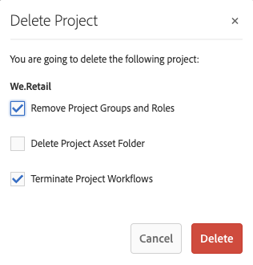

# Gerenciamento de projetos {#managing-projects}

No **Projetos** console, você acessa e gerencia os projetos.

Usando o console, você pode criar um projeto, associar recursos ao projeto e também excluir um projeto ou links de recursos.

## Requisitos de acesso {#access-requirements}

Projeta um recurso AEM padrão e não requer nenhuma configuração adicional.

No entanto, para que os usuários em projetos possam ver outros usuários/grupos enquanto usam Projetos, como ao criar projetos, criar tarefas/fluxos de trabalho ou exibir e gerenciar a equipe, eles precisam ter acesso de leitura a `/home/users` e `/home/groups`.

A maneira mais fácil de fazer isso é dar a **projetos-usuários** acesso de leitura do grupo a `/home/users` e `/home/groups`.

## Criação de um projeto {#creating-a-project}

Siga estas etapas para criar um projeto.

1. No **Projetos** toque ou clique em **Criar** para abrir o **Criar projeto** assistente.
1. Selecione um modelo e clique em **Próximo**. Você pode saber mais sobre os modelos de projeto padrão [aqui.](/help/sites-authoring/projects.md#project-templates)

   

1. Defina o **Título** e a **Descrição** e adicione uma imagem de **Miniatura** se necessário. Também é possível adicionar ou excluir usuários, bem como sua associação com um grupo.

   

1. Toque/clique em **Criar**. Você é solicitado(a) a confirmar se deseja abrir o novo projeto ou retornar ao console.

O procedimento para criar um projeto é o mesmo para todos os modelos de projeto. A diferença entre os tipos de projetos refere-se aos projetos [funções de usuário](/help/sites-authoring/projects.md) e [fluxos de trabalho.](/help/sites-authoring/projects-with-workflows.md)

### Associando recursos ao seu projeto {#associating-resources-with-your-project}

Os projetos permitem agrupar recursos em uma entidade para gerenciá-los como um todo. Portanto, é necessário associar recursos ao projeto. Esses recursos são agrupados no projeto como **Ladrilhos**. Os tipos de recursos que você pode adicionar estão descritos em [Blocos de projeto](/help/sites-authoring/projects.md#project-tiles).

Para associar recursos ao projeto:

1. Abra o projeto no console **Projetos**.
1. Toque/clique em **Adicionar bloco** e selecione o bloco que deseja vincular ao seu projeto. É possível selecionar vários tipos de mosaicos.

   

1. Toque/clique em **Criar**. O recurso é vinculado ao seu projeto e a partir de agora é possível acessá-lo do próprio projeto.

### Adicionar itens a um bloco {#adding-items-to-a-tile}

Talvez você queira adicionar mais de um item em alguns blocos. Por exemplo, você pode ter mais de um fluxo de trabalho em execução ao mesmo tempo ou mais de uma experiência.

Para adicionar itens a um bloco:

1. Entrada **Projetos**, navegue até o projeto e clique no ícone de divisa para baixo na parte superior direita do bloco ao qual deseja adicionar um item e selecione a opção apropriada.

   * A opção depende do tipo de bloco. Por exemplo, pode ser **Criar tarefa** para o **Tarefas** bloco ou **Iniciar fluxo de trabalho** para o **Fluxos de trabalho** bloco.

   

1. Adicione o item ao bloco da mesma maneira que você faria ao criar um bloco. Os blocos do projeto estão descritos [aqui.](/help/sites-authoring/projects.md#project-tiles)

## Exibindo Informações do Projeto {#viewing-project-info}

O principal objetivo dos projetos é agrupar informações associadas em um local para torná-las mais acessíveis e acionáveis. Há várias maneiras de acessar essas informações.

### Abrir um bloco {#opening-a-tile}

Você pode querer ver quais itens estão incluídos no bloco atual, ou modificar e excluir itens no bloco.

Para abrir um bloco e visualizar ou modificar itens:

1. Toque ou clique no ícone de reticências, na parte inferior direita do bloco.

   

1. O AEM abre o console para os tipos de itens associados ao bloco e filtros com base no projeto selecionado.

   

### Visualizar uma linha do tempo do projeto {#viewing-a-project-timeline}

A linha do tempo do projeto fornece informações sobre quando os ativos do projeto foram usados pela última vez. Para exibir a linha do tempo do projeto, siga estas etapas.

1. No **Projetos** clique ou toque em **Linha do tempo** no seletor de painéis na parte superior esquerda do console.
   
2. No console, selecione o projeto para o qual deseja exibir sua linha do tempo.
   

Os ativos são exibidos no painel. Use o seletor de painéis para retornar à exibição normal quando terminar.

### Visualizando projetos inativos {#viewing-active-inactive-projects}

Para alternar entre o ativo e [projetos inativos,](#making-projects-inactive-or-active) no **Projetos** clique no link **Alternar projetos ativos** na barra de ferramentas.

Por padrão, o console mostra os projetos ativos. Clique em **Alternar projetos ativos** ícone uma vez para alternar para a visualização de projetos inativos. Clique nele novamente para voltar para projetos ativos.

## Organização de projetos {#organizing-projects}

Há várias opções disponíveis para ajudar a organizar seus projetos para manter a **Projetos** console gerenciável.

### Pastas de Projeto {#project-folders}

Você pode criar pastas na variável **Projetos** console para agrupar e organizar projetos semelhantes.

1. No **Projetos** toque ou clique no console **Criar** e depois **Criar pasta**.

   

1. Atribua um título à pasta e clique em **Criar**.

1. A pasta é adicionada ao console.

Agora você pode criar projetos dentro da pasta. É possível criar várias pastas e também aninhar pastas.

### Desativação de projetos {#making-projects-inactive-or-active}

Você pode marcar um projeto como inativo se ele for concluído, mas ainda assim deseja manter as informações sobre ele. [Os projetos inativos agora são exibidos](#viewing-active-inactive-projects) por padrão, no campo **Projetos** console.

Para tornar um projeto inativo, siga estas etapas.

1. Abra o **Propriedades do projeto** da janela do projeto.
   * Você pode fazer isso no console selecionando o projeto ou no projeto por meio da tag **Informações do projeto** bloco.
1. No **Propriedades do projeto** , altere o **Status do projeto** controle deslizante de **Ativo** para **Inativo**.

   

1. Toque ou clique **Salvar e fechar** para salvar as alterações.

### Exclusão de projetos {#deleting-a-project}

Siga estas etapas para excluir um projeto.

1. Navegue até o nível superior da **Projetos** console.
1. Selecionar o projeto no console.
1. Toque ou clique **Excluir** na barra de ferramentas.
1. O AEM pode remover/modificar dados de projetos associados após a exclusão do projeto. Selecione quais opções são necessárias no **Excluir Projeto** diálogo.
   * Remover os grupos e as funções do projeto
   * Excluir a pasta de ativos do projeto
   * Encerrar fluxos de trabalho do projeto

   
1. Toque ou clique **Excluir** para excluir o projeto com as opções selecionadas.

Para saber mais sobre grupos criados automaticamente por projetos, consulte [Criação automática de grupo](/help/sites-authoring/projects.md#auto-group-creation) para obter detalhes.
