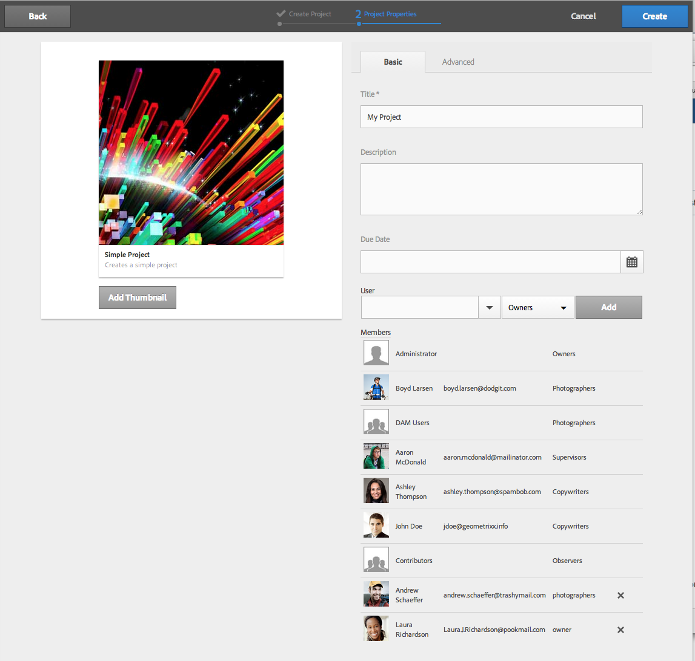

# Gerenciamento de projetos{#managing-projects}

O console Projetos permite que você organize seu projeto, agrupando os recursos em uma entidade.

No console **Projetos**, você acessa e toma medidas nos seus projetos:

Em Projetos, é possível criar um projeto, associar recursos ao projeto e também excluir um projeto ou vínculos de recursos. Você pode querer abrir um mosaico para exibir seu conteúdo, bem como adicionar itens a um mosaico. Este tópico descreve esses procedimentos.

>[!NOTE]
>
>A versão 6.2 introduziu a capacidade de organizar os projetos em pastas. Na página Projetos, você pode criar um projeto ou uma pasta.
>
>Se uma pasta estiver criada, o usuário será direcionado a ela e poderá criar outra pasta ou projeto dentro dela. Ajuda a organizar os projetos em pastas com base em categorias, como campanhas de produto, localização, idiomas de tradução, e assim por diante.
>
>Os projetos e pastas podem ser exibidos em uma visualização de lista e também podem ser pesquisados.

>[!CAUTION]
>
>Para que os usuários em projetos vejam outros usuários/grupos ao usar a funcionalidade Projetos, como criar projetos, criar tarefas/workflows, ver e gerenciar a equipe, esses usuários precisam ter acesso de leitura em **/home/users** e **/home/groups**. A maneira mais fácil de fazer isso é fornecer ao grupo **projects-users** acesso de leitura a **/home/users** e **/home/groups**.

## Criação de um projeto   {#creating-a-project}

Pronto para uso, o AEM permite escolher os seguintes modelos ao criar um projeto:

* Projeto simples
* Projeto de mídia
* Projeto de sessão fotográfica do produto
* Projeto de tradução

O procedimento de criação de um projeto é o mesmo em todos os projetos. A diferença entre os tipos de projetos inclui [funções de usuário](/help/sites-authoring/projects.md) e [fluxos de trabalho](/help/sites-authoring/projects-with-workflows.md) disponíveis.  Para criar um novo projeto:

1. Em **Projetos**, toque/clique em **Criar** para abrir o assistente **Criar projeto**:
1. Selecione um modelo. Estão disponíveis: Projeto simples, Projeto de mídia, [Projeto de tradução](/help/sites-administering/tc-manage.md) e [Projeto de sessão fotográfica do produto](/help/sites-authoring/managing-product-information.md); clique em **Próximo**.

   

1. Defina **Title** e **Descrição** e adicione uma imagem **Miniatura**, se necessário. Você também adiciona ou exclui os usuários e os grupos aos quais pertencem. Além disso, clique em **Avançado** para adicionar um nome utilizado no URL.

   

1. Toque/clique em **Criar**. A confirmação pergunta se você deseja abrir o novo projeto ou retornar ao console.

### Associar recursos ao projeto  {#associating-resources-with-your-project}

Como os projetos permitem agrupar recursos em uma única entidade, você deseja associar os recursos ao projeto. Esses recursos são chamados de **Mosaicos**. Os tipos de recursos que você pode adicionar são descritos nos [Mosaicos do projeto](/help/sites-authoring/projects.md#project-tiles).

Para associar recursos ao projeto:

1. Abra o projeto do console **Projetos**.
1. Toque/clique em **Adicionar mosaico** e selecione o mosaico que deseja vincular ao projeto. É possível selecionar vários tipos de mosaicos.

   

   >[!NOTE]
   >
   >Os mosaicos que podem ser associados a um projeto são descritos mais detalhadamente em [Mosaicos do projeto.](/help/sites-authoring/projects.md#project-tiles)

1. Toque/clique em **Criar**. O recurso é vinculado ao seu projeto e a partir de agora é possível acessá-lo do próprio projeto.

### Excluir um vínculo de projeto ou recurso {#deleting-a-project-or-resource-link}

O mesmo método é usado para excluir um projeto do console ou um recurso vinculado do seu projeto:

1. Navegue até o local apropriado:

   * Para excluir um projeto, acesse o nível superior do console **Projetos**.
   * Para excluir um vínculo de recurso em um projeto, abra o projeto no console **Projetos**.

1. Entre no modo de seleção clicando em **Selecionar** e selecionando o vínculo do projeto ou do recurso.
1. Toque/clique em **Excluir**.

1. Você precisa confirmar a exclusão em uma caixa de diálogo. Se confirmado, o vínculo do projeto ou do recurso será excluído. Toque/clique em **Desmarcar** para sair do modo de seleção.

>[!NOTE]
>
>Ao criar o projeto e adicionar usuários às várias funções, os grupos associados ao projeto são criados automaticamente para gerenciar as permissões associadas. Por exemplo, um projeto chamado Myproject teria três grupos: **Proprietários do Myproject**, **Editores do Myproject**, **Observadores do Myproject**. No entanto, se o projeto for excluído, esses grupos não serão excluídos automaticamente. Um administrador precisa excluir manualmente os grupos em **Ferramentas** > **Segurança** > **Grupos**.

### Adicionar itens a um mosaico {#adding-items-to-a-tile}

Em alguns mosaicos, é possível adicionar mais de um item. Por exemplo, é possível ter mais de um fluxo de trabalho ou experiência em execução simultaneamente.

Para adicionar itens a um mosaico:

1. Em **Projetos**, navegue até o projeto e clique no ícone Adicionar + no bloco ao qual você deseja adicionar um item.

   

1. Adicione um item ao mosaico da mesma forma que ao criar um novo mosaico. Os mosaicos do projeto são descritos[ aqui](/help/sites-authoring/projects.md#project-tiles). Neste exemplo, outro fluxo de trabalho foi adicionado.

   

### Abrir um mosaico {#opening-a-tile}

Você pode querer ver quais itens estão incluídos em um mosaico atual ou modificar ou excluir itens no mosaico.

Para abrir um mosaico para ver ou modificar itens:

1. No console Projetos, toque/clique nas reticências (...)

   

1. O AEM lista os itens no mosaico. É possível entrar no modo de seleção para modificar ou excluir os itens.

   

## Exibir as estatísticas do projeto {#viewing-project-statistics}

Para ver as estatísticas do projeto, no console **Projetos**, clique em **Exibir visualização de estatísticas**. O nível de conclusão de cada projeto é exibido. Clique em **Mostrar Visualização de Estatísticas** novamente para ir para o console **Projetos**.

### Exibir uma linha do tempo do projeto {#viewing-a-project-timeline}

A linha do tempo do projeto fornece informações sobre quando os ativos do projeto foram usados pela última vez. Para visualização da linha do tempo do projeto, clique/toque em **Linha do tempo**, insira o modo de seleção e selecione o projeto. Os ativos são exibidos no painel esquerdo. Clique/toque em **Linha do tempo** para retornar ao console **Projetos**.

### Exibir projetos ativos/inativos {#viewing-active-inactive-projects}

Para alternar entre os projetos ativos e inativos, no console **Projetos**, clique em **Alternar projetos ativos**. Se o ícone tiver uma marca de seleção, estará exibindo os projetos ativos.

Se o ícone tiver um X, estará exibindo os projetos inativos.

## Tornar os projetos ativo ou inativos {#making-projects-inactive-or-active}

Você pode querer inativar um projeto concluído, mas ainda manter as informações no projeto.

Para tornar um projeto inativo (ou ativo):

1. No console **Projetos**, abra o projeto e, em seguida, localize o mosaico **Informações do projeto**.

   >[!NOTE]
   Talvez seja necessário adicionar este mosaico se ele ainda não estiver no seu projeto. Consulte [Adicionar mosaico](#adding-items-to-a-tile).

1. Toque/clique em **Editar**.
1. Altere o seletor de **Ativo** para **Inativo** (ou vice-versa).

   

1. Toque/clique em **Concluído** para salvar as alterações.

