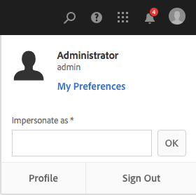

# Configurar o ambiente da sua conta  {#configuring-your-account-environment}

O AEM fornece a capacidade de configurar a sua conta e determinados aspectos do ambiente de criação.

Usando a opção [Usuário](/help/sites-authoring/user-properties.md#user-settings) no [cabeçalho](/help/sites-authoring/basic-handling.md#the-header) e a caixa de diálogo [Minhas preferências](#userpreferences) associada, é possível modificar suas opções de usuário, como as seguintes:

Comece acessando a opção [Usuário](/help/sites-authoring/user-properties.md#user-settings) no cabeçalho.

## Configurações de usuário {#user-settings}

A caixa de diálogo **Configurações do usuário** oferece acesso ao seguinte:

* Representar como

   * Com a funcionalidade [Representar como,](/help/sites-administering/security.md#impersonating-another-user) um usuário pode trabalhar em nome de outro usuário.

* Perfil

   * Oferece um link conveniente para as [configurações do usuário](/help/sites-administering/security.md)

* [Minhas preferências](/help/sites-authoring/user-properties.md#my-preferences)

   * Especifique várias configurações de preferências exclusivas para seu usuário

### Minhas preferências {#my-preferences}

A caixa de diálogo **Minhas preferências** é acessada através da opção [Usuário](/help/sites-authoring/user-properties.md#user-settings) no cabeçalho.

Cada usuário pode definir certas propriedades para si mesmo.

* **Idioma**

   Isso define o idioma a ser usado para a interface de usuário do ambiente de criação. Selecione o idioma desejado na lista disponível.

   Essa configuração também é usada para a interface de usuário clássica.

* **Gerenciamento de janelas**

   Isso define o comportamento ou abertura das janelas. Selecione um dos seguintes:

   * **Diversas janelas** (padrão)

      * As páginas serão abertas em uma nova janela.
   * **Uma janela**

      * As páginas serão abertas na janela atual.

* **Mostrar ações do desktop para Ativos**

   Essa opção requer o aplicativo de desktop do AEM para uso.

* **Cor da anotação**

   Isso define a cor padrão usada ao fazer anotações.

   * Clique no bloco de cores para abrir o seletor de amostras e selecionar uma cor.
   * Como alternativa, insira o código hexadecimal da cor desejada no campo.

* **Apresentação de data relativa**

   Para melhorar a legibilidade, o AEM renderizará datas nos últimos sete dias como datas relativas (por exemplo, três dias atrás) e datas mais antigas como datas exatas (por exemplo, 20 de março de 2017).

   Essa opção define como as datas no sistema são exibidas. As opções disponíveis são as seguintes:

   * **Sempre mostrar data exata**: a data exata é sempre exibida (nunca uma data relativa).
   * **1 dia**: a data relativa é mostrada para datas dentro de um dia; caso contrário, uma data exata é mostrada.

   * **7 dias (padrão)**: a data relativa é mostrada para datas dentro de sete dias; caso contrário, uma data exata é mostrada.

   * **1 mês**: a data relativa é mostrada para datas dentro de um mês; caso contrário, uma data exata é mostrada.

   * **1 ano**: a data relativa é mostrada para datas dentro de um ano; caso contrário, uma data exata é mostrada.

   * **Sempre mostrar data relativa**: as datas exatas nunca são mostradas, e apenas as datas relativas são mostradas.

* **Habilitar atalhos**

   O AEM oferece suporte a vários atalhos de teclado que tornam a criação mais eficiente.

   * [Atalhos de teclado para editar páginas](/help/sites-authoring/page-authoring-keyboard-shortcuts.md)
   * [Atalhos de teclado para os consoles](/help/sites-authoring/keyboard-shortcuts.md)

   Essa opção ativa atalhos de teclado. Por padrão, eles estão ativados, mas podem ser desativados, por exemplo, caso um usuário tenha determinados requisitos de acessibilidade.

* **Usar a experiência de criação clássica**

   Essa opção permite a criação de uma página baseada na [interface de usuário clássica](/help/sites-classic-ui-authoring/home.md). Por padrão, a interface de usuário padrão é usada.

* **Ativar a Página inicial dos ativos**

   Essa opção só estará disponível se o administrador do sistema tiver ativado a experiência da Página inicial do Ativos para toda a organização.

* **Configuração do Stock**

   Essa opção permite especificar a configuração preferencial do Adobe Stock e só estará disponível se o administrador do sistema tiver habilitado a [integração com o Adobe Stock](/help/assets/aem-assets-adobe-stock.md).
