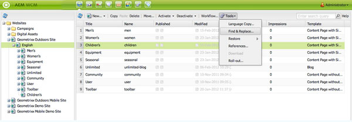

# Pesquisar{#searching}

O ambiente de criação do AEM fornece vários mecanismos de pesquisa de conteúdo, dependendo do tipo de recurso.

>[!NOTE]
>
>Fora do ambiente de criação, outros mecanismos também estão disponíveis para a pesquisa, como o [Construtor de consultas](/help/sites-developing/querybuilder-api.md) e o [CRXDE Lite](/help/sites-developing/developing-with-crxde-lite.md).

## Noções básicas de pesquisa {#search-basics}

Para acessar o painel de pesquisa, clique na guia **Pesquisar** na parte superior do painel esquerdo do console adequado.

O painel de pesquisa permite pesquisar em todas as páginas do site. Ele contém campos e widgets para o seguinte:

* **Texto completo**: pesquisa o texto especificado
* **Modificado antes/depois**: pesquisa apenas as páginas que foram alteradas entre as datas específicas
* **Modelo**: pesquisa apenas as páginas com base no modelo especificado
* **Tags**: pesquisa apenas as páginas com as tags especificadas

>[!NOTE]
>
>Quando a instância é configurada para [ Pesquisa de Lucene](/help/sites-deploying/queries-and-indexing.md), você pode usar o seguinte em **Texto completo**:
>
>* [Curingas](https://lucene.apache.org/core/5_3_1/queryparser/org/apache/lucene/queryparser/classic/package-summary.html#Wildcard_Searches)
>* [Operadores booleanos](https://lucene.apache.org/core/5_3_1/queryparser/org/apache/lucene/queryparser/classic/package-summary.html#Boolean_operators)

   >
   >
* [Expressões regulares](https://lucene.apache.org/core/5_3_1/queryparser/org/apache/lucene/queryparser/classic/package-summary.html#Regexp_Searches)
>* [Agrupamento de campo](https://lucene.apache.org/core/5_3_1/queryparser/org/apache/lucene/queryparser/classic/package-summary.html#Field_Grouping)
>* [Promover](https://lucene.apache.org/core/5_3_1/queryparser/org/apache/lucene/queryparser/classic/package-summary.html#Boosting_a_Term) 

>

Para executar a pesquisa, clique em **Pesquisar** na parte inferior da página. Clique em **Redefinir** para limpar os critérios de pesquisa.

## Filtro {#filter}

Em vários locais, é possível definir um filtro (e limpá-lo) para detalhar e refinar sua exibição:

## Localizar e substituir {#find-and-replace}

No console **Sites** uma opção de menu **Localizar e substituir** permite que você procure e substitua várias instâncias de uma sequência em uma seção do site.

1. Selecione a página raiz, ou pasta, em que você deseja que a ação de localizar e substituir ocorra.
1. Selecione **Ferramentas,** em seguida, **Localizar e substituir**:

   

1. A caixa de diálogo **Localizar e substituir** executa o seguinte:

   * confirma o caminho raiz onde a ação localizar deve ser iniciada
   * define o termo a ser encontrado
   * define o termo que deve substituí-lo
   * indica se a pesquisa deve diferenciar maiúsculas e minúsculas
   * indica se apenas palavras inteiras devem ser encontradas (caso contrário, subsequências também serão encontradas)

   Clicar em **Pré-visualização** lista onde o termo foi encontrado. Você pode selecionar/apagar instâncias específicas a serem substituídas:

   

1. Clique em **Substituir** para substituir todas as instâncias. Você receberá uma solicitação para confirmar a ação.

O escopo padrão do servlet localizar e substituir abrange as seguintes propriedades:

* `jcr:title`
* `jcr:description`
* `jcr:text`
* `text`

O escopo pode ser alterado usando o Console de gerenciamento da Web Apache Felix (por exemplo, em `https://localhost:4502/system/console/configMgr`). Selecione `CQ WCM Find Replace Servlet (com.day.cq.wcm.core.impl.servlets.FindReplaceServlet)` e configure o escopo conforme necessário.

>[!NOTE]
>
>Em uma instalação padrão do AEM, a opção Localizar e substituir usa Lucene como a funcionalidade de pesquisa.
>
>Lucene indexa as propriedades de sequência de até 16k de comprimento. As sequências que passarem disso não serão pesquisadas.
