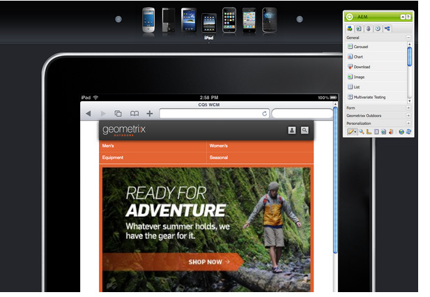

# Criação de uma página para dispositivos móveis  {#authoring-a-page-for-mobile-devices}

Ao criar uma página para dispositivos móveis, a página será exibida de uma forma que emula o dispositivo móvel. Ao criar a página, será possível alternar entre vários emuladores para ver o que o usuário final verá ao acessá-la.

Os dispositivos são agrupados nas recurso de categorias, inteligente e de toque, de acordo com as capacidades dos dispositivos que renderizarão a página. Quando o usuário final acessa uma página para dispositivos móveis, o AEM detectará o dispositivo e enviará a representação que corresponde ao seu grupo de dispositivos.

>[!NOTE]
>
>Para criar um site para dispositivos móveis com base em um site padrão já existente, crie uma live copy do site padrão. (Consulte [Criação de uma Live Copy para diferentes canais](/help/sites-administering/msm-livecopy.md).)
>
>Os desenvolvedores do AEM podem criar novos grupos de dispositivos. (Consulte [Criando Filtros de Grupos de Dispositivos.](/help/sites-developing/groupfilters.md))

Use o procedimento a seguir para criar uma página para dispositivos móveis:

1. No navegador, acesse o menu **Siteadmin** console.
1. Abra o **Produtos** página abaixo **Sites** >> **Site de demonstração do Geometrixx Mobile** >> **Inglês**.

1. Alternar para um emulador diferente. Para fazer isso, é possível:

   * Clique no ícone do dispositivo na parte superior da página.
   * Clique em **Editar** botão na caixa **Sidekick** e selecione o dispositivo no menu suspenso.

1. Arraste e solte a **Texto e imagem** da guia Mobile do Sidekick para a página.
1. Edite o componente e adicione texto. Clique em **OK** para salvar as alterações.

A página tem a mesma aparência do seguinte:

>[!NOTE]
>
>Os emuladores são desativados quando uma página na instância do autor é solicitada em um dispositivo móvel. A criação pode ser feita usando a interface habilitada para toque.
