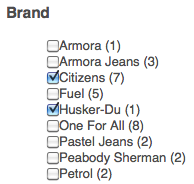

# Adicionar recursos Search&amp;Promote à sua página{#adding-search-promote-features-to-your-page}

Para integrar recursos do Search&amp;Promote ao seu site, use os componentes do Search&amp;Promote para adicionar os seguintes recursos às suas páginas:

* Pesquisa por palavra-chave
* Página de resultados da pesquisa
* Refinamento da pesquisa
* Banners

Observe que é possível usar os recursos do Search&amp;Promote somente se o administrador do AEM tiver ativado eles. Consulte [Integração com o Adobe Search&amp;Promote](/help/sites-administering/search-and-promote.md).

Facetas são configuradas no servidor Search&amp;Promote, assim como as informações fornecidas por cada componente. A tabela a seguir fornece uma breve descrição de cada componente. As seções subsequentes fornecem informações detalhadas sobre seu uso.

<table>
 <tbody>
  <tr>
   <th>componente do Search &amp; Promote</th>
   <th>Descrição</th>
  </tr>
  <tr>
   <td>Banners</td>
   <td>Exibe anúncios em banners. Os banners são selecionados com base nos dados coletados pelo Search &amp; Promote.  </td>
  </tr>
  <tr>
   <td>Navegações estruturais</td>
   <td>Exibe a palavra-chave de pesquisa e a sequência de filtros que o usuário aplicou aos resultados da pesquisa.</td>
  </tr>
  <tr>
   <td>Lista da caixa de seleção - Aspecto</td>
   <td>Uma lista de caixas de seleção para selecionar aspectos para filtrar os resultados da pesquisa.</td>
  </tr>
  <tr>
   <td>Faceta suspensa</td>
   <td>Uma lista suspensa de aspectos para filtrar os resultados da pesquisa.</td>
  </tr>
  <tr>
   <td>Aspecto da lista de links</td>
   <td>Uma lista de links de facetas para filtrar os resultados da pesquisa.</td>
  </tr>
  <tr>
   <td>Paginação</td>
   <td>Controles para navegar pelas páginas dos resultados da pesquisa.</td>
  </tr>
  <tr>
   <td>Resultados</td>
   <td>Exibe os resultados de uma pesquisa por palavra-chave.</td>
  </tr>
  <tr>
   <td>Pesquisar  </td>
   <td>Adiciona um campo de pesquisa à página.</td>
  </tr>
 </tbody>
</table>

## Criação da página de resultados da pesquisa {#creating-the-search-results-page}

Use o console Sites do WCM para criar uma página para mostrar resultados de pesquisas. Os resultados de uma pesquisa de qualquer componente de pesquisa poderão aparecer nessa página se ela usar o mesmo serviço Search&amp;Promote.

Os componentes que permitem aos usuários revisar os resultados da pesquisa são Resultados e Paginação. O componente **Resultados** não possui propriedades configuráveis no modo de Edição ou Design. O componente Resultados simplesmente lista os resultados da pesquisa, que fornecem links para outras páginas, e exibe o número de resultados para a palavra-chave de pesquisa.

O componente **Paginação** permite que os usuários naveguem em várias páginas de resultados de pesquisa. O usuário pode ver o número de páginas, passar para a página seguinte ou anterior, selecionar uma página a ser aberta ou consolidar todos os resultados em uma página.

Você pode configurar as seguintes propriedades do componente no modo de Edição para controlar o comportamento em tempo de execução:

* Ocultar página de resultado único: Selecione essa opção para ocultar os controles de navegação da página quando a pesquisa retornar uma única página de resultados.
* Ocultar primeiro/último: selecione essa opção para impedir que os usuários pulem para a primeira ou a última página de resultados.
* Ocultar anterior/próximo: determina se os usuários podem navegar pelas páginas de resultados em relação à página atual.
* Ocultar Exibir tudo: determina se o usuário pode consolidar todos os resultados da pesquisa em uma única página. Normalmente, fornecer dados paginados usa de maneira mais eficiente os recursos do servidor. Selecione essa opção para impedir a transferência de grandes conjuntos de dados em uma única mensagem de resposta.

### Ativação da filtragem de resultados por facetas {#enabling-the-filtering-of-results-by-facets}

Você pode permitir que os usuários filtrem os resultados da pesquisa por facetas. Os componentes **Faceta de Lista da caixa de seleção**, **Faceta suspensa** e **Faceta de Lista de link** permitem que os usuários selecionem uma ou mais facetas para filtragem. Ao usar esses componentes, você também deve incluir o componente **Caminhos de navegação**. Caminhos de navegação indicam os filtros atuais que são usados.

Os componentes **Faceta de Lista da caixa de seleção**, **Faceta suspensa** e **Faceta de Lista de link** têm as seguintes propriedades que você configura no modo **Editar**:

* **Nome da faceta**: o nome da faceta usada para filtros.

O componente **Face da lista da caixa de seleção** exibe uma lista de facetas com uma caixa de seleção acompanhante. Use uma **Face da lista da caixa de seleção** para que os usuários possam visualizar um subconjunto de resultados que incluem itens de várias facetas. Por exemplo, a faceta **Marca é apropriada porque várias marcas fornecem o mesmo tipo de produto.**

Uma caixa de seleção é exibida para cada faceta associada a um resultado de pesquisa. Quando um usuário marca uma caixa de seleção, a página é recarregada com um conjunto de resultados atualizado. Todas as caixas de seleção permanecem na página, para que os clientes possam adicionar ou remover facetas ao/do filtro a qualquer momento:

O componente **Faceta suspensa** permite que os clientes selecionem um item de faceta de uma lista suspensa. Esse componente é útil quando você deseja que os clientes se concentrem em um único item de faceta de uma só vez. Por exemplo, a faceta Departamento é adequada para permitir que os clientes restrinjam pesquisas de produtos por sexo. John procura *jeans* e depois filtra no departamento masculino.

A lista suspensa é preenchida com as facetas associadas a todos os resultados da pesquisa. Ao selecionar um item na lista suspensa, a página é recarregada com um conjunto de resultados atualizado. Os itens na lista suspensa não são alterados, para que os clientes possam alternar entre facetas a qualquer momento.

O componente **Faceta da lista de links** permite que os clientes reduzam progressivamente o foco em itens categorizados em vários membros de facetas ou facetas.

Os membros da faceta aparecem como uma lista de links. O texto de cada link é o nome de um membro de faceta associado aos resultados atuais da pesquisa. Quando um cliente clica em um link de faceta, a página é recarregada, e um subconjunto dos resultados da pesquisa é exibido. A lista de links é atualizada de acordo, permitindo um foco ainda mais estreito.

Os links na lista também mudam quando um filtro é aplicado a partir de um tipo diferente de componente Search&amp;Promote. O uso de vários tipos de componentes de filtro pode fornecer combinações de filtros eficazes.

O componente **Caminhos de navegação** permite que os clientes vejam os filtros atualmente aplicados aos resultados da pesquisa, na ordem em que foram aplicados. Os clientes podem clicar nos itens no caminho de navegação para reverter para essa combinação de filtros.

Você pode configurar as seguintes propriedades para Caminhos de navegação no modo de Edição, para personalizar a aparência do componente:

* Delimitador: defina o caractere ou sequência de caracteres que atuará como um delimitador entre cada caminho de navegação. O campo Delimitador aceita qualquer sequência de caracteres como entrada. A configuração padrão é: &quot;>&quot; (sem as aspas)
* Delimitador de caminho: defina um caractere ou uma sequência de caracteres para exibição no final dos caminhos de navegação. O campo Delimitador de caminho aceita qualquer sequência de caracteres como entrada. A configuração padrão para isso é *em branco* (ou seja, nada é exibido no final da linha de caminho de navegação)

### Adição de caixas de pesquisa  {#adding-search-boxes}

O componente Pesquisa permite que os clientes realizem pesquisas por palavra-chave. Adicione componentes Pesquisa a cada página na qual você deseja fornecer acesso para pesquisa.

Configure as seguintes propriedades no modo de Edição para controlar o comportamento em tempo de execução:

* Caminho da página de resultados: o caminho para a página que exibe os resultados da pesquisa.
* Ativar opção Completar automaticamente: selecione para que as palavras-chave de pesquisa sugeridas apareçam quando o cliente começar a digitar na caixa de pesquisa.

### Adição de banners {#adding-banners}

O componente Banners exibe anúncios de banner de acordo com as pesquisas do cliente. A lógica no servidor Search&amp;Promote determina o banner a ser exibido. Por exemplo, uma pesquisa por jeans pode fazer com que um banner de moda apareça. Filtrar no departamento masculino pode refinar ainda mais a escolha do banner.

O componente Banners fornece uma propriedade configurável denominada Área do banner. No modo de Edição, selecione um dos valores da propriedade para especificar como o banner é exibido. O serviço Search&amp;Promote determina a lista de valores que você pode selecionar.

### Exemplo de página de pesquisa do Search&amp;Promote {#example-search-promote-search-page}

Este diagrama mostra os componentes que são adicionados a uma página para criar a página de resultados do Search&amp;Promote totalmente funcional abaixo.

 
