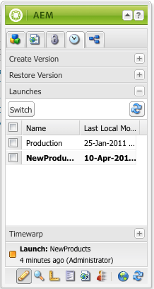

# Edição de inicializações{#editing-launches}

## Edição de páginas de lançamento {#editing-launch-pages}

Quando um lançamento foi criado para uma página (ou um conjunto de páginas), é possível editar o conteúdo na cópia de lançamento da(s) página(s).

1. Abra a página para edição.
1. No Sidekick, selecione a guia **Controle de versão** e, em seguida, expanda o grupo **Lançamentos**. O título do lançamento que está sendo editado usa uma fonte em negrito.

   

1. Selecione o lançamento em que você deseja trabalhar e clique em **Alternar**.
1. Comece a editar.

   >[!NOTE]
   >
   >Você pode usar a guia **Página** do sidekick para realizar ações como **Criar página secundária**, entre outras.

## Edição de configuração de lançamento {#editing-a-launch-configuration}

Depois de criar um lançamento, você pode alterar seu nome e sua data. Também é possível especificar uma imagem que será associada ao lançamento.

1. Abra a página de administração de lançamentos ([http://localhost:4502/libs/launches/content/admin.html](http://localhost:4502/libs/launches/content/admin.html)).

1. Selecione o lançamento necessário e clique em **Editar** para abrir a caixa de diálogo:

   * Na guia **Geral**, você pode editar:

      * **Título**
      * **Data de ativação**: equivalente à data de lançamento
      * **Pronto para produção**

      Consulte [Lançamentos - a ordem de eventos](/help/sites-authoring/launches.md#launches-the-order-of-events) para obter informações sobre o propósito e a interação desses campos.

   * Na guia **Imagem**, você pode fazer upload de um arquivo de imagem.

1. Clique em **Salvar**.

## Descoberta do status de lançamento de uma página {#discovering-the-launch-status-of-a-page}

Quando você está editando um lançamento de uma página, as informações sobre esse lançamento aparecem na parte inferior da guia **Controle de versão** do Sidekick:

* O nome do lançamento.
* O tempo desde a última alteração.
* O usuário que fez a última alteração.
* O status do sinalizador de **Pronto para produção** (laranja = não definido; verde = definido).

