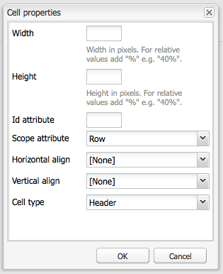

# Criação de conteúdo acessível (Conformidade com a WCAG 2.0)  {#creating-accessible-content-wcag-conformance}

>[!CAUTION]
>
>Como a interface clássica foi descontinuada no AEM 6.4, o conteúdo desta página não foi atualizado para WCAG 2.1.
>
>Consulte as seguintes páginas para obter detalhes relacionados ao AEM e à WCAG 2.1:
>
>* [AEM e diretrizes de acessibilidade na Web](/help/managing/web-accessibility.md)
>* [Um guia rápido para a WCAG 2.1](/help/managing/qg-wcag.md)
>* [Criação de conteúdo acessível (Conformidade com o WCAG 2.1)](/help/sites-authoring/creating-accessible-content.md)

A WCAG 2.0 consiste em um conjunto de diretrizes de tecnologia independentes e critérios de sucesso para ajudar a tornar o conteúdo da Web acessível e utilizável para pessoas com necessidades especiais.

>[!NOTE]
>
>Consulte também:
>
>* [Guia rápido para a WCAG 2.0](/help/managing/qg-wcag.md)
>* [Configurar o editor de rich text para produzir conteúdo acessível](/help/sites-administering/rte-accessible-content.md)
>

Essas diretrizes são classificadas de acordo com os três níveis de conformidade: Nível A (o mais baixo), Nível AA e Nível AAA (o mais alto). Em resumo, os níveis são definidos da seguinte maneira:

* **Nível A**: o site atinge um nível mínimo básico de acessibilidade. Para atingir esse nível, todos os Critérios de sucesso do Nível A são cumpridos.
* **Nível AA:** O nível ideal de acessibilidade que você deve almejar, no qual seu site atinge um nível aprimorado de acessibilidade, para que seja acessível à maioria das pessoas na maior parte das situações usando a maioria das tecnologias. Para atingir esse nível, todos os Critérios de sucesso do Nível A e Nível AA são cumpridos.
* **Nível AAA:** O site atinge um nível muito elevado de acessibilidade. Para atingir esse nível, todos os Critérios de sucesso do Nível A, Nível AA e Nível AAA são cumpridos.

Ao criar o seu site, é necessário determinar o nível global com o qual você gostaria que ele estivesse em conformidade.

A seção a seguir apresenta as [Diretrizes da WCAG 2.0](https://www.w3.org/TR/WCAG20/#guidelines) com os critérios de sucesso relacionados aos [níveis de conformidade](https://www.w3.org/TR/UNDERSTANDING-WCAG20/conformance.html) A e AA.

>[!NOTE]
>
>Como não é possível cumprir todos os Critérios de sucesso de Nível AAA para certos tipos de conteúdo, não é recomendável que esse nível de conformidade seja exigido como uma política geral.

>[!NOTE]
>
>Este documento usa o seguinte:
>
>* os nomes curtos para as [Diretrizes da WCAG 2.0](https://www.w3.org/TR/WCAG20/#guidelines).
>* a numeração usada nas [Diretrizes da WCAG 2.0](https://www.w3.org/TR/WCAG20/#guidelines) para auxiliar na referência cruzada com o site da WCAG.
>

## Princípio 1: perceptível    {#principle-perceivable}

[Princípio 1: perceptível - As informações e os componentes da interface do usuário têm de ser apresentados aos usuários de formas perceptíveis.](https://www.w3.org/TR/WCAG20/#perceivable)

### Alternativas em texto (1.1)       {#text-alternatives}

[Diretriz 1.1 Alternativas em texto: Fornece alternativas em texto para qualquer conteúdo não textual, para que seja possível alterá-lo para outras formas mais adequadas à necessidade do indivíduo, como impressão em caracteres ampliados, braille, fala, símbolos ou linguagem mais simples.](https://www.w3.org/TR/WCAG20/#text-equiv)

### Conteúdo não textual (1.1.1) {#non-text-content}

* Critério de Sucesso 1.1.1
* Nível A
* Conteúdo não textual: todo o conteúdo não textual que é apresentado ao usuário tem uma alternativa em texto que serve um propósito equivalente, exceto para as situações indicadas abaixo.

#### Finalidade - Conteúdo não textual (1.1.1) {#purpose-non-text-content}

As informações em uma página da Web podem ser fornecidas em vários formatos não textuais diferentes, como imagens, vídeos, animações, gráficos e gráficos. As pessoas cegas ou com deficiências visuais graves não conseguem ver o conteúdo não textual, mas podem acessar o conteúdo textual fazendo com que seja lido por um leitor de tela ou apresentado na forma tátil por um dispositivo de exibição em Braille. Portanto, ao fornecer alternativas em texto para o conteúdo no formato gráfico, as pessoas que não puderem vê-lo podem acessar uma versão equivalente das informações fornecidas.

Uma vantagem adicional é que as alternativas em texto permitem que o conteúdo não textual seja indexado pela tecnologia do mecanismo de pesquisa.

#### Como cumprir - Conteúdo não textual (1.1.1) {#how-to-meet-non-text-content}

Para gráficos estáticos, o requisito básico é o de proporcionar uma alternativa em texto equivalente para o gráfico. Este método é feito no **Texto Alternativo** campo:

>[!NOTE]
>
>Alguns componentes prontos para uso, como o **Carrossel** e a **Apresentação de slides**, não fornecem um meio de adicionar descrições de texto alternativas a imagens. Ao implementar as versões desses componentes para a instância do AEM, sua equipe de desenvolvimento deve configurá-los para dar suporte à `alt` atributo. Isso garante que os autores possam adicioná-lo ao conteúdo (consulte [Adicionar compatibilidade com elementos e atributos de HTML adicionais](/help/sites-administering/rte-accessible-content.md#add-support-for-more-html-elements-and-attributes)).

A variável **Texto Alternativo** O campo está disponível no **Avançado** guia propriedades da imagem de **Imagem** caixa de diálogo do componente:


AEM adiciona um **Texto Alternativo** em suas imagens por padrão. Para a interface clássica, há dois cenários diferentes para como o atributo padrão é criado, embora o valor padrão possa não ser suficiente como alternativa e provavelmente deve ser editado no **Avançado** guia propriedades da imagem:

* Arquivo:

  Uma imagem é carregada a partir do disco rígido do usuário. Se você adicionar um componente de imagem a uma página e escolher uma imagem do seu disco rígido, ou de outra fonte, o valor padrão para **Texto Alternativo** é `file`. Esse valor deve ser alterado no **Avançado** guia de propriedades da imagem. Novamente, esse valor não é exibido no **Texto Alternativo** mas quando o valor é alterado, o novo valor é exibido no campo.

* Ativo:

  Uma imagem é adicionada do repositório de ativos digitais. Se você arrastar uma imagem do repositório de ativos digitais para uma página da Web, a variável **Título** e **Texto Alternativo** os valores para essa imagem são retirados dos metadados para essa imagem.

>[!NOTE]
>
>Em ambos os cenários acima, o padrão é **Texto Alternativo** o valor não está visível no **Propriedades avançadas da imagem** guia. Para alterar o valor padrão, basta inserir um novo valor no campo **Texto Alternativo** campo.

>[!NOTE]
>
>Se a imagem for meramente decorativa (consulte [Criar boas alternativas de texto](#creating-good-text-alternatives)), você pode inserir um espaço no campo **Texto Alternativo** usando a barra de espaço. Isso cria um espaço em branco `alt` atributo, que solicita que um leitor de tela ignore a imagem.

#### Criar boas alternativas de texto {#creating-good-text-alternatives}

Existem várias formas de conteúdo não textual, portanto, o valor da alternativa em texto depende da função que o gráfico desempenha na página da Web. Algumas regras básicas gerais incluem o seguinte:

* As alternativas em texto devem ser sucintas, mas devem capturar claramente as informações essenciais fornecidas pelo conteúdo não textual.
* Descrições longas (mais de 100 caracteres) devem ser evitadas. Se um texto alternativo exigir mais detalhes:

   * forneça uma breve descrição no texto alternativo
   * e inclua uma descrição de texto mais longa em outro lugar na mesma página ou em uma página da web separada. Insira um link para essa descrição separada na imagem ou no texto adjacente à imagem.

* O texto alternativo não deve replicar o conteúdo fornecido no formulário de texto próximo à mesma página. Lembre-se que muitas imagens são ilustrações de pontos já abordados no texto de uma página, então é possível que já exista uma alternativa de texto detalhada.
* Se o conteúdo não textual for um link para outra página ou documento e não houver outro texto fazendo parte do mesmo link, o texto alternativo para a imagem deverá indicar o destino do link. Ele não deve descrever a imagem.
* Se o conteúdo não textual estiver contido em um elemento de botão e não houver texto fazendo parte do mesmo botão, o texto alternativo da imagem deverá indicar a funcionalidade do botão, não descrever a imagem.
* É aceitável disponibilizar um texto alternativo vazio (nulo) para uma imagem, mas somente se ela não tiver um texto alternativo. Por exemplo, é um gráfico meramente decorativo. Ou, se o texto equivalente já existir no texto da página.

A variável [W3C draft: técnicas de HTML5 para fornecer alternativas em texto úteis](https://html.spec.whatwg.org/multipage/images.html#alt) A tem mais detalhes e exemplos de provisão de texto alternativo apropriado para imagens de diferentes tipos.

Tipos específicos de conteúdo não textual que necessitam de alternativas em texto podem incluir:

* Fotos ilustrativas:

  Estas são imagens de pessoas, objetos ou lugares. Reflita sobre a função da fotografia na página; é provável que um equivalente em texto adequado seja *Foto de [objeto]*, mas pode depender do contexto.

* Ícones:

  Pequenos pictogramas (gráficos) que transmitem informações específicas. Eles devem ser usados de forma consistente em uma página e um site. Todas as instâncias do ícone em uma página ou site devem ter a mesma alternativa em texto curta e sucinta, a menos que isso resulte em duplicação desnecessária do texto adjacente.

* Gráficos:

  Normalmente, eles representam dados numéricos. Portanto, uma opção para fornecer uma alternativa em texto pode ser incluir um breve resumo das principais tendências mostradas no gráfico. Se necessário, forneça também uma descrição mais detalhada no texto usando o **Descrição** no campo **Avançado** guia de propriedades da imagem. Além disso, é possível fornecer os dados de origem em forma de tabela em outro lugar da página ou site.

  

  Para fornecer uma alternativa para este gráfico de exemplo, adicione uma concisa `alt` para a própria imagem e, em seguida, siga a imagem com uma alternativa em texto completo.

  ```xml
  <p></p>
  <p> Figure 1. Distribution of Articles by Journal Category.
  Pie chart: Language=68%, Education=14% and Science=18%.</p>
  ```

  >[!NOTE]
  >
  >O trecho acima é usado apenas para ilustrar a ordem. Use o **Imagem** componente, em vez do `img src` referência usada acima.

  No AEM, é possível usar uma combinação dos seguintes **Texto Alternativo** e **Descrição** campos na caixa de diálogo de configuração da imagem - como em [Como cumprir - Conteúdo não textual (1.1.1)](#how-to-meet-non-text-content).

* Mapas, diagramas, fluxogramas:

  Para gráficos que fornecem dados espaciais (por exemplo, para ser compatível com a descrição das relações entre objetos ou um processo), verifique se a mensagem principal é fornecida no formato de texto.  Para mapas, fornecer um equivalente de texto completo provavelmente não será prático, mas se o mapa for fornecido como uma maneira de ajudar as pessoas a encontrar o caminho para um determinado local, o texto alternativo da imagem do mapa poderá indicar brevemente a informação *Mapa de X* e, em seguida, fornecer instruções para acessar esse local no texto de outro lugar da página ou por meio do campo **Descrição** na guia **Avançado** do componente **Imagem**.

* CAPTCHAs:

  Um CAPTCHA é um *Teste de Turing público completamente automatizado para diferenciação entre computadores e humanos*. É uma verificação de segurança usada em páginas da Web para distinguir seres humanos de softwares mal-intencionados, mas que pode causar barreiras de acessibilidade. São imagens que exigem que os usuários descrevam o que eles veem para passar em um teste de segurança. Não é possível fornecer uma alternativa em texto para a imagem. Portanto, você deve considerar soluções alternativas não gráficas.

  O W3C fornece várias sugestões, como as seguintes. Cada uma dessas abordagens tem suas próprias vantagens e desvantagens.

   * Enigmas de lógica
   * O uso de som em vez de imagens
   * Contas e filtros de spam de uso limitado.

* Imagens de fundo:

  Essas imagens são obtidas usando as Folhas de estilo em cascata (CSS), em vez de em HTML. Não é possível especificar um valor de texto alternativo. Portanto, as imagens de fundo não devem fornecer informações textuais importantes; caso forneçam, essas informações também devem ser fornecidas no texto da página.

  No entanto, é importante que um plano de fundo alternativo seja exibido quando a imagem não puder ser exibida.

  >[!NOTE]
  >
  >Deve haver um nível adequado de contraste entre o plano de fundo e o texto de primeiro plano. Esse contraste é discutido com mais detalhes na seção [Contraste (Mínimo) (1.4.3)](#contrast-minimum).

#### Mais informações - Conteúdo não contextual (1.1.1) {#more-information-non-text-content}

* [Noções sobre o Critério de sucesso 1.1.1](https://www.w3.org/TR/UNDERSTANDING-WCAG20/text-equiv-all.html)
* [Como cumprir o Critério de sucesso 1.1.1](https://www.w3.org/WAI/WCAG21/quickref/?versions=2.0#text-alternatives)
* [W3C: técnicas de HTML5 para fornecer alternativas em texto úteis](https://html.spec.whatwg.org/multipage/images.html#alt)
* [Explicação do W3C sobre as alternativas para CAPTCHAs](https://www.w3.org/TR/turingtest/)

### Mídia com base no tempo (1.2)       {#time-based-media}

[Diretriz de mídia com base no tempo 1.2: fornece alternativas para a mídia com base no tempo.](https://www.w3.org/TR/WCAG20/#text-equiv)

Essas informações tratam do conteúdo da Web que é *baseado em tempo*. Isso abrange o conteúdo que o usuário pode reproduzir (como vídeo, áudio e conteúdo animado) e pode ser pré-gravado ou ter transmissão ao vivo.

### Apenas áudio e apenas vídeo (pré-gravado) (1.2.1)    {#audio-only-and-video-only-pre-recorded}

* Critério de sucesso 1.2.1
* Nível A
* Apenas áudio e apenas vídeo (pré-gravado): para mídia somente de áudio e somente de vídeo pré-gravada, as informações a seguir são verdadeiras, exceto quando o áudio ou vídeo for uma alternativa em mídia para o texto e for claramente identificado como tal:

   * Apenas áudio pré-gravado: é fornecida uma alternativa para mídia baseada no tempo que apresenta informações equivalentes para conteúdo apenas áudio pré-gravado.
   * Somente vídeo pré-gravado: é fornecida uma alternativa para mídia com base no tempo ou uma faixa de áudio que apresenta informações equivalentes para conteúdo apenas de vídeo pré-gravado.

#### Propósito - Apenas áudio e apenas vídeo (pré-gravado) (1.2.1)    {#purpose-audio-only-and-video-only-pre-recorded}

Algumas pessoas podem enfrentar problemas de acessibilidade em vídeos e áudios, como:

* Pessoas com deficiências visuais em casos onde não há trilha sonora ou esta não é suficiente para informá-las do que está acontecendo no vídeo ou animação;
* Pessoas com deficiências auditivas ou surdas, que não conseguem ouvir a trilha sonora;
* Pessoas que podem ouvir a trilha sonora, mas não entendem o que está sendo falado (por exemplo, porque está em um idioma que não entendem).

O vídeo ou áudio também pode estar indisponível para pessoas que usam navegadores ou dispositivos que não são compatíveis com a reprodução de conteúdo em formatos de mídia específicos, como o Adobe Flash.

Fornecer essas informações em um formato diferente, como texto (ou áudio para vídeos sem áudio), pode torná-las acessíveis para pessoas que não conseguem acessar o conteúdo original.

#### Como cumprir - Apenas áudio e apenas vídeo (pré-gravado) (1.2.1)    {#how-to-meet-audio-only-and-video-only-pre-recorded}

* Se o conteúdo for um áudio pré-gravado sem vídeo (como um podcast):

   * Forneça um link imediatamente antes ou depois do conteúdo para obter uma transcrição do texto do conteúdo de áudio.

     A transcrição deve ser uma página de HTML com um equivalente em texto de todo o conteúdo falado e não-falado importante. Ele também deve indicar quem está falando, uma descrição do cenário, expressões vocais e uma descrição de qualquer outro áudio significativo.

* Se o conteúdo for uma animação ou vídeo pré-gravado sem áudio:

   * Forneça um link imediatamente antes ou depois do conteúdo para uma descrição de texto equivalente das informações fornecidas no vídeo
   * Ou uma descrição de áudio equivalente em um formato de áudio usado com frequência, como MP3.

>[!NOTE]
>
>Se o conteúdo de áudio ou vídeo for fornecido como uma alternativa ao conteúdo que existe em outro formato em uma página da Web, não será necessário seguir os requisitos acima. Por exemplo, se um vídeo ilustra uma lista de instruções de texto, ele não exigirá uma alternativa, pois as instruções de texto já agem como uma alternativa ao vídeo.

Inserir multimídia, especificamente conteúdo de Flash, nas páginas da Web do AEM é semelhante a inserir uma imagem. No entanto, como o conteúdo multimídia é muito mais do que uma imagem estática, há várias configurações e opções diferentes para controlar como a multimídia é reproduzida.

>[!NOTE]
>
>Ao usar multimídia com um conteúdo informativo, é necessário criar também links para as alternativas. Por exemplo, para incluir uma transcrição de texto, crie uma página HTML para exibir a transcrição e, em seguida, adicione um link ao lado ou abaixo do conteúdo de áudio.

#### Mais informações - Apenas áudio e apenas vídeo (pré-gravado) (1.2.1) {#more-information-audio-only-and-video-only-pre-recorded}

* [Noções sobre o Critério de sucesso 1.2.1](https://www.w3.org/TR/UNDERSTANDING-WCAG20/media-equiv-av-only-alt.html)
* [Como cumprir o Critério de sucesso 1.2.1](https://www.w3.org/WAI/WCAG21/quickref/?versions=2.0#time-based-media)

### Legendas (pré-gravadas) (1.2.2)    {#captions-pre-recorded}

* Critério de sucesso 1.2.2
* Nível A
* Legendas (pré-gravadas): as legendas são disponibilizadas para todo o conteúdo de áudio pré-gravado na multimídia sincronizada, exceto quando a mídia é uma alternativa para texto e é claramente identificada como tal.

#### Propósito - Legendas (pré-gravadas) (1.2.2)    {#purpose-captions-pre-recorded}

Os indivíduos surdos ou com deficiência auditiva não conseguem ou têm grande dificuldade para acessar o conteúdo de áudio. As legendas são equivalentes em texto para áudio falado e não falado, exibidas na tela no momento adequado durante o vídeo. Elas permitem que os indivíduos que não conseguem ouvir o áudio entendam o que está acontecendo.

>[!NOTE]
>
>Não são necessárias legendas quando houver texto adequado ou equivalentes não textuais (que forneçam informações diretamente equivalentes) disponíveis na mesma página do vídeo ou da animação.

#### Como cumprir - Legendas (pré-gravadas) (1.2.2)    {#how-to-meet-captions-pre-recorded}

As legendas podem ser:

* Abertas: sempre visíveis quando o vídeo é reproduzido
* Ocultas: as legendas podem ser ativadas ou desativadas pelo usuário

Use as legendas ocultas sempre que possível. Ele oferece aos usuários a escolha de visualizar ou não legendas.

Para as legendas ocultas, crie e forneça um arquivo de legenda sincronizada em um formato apropriado, como [SMIL](https://www.w3.org/AudioVideo/), junto com o arquivo de vídeo.

Consulte os tutoriais em [Mais informações - Legendas (pré-gravadas) (1.2.2)](#more-information-captions-pre-recorded). Forneça uma nota para informar aos usuários que legendas estão disponíveis para o vídeo.

Se você precisar usar legendas abertas, incorpore o texto à faixa de vídeo. Esse método é obtido usando aplicativos de edição de vídeo que permitem a sobreposição de títulos no vídeo.

#### Mais informações - Legendas (pré-gravadas) (1.2.2)    {#more-information-captions-pre-recorded}

* [Noções sobre o Critério de sucesso 1.2.2](https://www.w3.org/TR/UNDERSTANDING-WCAG20/media-equiv-captions.html):
* [Como cumprir o Critério de sucesso 1.2.2](https://www.w3.org/WAI/WCAG21/quickref/?versions=2.0#time-based-media)
* [W3C: Multimídia sincronizada](https://www.w3.org/AudioVideo/)
* [Legendas, transcrições e descrições de áudio - pelo WebAIM](https://webaim.org/techniques/captions/)

### Descrição de áudio ou alternativa de mídia (pré-gravada) (1.2.3)    {#audio-description-or-media-alternative-pre-recorded}

* Critério de Sucesso 1.2.3
* Nível A
* Descrição de áudio ou alternativa de mídia (pré-gravada): uma alternativa para mídias com base no tempo ou uma descrição de áudio do conteúdo de vídeo pré-gravado é fornecida para a mídia sincronizada, exceto quando a mídia é uma alternativa para o texto e é claramente identificada como tal.

#### Propósito - Descrição de áudio ou alternativa de mídia (pré-gravada) (1.2.3)    {#purpose-audio-description-or-media-alternative-pre-recorded}

Os indivíduos cegos ou deficientes visuais enfrentam barreiras de acessibilidade se as informações em um vídeo ou uma animação forem fornecidas apenas visualmente. Ou, se a trilha sonora não fornecer informações suficientes para permitir a compreensão do que está acontecendo visualmente.

#### Como cumprir - Descrição de áudio ou alternativa de mídia (pré-gravada) (1.2.3)    {#how-to-meet-audio-description-or-media-alternative-pre-recorded}

Há duas abordagens que podem ser adotadas para atender a esse critério de sucesso. Ambas são aceitáveis:

1. Incluir uma descrição de áudio adicional para o conteúdo de vídeo. Você pode realizar essa abordagem de uma das três formas a seguir:

   * Durante as pausas na caixa de diálogo existente, forneça informações sobre as alterações na cena que não são apresentadas como parte da faixa de áudio existente;
   * Forneça uma faixa de áudio nova, adicional e opcional que contenha a trilha sonora original, mas incluindo também informações de áudio extras sobre as mudanças de cena.

      * Os usuários podem alternar entre a faixa de áudio existente (que *não* contém uma descrição de áudio) e a nova faixa de áudio (que *faz* contém uma descrição de áudio).
      * Esse método evita a interrupção para usuários que não precisam da descrição adicional.

   * Crie uma segunda versão do conteúdo de vídeo para permitir descrições de áudio mais extensas. Isso reduz as dificuldades associadas ao fornecimento de descrições de áudio detalhadas dentro das lacunas entre as caixas de diálogo existentes, pausando temporariamente o áudio e o vídeo em pontos apropriados. Como resultado, uma descrição de áudio muito mais longa pode ser fornecida, antes de retornar à ação. Como no exemplo anterior, a melhor forma de fornecer essa opção é disponibilizar uma faixa de áudio extra opcional, para evitar a interrupção de usuários que não precisam de uma descrição adicional.

1. Forneça uma transcrição de texto que seja um equivalente de texto adequado dos elementos visuais e de áudio do vídeo ou da animação. Ele deve incluir, quando apropriado, uma indicação de quem está falando, uma descrição do cenário, expressões vocais. Dependendo do tamanho, você pode colocar a transcrição na mesma página do vídeo ou animação ou em uma página separada; caso escolha a última opção, forneça um link para a transcrição ao lado do vídeo ou animação.

Detalhes exatos de como criar um vídeo descrito por áudio estão fora do escopo desse guia. A criação de descrições de vídeo e áudio pode ser demorada, mas outros produtos de Adobe podem ajudar a realizar essas tarefas. Se você criar o conteúdo no Adobe Flash Professional, também será necessário criar um script para solicitar que o usuário baixe o plug-in adequado e fornecer uma alternativa em texto por meio do elemento `<noscript>`.

#### Mais informações - Descrição de áudio ou alternativa de mídia (pré-gravada) (1.2.3) {#more-information-audio-description-or-media-alternative-pre-recorded}

* [Noções sobre o Critério de sucesso 1.2.3](https://www.w3.org/TR/UNDERSTANDING-WCAG20/media-equiv-audio-desc.html):
* [Como cumprir o Critério de sucesso 1.2.3](https://www.w3.org/WAI/WCAG21/quickref/?versions=2.0#qr-media-equiv-audio-desc)
* [Adobe Encore CS5](https://helpx.adobe.com/premiere-pro/using/whats-new.html)

### Legendas (ao vivo) (1.2.4)        {#captions-live}

* Critério de sucesso 1.2.4
* Nível AA
* Legendas (ao vivo): são fornecidas legendas para todo o conteúdo de áudio ao vivo na mídia sincronizada.

#### Propósito - Legendas (ao vivo) (1.2.4)       {#purpose-captions-live}

Esse critério de sucesso é idêntico às [Legendas (pré-gravadas)](#captions-pre-recorded), já que aborda as barreiras de acessibilidade enfrentadas pelos indivíduos surdos ou com deficiências auditivas, exceto que esse critério de sucesso lida com as apresentações ao vivo, como webcasts.

#### Como cumprir - Legendas (ao vivo) (1.2.4) {#how-to-meet-captions-live}

Siga as orientações fornecidas para [Legendas (pré-gravadas)](#captions-pre-recorded) acima. No entanto, devido à natureza viva dos meios de comunicação social, a disposição da legenda tem de ser criada o mais rapidamente possível e em resposta ao que está a acontecer. Portanto, você deve considerar o uso de legendas em tempo real ou ferramentas de fala para texto.

Instruções detalhadas estão além do escopo desse documento, mas os seguintes recursos disponibilizam informações úteis:

* [WebAIM: legendagem em tempo real](https://webaim.org/techniques/captions/realtime)
* [AccessIT (University of Washington): as legendas podem ser geradas automaticamente usando reconhecimento de voz?](https://www.washington.edu/doit/programs/accessit?1209)

#### Mais informações - Legendas (ao vivo) (1.2.4)    {#more-information-captions-live}

* [Noções sobre o Critério de sucesso 1.2.4](https://www.w3.org/TR/UNDERSTANDING-WCAG20/media-equiv-real-time-captions.html)
* [Como cumprir o Critério de sucesso 1.2.4](https://www.w3.org/WAI/WCAG21/quickref/?versions=2.0#qr-media-equiv-real-time-captions)

### Descrição de áudio (pré-gravado) (1.2.5)        {#audio-description-pre-recorded}

* Critério de Sucesso 1.2.5
* Nível AA
* Descrição de áudio (pré-gravado): uma descrição de áudio é fornecida para todo o conteúdo de vídeo pré-gravado na mídia sincronizada.

#### Propósito - Descrição de áudio (pré-gravado) (1.2.5)    {#purpose-audio-description-pre-recorded}

Esse critério de sucesso é idêntico à [Descrição de áudio ou alternativa de mídia (pré-gravada)](#audio-description-or-media-alternative-pre-recorded), exceto que os autores devem fornecer uma descrição de áudio muito mais detalhada para estar em conformidade com o Nível AA.

#### Como cumprir - Descrição de áudio (pré-gravado) (1.2.5)    {#how-to-meet-audio-description-pre-recorded}

Siga as orientações fornecidas para a [Descrição de áudio ou alternativa de mídia (pré-gravada)](#audio-description-or-media-alternative-pre-recorded).

#### Mais informações - Descrição de áudio (pré-gravado) (1.2.5)    {#more-information-audio-description-pre-recorded}

* [Noções sobre o Critério de sucesso 1.2.5](https://www.w3.org/TR/UNDERSTANDING-WCAG20/media-equiv-audio-desc-only.html)
* [Como cumprir o Critério de sucesso 1.2.5](https://www.w3.org/WAI/WCAG21/quickref/?versions=2.0#qr-media-equiv-audio-desc-only)

### Adaptável (1.3)       {#adaptable}

[Diretriz 1.3 Adaptável: crie conteúdo que pode ser apresentado de diferentes maneiras (por exemplo, layout mais simples) sem perder informações ou estrutura.](https://www.w3.org/TR/WCAG20/#content-structure-separation)

Esta diretriz abrange os requisitos necessários para fornecer suporte a pessoas que:

* pode não ser capaz de acessar as informações apresentadas por um autor em um *padrão* layout de página da Web bidimensional, com várias colunas e colorido

* usam uma exibição visual alternativa ou apenas de áudio, como um texto grande ou contraste alto.

### Informações e Relações (1.3.1)          {#info-and-relationships}

* Critério de Sucesso 1.3.1
* Nível A
* Informações e relacionamentos: as informações, a estrutura e os relacionamentos transmitidos por meio da apresentação podem ser determinados de forma programática ou estão disponíveis no texto.

#### Propósito - Informações e Relações (1.3.1)       {#purpose-info-and-relationships}

Muitas tecnologias de assistência utilizadas por indivíduos com deficiência contam com informações estruturais para exibir ou produzir conteúdo de forma eficiente. Essas informações estruturais podem assumir a forma de cabeçalhos de página, cabeçalhos de linha e coluna de tabela e tipos de lista. Por exemplo, um leitor de tela pode permitir que um usuário navegue por uma página de cabeçalho em cabeçalho. No entanto, caso a estrutura do conteúdo da página pareça depender exclusivamente do estilo visual, em vez do HTML subjacente, não haverá informações estruturais disponíveis para as tecnologias de acessibilidade e sua capacidade de facilitar a navegação será limitada.

Esse critério de sucesso existe para garantir que a informação estrutural seja fornecida por meio do HTML, para que os navegadores e as tecnologias assistivas possam acessar e aproveitar as informações.

#### Como cumprir - Informações e Relações (1.3.1)     {#how-to-meet-info-and-relationships}

O AEM facilita a criação de páginas da Web usando os elementos de HTML adequados. Abra o conteúdo da página no RTE (um componente de Texto) e use o **Formato** para especificar o elemento estrutural apropriado (por exemplo, parágrafo e cabeçalho).

A imagem a seguir mostra um texto que foi estilizado como texto de parágrafo; a exibição do código-fonte em uso mostra que ele tem a abertura e o fechamento corretos &lt;p> e &lt;/p> específicos.


Verifique se as suas páginas da Web têm a estrutura apropriada ao:

* **Utilização de cabeçalhos:**  

  Desde que você tenha os recursos de acessibilidade do RTE ativados (consulte [AEM e acessibilidade](/help/sites-administering/rte-accessible-content.md)), o AEM oferece três níveis de cabeçalho de página. É possível usá-los para identificar seções e subseções de conteúdo. O cabeçalho 1 é o nível mais alto, o Cabeçalho 3 o mais baixo. O administrador do sistema pode configurar o sistema para permitir o uso de mais níveis de cabeçalho.

  A imagem a seguir demonstra um exemplo dos diferentes tipos de cabeçalhos.

  

* **Texto destacado**:

  Use o  elemento ou para indicar ênfase. Não use os cabeçalhos para destacar o texto dentro dos parágrafos.

   * Destaque o texto que deseja enfatizar;
   * Clique no link **B** ícone (para &lt;strong>) ou o **I** ícone (para &lt;em>) mostrada na **Propriedades** (verifique se HTML está selecionado).

  >[!NOTE]
  >
  >O RTE em uma instalação padrão do AEM está configurado para usar:
  >
  >* &lt;b> para &lt;strong>
  * &lt;i> para &lt;em>
  >
  Eles são efetivamente os mesmos, mas  e  são preferíveis, pois são html semanticamente corretos. Sua equipe de desenvolvimento pode configurar o RTE para usar  e  (em vez de  e ), ao desenvolver a instância do projeto.

* **Use listas**: você pode usar o HTML para especificar três diferentes tipos de listas:

   * A variável `<ul>` elemento é usado para *desordenado* listas com marcadores. Os itens da lista individual são identificados usando o `<li>` elemento.

     no RTE, use a variável **Lista com marcadores** ícone.

   * O elemento `<ol>` é usado para as listas *numeradas*. Os itens da lista individual são identificados usando o `<li>` elemento.

     No RTE, use o ícone **Lista numerada**.

  Se desejar alterar o conteúdo existente em um tipo de lista específica, destaque o texto e selecione o tipo de lista apropriado. Como no exemplo anterior, que mostra como o texto de parágrafo é inserido, os elementos da lista apropriados são adicionados automaticamente ao HTML, mas você pode visualizá-los na exibição de edição de origem.

  >[!NOTE]
  >
  A variável `<dl>` elemento não é suportado pelo RTE.

* **Usar tabelas**:

  As tabelas de dados devem ser identificadas usando os elementos da tabela de HTML:

   * um elemento `<table>`
   * um elemento `<tr>` para cada linha da tabela
   * um elemento `<th>` para cada linha e cabeçalho da coluna
   * um elemento `<td>` para cada célula de dados

  >[!NOTE]
  >
  As tabelas devem ser realizadas com o **Tabela** componente. Embora as tabelas possam ser criadas no componente de Texto, isso não é recomendado.

  Além disso, as tabelas acessíveis usam os seguintes elementos e atributos:

   * O elemento `<caption>` é usado para fornecer uma legenda visível para a tabela. As legendas por padrão aparecem centralizadas acima da tabela, mas podem ser posicionadas adequadamente usando CSS. A legenda é associada à tabela de forma programada, portanto, é um método útil para fornecer uma introdução ao conteúdo.
   * O elemento `<h3 class="summary">` auxilia os usuários com deficiências visuais a compreender de forma mais fácil as informações apresentadas em uma tabela, fornecendo um resumo do que pode ser visto. Isso é particularmente útil quando layouts complexos ou não convencionais são usados (esse atributo não é exibido no navegador, somente é lido nas tecnologias de assistência).
   * O `scope` atributo do elemento `<th>` é usado para indicar se uma célula representa um cabeçalho de uma linha ou de uma coluna específica. Uma abordagem semelhante é a de usar o cabeçalho e os atributos de id em tabelas complexas, onde as células de dados podem ser associadas a um ou mais cabeçalhos.

  >[!NOTE]
  >
  Por padrão, esses elementos e atributos não estão diretamente disponíveis, embora o administrador do sistema possa adicionar o suporte para esses valores na caixa de diálogo **Propriedades da tabela** (consulte [Adicionar suporte para outros elementos e atributos de HTML](/help/sites-administering/rte-accessible-content.md#add-support-for-more-html-elements-and-attributes)).

  Ao adicionar um **Tabela**, você pode configurar **Propriedades da tabela** usando o diálogo.

   * uma **Legenda**.
   * Remova qualquer valor padrão para **Largura**, **Altura**, **Borda**, **Preenchimento da célula e** **Espaçamento entre células**. já que essas propriedades podem ser definidas em uma planilha de estilos global.

  

  Em seguida, você pode usar o **Propriedades da célula** para escolher se a célula é uma célula de dados ou de cabeçalho e, se for uma célula de cabeçalho, se ela se relaciona a uma linha ou coluna ou ambas:

  

* **Tabelas de dados complexos:**

  Às vezes, quando há tabelas complexas com dois ou mais níveis de cabeçalhos, as Propriedades básicas da tabela podem não ser suficientes para fornecer todas as informações estruturais necessárias. Para esses tipos de tabelas complexas, relações diretas devem ser criadas entre os cabeçalhos e suas células relacionadas usando o **cabeçalho** e **id** atributos. Por exemplo, na tabela abaixo os cabeçalhos e IDs são combinados para fazer uma associação programática para usuários de tecnologia assistiva.

  >[!NOTE]
  >
  O atributo de ID não está disponível em uma instalação predefinida. Ele pode ser ativado configurando regras de HTML e o serializador no RTE.

  >[!NOTE]
  >
  As tabelas devem ser realizadas com o **Tabela** componente. Embora as tabelas possam ser criadas no componente de Texto, isso não é recomendado.

  ```xml
  <table>
     <tr>
       <th rowspan="2" id="h">Homework</th>
       <th colspan="3" id="e">Exams</th>
       <th colspan="3" id="p">Projects</th>
     </tr>
     <tr>
       <th id="e1" headers="e">1</th>
       <th id="e2" headers="e">2</th>
       <th id="ef" headers="e">Final</th>
       <th id="p1" headers="p">1</th>
       <th id="p2" headers="p">2</th>
       <th id="pf" headers="p">Final</th>
     </tr>
     <tr>
      <td headers="h">15%</td>
      <td headers="e e1">15%</td>
      <td headers="e e2">15%</td>
      <td headers="e ef">20%</td>
      <td headers="p p1">10%</td>
      <td headers="p p2">10%</td>
      <td headers="p pf">15%</td>
     </tr>
    </table>
  ```

  Para fazer isso no AEM, é necessário adicionar a marcação diretamente usando o modo de edição de origem.

  >[!NOTE]
  >
  Essa funcionalidade não está imediatamente disponível em uma instalação padrão. Ela requer a configuração das regras de HTML RTE; e do serializador.

#### Mais informações - Informações e Relações (1.3.1) {#more-information-info-and-relationships}

* [Noções sobre o Critério de sucesso 1.3.1](https://www.w3.org/TR/UNDERSTANDING-WCAG20/content-structure-separation-programmatic.html)
* [Como cumprir o Critério de sucesso 1.3.1](https://www.w3.org/WAI/WCAG21/quickref/?versions=2.0#qr-content-structure-separation-programmatic)

### Características sensoriais (1.3.3)        {#sensory-characteristics}

* Critério de Sucesso 1.3.3
* Nível A
* Características sensoriais: as instruções fornecidas para compreender e utilizar o conteúdo não dependem somente das características sensoriais dos componentes, como forma, tamanho, localização visual, orientação ou som.

#### Propósito - Características sensoriais (1.3.3)       {#purpose-sensory-characteristics}

Ao apresentar as informações, os designers geralmente se concentram nos recursos de design visual, como cor, forma, estilo de texto ou a posição relativa/absoluta de uma parte do conteúdo. Essas podem ser técnicas de design poderosas na transmissão de informações, mas as pessoas cegas ou com deficiências visuais podem não conseguir acessar informações que exigem a identificação visual de atributos como posição, cor ou forma.

Da mesma forma, as informações que exigem a distinção entre sons diferentes (por exemplo, o conteúdo falado com voz masculina ou feminina) apresentam barreiras de acessibilidade para os indivíduos com deficiência auditiva, se não estiverem refletidas em nenhuma alternativa em texto para o conteúdo de áudio.

>[!NOTE]
>
Para os requisitos relacionados às alternativas de cor, consulte [Uso de cor](#use-of-color).

#### Como cumprir - Características sensoriais (1.3.3)       {#how-to-meet-sensory-characteristics}

Certifique-se de que todas as informações que dependem das características visuais do conteúdo da página também sejam apresentadas em um formato alternativo.

* Não se baseie na posição visual para fornecer informações. Por exemplo, se você quiser direcionar os usuários a um menu no lado direito da página para acessar mais informações, não consulte *o menu à direita*; em vez disso, nomeie o menu (por exemplo, por meio de um cabeçalho) e consulte esse nome no texto.
* Não se baseie no estilo do texto (por exemplo, negrito ou itálico) como a única maneira de transmitir as informações.

>[!NOTE]
>
O uso de termos descritivos é aceitável se eles forem entendidos como tendo significado em um contexto não visual. Por exemplo, usando *acima* e *abaixo* seriam geralmente aceitáveis, pois implicam, respectivamente, conteúdo antes e depois de um determinado conteúdo. Ainda faria sentido quando o conteúdo fosse falado em voz alta.

#### Mais informações - Características sensoriais (1.3.3)       {#more-information-sensory-characteristics}

* [Noções sobre o Critério de sucesso 1.3.3](https://www.w3.org/TR/UNDERSTANDING-WCAG20/content-structure-separation-understanding.html)
* [Como cumprir o Critério de sucesso 1.3.3](https://www.w3.org/WAI/WCAG21/quickref/?versions=2.0#qr-content-structure-separation-understanding)

### Discernível (1.4)       {#distinguishable}

[Diretriz 1.4 Discernível: facilitar a visualização e a audição de conteúdos aos usuários, incluindo a separação do primeiro plano e do plano de fundo. ](https://www.w3.org/TR/WCAG20/#visual-audio-contrast)

### Utilização de cor (1.4.1)              {#use-of-color}

* Critério de Sucesso 1.4.1
* Nível A
* Utilização de cor: a cor não é usada como o único meio visual de transmitir informações, indicar uma ação, solicitar uma resposta ou distinguir um elemento visual.

>[!NOTE]
>
Esse critério de sucesso aborda especificamente a percepção da cor. Outras formas de percepção são abordadas na [Adaptável (1.3)](#adaptable), incluindo o acesso programático a cores e outras codificações de apresentação visual.

#### Propósito - Utilização de cor (1.4.1)       {#purpose-use-of-color}

As cores são uma forma eficaz de melhorar o apelo estético das páginas da web e também são úteis na transmissão de informações. No entanto, existem diversas deficiências visuais, desde a cegueira até o daltonismo, que podem impedir algumas pessoas de distinguir certas cores. Esse problema torna a codificação por cores uma maneira não confiável de fornecer informações.

Por exemplo, alguém com deficiência de visão de cor vermelho-verde não consegue distinguir entre tons de verde e tons de vermelho. É possível que ele veja as duas cores como uma terceira cor (por exemplo, marrom). Nesse caso, o indivíduo não conseguirá distinguir entre vermelho, verde e marrom.

Além disso, a cor pode não ser observada por indivíduos que usam navegadores somente de texto, dispositivos com visor monocromático ou que utilizam uma impressão em preto e branco da página.

#### Como cumprir - Utilização de cor (1.4.1)       {#how-to-meet-use-of-color}

Sempre que a cor for usada para transmitir informações, certifique-se de que a informação está disponível, sem a necessidade da visualização das cores.

Por exemplo, verifique se as informações fornecidas pelas cores também estão explicitamente incluídas no texto. A ilustração abaixo mostra como a cor e o texto indicam a disponibilidade de assentos para um desempenho:

<table>
 <tbody>
  <tr>
   <td><p><strong>Desempenho</strong></p> </td>
   <td><p><strong>Disponibilidade</strong></p> </td>
  </tr>
  <tr>
   <td><p>Terça-feira, 16 de março</p> </td>
   <td><p>VAGAS DISPONÍVEIS</p> </td>
  </tr>
  <tr>
   <td><p>Quarta-feira, 17 de março</p> </td>
   <td><p>VAGAS DISPONÍVEIS</p> </td>
  </tr>
  <tr>
   <td><p>Quinta-feira, 18 de março</p> </td>
   <td><p>ESGOTADO</p> </td>
  </tr>
 </tbody>
</table>

Se a cor for usada como uma indicação para fornecer as informações, você deverá disponibilizar uma indicação visual adicional, como uma mudança de estilo (por exemplo, negrito, itálico) ou de fonte. Isso ajuda os indivíduos com problemas de visão ou daltonismo a identificar as informações. No entanto, não é possível depender totalmente disso, pois não ajuda as pessoas que não conseguem visualizar a página.

#### Mais informações - Utilização de cor (1.4.1) {#more-information-use-of-color}

* [Noções sobre o Critério de sucesso 1.4.1](https://www.w3.org/TR/2008/NOTE-WCAG20-TECHS-20081211/working-examples/G183/link-contrast.html)
* [Como cumprir o Critério de sucesso 1.4.1](https://www.w3.org/TR/2008/NOTE-WCAG20-TECHS-20081211/working-examples/G183/link-contrast.html)
* [Orientação sobre como atender a uma relação de contraste de 3:1, com uma lista de cores &quot;seguras para usar na Web&quot;](https://www.w3.org/TR/2008/NOTE-WCAG20-TECHS-20081211/working-examples/G183/link-contrast.html)

### Contraste (Mínimo) (1.4.3)       {#contrast-minimum}

* Critério de Sucesso 1.4.3
* Nível AA
* Contraste (mínimo): a apresentação visual de texto e imagens de texto tem uma relação de contraste de pelo menos 4.5:1, exceto nos seguintes casos:

   * Texto grande: os textos e imagens de texto em grande escala têm uma relação de contraste de pelo menos 3:1.
   * Incidental: o texto ou as imagens de texto que fazem parte de um componente de interface de usuário inativo que são meramente decorativos ou não estão visíveis para ninguém, ou que são parte de uma imagem que contém outro conteúdo visual significativo, não têm requisito de contraste.
   * Logotipos: o texto que faz parte de um logotipo ou marca comercial não tem requisito de contraste.

#### Propósito - Contraste (Mínimo) (1.4.3)       {#purpose-contrast-minimum}

Indivíduos com certas deficiências visuais podem não conseguir distinguir entre determinados pares de cores de baixo contraste. Essas pessoas podem enfrentar problemas de acessibilidade se:

* O texto contrasta mal com a cor de fundo.
* A codificação de cores do texto (como textos que contém um link e textos sem link) é importante na distinção das informações.

>[!NOTE]
>
Textos usados exclusivamente para fins decorativos estão excluídos desse critério de sucesso.

#### Como cumprir - Contraste (Mínimo) (1.4.3)       {#how-to-meet-contrast-minimum}

Verifique se o texto está suficientemente contrastado com o plano de fundo. As relações de contraste dependem do tamanho e do estilo do texto em questão:

* Para texto com menos de 18 pontos (ou 14 pontos em negrito) em tamanho, a relação de contraste entre o texto/imagens de texto e o plano de fundo deve ser, pelo menos, 4.5:1.
* Para textos com pelo menos 18 pontos (ou 14 pontos em negrito) de tamanho, a relação de contraste deve ser de pelo menos 3:1.
* Se um plano de fundo for estampado, a área ao redor de qualquer texto deverá ser sombreada para que a proporção de 4.5:1 ou 3:1 seja mantida.

Para verificar as relações de contraste, use uma ferramenta de contraste de cores, como o [Color Contrast Analyzer do Paciello Group](https://www.paciellogroup.com/resources/contrast-analyser.html) ou o [Color Contrast Checker do WebAIM](https://webaim.org/resources/contrastchecker/). Essas ferramentas permitem verificar pares de cores e relatar problemas de contraste.

De maneira alternativa, se não estiver tão preocupado em especificar a aparência de sua página, poderá optar por não especificar as cores do texto de primeiro e segundo plano. Nenhuma verificação de contraste é necessária, já que o navegador do usuário determina as cores do texto e plano de fundo.

Se não for possível atender aos níveis de contraste recomendados, forneça um link para uma versão alternativa e equivalente da página (que não tem problemas de contraste de cores). Ou permita que o usuário ajuste o contraste do esquema de cores da página de acordo com suas próprias necessidades.

#### Mais informações - Contraste (Mínimo) (1.4.3)       {#more-information-contrast-minimum}

* [Noções sobre o Critério de sucesso 1.4.3](https://www.w3.org/TR/UNDERSTANDING-WCAG20/visual-audio-contrast-contrast.html)
* [Como cumprir o Critério de sucesso 1.4.3](https://www.w3.org/WAI/WCAG21/quickref/?versions=2.0#qr-visual-audio-contrast-contrast)

### Imagens de texto (1.4.5)    {#images-of-text}

* Critério de Sucesso 1.4.5
* Nível AA
* Imagens de texto: se as tecnologias usadas puderem obter a apresentação visual, o texto será usado para transmitir as informações, em vez das imagens de texto, exceto para o seguinte:

   * Personalizável: a imagem do texto pode ser personalizada visualmente de acordo com os requisitos do usuário;
   * Essencial: uma apresentação distintiva do texto é essencial para a transmissão das informações.

>[!NOTE]
>
Os logotipos (texto que faz parte de um logotipo ou nome de marca) são considerados essenciais.

#### Propósito - Imagens de texto (1.4.5)       {#purpose-images-of-text}

Imagens de texto são usadas com frequência quando um determinado estilo de texto é preferido; por exemplo, um logotipo ou se o texto foi gerado de outra fonte (por exemplo, uma digitalização de um documento em papel). No entanto, em comparação com o texto apresentado no HTML e estilizado usando CSS, as imagens de texto não têm flexibilidade com relação à alteração de tamanho ou aparência, o que pode ser necessário para indivíduos com deficiências visuais ou dificuldade de leitura.

#### Como cumprir - Imagens de texto (1.4.5)       {#how-to-meet-images-of-text}

Se as imagens de texto tiverem que ser utilizadas, use o CSS para substituir as imagens de texto pelo texto equivalente em HTML, para que o texto seja disponibilizado de forma personalizada. Para ver um exemplo, consulte [C30: utilizar CSS para substituir o texto por imagens de texto e fornecer controles de interface do usuário para alternar](https://www.w3.org/TR/2008/NOTE-WCAG20-TECHS-20081211/C30).

#### Mais informações - Imagens de texto (1.4.5)       {#more-information-images-of-text}

* [Noções sobre o Critério de sucesso 1.4.5](https://www.w3.org/TR/UNDERSTANDING-WCAG20/visual-audio-contrast-text-presentation.html)
* [Como cumprir o Critério de sucesso 1.4.5](https://www.w3.org/WAI/WCAG21/quickref/?versions=2.0#qr-visual-audio-contrast-text-presentation)

## Princípio 2: operável       {#principle-operable}

[Princípio 2: operável - os componentes da interface de usuário e a navegação precisam ser operáveis.](https://www.w3.org/TR/WCAG20/#operable)

### Pausar, Interromper, Ocultar (2.2.2)        {#pause-stop-hide}

* Critério de Sucesso 2.2.2
* Nível A
* Pausar, Interromper, Ocultar: para mover, piscar, deslocar ou atualizar automaticamente as informações, as seguintes opções são verdadeiras:

   * Movimentação, intermitência ou rolagem: para qualquer informação de movimentação, intermitência ou rolagem que
      * a) Inicia automaticamente;
      * b) Tenha uma duração superior a cinco segundos e
      * c) For apresentado em paralelo com outros conteúdos, existir um mecanismo para o utilizador os pausar, parar ou ocultar, a menos que o movimento, a intermitência ou a deslocação façam parte de uma atividade em que são essenciais;
   * Atualização automática: para qualquer informação de atualização automática que
      * a) Inicia automaticamente; e
      * (b) For apresentada em paralelo com outros conteúdos, houver um mecanismo para o usuário pausar, parar ou ocultar ou controlar a frequência da atualização, a menos que a atualização automática faça parte de uma atividade em que é essencial.

Os pontos para observar são:

1. Para os requisitos relacionados ao conteúdo no modo intermitente ou piscante, consulte [Não crie o conteúdo em uma forma conhecida por causar convulsões (2.3)](#seizures).
1. Todo conteúdo da Web deve atender aos critérios de sucesso (independentemente de ser utilizado para atender a outros critérios de sucesso ou não), caso contrário, o usuário pode ser impossibilitado de utilizar a página inteira. Consulte o [Requisito de conformidade 5: não interferência](https://www.w3.org/TR/WCAG20/#cc5).
1. Com relação a um conteúdo que é atualizado periodicamente pelo software ou que é transmitido ao agente do usuário, não é obrigatório armazenar ou apresentar as informações geradas ou recebidas entre o início da pausa e a retomada da apresentação, pois isso pode não ser tecnicamente possível e, em muitas situações, pode gerar informações que não são confiáveis.
1. Em uma fase de pré-carregamento da página, ou um caso similar, na qual a interação não seja possível para todos os usuários, é essencial o uso de uma animação para indicar o progresso do carregamento; caso contrário, o usuário pode pensar que o conteúdo não pôde ser carregado ou que a página travou.

#### Propósito - Pausar, Interromper, Ocultar (2.2.2)       {#purpose-pause-stop-hide}

Alguns usuários podem achar que o conteúdo que se move é perturbador e dificulta a concentração em outras partes da página. Além disso, esse conteúdo pode ser de difícil leitura para os indivíduos que tenham problemas para acompanhar o texto em movimento.

#### Como cumprir - Pausar, Interromper, Ocultar (2.2.2)       {#how-to-meet-pause-stop-hide}

Dependendo da natureza do conteúdo, você pode aplicar uma ou mais das seguintes sugestões ao criar as páginas da Web com um conteúdo em movimento, em modo intermitente ou piscante:

* Forneça um meio de pausar a rolagem do conteúdo para que os usuários tenham tempo suficiente para lê-lo. Por exemplo, marcadores de notícias ou texto atualizado automaticamente.
* Verifique se o conteúdo em modo intermitente é interrompido após cinco segundos.
* Use as tecnologias adequadas para exibir um conteúdo em modo intermitente que possa ser desativado pelo navegador. Por exemplo, os arquivos Graphics Interchange Format (GIF) ou Animated Portable Network Graphics (APNG).
* Forneça um controle de formulário na página da Web para permitir que o usuário desative todos os conteúdos intermitentes da página.
* Se nenhuma das situações acima for possível, forneça um link para uma página que contenha todo o conteúdo, mas sem qualquer link.

#### Mais informações - Pausar, Interromper, Ocultar (2.2.2)     {#more-information-pause-stop-hide}

* [Noções sobre o Critério de sucesso 2.2.2](https://www.w3.org/TR/UNDERSTANDING-WCAG20/time-limits-pause.html)
* [Como cumprir o Critério de sucesso 2.2.2](https://www.w3.org/WAI/WCAG21/quickref/?versions=2.0#qr-time-limits-pause)

### Convulsões (2.3)    {#seizures}

[Diretriz Convulsões 2.3: não crie o conteúdo em uma forma conhecida por causar convulsões](https://www.w3.org/TR/WCAG20/#seizure)

### Três flashes ou abaixo do limite (2.3.1)    {#three-flashes-or-below-threshold}

* Critério de Sucesso 2.3.1
* Nível A
* Três flashes ou Abaixo do limite: as páginas da Web não incluem qualquer conteúdo com mais de três flashes no período de um segundo ou o flash encontra-se abaixo dos limites de flash universal e flash vermelho.

>[!NOTE]
>
Como qualquer conteúdo que não cumpre este critério de sucesso pode interferir na capacidade de um usuário em utilizar a página inteira, todo o conteúdo da página da Web (quer seja ou não utilizado para cumprir outros critérios de sucesso) tem de cumprir este critério. Consulte o [Requisito de conformidade 5: não interferência](https://www.w3.org/TR/WCAG20/#cc5).

#### Finalidade - Três flashes ou Abaixo do limite (2.3.1) {#purpose-three-flashes-or-below-threshold}

Em certos casos, os flashes podem causar convulsões fotossensíveis. Este é um critério de sucesso para garantir que o usuário tenha acesso a todo o conteúdo sem se preocupar com os flashes.

#### Como cumprir - Três flashes ou Abaixo do limite (2.3.1)       {#how-to-meet-three-flashes-or-below-threshold}

Adote algumas medidas para se certificar de que as seguintes técnicas são aplicadas:

* Garantir que nenhum componente do conteúdo tenha mais de três flashes no período de um segundo;
* Se a condição acima não puder ser cumprida, exibir o conteúdo em modo flash em uma *área pequena de segurança* em pixels na tela. Essa área é calculada utilizando uma fórmula complexa, abordada em [G176: manter a área de flashes suficientemente pequena,](https://www.w3.org/TR/2008/NOTE-WCAG20-TECHS-20081211/G176), de modo que esta técnica só deve ser seguida se o conteúdo em modo flash for necessário.

#### Mais informações - Três flashes ou Abaixo do limite (2.3.1) {#more-information-three-flashes-or-below-threshold}

* [Noções sobre o Critério de sucesso 2.3.1](https://www.w3.org/TR/UNDERSTANDING-WCAG20/seizure-does-not-violate.html)
* [Como cumprir o Critério de sucesso 2.3.1](https://www.w3.org/WAI/WCAG21/quickref/?versions=2.0#seizure)

### Página com título (2.4.2)        {#page-titled}

* Critério de Sucesso 2.4.2
* Nível A
* Página com título: as páginas da Web têm títulos que descrevem seu tópico ou finalidade.

#### Finalidade - Página com título (2.4.2)       {#purpose-page-titled}

Esse critério de sucesso ajuda todos, independentemente de quaisquer deficiências, a identificar rapidamente o conteúdo de uma página da Web sem precisar ler a página na íntegra. Esse design é útil onde várias páginas da Web são abertas em guias do navegador, como o título da página é mostrado na guia e, portanto, pode ser localizado rapidamente.

#### Como cumprir - Página com título (2.4.2)       {#how-to-meet-page-titled}

Quando uma nova página HTML é criada no AEM, é possível especificar o título da página. Certifique-se de que o título descreva adequadamente o conteúdo da página, para que os visitantes possam identificar rapidamente se o conteúdo é relevante para suas necessidades.

Ao editar uma página, também é possível editar seu título, que pode ser acessado por **Sidekick** - **Página** guia - **Página Propriedades...**

#### Mais informações - Página com título (2.4.2) {#more-information-page-titled}

* [Noções sobre o Critério de sucesso 2.4.2](https://www.w3.org/TR/UNDERSTANDING-WCAG20/navigation-mechanisms-title.html)
* [Como cumprir o Critério de sucesso 2.4.2](https://www.w3.org/WAI/WCAG21/quickref/?versions=2.0#qr-navigation-mechanisms-title)

### Finalidade do link (em contexto) (2.4.4)        {#link-purpose-in-context}

* Critério de Sucesso 2.4.4
* Nível A
* Finalidade do link (Em contexto): a finalidade de cada link pode ser determinada a partir do texto do link sozinho ou do texto do link junto com seu contexto de link determinado programaticamente. A exceção é quando o objetivo do link é ambíguo para os usuários em geral.

#### Finalidade - Finalidade do link (Em contexto) (2.4.4)       {#purpose-link-purpose-in-context}

Para todos os usuários, independentemente de deficiências, é essencial indicar claramente a direção de um link por meio de um texto de link apropriado. Esse design ajuda os usuários a decidir se realmente desejam seguir um link. Para usuários deficientes visuais, um texto de link significativo é extremamente útil quando há vários links em uma página (principalmente se a página tiver muito texto), já que textos de link significativos fornecem uma indicação mais clara da funcionalidade da página de destino. Embora os usuários de tecnologias assistivas, que podem gerar uma lista de todos os links em uma única página, possam entender mais facilmente o texto do link fora do contexto.

#### Como cumprir - Finalidade do link (Em contexto) (2.4.4)       {#how-to-meet-link-purpose-in-context}

Acima de tudo, verifique se a finalidade de um link está claramente descrita no texto.

* Exemplo incorreto:

   * Texto: para obter mais detalhes sobre as aulas noturnas no segundo trimestre de 2010, clique aqui.
   * Motivo: não indica clara e inequivocamente o seu destino.

* Exemplo correto:

   * Texto: aulas à noite para o segundo trimestre de 2010 - mais informações.
   * Motivo: ajustando ligeiramente o texto e a posição do elemento de link, o texto do link pode ser melhorado:

Os links devem ser redigidos de forma consistente ao longo das páginas, especialmente em barras de navegação. Por exemplo, se um link para uma página específica for nomeado como **Publicações** em uma página, use esse texto em outras páginas para garantir a consistência.

No entanto, no momento da escrita, há algumas questões relacionadas ao uso de títulos:

* O texto contido no atributo de título só está disponível para usuários do mouse como um pop-up de dica de ferramenta e não pode ser acessado usando o teclado.
* Os leitores de tela podem ler atributos de título, mas essa funcionalidade pode não estar ativada por padrão. Portanto, os usuários podem não estar cientes de que existe um atributo de título.
* É complicado alterar a aparência do texto do título, o que significa que, para algumas pessoas, ele pode ser difícil ou impossível de ler.

Portanto, embora o atributo de título possa ser usado para fornecer contexto adicional a um link, esteja ciente de suas limitações e não o use como alternativa para um texto de link apropriado.

Quando o link for composto de uma imagem, verifique se o texto alternativo para a imagem descreve o destino do link. Por exemplo, se uma imagem de uma estante de livros for definida como um link para as publicações de uma pessoa, o texto alternativo deverá informar **Publicações de John Smith** e não **Estante**.

De maneira alternativa, se a âncora do link contiver um texto que descreva a finalidade do link, além do elemento de imagem (e, portanto, o texto apareça junto com a imagem), use um atributo alternativo vazio para a imagem:

```xml
<a href="publications.html">

John Smith's publications
</a>
```

>[!NOTE]
>
O trecho acima é uma ilustração; é recomendável usar o componente de **Imagem**.

Embora seja aconselhável fornecer um texto de link que identifique a finalidade do link sem a necessidade de contexto adicional, reconhece-se que isto nem sempre é possível. Link contextuais gratuitos podem ser usados nos casos a seguir, exemplos de HTML que podem ser encontrados em [Como cumprir o Critério de sucesso 2.4.4](https://www.w3.org/WAI/WCAG21/quickref/?versions=2.0#qr-navigation-mechanisms-refs).

* Sempre que o texto do link fizer parte de uma lista de links estritamente relacionados e quando um item de lista que delimita o link fornecer contexto suficiente.
* Sempre que a finalidade de um link puder ser claramente identificada no texto do parágrafo *anterior* (não o seguinte).
* Sempre que o link estiver contido em uma tabela de dados e, portanto, sua finalidade puder ser claramente identificada nos cabeçalhos associados.
* Sempre que uma lista de links estiver contida em um conjunto de cabeçalhos e o próprio cabeçalho fornecer o contexto adequado.
* Sempre que uma lista de links estiver contida em um link aninhado e o item de lista principal acima do link aninhado fornecer o contexto adequado.

Algumas vezes, quando existem vários links em uma página (cada um dos quais fornecendo a direção de um link em detalhes complexos, mas necessários), pode ser apropriado fornecer uma versão alternativa da página da web que mostre exatamente o mesmo conteúdo, mas sem um texto de link tão detalhado.

Como alternativa, os scripts podem ser usados para que uma quantidade mínima de texto seja fornecida no próprio link. Mas ao ativar um controle apropriado posicionado na parte superior da página, o texto do link é *expandido* em mais detalhes. Uma abordagem semelhante é usar o CSS para *ocultar* o link completo de usuários deficientes visuais, mas ainda o envia por completo para os usuários de leitores de tela. Isso está fora do escopo deste documento, mas mais informações sobre como isso pode ser feito podem ser encontradas no [Mais informações - Finalidade do link (no contexto) (2.4.4)](#more-information-link-purpose-in-context) seção.

#### Mais informações - Finalidade do link (no contexto) (2.4.4) {#more-information-link-purpose-in-context}

* [Noções sobre o Critério de sucesso 2.4.4](https://www.w3.org/TR/UNDERSTANDING-WCAG20/navigation-mechanisms-refs.html)
* [Como cumprir o Critério de sucesso 2.4.4](https://www.w3.org/WAI/WCAG21/quickref/?versions=2.0#qr-navigation-mechanisms-refs)
* [C7: utilizar CSS para ocultar uma parte do texto do link](https://www.w3.org/TR/2008/NOTE-WCAG20-TECHS-20081211/C7)

## Princípio 3: compreensível    {#principle-understandable}

[Princípio 3: compreensível - A informação e a operação da interface do usuário devem ser compreensíveis.](https://www.w3.org/TR/WCAG20/#understandable)

### Torne o conteúdo do texto legível e compreensível (3.1)       {#make-text-content-readable-and-understandable}

[Diretriz 3.1 Legível: tornar o conteúdo do texto legível e compreensível.](https://www.w3.org/TR/WCAG20/#meaning)

### Idioma da página (3.1.1)       {#language-of-page}

* Critério de Sucesso 3.1.1
* Nível A
* Idioma da página: o idioma humano padrão de cada página da Web pode ser determinado de forma programática.

#### Finalidade - Idioma da página (3.1.1)       {#purpose-language-of-page}

A finalidade deste critério de sucesso é garantir que o texto e outros conteúdos linguísticos sejam apresentados corretamente. Para leitores de tela, isso garante que o conteúdo seja pronunciado de forma correta, enquanto os navegadores visuais têm maior probabilidade de exibir determinados conjuntos de caracteres corretamente.

#### Como cumprir - Idioma da página (3.1.1)       {#how-to-meet-language-of-page}

Para cumprir este critério de sucesso, o idioma padrão de uma página da Web pode ser identificado usando o atributo `lang`dentro do elemento`<html>` no topo da página. Por exemplo:

* Se uma página for escrita em inglês britânico, o elemento `<html>` deverá informar:

  `<html lang = "en-gb">`

* Para processar uma página como inglês dos EUA, deve ser adotado o seguinte padrão:

  `<html lang = "en-us">`

No AEM, o idioma padrão da sua página é definido ao criá-la, mas também pode ser alterado durante a edição de uma página, acessível em **Sidekick** - guia **Página** - **Propriedades da página...** - guia **Avançadas**.

#### Mais Informações - Idioma da Página (3.1.1) {#more-information-language-of-page}

* [Noções sobre o Critério de sucesso 3.1.1](https://www.w3.org/TR/UNDERSTANDING-WCAG20/meaning-doc-lang-id.html)
* [Como cumprir o Critério de sucesso 3.1.1](https://www.w3.org/WAI/WCAG21/quickref/?versions=2.0#qr-meaning-doc-lang-id)
* Os códigos são baseados em ISO 639-1. Uma lista mais extensa de códigos para cada idioma pode ser encontrada no [site W3 Schools](https://www.w3schools.com/tags/ref_language_codes.asp).

### Idioma de Partes (3.1.2)              {#language-of-parts}

* Critério de Sucesso 3.1.2
* Nível AA
* Idioma de partes: o idioma humano de cada passagem ou frase do conteúdo pode ser determinado de forma programática, exceto para nomes próprios, termos técnicos, palavras de um idioma indeterminado e palavras ou frases que se tornaram parte do vernáculo do texto imediatamente circundante.

#### Finalidade - Idioma de Partes (3.1.2)       {#purpose-language-of-parts}

A finalidade deste critério de sucesso é semelhante ao critério de sucesso de [Idioma da Página](#language-of-page), exceto que se aplica a páginas da Web com conteúdo em múltiplos idiomas em uma única página (por exemplo, devido a citações ou palavras incomuns).

As páginas que utilizam este critério de sucesso permitem:

* O uso do software de transição para o Braille para a inserção de caracteres acentuados.
* Leitores de tela para pronunciar corretamente as palavras que não estão no idioma padrão.
* Permitem que as ferramentas de tradução, como o Google Translate, traduzam corretamente o conteúdo de um idioma para outro.

#### Como Cumprir - Idioma de Partes (3.1.2)       {#how-to-meet-language-of-parts}

O atributo `lang` pode ser utilizado para identificar alterações no idioma do conteúdo. Por exemplo, uma citação em alemão (ISO 639-1, código “de”) pode ser apresentada da seguinte maneira:

```xml
<blockquote cite = "John F. Kennedy" lang = "de">
     <p>Ich bin ein Berliner</p>
 </blockquote>
```

>[!NOTE]
>
Blocos de citação não são suportados em uma instância predefinida. Um componente personalizado pode ser desenvolvido para oferecer suporte ao recurso.

Da mesma forma, o navegador poderá processar uma palavra incomum ou frase corretamente se o elemento `span` for usado da seguinte maneira:

```xml
<p>The only French phrase I know is <span lang = "fr">je ne sais quoi</span>.</p>
```

>[!NOTE]
>
Não é necessário seguir este critério de sucesso ao incluir nomes ou cidades em diferentes idiomas, ou ao usar palavras de empréstimo ou frases que se tornaram comuns no idioma padrão (como *schadenfreude* em inglês).

Para adicionar o elemento span, com um idioma apropriado, você pode editar manualmente a sua marcação HTML no modo de edição de fonte da RTE para ser exibido como acima. Como alternativa, o atributo `lang` pode ser incluído na RTE pelo administrador do sistema (consulte [Adicionar suporte para elementos e atributos HTML adicionais](/help/sites-administering/rte-accessible-content.md#add-support-for-more-html-elements-and-attributes)).

#### Mais Informações - Idioma de Partes (3.1.2) {#more-information-language-of-parts}

* [Noções sobre o Critério de sucesso 3.1.2](https://www.w3.org/TR/UNDERSTANDING-WCAG20/meaning-other-lang-id.html)
* [Como cumprir o Critério de sucesso 3.1.2](https://www.w3.org/WAI/WCAG21/quickref/?versions=2.0#qr-meaning-other-lang-id)

### Ajude os usuários a evitar e corrigir erros (3.3)    {#help-users-avoid-and-correct-mistakes}

[Diretriz 3.3 Assistência de entrada: ajudar os usuários a evitar e corrigir erros](https://www.w3.org/TR/WCAG20/#minimize-error)

### Etiquetas ou Instruções (3.3.2)    {#labels-or-instructions}

* Critério de Sucesso 3.3.2
* Nível A
* Rótulos ou instruções: rótulos ou instruções são fornecidos quando o conteúdo exige a entrada do usuário.

#### Finalidade - Etiquetas ou Instruções (3.3.2)       {#purpose-labels-or-instructions}

Fornecer instruções para ajudar as pessoas a preencher formulários é uma parte fundamental das práticas recomendadas de usabilidade da interface. É útil para pessoas com deficiências visuais ou cognitivas que podem ter dificuldade para entender o layout de um formulário e o tipo de dados a serem fornecidos em um campo de formulário específico.

No AEM, um rótulo padrão é adicionado quando você adiciona um componente de formulário, como um **Campo de texto**, para a página. O título padrão depende do tipo de componente. Você pode adicionar seu próprio título na guia **Título e texto** da caixa de diálogo de edição desse campo. É importante garantir que as etiquetas ajudem os usuários a compreender os dados associados a cada componente do formulário.


O campo de **Título** deve ser usado para elementos de campo, pois ele fornece um rótulo que é disponibilizado para a tecnologia de acessibilidade. Apenas escrever um rótulo no texto ao lado do campo não é suficiente.

Para alguns componentes de formulário, também é possível ocultar visualmente rótulos usando o **Ocultar título** caixa de seleção Os rótulos ocultos dessa maneira ainda estarão disponíveis para a tecnologia assistiva, mas não serão exibidos na tela. Embora esta possa ser uma boa abordagem em algumas situações, é melhor incluir um rótulo visual sempre que possível. Alguns usuários podem estar olhando para uma pequena seção da tela (um campo de cada vez) e precisam dos rótulos para identificar o campo corretamente.

#### Botões de imagem {#image-buttons}

Quando são utilizados botões de imagem (por exemplo, o componente **Botão de Imagem**), o campo **Título** na guia **Título e Texto** da janela de edição fornece o texto alternativo para a imagem, em vez da etiqueta. Assim, no exemplo abaixo, a imagem com o texto `Submit`tem o texto alternativo de `Submit`, adicionado usando o campo **Título** na janela de edição.


#### Grupos de campos de formulário {#groups-of-form-fields}

Quando houver um grupo de controles relacionados, como **Grupo radial**, pode ser necessário um título para o grupo e controles individuais. Ao adicionar um conjunto de botões de opção no AEM, o campo **Título** fornece esse título de grupo, enquanto títulos individuais são especificados conforme os botões de opção (**Itens**) são criados.


Contudo, não existe uma associação programática entre o título do grupo e os próprios botões de opção. Os editores de modelo devem vincular o título no `fieldset` e `legend` para criar essa associação, e isso só pode ser feito ao editar o código fonte da página. Alternativamente, um administrador do sistema pode adicionar suporte a esses elementos para que eles apareçam na janela **Propriedades do Campo** (consulte [Adicionar suporte para elementos e atributos HTML adicionais](/help/sites-administering/rte-accessible-content.md#add-support-for-more-html-elements-and-attributes)).

#### Considerações adicionais para formulários {#additional-considerations-for-forms}

Se os dados devem ser inseridos em um formato específico, deixe isso claro no texto da etiqueta. Por exemplo, se uma data deve ser inscrita no formato `DD-MM-YYYY`, indique isso especificamente como parte da etiqueta. Isso significa que quando os usuários de leitores de tela encontrarem o campo, o rótulo será anunciado automaticamente, junto com as informações adicionais sobre o formato.

Se a entrada de um campo de formulário for obrigatória, deixe isso claro usando a palavra &quot;obrigatório&quot; como parte do rótulo. O AEM adiciona um asterisco quando um campo é obrigatório, mas seria ideal incluir a palavra `required` na própria etiqueta (no campo **Título** na janela de edição).


O posicionamento dos rótulos também é importante, pois ajuda a localizar os campos apropriados. Isso é particularmente importante quando o usuário se depara com um formulário complexo. Siga as orientações abaixo:

* Caixas de seleção ou botões de opção:

  Os rótulos são posicionados imediatamente à direita do campo.

* Todos os outros componentes do formulário (por exemplo, caixas de texto, caixas de combinação):

  Os rótulos são posicionados imediatamente acima ou à esquerda do campo.

Em formas simples com funcionalidade limitada, rotular adequadamente uma `Submit` pode agir como um rótulo para o campo adjacente (por exemplo, `Search`). Isso é útil em situações em que encontrar espaço para o texto da etiqueta pode ser difícil.

#### Mais Informações - Etiquetas ou Instruções (3.3.2)       {#more-information-labels-or-instructions}

* [Noções sobre o Critério de sucesso 3.3.2](https://www.w3.org/TR/UNDERSTANDING-WCAG20/minimize-error-cues.html)
* [Como cumprir o Critério de sucesso 3.3.2](https://www.w3.org/WAI/WCAG21/quickref/?versions=2.0#qr-minimize-error-cues)
