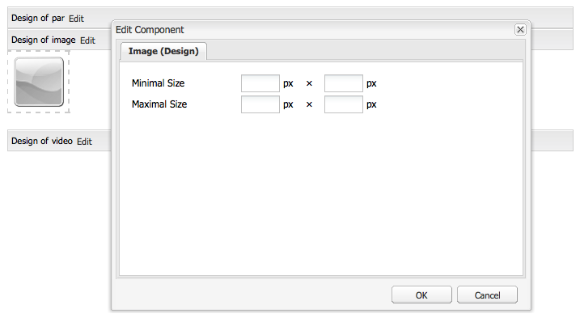

# Configuração dos componentes no Modo de design{#configuring-components-in-design-mode}

Quando a instância do AEM é instalada prontamente, uma seleção de componentes é disponibilizada imediatamente no sidekick.

Além destes, outros componentes também estarão disponíveis. Você pode usar o Modo de design para [Ativar/Desativar tais componentes](#enabledisablecomponentsusingdesignmode). Quando ativado e localizado em sua página, você poderá usar o Modo de design para [configurar os aspectos de design do componente](#configuringcomponentsusingdesignmode) através da edição dos parâmetros do atributo.

>[!NOTE]
>
>Alguns cuidados devem ser tomados ao editar esses componentes. As configurações de design muitas vezes são uma parte integrante do design de todo o site, por isso só devem ser alteradas por alguém com os privilégios adequados (e experiência), normalmente um administrador ou desenvolvedor. Consulte [Desenvolvimento de componentes](/help/sites-developing/components.md) para obter mais informações.

Na verdade, isso envolve adicionar ou remover os componentes permitidos no sistema de parágrafo da página. O sistema de parágrafo (`parsys`) é um componente composto que contém todos os outros componentes de parágrafo. O sistema de parágrafo permite aos autores adicionar componentes de diferentes tipos em uma página, pois contêm todos os outros componentes de parágrafo. Cada tipo de parágrafo é representado como um componente.

Por exemplo, o conteúdo de uma página de produto pode conter um sistema de parágrafo com o seguinte:

* Uma imagem do produto (na forma de uma imagem ou de um parágrafo de imagem e texto)
* A descrição do produto (como um parágrafo de texto)
* Uma tabela com os dados técnicos (como um parágrafo de tabela)
* Um formulário para os usuários preencherem (como formas de começar, formas de elemento e formas de parágrafo final)

>[!NOTE]
>
>Consulte [Desenvolvimento de componentes](/help/sites-developing/components.md#paragraphsystem) e [diretrizes para o uso de modelos e componentes](/help/sites-developing/dev-guidelines-bestpractices.md#guidelines-for-using-templates-and-components) para obter mais informações sobre o `parsys`.

## Desativar/Ativar componentes {#enable-disable-components}

No modo de Design, o sidekick é minimizado e você tem a possibilidade de configurar os componentes acessíveis para a criação:

1. Para entrar no modo de Design, abra uma página de edição e use o ícone Sidekick:

   

1. Clique em **Editar** no sistema Parágrafo (**Design de par**).

   

1. Uma caixa de diálogo será aberta, listando os grupos de componentes que são mostrados no Sidekick, juntamente com os componentes individuais que eles contêm.

   Selecione conforme necessário para adicionar, ou remover, os componentes que estarão disponíveis no sidekick.

   

1. O Sidekick é minimizado no modo Design. Ao clicar na seta, você pode maximizar o Sidekick e retornar ao modo Editar:

   

## Configuração do design de um componente {#configuring-the-design-of-a-component}

No modo Design, também é possível configurar os atributos para os componentes individuais. Cada componente tem seus próprios parâmetros, o exemplo a seguir mostra o componente de **Imagem**:

1. Para entrar no modo de Design, abra uma página de edição e use o ícone Sidekick:

   

1. É possível configurar o design dos componentes.

   Por exemplo, se você clicar em **Editar** no componente de Imagem (**Design de imagem**), poderá configurar os parâmetros específicos do componente:

   

1. Clique em **OK** para salvar suas alterações.

1. O Sidekick é minimizado no modo Design. Ao clicar na seta, você pode maximizar o Sidekick e retornar ao modo Editar:

   
