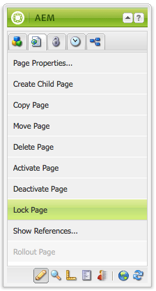

# Editar conteúdo da página{#editing-page-content}

Assim que a página for criada (nova ou como parte de um lançamento ou uma live copy), você pode editar o conteúdo para fazer as atualizações necessárias.

O conteúdo é adicionado usando [componentes](/help/sites-classic-ui-authoring/classic-page-author-default-components.md) (apropriado ao tipo de conteúdo) que pode ser arrastado para a página. Estes podem então ser editados no local, movidos ou excluídos. 

>[!NOTE]
>
>Sua conta precisa do [direitos de acesso apropriados](/help/sites-administering/security.md) e [permissões](/help/sites-administering/security.md#permissions) para editar páginas; por exemplo, adicionar, editar ou excluir componentes, anotar, desbloquear.
>
>Caso encontre algum problema, sugerimos que você entre em contato com o administrador do sistema.

## Sidekick {#sidekick}

O sidekick é uma ferramenta importante para a criação de páginas. Ele flutua ao criar uma página, de modo que fique sempre visível.

Várias guias e ícones estão disponíveis, incluindo:

* Componentes
* Página
* Info
* Versões
* Fluxo de trabalho
* Modos
* Andaime
* ClientContext
* Sites

Eles fornecem acesso a uma ampla variedade de funcionalidades, incluindo:

* [seleção de componentes](/help/sites-classic-ui-authoring/classic-page-author-env-tools.md#sidekick)
* [exibição de referências](/help/sites-classic-ui-authoring/classic-page-author-env-tools.md#showing-references)
* [acesso ao log de auditoria](/help/sites-classic-ui-authoring/classic-page-author-env-tools.md#audit-log)
* [alternando modos](/help/sites-classic-ui-authoring/classic-page-author-env-tools.md#page-modes)
* [criando](/help/sites-classic-ui-authoring/classic-page-author-work-with-versions.md#creating-a-new-version), [restaurando](/help/sites-classic-ui-authoring/classic-page-author-work-with-versions.md#restoring-a-page-version-from-sidekick) e [comparação](/help/sites-classic-ui-authoring/classic-page-author-work-with-versions.md#comparing-with-a-previous-version) versões

* [publicação](/help/sites-classic-ui-authoring/classic-page-author-publish-pages.md#publishing-a-page), [desfazer publicação](/help/sites-classic-ui-authoring/classic-page-author-publish-pages.md#unpublishing-a-page) uma página

* [editar propriedades da página](/help/sites-classic-ui-authoring/classic-page-author-edit-page-properties.md)

* [andaime](/help/sites-authoring/scaffolding.md)

* [contexto do cliente](/help/sites-administering/client-context.md)

## Inserir um componente {#inserting-a-component}

### Inserir um componente {#inserting-a-component-1}

Após abrir a página, você pode começar a adicionar conteúdo. Para isso, adicione componentes (também chamados de parágrafos).

Para inserir um novo componente:

1. Há vários métodos para selecionar o tipo de parágrafo que deseja inserir:

   * Clique duas vezes na área rotulada **Arraste componentes ou ativos aqui...** - o **Inserir novo componente** a barra de ferramentas é aberta. Selecione um componente e clique em **OK**.

   * Arraste um componente da barra de ferramentas flutuante (chamado sidekick) para inserir um novo parágrafo.
   * Clique com o botão direito em um parágrafo existente e selecione **Novo...** - a barra de ferramentas Inserir novo componente se abre. Selecione um componente e clique em **OK**.

   

1. Tanto no sidekick como no **Inserir novo componente** barra de ferramentas, você verá uma lista dos componentes disponíveis (tipos de parágrafo). Elas podem ser divididas em várias seções (por exemplo, Geral, Colunas etc.), que podem ser expandidas conforme necessário.

   Dependendo do ambiente de produção, essas opções podem ser diferentes. Para obter detalhes completos sobre componentes, consulte [Componentes padrão](/help/sites-classic-ui-authoring/classic-page-author-default-components.md).

1. Insira o componente desejado na página. Em seguida, clique duas vezes no parágrafo. Uma janela é aberta permitindo configurar seu parágrafo e adicionar conteúdo.

### Inserir um componente usando o Localizador de conteúdo {#inserting-a-component-using-the-content-finder}

Você também pode adicionar um novo componente à página arrastando um ativo da página [Localizador de conteúdo](/help/sites-classic-ui-authoring/classic-page-author-env-tools.md#the-content-finder). Isso criará automaticamente um novo componente do tipo apropriado que contém o ativo.

Isso é válido para os seguintes tipos de ativos (alguns dependerão do sistema de página/parágrafo):

| Tipo de ativo | Tipo de componente resultante |
|---|---|
| Imagem | Imagem |
| Documento | Download |
| Produto | Produto |
| Vídeo | Flash |

>[!NOTE]
>
>Esse comportamento pode ser configurado para a instalação. Consulte [Configurar um sistema de parágrafo para que arrastar um ativo crie uma instância de componente](/help/sites-developing/developing-components.md#configuring-a-paragraph-system-so-that-dragging-an-asset-creates-a-component-instance) para obter mais detalhes.

Para criar um componente arrastando um dos tipos de ativos acima:

1. Certifique-se de que a página está no modo de [**edição**](/help/sites-classic-ui-authoring/classic-page-author-env-tools.md#page-modes).
1. Abra o [Localizador de conteúdo](/help/sites-classic-ui-authoring/classic-page-author-env-tools.md#the-content-finder).
1. Arraste o ativo para a posição desejada. O [placeholder do componente](#componentplaceholder) mostra onde o componente será posicionado.

   Um componente, apropriado para o tipo de ativo, será criado no local necessário; ele conterá o ativo selecionado.

1. [Editar](#editmovecopypastedelete) o componente, se necessário.

## Editar um componente (conteúdo e propriedades) {#editing-a-component-content-and-properties}

Para editar um parágrafo existente, siga um destes procedimentos:

* **Clique duas vezes** o parágrafo para abri-lo. Você vê a mesma janela de quando criou o parágrafo com o conteúdo existente. Faça as alterações e clique em **OK**.

* **Clique com o botão direito do mouse** o parágrafo e clique em **Editar**.

* **Clique em** duas vezes no parágrafo (um clique duplo lento) para entrar no modo de edição no local. Você poderá editar o texto diretamente na página, em vez de dentro de uma janela de diálogo. Nesse modo, você receberá uma barra de ferramentas na parte superior da página. Basta fazer as alterações, que serão salvas automaticamente.

## Mover um componente {#moving-a-component}

Para mover um parágrafo:

>[!NOTE]
>
>Também é possível usar [Cortar e colar](#cut-copy-paste-a-component) para mover um componente.

1. Selecione o parágrafo a ser movido:

   

1. Arraste o parágrafo para o novo local - AEM indica onde o parágrafo pode ser movido com uma marca de seleção verde. Solte-o no local desejado.
1. Seu parágrafo foi movido:

   

## Excluir um componente {#deleting-a-component}

Para excluir um parágrafo:

1. Selecione o parágrafo e **clique com o botão direito do mouse**:

   

1. Selecionar **Excluir** no menu. O WCM do AEM solicita a confirmação de que você deseja excluir o parágrafo, pois essa ação não pode ser desfeita.
1. Clique em **OK**.

>[!NOTE]
>
>Se você definiu seu [Propriedades do usuário para mostrar a barra de ferramentas Edição global](/help/sites-classic-ui-authoring/author-env-user-props.md) também é possível executar determinadas ações nos parágrafos usando o **Copiar**, **Recortar**, **Colar**, **Excluir** botões disponíveis.
>
>Vários [atalhos de teclado](/help/sites-classic-ui-authoring/classic-page-author-keyboard-shortcuts.md) também estão disponíveis.

## Recortar/copiar/colar um componente {#cut-copy-paste-a-component}

Como quando [Excluir um componente](#deleting-a-component) você pode usar o menu de contexto para copiar, recortar e/ou colar um componente

>[!NOTE]
>
>Se você definiu seu [Propriedades do usuário para mostrar a barra de ferramentas Edição global](/help/sites-classic-ui-authoring/author-env-user-props.md) também é possível executar determinadas ações nos parágrafos usando o **Copiar**, **Recortar**, **Colar**, **Excluir** botões disponíveis.
>
>Vários [atalhos de teclado](/help/sites-classic-ui-authoring/classic-page-author-keyboard-shortcuts.md) também estão disponíveis.

>[!NOTE]
>
>Recortar, copiar e colar conteúdo só é compatível na mesma página.

## Componentes herdados {#inherited-components}

Componentes herdados podem ser o resultado de vários cenários, incluindo:

* [Gerenciamento de vários sites](/help/sites-administering/msm.md); também em combinação com [andaime](/help/sites-classic-ui-authoring/classic-feature-scaffolding.md#scaffolding-with-msm-inheritance).

* [Lançamentos](/help/sites-classic-ui-authoring/classic-launches.md) (quando com base na live copy).
* Componentes específicos; por exemplo, o Sistema de parágrafo herdado no Geometrixx.

Você pode cancelar (e depois reativar) a herança. Dependendo do componente, isso pode estar disponível em:

1. **Live Copy**

   Se um componente fizer parte de uma live copy ou lançamento, ele será indicado por um ícone de cadeado. Você pode clicar no cadeado para cancelar a herança.

   * O ícone de cadeado é exibido quando o componente é selecionado; por exemplo:

   

   * O cadeado também é mostrado na caixa de diálogo dos componentes; por exemplo:

   

1. **Um Sistema De Parágrafo Herdado**

   A janela de configuração. Por exemplo, como no Sistema de parágrafo herdado no Geometrixx:

   

## Adicionar anotações {#adding-annotations}

[Anotações](/help/sites-classic-ui-authoring/classic-page-author-annotations.md) permitir que outros autores forneçam feedback sobre o seu conteúdo. Isso é usado com frequência para fins de revisão e validação.

## Visualizar páginas   {#previewing-pages}

Há dois ícones na borda inferior do sidekick que são importantes para visualizar páginas:

* O ícone de lápis mostra que você está no modo de edição, onde é possível adicionar, modificar, mover ou excluir conteúdo.

   

* O ícone de lupa permite selecionar o modo de visualização, em que a página é exibida como será vista no ambiente de publicação (às vezes, também é necessária uma atualização de página):

   

   No modo de visualização, o sidekick será reduzido. Clique no ícone de seta para baixo para voltar ao modo de edição:

   

## Localizar e Substituir {#find-replace}

Para edições em maior escala da mesma frase, um **[Localizar e substituir](/help/sites-classic-ui-authoring/author-env-search.md#find-and-replace)** A opção de menu permite pesquisar e substituir várias instâncias de uma cadeia de caracteres em uma seção do site.

## Bloquear uma página   {#locking-a-page}

O AEM permite bloquear uma página, de modo que ninguém mais possa modificar o conteúdo. Isso é útil quando você está fazendo muitas edições para uma página específica ou quando precisa congelar uma página por pouco tempo.

>[!CAUTION]
>
>Bloquear uma página deve ser usado com cuidado, pois a única pessoa que pode desbloquear uma página é a pessoa que a bloqueou (ou uma conta com privilégios de administrador).

Para bloquear uma página:

1. No **Sites** selecione a página que deseja bloquear.
1. Clique duas vezes na página para abri-la para edição.
1. No **Página** do sidekick, selecione **Bloquear página**:

   

   Uma mensagem mostra que sua página está bloqueada para outros usuários. Além disso, no painel direito do **Sites** O WCM do AEM exibe a página como bloqueada e indica qual usuário bloqueou a página.

   

## Desbloquear uma página {#unlocking-a-page}

Para desbloquear uma página:

1. No **Sites** selecione a página que deseja desbloquear.
1. Clique duas vezes na página para abri-la.
1. No **Página** do sidekick, selecione **Desbloquear página**.

## Desfazer e refazer edições de página {#undoing-and-redoing-page-edits}

Use os seguintes atalhos do teclado enquanto o quadro de conteúdo da página estiver em foco:

* Desfazer: Ctrl+Z (Windows) ou Cmd+Z (Mac)
* Refazer: Ctrl+Y (Windows) ou Cmd+Y (Mac)

Ao desfazer ou refazer a remoção, adição ou realocação de um ou mais parágrafos, os realces piscando (comportamento padrão) indicam os parágrafos afetados.

>[!NOTE]
>
>Consulte [Desfazer e refazer edições de página - A teoria](#undoing-and-redoing-page-edits-the-theory) para obter todos os detalhes do que é possível fazer ao desfazer e refazer edições de página.

## Desfazer e refazer edições de página - a teoria {#undoing-and-redoing-page-edits-the-theory}

>[!NOTE]
>
>O administrador do sistema pode [configurar vários aspectos dos recursos Desfazer/Refazer](/help/sites-administering/config-undo.md) de acordo com os requisitos de sua instância.

O AEM armazena um histórico de ações que você executa e a sequência na qual elas foram executadas. Assim, você desfaz várias ações na ordem em que as executou. Em seguida, é possível usar refazer para reaplicar uma ou mais ações.

Se um elemento na página de conteúdo for selecionado, o comando desfazer e refazer será aplicado ao item selecionado, como um componente de texto.

O comportamento dos comandos desfazer e refazer é semelhante ao de outros programas de software. Use os comandos para restaurar o estado recente da sua página da Web conforme você toma decisões sobre o conteúdo. Por exemplo, caso mova um parágrafo de texto para um local diferente na página, você pode usar o comando desfazer para mover o parágrafo de volta. Se decidir mover o parágrafo novamente, use o comando Refazer.

>[!NOTE]
>
>É possível:
>
>* refazer ações, desde que você não tenha feito uma edição de página desde que usou desfazer.
>* desfaça no máximo 20 ações de edição (configuração padrão).
>* também usar [Atalhos de teclado](/help/sites-classic-ui-authoring/classic-page-author-keyboard-shortcuts.md) para desfazer e refazer.
>

Você pode desfazer e refazer os seguintes tipos de alterações de página:

* Adição, edição, remoção e movimentação de parágrafos
* Edição no local do conteúdo de parágrafo
* Copiar, recortar e colar itens em uma página
* Como copiar, recortar e colar itens entre páginas
* Adição, remoção e alteração de arquivos e imagens
* Adição, remoção e alteração de anotações e rascunhos
* Alterações no scaffold
* Adição e remoção de referências
* Alteração dos valores da propriedade nas caixas de diálogo do componente.

Os campos de formulário que os componentes de formulário renderizam não devem ter valores especificados durante a criação de páginas. Portanto, os comandos desfazer e refazer não afetam as alterações feitas nos valores desses tipos de componentes. Por exemplo, não é possível desfazer a seleção de um valor em uma lista suspensa.

>[!NOTE]
>
>Permissões especiais são necessárias para desfazer e refazer as alterações nos arquivos e imagens. Além disso, o histórico de desfazer para alterações em arquivos e imagens dura pelo menos algumas horas. Além desse tempo, no entanto, a ação de desfazer as alterações não é garantida. Seu administrador pode fornecer permissões e alterar o tempo padrão de dez horas.
