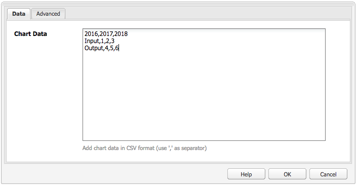
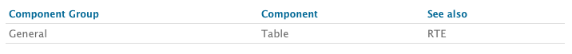
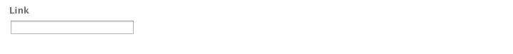

# Componentes para criação de página{#components-for-page-authoring}

Os componentes a seguir devem ser usados durante a criação de conteúdo para uma página da Web padrão. Os componentes formam um subconjunto dos componentes disponíveis prontamente para uma instalação padrão de AEM.

Alguns estão imediatamente disponíveis por meio do sidekick; vários outros também estão disponíveis por meio do uso de [Modo de design](/help/sites-classic-ui-authoring/classic-page-author-design-mode.md) para ativá-los ou desativá-los.

>[!CAUTION]
>
>Esta seção discute apenas os componentes que estão disponíveis prontamente em uma instalação padrão do AEM.
>
>Dependendo do seu caso, você pode ter componentes personalizados desenvolvidos explicitamente para suas necessidades. Esses componentes personalizados podem até ter o mesmo nome de alguns dos componentes discutidos aqui.

Os componentes estão disponíveis quando [edição de uma página](/help/sites-classic-ui-authoring/classic-page-author-edit-content.md) do **Componentes** da guia do sidekick e do **Inserir novo componente** (ao clicar duas vezes no **Arraste componentes ou ativos aqui** área).

Você pode selecionar um componente, arrastá-lo até o local desejado na página e, em seguida, [Editar conteúdo e propriedades](/help/sites-classic-ui-authoring/classic-page-author-edit-content.md#editing-a-component-content-and-properties).

Os componentes são classificados de acordo com as várias categorias (grupos de componentes), incluindo (para criação de página):

* [Geral](#general): Inclui componentes básicos, como texto, imagens, tabelas, gráficos e assim por diante.
* [Colunas](#columns): Inclui componentes necessários para organizar o layout do conteúdo.
* [Formulário](#formgroup): Inclui todos os componentes necessários para criar um formulário.

## Geral {#general}

Os componentes Gerais são os componentes básicos usados para criar conteúdo.

### Item da conta {#account-item}

Você pode definir um link com título e descrição.


### Imagem adaptativa {#adaptive-image}

O componente de base da Imagem adaptativa gera imagens que são dimensionadas para caber na janela em que a página da Web é aberta. Para usar o componente, você fornece um recurso de imagem do sistema de arquivos ou do DAM. Quando a página da Web é aberta, o navegador baixa uma cópia da imagem que foi redimensionada para que seja adequada à janela atual.

As seguintes características podem determinar o tamanho da janela:

* Tela do dispositivo: Dispositivos móveis geralmente exibem páginas da Web, de modo que se estendem por toda a tela.
* Tamanho da janela do navegador da Web: Os usuários de laptop e desktop podem redimensionar as janelas do navegador da Web.

Por exemplo, o componente gera uma imagem pequena quando a página da Web é aberta em um telefone celular e uma imagem de tamanho médio quando é aberta em um tablet. Em um laptop, o componente cria e fornece uma imagem grande quando a página é aberta em um navegador da Web maximizado. Quando o navegador da Web é redimensionado para caber em uma parte da tela, o componente se adapta, fornecendo uma imagem menor e atualizando a visualização.

#### Formatos de imagem suportados {#supported-image-formats}

Você pode usar arquivos de imagem das seguintes extensões de nome de arquivo com o componente Imagem adaptativa :

* .jpg
* .jpeg
* .png
* .gif &#42;&#42;

>[!CAUTION]
>
>&#42;&#42; Arquivos .gif animados não são aceitos no AEM para representações adaptáveis.

#### Tamanhos e qualidade das imagens {#images-sizes-and-quality}

A tabela a seguir lista a largura da imagem gerada para a largura da janela de visualização fornecida. A altura da imagem gerada é calculada para manter uma proporção de aspecto constante e nenhum espaço em branco ocorre dentro da borda da imagem. O comando Recortar pode ser usado para evitar espaços em branco.

Quando a imagem é uma imagem JPEG, o tamanho do visor também pode influenciar a qualidade do JPEG. As seguintes qualidades de JPEG são possíveis:

* Baixa (0,42)
* Médio (0,82)
* Alta (1,00)

| Intervalo de largura da janela de visualização (pixels) | Largura da imagem (pixels) | Qualidade JPEG | Tipo de dispositivo de destino |
|---|---|---|---|
| largura &lt;= 319 | 320 | baixa |  |
| largura = 320 | 320 | médio | Telefone celular (retrato) |
| 320 &lt; largura &lt; 481 | 480 | médio | Telefone celular (paisagem) |
| 480 &lt; largura &lt; 769 | 476 | alta | Comprimido (retrato) |
| 768 &lt; largura &lt; 1025 | 620 | alta | Tablet (paisagem) |
| largura &lt;= 1025 | full (tamanho original) | alta | Desktop |

#### Propriedades {#properties}

A caixa de diálogo permite editar as propriedades da sua instância do componente de Imagem adaptativa, muitas das quais são comuns com o componente de Imagem na qual são baseadas. As propriedades estão disponíveis em duas guias:

* **Imagem**

   * **Imagem**
Arraste uma imagem do localizador de conteúdo ou clique para abrir uma janela de navegação, onde é possível carregar uma imagem. Após carregar a imagem, você pode recortar a imagem, girá-la ou excluí-la. Para ampliar e reduzir a imagem, use a barra de rolagem abaixo da imagem (acima dos botões OK e Cancelar)

   * **Cortar**
Permite recortar partes de uma imagem. Arraste a borda para recortar a imagem.

   * **Girar**
Clique em Girar repetidamente até que a imagem seja girada conforme desejado.

   * **Limpar**
Remova a imagem atual.

* **Avançado**

   * **Título**
O componente da Imagem adaptativa não utiliza essa propriedade.

   * **Texto alternativo**
O texto alternativo a ser usado para a imagem.

   * **Vincular ao**
O componente da Imagem adaptativa não utiliza essa propriedade.

   * **Descrição**
O componente da Imagem adaptativa não utiliza essa propriedade.

#### Extensão do componente de imagem adaptativa {#extending-the-adaptive-image-component}

Para obter informações sobre como personalizar o componente Imagem adaptativa, consulte [Noções básicas sobre o componente de imagem adaptativa](/help/sites-developing/responsive.md#using-adaptive-images).

### Carrossel {#carousel}

O componente Carrossel permite exibir imagens associadas a páginas individuais:

* uma de cada vez
* por pouco tempo
* em uma ordem especificada por você
* com um atraso de tempo especificado por você

Os controles clicáveis também permitem que o usuário alterne entre as páginas exibidas em tempo real, sob demanda. Selecionar a imagem de página atualmente visível leva você até essa página. Em outras palavras, o carrossel atua como um controle de navegação.

#### Propriedades {#properties-1}

As propriedades estão disponíveis em duas guias:

* **Carrossel**
Aqui você especifica como o carrossel opera:

   * Velocidade de reprodução O tempo em milissegundos antes de o próximo slide ser exibido.
   * Tempo de transição O tempo em milissegundos para a transição entre dois slides.
   * Estilo dos controles Várias opções estão disponíveis em um menu suspenso; por exemplo, os botões Anterior/Próximo, os comutadores Superior direito.

* **Lista**
Aqui você especifica como as páginas são incluídas no carrossel:

   * **Criar lista usando**
Há várias maneiras de criar uma lista de páginas - Páginas secundárias, Lista fixa, Pesquisa ou Pesquisa Avançada (todas descritas abaixo).
Independentemente do método escolhido, cada página que você incluir na lista deve ter uma imagem associada à página. É essa imagem exibida no carrossel. Se não houver imagem para uma página nas Propriedades da página, você deverá associar uma imagem à página antes de começar. Caso contrário, o carrossel exibirá uma página em branco. Consulte [Editar as propriedades da página](/help/sites-classic-ui-authoring/classic-page-author-edit-page-properties.md).
Dependendo do item que você escolher, um novo painel será exibido:

      * **Opções de páginas filho**

         * **Página principal**
Especifique um caminho manualmente ou usando o seletor. Deixe em branco para usar a página atual como principal.
      * **Opções de lista fixa**

         * **Páginas**
Selecione uma lista de páginas. Utilização 
`+` para adicionar mais entradas e os botões para cima/para baixo para ajustar a ordem.
      * **Opções de pesquisa**

         * **Iniciar em**
Insira um caminho inicial, manualmente ou usando o seletor.

         * **Pesquisar consulta**
Você pode inserir uma consulta de pesquisa de texto simples.
      * **Opções de pesquisa avançada**

         * **Notação do predicativo do Querybuilder**
Você pode inserir uma consulta de pesquisa usando a notação do predicativo do Querybuilder. Por exemplo, você pode inserir &quot;fulltext=Marketing&quot; para ter todas as páginas com &quot;Marketing&quot; em seu conteúdo exibidas no carrossel.
Consulte [API do QueryBuilder](/help/sites-developing/querybuilder-api.md) para uma discussão completa de expressões de query e mais exemplos.
   * **Ordenar por**
Selecionar 
`jcr:title`, `jcr:created`, `cq:lastModified`ou `cq:template` no menu suspenso.

   * **Limite**
Opcional. O número máximo de itens que você deseja usar no carrossel.


>[!NOTE]
>
>Você pode criar um componente de carrossel personalizado para o Adobe Experience Manager que exibe ativos digitais no DAM AEM.

### Gráfico {#chart}

O componente Gráfico permite adicionar um gráfico de barras, de linhas ou de pizza. AEM cria um gráfico a partir dos dados fornecidos. Você fornece dados digitando diretamente na guia Dados ou copiando e colando em uma planilha.

* **Dados**

   * **Dados do gráfico**
Insira os dados do gráfico usando o formato CSV; o formato Valores separados por vírgula usa vírgulas (&quot;,&quot;) como separador de campo.

* **Avançado**

   * **Tipo de gráfico**
Selecione a partir do Gráfico de pizza, do Gráfico de linhas e do Gráfico de barras.

   * **Texto alternativo**
Texto que é exibido em vez do gráfico.

   * **Largura**
A largura do gráfico em pixels.

   * **Altura**
A altura do gráfico em pixels.

O exemplo a seguir mostra os dados do gráfico seguido pelo gráfico de barras resultante:

 


### Fragmento de conteúdo {#content-fragment}

>[!CAUTION]
>
>A funcionalidade completa do Gerenciamento de fragmentos de conteúdo só está disponível com a interface otimizada para toque.
>
>O componente Fragmento do conteúdo pode ser visualizado no sidekick da interface clássica, mas outras funções não estão disponíveis.

[Fragmentos de conteúdo](/help/sites-classic-ui-authoring/classic-page-author-content-fragments.md) são criados e gerenciados como ativos independentes da página. Em seguida, é possível usar estes fragmentos e suas variações ao criar suas páginas de conteúdo.

### Importador de design {#design-importer}

Permite carregar um arquivo zip contendo um pacote de design.

### Download {#download}

O componente de download cria um link na página da Web selecionada para baixar um arquivo específico. Você pode arrastar um ativo do Localizador de conteúdo ou fazer upload de um arquivo.

* **Download**

   * **Descrição**
Uma breve descrição é exibida com o link de download.

   * **Arquivo**
O arquivo que está disponível para download na página da Web resultante. Arraste um ativo do localizador de conteúdo ou selecione a área para fazer upload do arquivo que deseja disponibilizar para download.

O exemplo a seguir mostra o componente de Download no Geometrixx:


### Externo {#external}

O componente externo de integração do aplicativo (**Externo**) permite que você incorpore aplicativos externos à sua página AEM usando um iframe.

* **Externo**

   * **Aplicativo de destino**

      Especifique o URL da aplicação Web a ser integrada; por exemplo:

      ```
      https://en.wikipedia.org/wiki/Main_Page
      ```

   * **Enviar parâmetros**

      Marque a caixa com parâmetros a serem enviados para o aplicativo, quando necessário.

   * **Largura e altura**

      Definir o tamanho do iframe

O aplicativo externo é integrado ao sistema de parágrafo da página de AEM; por exemplo, ao usar um aplicativo Target de `https://en.wikipedia.org/wiki/Main_Page`:


>[!NOTE]
>
>Dependendo do caso de uso, outras opções estão disponíveis para integração de aplicativos externos, por exemplo, a variável [Integração de portlets](/help/sites-administering/aem-as-portal.md).

### Flash {#flash}

O componente Flash permite carregar um filme do Flash. Você pode arrastar um ativo flash do localizador de conteúdo para o componente ou usar a caixa de diálogo:

* **Flash**

   * **Filme em flash**

      O arquivo de filme em flash. Arraste um ativo do localizador de conteúdo ou clique para abrir uma janela de navegação.

   * **Tamanho**

      Dimension em pixels da área de exibição contendo o filme.

* **Imagem alternativa**

   Uma imagem alternativa a ser mostrada

* **Avançado**

   * **Menu de contexto**

      Indica se o menu de contexto deve ser mostrado ou oculto.

   * **Modo de janela**

      Como a janela aparece, por exemplo opaca, transparente ou como uma janela distinta (sólida).

   * **Cor do plano de fundo**

      Uma cor de plano de fundo selecionada no gráfico de cores fornecido.

   * **Versão mínima**

      A versão mínima do Flash Player Adobe necessária para executar o filme. O padrão é 9.0.0.

   * **Atributos**

      Quaisquer atributos necessários.

### Imagem {#image}

O componente de imagem exibe uma imagem e o texto respectivo de acordo com os parâmetros especificados.

Você pode fazer upload de uma imagem, em seguida, editá-la e manipulá-la (por exemplo, recortar, girar, adicionar link/título/texto).

Você pode arrastar e soltar uma imagem do [Localizador de conteúdo](/help/sites-classic-ui-authoring/classic-page-author-env-tools.md#the-content-finder) diretamente no componente ou na caixa de diálogo Editar. Você também pode clicar duas vezes na área central da caixa de diálogo Editar para navegar pelo sistema de arquivos local e fazer upload de uma imagem. As duas guias da caixa de diálogo Editar também controlam todas as definições e manipulações da imagem:


>[!NOTE]
>
>O progresso do carregamento não pode ser monitorado com o Internet Explorer.
>
>Os usuários do Internet Explorer devem fazer upload da imagem e clicar em **Ok**, reabra a imagem para ver o arquivo carregado na visualização e para poder executar modificações (isto é, cortar).
>
>Consulte a [Plataformas certificadas](/help/release-notes/release-notes.md#certifiedplatforms) para obter mais informações sobre os recursos do HTML5 usados pelo AEM.

Quando uma imagem é carregada, você pode configurar o seguinte:

* **Mapa**

   Para mapear uma imagem, selecione Mapa. Você pode especificar como deseja criar o mapa de imagem (retângulo, polígono e assim por diante) e para onde a área deve apontar.

* **Cortar**

   Selecione Recortar para que você possa recortar uma parte de uma imagem. Use o mouse para recortar a imagem.

* **Girar**

   Para girar uma imagem, selecione Girar. Use repetidamente até que a imagem seja girada da maneira que desejar.

* **Limpar**

   Remova a imagem atual.

* **Barra de zoom**

   Para ampliar e reduzir a imagem, use a barra de rolagem abaixo da imagem (acima dos botões OK e Cancelar)

* **Título**

   O título da imagem.

* **Alternar texto**

   Um texto alternativo para usar na criação de conteúdo acessível.

* **Vincular ao**

   Crie um link para ativos ou outras páginas no seu site.

* **Descrição**

   Uma descrição da imagem.

* **Tamanho**

   Define a altura e a largura da imagem.

A imagem final (com **Título** e **Descrição**) pode ser exibido como:


### Contêiner de layout {#layout-container}

>[!CAUTION]
>
>Embora o componente do contêiner de layout esteja disponível na interface clássica, as suas funcionalidades estão disponíveis apenas na interface habilitada para toque. Para obter detalhes, consulte [Layout responsivo](/help/sites-classic-ui-authoring/classic-page-author-responsive-layout.md).

### Lista {#list}

O componente Lista permite que você configure critérios de pesquisa para exibir uma lista:

* **Lista**

   * **Criar uso da lista**

      Aqui, você especifica onde a lista recupera seu conteúdo. Existem vários métodos:

   * Dependendo do item que você escolher, um novo painel será exibido:

      * **Opções de páginas filho**

         * **Filhos de** (Página principal) Especifique um caminho manualmente ou usando o seletor. Deixe em branco para usar a página atual como principal.
      * **Opções de lista fixa**

         * **Páginas**

            Selecione uma lista de páginas. Use + para adicionar mais entradas e os botões Para cima/Para baixo para ajustar a ordem.
      * **Opções de pesquisa**

         * **Começa em**

            Insira um caminho inicial, manualmente ou usando o seletor.

         * **Pesquisar consulta**

            Você pode inserir uma consulta de pesquisa de texto simples.
      * **Opções de pesquisa avançada**

         * **Notação do predicativo do Querybuilder**

            Você pode inserir uma consulta de pesquisa usando a notação do predicativo do Querybuilder. Por exemplo, você pode inserir &quot;fulltext=Marketing&quot; para ter todas as páginas com &quot;Marketing&quot; em seu conteúdo exibidas no carrossel.

            Consulte [API do QueryBuilder](/help/sites-developing/querybuilder-api.md) para uma discussão completa de expressões de query e mais exemplos.
      * **Tags**

         Especifique a **Página principal**, **Tags/Palavras-chave** e os critérios de correspondência necessários.
   * **Exibir como**

      Como deseja que os itens sejam listados; inclui links, teasers e notícias.

   * **Ordenar por**

      Se a lista deve ser ordenada e, se assim for, os critérios a serem usados para a classificação. Você pode inserir um critério ou selecionar um na lista suspensa fornecida.

   * **Limite**

      Especifique o número máximo de itens que deseja exibir na lista.

   * **Ativar feed**

      Indica se um feed RSS deve ser ativado na lista.

   * **Paginar após**

      Aqui, você pode especificar o número de itens da lista a serem exibidos ao mesmo tempo. Uma lista com mais itens do que o especificado usa paginação para exibir a lista em várias porções.


O exemplo a seguir mostra um **Lista** componente na forma como pode exibir uma lista de páginas filhas (o design é controlado pelas definições CSS personalizadas de um design de site).


### Logon {#login}

Fornece os campos Nome de usuário e Senha.


Você pode configurar:

* Fazer Logon

   * Rótulo da seção

      Texto de lead para os campos de entrada.

   * Rótulo do nome de usuário

      Texto para rotular o campo de nome de usuário.

   * Rótulo da senha

      Texto para rotular o campo de senha.

   * Rótulo do botão de logon

      Texto para o botão de logon.

   * Redirecionar para

      Você pode especificar a página em seu site que deve ser aberta assim que o usuário fizer logon.

* Já está conectado.

   * Continuar a etiqueta do botão

      Texto para indicar que o usuário já está conectado.

### Status do pedido {#order-status}

* **Título**

   * **Título**

      Especifique o texto do título que deseja exibir.

   * **Link**

      Especifique a página (produto) para a qual o status do pedido deve ser exibido.

   * **Tipo / Tamanho**

      Selecione a partir da seleção fornecida.


### Referência {#reference}

O **Referência** permite referenciar o texto de outra página do site da AEM (na instância atual). O conteúdo do parágrafo referenciado aparece como se fosse na página atual. O conteúdo é atualizado quando o parágrafo de origem é alterado (pode ser necessário uma atualização de página).

* **Referência do parágrafo**

   * **Referência**

      Especifique o caminho para a página e o parágrafo que deseja referenciar (inclua o conteúdo).

Para especificar o caminho para um parágrafo, você deve colocar o caminho como sufixo (para a página) com o seguinte:

`.../jcr:content/par/<paragraph-ID>`

Por exemplo:

`/content/geometrixx-outdoors/en/equipment/biking/cajamara/jcr:content/par/similar-products`

Além de fazer referência a um parágrafo específico, o caminho também pode ser modificado para especificar um sistema de parágrafo inteiro. Sufixo o caminho com o seguinte:

`/jcr:content/par`

Por exemplo:

`/content/geometrixx-outdoors/en/equipment/biking/cajamara/jcr:content/par`

Após a configuração, o conteúdo é exibido exatamente como na página de origem. O fato de que é uma referência só é visto quando você abre o componente para edição:


### Pesquisar {#searching}

O componente de Pesquisa adiciona o recurso de pesquisa à página.

Você pode configurar:

* Pesquisar

   * **Tipos de nós**

      Se a pesquisa for restrita ao tipo de nó específico, liste-os aqui; por exemplo, `cq:Page`.

   * **Caminho para pesquisar em**

      Especifique a página raiz da ramificação que deseja pesquisar.

   * **Texto do botão de pesquisa**

      O nome exibido no botão de pesquisa real.

   * **Texto da estatística**

      O texto exibido acima dos resultados da pesquisa.

   * **Nenhum texto de resultados**

      Se não houver resultados, o texto inserido aqui será exibido.

   * **Verificar a ortografia do texto**

      Se alguém inserir um termo semelhante, esse texto será exibido antes do termo.
Por exemplo, se você digitar `Geometrixxe`, o sistema exibe &quot;Você quer dizer? Geometrixx&quot;.

   * **Texto de páginas semelhantes**

      O texto que é exibido ao lado de um resultado para páginas semelhantes. Para recortar parte de uma imagem, clique neste link.

   * **Texto de pesquisa relacionada**

      O texto que aparece ao lado das pesquisas para os termos e tópicos relacionados.

   * **Pesquisar texto de tendências**

      O título acima dos termos de pesquisa digitados por um usuário.

   * **Rótulo de Páginas de Resultado**

      O texto que aparece na parte inferior da lista com links para outras páginas de resultados.

   * **Rótulo anterior**

      O nome que aparece no link para as páginas de pesquisa anteriores.

   * **Próximo rótulo**

      O nome que aparece no link para as páginas de pesquisa subsequentes.

O exemplo a seguir mostra o componente de Pesquisa após uma pesquisa pela palavra *`geometrixx`* no diretório raiz de uma instalação padrão. Também ilustra a paginação dos resultados:


O exemplo a seguir mostra um termo de pesquisa com ortografia incorreta e não disponível:


### Mapa do site {#sitemap}

Uma lista de mapa do site automático, que (com as configurações padrão) lista todas as páginas (como links ativos) no site atual. Por exemplo, uma extração mostra:


Se necessário, é possível configurar:

* **Mapa do site**

   * **Caminho raiz**

      Caminho onde a listagem deve começar.

### Slideshow {#slideshow}

Esse componente permite que você carregue uma série de imagens a serem exibidas como um slideshow em sua página. Você pode adicionar ou remover imagens e atribuir cada uma a um título. Em Avançado, também é possível especificar o tamanho da área de exibição.

Você pode configurar:

* **Slides**

   * **Novo slide**

      Você pode especificar uma seleção de slides usando o **Adicionar** e **Remover**).

   * **Título**

      Especifique um título, se necessário. Esse título é sobreposto no slide apropriado.

* **Avançado**

   * **Tamanho**

      Especifique a largura e a altura em pixels.

O componente de slideshow exibe repetidamente em cada sequência, por um curto período de tempo, antes de esmaecer no próximo slide:


### Tabela {#table}

>[!NOTE]
>
>O **Tabela** O componente é baseado na variável [Editor de Rich Text](/help/sites-classic-ui-authoring/classic-page-author-rich-text-editor.md), como está no **[Texto](#text)** componente.
>
>O Adobe recomenda usar a variável **Tabela** componente para tabelas, embora também possam ser construídas com a variável **Texto** componente.

O **Tabela** é pré-configurado para permitir construir, preencher e formatar uma tabela. Usando a caixa de diálogo, é possível configurar a tabela e criar o conteúdo do zero ou copiando e colando uma planilha ou uma tabela de um editor externo, como Excel, OpenOffice ou Bloco de notas.


A captura de tela a seguir mostra um exemplo do componente de tabela; o design é determinado pelo CSS específico do site:



### Nuvem de tags {#tag-cloud}

Uma nuvem de tags mostra uma seleção apresentada graficamente das tags aplicadas ao conteúdo do seu site:


Ao configurar o componente Nuvem de tags, você pode especificar:

* **Tags a serem exibidas**
Onde as tags a serem exibidas são coletadas. Selecione de uma página, uma página com todas as páginas filhas ou com todas as tags.

* **Página**
Selecione a página que será referenciada.

* **Nenhum link nas tags**
Se as tags exibidas devem agir como links.

Para obter mais informações sobre como aplicar tags, visite [Uso de tags](/help/sites-classic-ui-authoring/classic-feature-tags.md).

### Texto {#text}

>[!NOTE]
>
>O **Texto** O componente é baseado na variável [Editor de Rich Text](/help/sites-classic-ui-authoring/classic-page-author-rich-text-editor.md), como está no **[Tabela](#table)** componente.
>
>O Adobe recomenda usar a variável **Tabela** componente para tabelas, embora também possam ser construídas com a variável **Texto** componente.

O componente de Texto permite que você insira um bloco de texto usando um editor WYSIWYG, com a funcionalidade fornecida pelo [Editor de Rich Text](/help/sites-classic-ui-authoring/classic-page-author-rich-text-editor.md). Uma seleção de ícones permite que você formate o texto, incluindo características da fonte, alinhamento, links, listas e recuo.


Ao abrir o **Estilos** da guia **Editar** você também pode definir o seguinte:

* **Espaçador**
* **Estilo do texto**

O texto formatado é então exibido na página. O design real depende do CSS do site:


Para obter informações mais detalhadas sobre o componente de Texto e a funcionalidade fornecida pelo Editor de Rich Text, consulte o [Editor de Rich Text](/help/sites-classic-ui-authoring/classic-page-author-rich-text-editor.md) página.

#### Edição no local {#inplace-editing}

Além do modo de edição Rich Text baseado em caixa de diálogo, o AEM também fornece [Edição no local](/help/sites-authoring/editing-content.md), que permite a edição direta do texto da forma como ele é exibido no layout da página.

### Texto e imagem {#text-image}

O componente Texto e imagem adiciona um bloco de texto e uma imagem. Você também pode adicionar e editar texto e imagens separadamente. Consulte a [Texto](#text) e [Imagem](#image) componentes para obter detalhes.

 

Você pode configurar:

* **Estilos de componentes** (**Estilos**)

   Aqui, você pode alinhar à esquerda ou à direita da imagem. O padrão é **Left** alinhado, com a imagem à esquerda.

* **Propriedades da imagem** (**Propriedades avançadas de imagem**)

   Permite que você especifique o seguinte:

   * **Ativos da imagem**

      Carregue a imagem desejada.

   * **Título**

      O título do bloco. Ele é mostrado ao passar o mouse.

   * **Alternar texto**

      Texto alternativo a ser exibido se a imagem não puder ser exibida. Caso deixado em branco, o título será usado.

   * **Vincular para**

      Especifique um caminho de destino.

   * **Descrição**

      Uma descrição da imagem.

   * **Tamanho**

      Define a altura e a largura da imagem.

O exemplo a seguir mostra um Componente de imagem de texto que exibe a imagem alinhada à esquerda:


### Título {#title}

O componente de título pode:

* Exiba o nome da página atual, deixando o campo Título em branco.
* Exiba um texto especificado no campo Título .

Você pode configurar o seguinte:

* **Título**

   Se quiser usar um nome diferente do título da página, insira-o aqui.

* **Link**

   O URI se o título deve funcionar como um link.

* **Tipo / Tamanho**

   Selecione Pequeno ou Grande na lista suspensa. Pequeno é gerado como uma imagem. Grande é gerado como texto.

O exemplo a seguir mostra um **Título** componente sendo exibido; o design é determinado pelo CSS específico do site.


### Vídeo {#video}

O **Vídeo** permite que você coloque um elemento de vídeo predefinido e pronto para uso em uma página.

Consulte também [Configurar os perfis de vídeo](/help/sites-administering/config-video.md#configuringvideoprofiles) para uso com elementos HTML5.

Depois de colocar uma instância do componente na página, você pode configurar o seguinte:

* Vídeo

   * **Ativo de vídeo**

      Faça upload ou solte o ativo de vídeo.

   * **Tamanho**

      O tamanho nativo do vídeo (largura x altura em pixels) é exibido nas caixas ao lado do Tamanho (veja acima). Insira manualmente as dimensões de largura e altura aqui, caso deseje substituir as dimensões nativas do vídeo. Selecionar **OK** interrompe a caixa de diálogo.

>[!NOTE]
>
>Os formatos suportados incluem:
>
>* `.mp4`
>* `Ogg`
>* `FLV` (Vídeo do Flash)
>


## Colunas {#columns}

As colunas são um mecanismo para controlar o layout do conteúdo no AEM. Em uma instalação padrão, são fornecidos componentes para a criação de duas e/ou três colunas.

O exemplo a seguir mostra os componentes de duas colunas e três colunas em uso. Você pode usar os espaços reservados para os novos componentes:


### 2 colunas {#columns-1}

Um componente de Controle de coluna que padroniza duas colunas iguais.

### 3 colunas {#columns-2}

Um componente de Controle de coluna que padroniza três colunas iguais.

### Controle de coluna {#column-control}

O componente de Controle de coluna permite que os usuários escolham como dividir o conteúdo no painel principal da página da Web em várias colunas. Os usuários podem selecionar o número de colunas necessárias (de uma lista predefinida) e, em seguida, criar, excluir ou mover o conteúdo dentro de cada uma das colunas.

* **Controle de coluna**

   * **Layout da coluna**

      Selecione o número de colunas que você deseja renderizar. Depois de criadas, cada coluna tem seu próprio link para arrastar componentes ou ativos ao adicionar conteúdo.

## Formulário {#form}

Os componentes do formulário são usados para criar formulários para os visitantes enviarem informações. O Forms e os componentes do formulário podem ser usados para coletar informações, incluindo o feedback do usuário (por exemplo, um questionário de satisfação do cliente) e as informações do usuário (por exemplo, o registro do usuário).

>[!NOTE]
>
>Consulte [Ajuda do AEM Forms](/help/forms/home.md) para obter informações sobre o AEM Forms.

Os Forms são criados de vários componentes diferentes:

* **Formulário**

   O componente de formulário define o início e o fim de um novo formulário em uma página. Outros componentes podem então ser colocados entre esses elementos, como tabelas e downloads.

* **Elementos e campos de formulário**

   Os campos e elementos do formulário podem incluir caixas de texto, botões de opção e imagens. O usuário geralmente conclui uma ação em um campo de formulário, como digitar um texto. Consulte os elementos de formulário individuais para obter mais informações.

* **Componentes de perfil**

   Os componentes de perfil estão relacionados aos perfis de visitantes usados para a colaboração social e outras áreas onde é necessária a personalização do visitante.

A seguir, há um exemplo de formulário. É composto pelo **Formulário** componente (início e fim), com dois **Formulário** **Texto** campos usados para entrada, um **Geral** **Texto** campo usado para o texto de lead e um **Enviar** botão.


>[!NOTE]
>
>Informações sobre o desenvolvimento e a personalização de seus formulários estão disponíveis no [Página Desenvolvimento do Forms](/help/sites-developing/developing-forms.md). Esse formulário personalizado inclui a adição de ações, restrições, o pré-carregamento de campos e a utilização de scripts para chamar um serviço à ação, entre outros.

### Configurações comuns a (muitos) componentes de formulário {#settings-common-to-many-form-components}

Embora cada um dos componentes do formulário tenha uma finalidade diferente, muitos são compostos de opções e parâmetros semelhantes.

Ao configurar qualquer um dos componentes do formulário, as seguintes guias estão disponíveis na caixa de diálogo:

* **Título e texto**

   Aqui você deve especificar as informações básicas, como o título do formulário e qualquer texto que o acompanha. Quando apropriado, também permite definir outras informações importantes, como se o campo é de seleção múltipla e se os itens estão disponíveis para seleção.

* **Valores iniciais**

   Permite especificar um valor padrão.

* **Restrições**

   Aqui, é possível especificar se um campo é obrigatório e se as restrições de local estão no campo, como numérico.

* **Estilo**

   Indica o tamanho e estilo dos campos.

>[!NOTE]
>
>Os campos variam muito, dependendo do componente individual.

Essas guias fornecem os parâmetros necessários. As guias dependem do tipo de componente individual, mas podem incluir o seguinte:

* **Título e texto**

   * **Nome do elemento**

      Nome do elemento de formulário. Indica onde os dados são armazenados no repositório.
Este campo é obrigatório e deve conter apenas os seguintes caracteres:

      * caracteres alfanuméricos
      * `_ . / : -`
   * **Título**

      O título exibido com o campo. Se deixado em branco, o título padrão será exibido.

   * **Descrição**

      Permite fornecer informações adicionais para o usuário, se necessário. No formulário, essa descrição é mostrada abaixo do campo, em uma fonte menor do que o título.

   * **Exibir / Ocultar**

      Determina quando o campo é visível.


* **Valores iniciais**

   * **Valor padrão**

      O valor exibido no campo quando o formulário é aberto. Ou seja, antes que o usuário tenha inserido qualquer informação.

* **Restrições**

   * **Obrigatório**

      Essa restrição depende do tipo de componente de formulário, mas fornece uma ou mais caixas de clique para indicar que esse campo é obrigatório ou determinadas partes dele são obrigatórias.

   * **Mensagem obrigatória**

      Uma mensagem para informar os usuários que este campo é obrigatório. Um campo obrigatório é sinalizado com um asterisco.

   * **Restrição**

      As restrições disponíveis para seleção dependem do tipo de componente de formulário.

   * **Mensagem de restrição**

      Uma mensagem para informar os usuários o que é necessário.

* **Estilo**

   * **Tamanho**

      Em linhas e colunas.

   * **Largura**

      Em pixels.

   * **CSS**

### Formulário (componente) {#form-component}

O componente Formulário define o início e o fim de um formulário usando o **Início do formulário** e **Fim do formulário** elementos. Os elementos start e end são sempre pareados para garantir que o formulário seja definido corretamente.


Entre o início e o fim de um formulário, é possível adicionar componentes de formulário que definem os campos de entrada reais para os usuários.

#### Início do formulário {#start-of-form}

Esse componente necessário define o início de um novo formulário em uma página. Você pode configurar o seguinte:

* **Formulário**

   * **Página de agradecimento**

      A página a ser referenciada para agradecer aos visitantes por suas informações. Caso deixado em branco, o formulário será exibido novamente após o envio.

   * **Iniciar fluxo de trabalho**

      Determina qual fluxo de trabalho é acionado após o envio do formulário.

* **Avançado**

   * **Tipo de ação**

      Um formulário precisa de uma ação. A ação define a operação acionada para execução com os dados enviados pelo usuário (semelhante a action= in HTML). Alguns precisam de um **Configuração de ação**.

      Uma seleção de tipos de ação está incluída em uma instalação de AEM padrão:

      * **Solicitação de conta**
      * **Criar conteúdo**
      * **Criar cliente em potencial**
      * **Criar e atualizar a conta**
      * **Serviço de e-mail: Criar assinante e adicionar à lista**
      * **Servio de e-mail: enviar e-mail de resposta automática**
      * **Serviço de e-mail: cancelar a inscrição do usuário da lista**
      * **Editar comunidade**
      * **Editar recursos**
      * **Editar recursos controlados pelo fluxo de trabalho**
      * **Email**
      * **Detalhes do pedido feito**
      * **Atualização do perfil**
      * **Redefinir senha**
      * **Definir senha**
      * **Armazenar conteúdo**

         O tipo de ação padrão.

      * **Armazenar conteúdo com os uploads**
      * **Enviar Ordem**
      * **Cancelar assinatura do assinante**
      * **Atualizar a ordem**
   * **Identificador de formulário**

      O identificador de formulário identifica-o exclusivamente. Use o identificador de formulário se você tiver vários formulários em uma única página; verifique se eles têm identificadores diferentes.

   * **Carregar caminho**

      O caminho para as propriedades do nó usadas para carregar valores predefinidos nos campos do formulário.
Este campo é opcional e especifica o caminho para um nó no repositório. Quando esse nó tem propriedades que correspondem aos nomes dos campos, os campos apropriados no formulário são pré-carregados com o valor dessas propriedades. Se não houver correspondência, o campo conterá o valor padrão.
Usando **Carregar caminho** é possível pré-carregar o formulário com valores nos campos obrigatórios. Consulte [Pré-carregar valores do formulário](/help/sites-developing/developing-forms.md#preloading-form-values).

   * **Validação do cliente**

      Indica se a validação do cliente é necessária para este formulário (validação do servidor) *always* ocorre.). A validação é alcançada com o **Forms Captcha** componente.

   * **Tipo de recurso de validação**

      Define o tipo de recurso de validação do formulário se você quiser validar o formulário inteiro (em vez de campos individuais). Caso esteja validando o formulário completo, inclua também um dos seguintes itens:

      * Um script de validação do cliente:

         `/apps/<myApp>/form/<myValidation>/formclientvalidation.jsp`

      * Um script de validação no lado do servidor:

         `/apps/<myApp>/form/<myValidation>/formservervalidation.jsp`
   * **Configurações de ação**

      As opções disponíveis em **Configuração de ação** depende do **Tipo de ação**:

      * **Solicitação de conta**

         * **Página Criar Conta**
A página usada ao criar uma conta.
      * **Criar conteúdo**

         * Caminho do conteúdo O caminho do conteúdo para qualquer conteúdo que o formulário acumule. Insira um caminho que termine com uma barra `/`. A barra significa que, para cada porta de formulário, um novo nó é criado no local determinado; por exemplo:
            `/forms/feedback/`

         * **Tipo**

            Selecione o tipo necessário.

         * **Formulário**

            Especifique o formulário.

         * **Renderizar com**

            Selecione a opção desejada na lista.

         * **Tipo de recurso**

            Se definido, ele será adicionado a cada comentário como `sling:resourceType`

         * **Exibir seletor**
      * **Criar cliente em potencial**

         * **O lead será adicionado a esta lista**
Especifique a lista de lead necessária.
      * **Criar e atualizar a conta**

         * **Grupo inicial**

            Grupo para atribuir um novo usuário.

         * **Início**

            Página a ser exibida após o logon bem-sucedido.

         * **Caminho**

            O caminho (relativo) para onde a nova conta é criada e armazenada.

         * **Exibir dados...**

            Selecione o botão para que você possa acessar as informações sobre os resultados do formulário no Editor de itens em massa. A partir daqui, você pode exportar as informações para um `.tsv` (separado por tabulações) (para uso, por exemplo, em uma planilha do Excel).
      * **Email**

         * **De**

            Insira o endereço de email para origem do email.

         * **Mailto**

            Insira um ou mais endereços de email para os quais o formulário é enviado.

         * **CC**

            Insira um ou mais endereços de email CC.

         * **BCC**

            Insira um ou mais endereços de email CCO.

         * **Assunto**

            Insira um assunto para o email.
      * **Redefinir senha**

         * **Alterar página de senha**

            A página usada ao alterar a senha.
      * **Armazenar conteúdo**

         * **Caminho do conteúdo**

            O caminho do conteúdo para qualquer conteúdo que o formulário acumule. Insira um caminho que termine com uma barra `/`. A barra significa que, para cada porta de formulário, um novo nó é criado no local determinado; por exemplo:
            `/forms/feedback/`

         * **Exibir dados...**

            Selecione o botão para que você possa acessar as informações sobre os resultados do formulário no Editor de itens em massa. Aqui, é possível exportar as informações para um arquivo .tsv (separado por tabulações) (para ser usado, por exemplo, em uma planilha do Excel).
      * **Armazenar conteúdo com os uploads**

         Tem as mesmas opções que **Armazenar conteúdo**.

      * **Cancelar assinatura do assinante**

         * **O cliente em potencial será excluído da lista**

            Especifique a lista de lead necessária.


#### Final do formulário {#end-of-form}

Marca o fim do formulário. Você pode configurar o seguinte:

* **Fim do formulário**

   * **Mostrar botão enviar**

      Indica se um botão Enviar deve ser exibido ou não.

   * **Enviar nome**

      Um identificador se estiver usando vários botões Enviar em um formulário.

   * **Enviar título**

      O nome que aparece no botão, como Enviar.

   * **Mostrar botão de redefinição**

      Marcar a caixa de seleção torna visível o botão Redefinir .

   * **Redefinir título**

      O nome que aparece no botão Redefinir.

   * **Descrição**

      Informações que aparecem abaixo do botão.

### Nome da conta {#account-name}

Permite que o usuário insira um nome de conta:


### Endereço {#address}

Permite adicionar um campo de endereço internacional com o seguinte formato:


O componente está configurado para uso imediato, mas você pode alterar a configuração, se necessário. Por exemplo, as restrições podem ser adicionadas para os elementos individuais do endereço. Deixar campos vazios significa que as configurações padrão são usadas.

### Captcha {#captcha}

O componente Captcha requer que o usuário digite uma sequência alfanumérica como exibido na tela. A string muda a cada atualização.


Você pode configurar vários parâmetros para esse componente, incluindo uma mensagem a ser mostrada quando a string de captcha for inválida.

### Grupos de caixa de seleção {#checkbox-group}

Uma caixa de seleção permite criar uma lista de uma ou mais caixas de seleção, várias das quais podem ser selecionadas ao mesmo tempo.


Você pode especificar vários parâmetros, incluindo um título, descrição e nome do elemento. Ao usar os botões + e -, você pode adicionar ou remover itens, em seguida, posicioná-los com as setas para cima e para baixo.

>[!NOTE]
>
>Usando **Caminho de carregamento dos itens** você pode pré-carregar a lista de grupos de caixas de seleção com valores.
>
>Consulte [Pré-carregamento de campos de formulário com vários valores](/help/sites-developing/developing-forms.md#preloading-form-fields-with-multiple-values).

### Detalhes do cartão de crédito {#credit-card-details}

Permite fornecer os campos necessários para inserir os detalhes do cartão de crédito. Você pode configurá-lo para especificar os tipos de cartão aceitos e as informações necessárias (por exemplo, código de segurança).


### Lista suspensa {#dropdown-list}

Uma lista suspensa pode ser configurada para fornecer ao usuário um intervalo de valores para a seleção:


Você pode especificar um título e itens para serem exibidos na lista. Usando os botões + e -, você pode adicionar ou remover os itens da lista, em seguida, posicioná-los com os botões Para cima e Para baixo. Você pode especificar se os usuários têm permissão para selecionar vários itens da lista e quaisquer itens que devem ser selecionados automaticamente na primeira vez que abrirem a lista (valores iniciais).

>[!NOTE]
>
>Usando **Caminho de carregamento dos itens** é possível pré-carregar a lista suspensa com valores.
>
>Consulte [Pré-carregamento de campos de formulário com vários valores](/help/sites-developing/developing-forms.md#preloading-form-fields-with-multiple-values).

### Upload de arquivo {#file-upload}

O componente de upload de arquivo fornece ao usuário um mecanismo para selecionar e carregar um arquivo.


### Campo oculto {#hidden-field}

Esse componente permite criar um campo oculto. Esses campos ocultos podem ser usados para vários propósitos, como quando você deve executar uma ação após enviar o formulário ou quando dados ocultos são necessários no processamento posterior.


>[!NOTE]
>
>Você também pode personalizar o formulário para mostrar ou ocultar componentes específicos de formulário de acordo com o valor de outros campos no formulário. Alterar a visibilidade de um campo de formulário é útil quando o campo é necessário somente em condições específicas.
>
>Consulte [Mostrar e ocultar componentes de formulário](/help/sites-developing/developing-forms.md#showing-and-hiding-form-components).

### Botão de imagem {#image-button}

Um botão de imagem permite criar um botão com sua própria imagem e texto:


### Carregamento de imagem {#image-upload}

O componente de upload de imagem fornece ao usuário um mecanismo para selecionar e carregar um arquivo de imagem.


### Campo de link {#link-field}

O campo link permite que um usuário especifique um URL:



Mais usado para o formulário de evento do calendário, onde é usado para o campo URL/link de um evento.

### Campo de senha {#password-field}

Permite que um usuário insira sua senha:


### Redefinição de senha {#password-reset}

Esse componente fornece ao usuário dois campos para:

* a introdução de uma senha
* introdução repetida da senha para verificar se a entrada está correta.

Com as configurações padrão, o componente aparece como o seguinte:


### Grupo radial {#radio-group}

Um grupo de opções fornece uma lista de uma ou mais caixas de seleção de opções de rádio, das quais apenas uma pode ser selecionada em um determinado momento.

Você pode especificar o nome do elemento junto com um título e uma descrição. Usando os botões + e -, você pode adicionar ou remover itens, posicioná-los com as setas para cima e para baixo e especificar um valor padrão, se necessário:


>[!NOTE]
>
>Usando **Caminho de carregamento dos itens** você pode pré-carregar o grupo de opções com valores.
>
>Consulte [Pré-carregamento de campos de formulário com vários valores](/help/sites-developing/developing-forms.md#preloading-form-fields-with-multiple-values).

### Botão Enviar {#submit-button}

Esse componente permite criar um botão Enviar, com o texto padrão:


Ou com seu próprio texto:


### Campo de tags {#tags-field}

Este campo permite que você selecione tags:


Você pode especificar vários parâmetros, incluindo os namespaces que podem ser usados, usando a guia especializada:

* **Campo de tag**

   * **Namespaces permitidos**

      * **Geometrixx Outdoors**
      * **Fluxo de trabalho**
      * **Fórum**
      * **Fotografia de bancos de dados**
      * **Geometrixx Media**
      * **Tags padrão**
      * **Marketing**
      * **Propriedades do ativo**
   * **Largura em pixels**
   * **Tamanho do popup**


### Campo de texto {#text-field}

O campo de texto padrão pode ser configurado para o tamanho necessário e com seu próprio lead na mensagem:


### Botões de envio de fluxo de trabalho {#workflow-submit-button-s}

Permite criar um botão Enviar para uso em um fluxo de trabalho.


