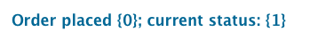
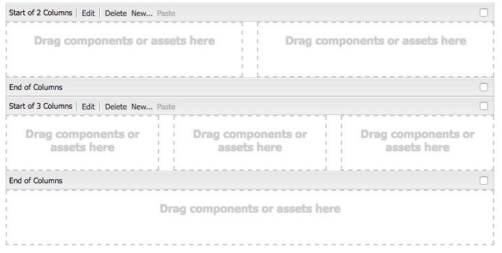
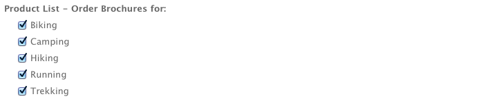
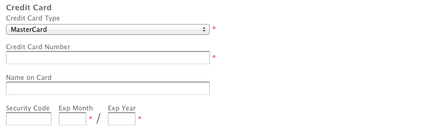
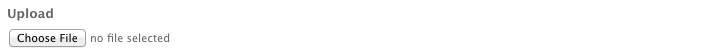

# Componentes da autoria de página{#components-for-page-authoring}

Os componentes a seguir devem ser usados ao criar conteúdo autoral em uma página da Web padrão. Eles formam um subconjunto de componentes disponíveis out-of-the-box em uma instalação padrão do AEM.

Alguns estão imediatamente disponíveis através do Sidekick; vários outros também estão disponíveis usando o [Modo de design ](/help/sites-classic-ui-authoring/classic-page-author-design-mode.md) para ativá-los ou desativá-los.

>[!CAUTION]
>
>Esta seção discute somente os componentes que estão disponíveis out-of-the-box em uma instalação padrão do AEM.
>
>Dependendo do seu caso, você pode ter componentes personalizados desenvolvidos explicitamente para as suas necessidades. Eles podem até ter o mesmo nome que alguns dos componentes discutidos aqui.

The components are available when [editing a page](/help/sites-classic-ui-authoring/classic-page-author-edit-content.md) from the **Components** tab of the sidekick and the **Insert New Component** selector (when you double-click in the **Drag components or assets here** area).

You can select a component and drag it to the required location on your page and then [Edit Content and Properties](/help/sites-classic-ui-authoring/classic-page-author-edit-content.md#editing-a-component-content-and-properties).

Os componentes são classificados de acordo com as diferentes categorias (grupos de componentes), incluindo (para criação de página):

* [Geral:](#general) inclui componentes básicos, como texto, imagens, tabelas, gráficos e assim por diante.
* [Colunas:](#columns) inclui os componentes necessários para organizar o layout do conteúdo.
* [Formulário:](#formgroup) inclui todos os componentes necessários para criar um formulário.

## Geral {#general}

Os componentes Gerais são os componentes básicos usados na criação de conteúdo.

### Item de conta {#account-item}

Você pode definir um link com título e descrição.


### Imagem adaptativa {#adaptive-image}

O componente de base da Imagem adaptativa gera imagens que são dimensionadas para caber na janela na qual a página da Web está aberta. Para usar o componente, você fornece um recurso de imagem do sistema de arquivos ou DAM. Quando a página da Web está aberta, o navegador baixa uma cópia da imagem que foi redimensionada para que seja adequada à janela atual.

As características seguintes podem determinar o tamanho da janela:

* Tela do dispositivo: os dispositivos móveis geralmente exibem as páginas da Web, para que estendem-se por toda a tela.
* Tamanho da janela do navegador da Web: os usuários de laptop e desktop podem redimensionar as janelas do navegador da Web.

Por exemplo, o componente gera uma imagem pequena, quando a página da Web é aberta em um telefone celular e, uma imagem de tamanho médio quando é aberta em um tablet. Em um laptop, o componente cria e oferece uma imagem grande, quando a página é aberta em um navegador da Web maximizado. Quando o navegador da Web é redimensionado para caber em uma parte da tela, o componente se adapta, fornecendo uma imagem menor e, atualiza a visualização.

#### Formatos de imagem suportados {#supported-image-formats}

Você pode usar os arquivos de imagem das seguintes extensões de nome de arquivo com o componente da Imagem adaptativa:

* .jpg
* .jpeg
* .png
* .gif **

>[!CAUTION]
>
>** Arquivos .gif animados não são suportados no AEM para renderizações adaptativas.

#### Tamanhos e qualidade de imagens {#images-sizes-and-quality}

A tabela a seguir lista a largura da imagem que é gerada para a largura da janela de exibição fornecida. A altura da imagem gerada é calculada para manter uma proporção do aspecto constante e, nenhum espaço em branco ocorre dentro da borda da imagem. O comando Recortar pode ser usado para evitar espaços em branco.

Quando a imagem é uma imagem JPEG, o tamanho do visor também pode influenciar a qualidade de JPEG. As seguintes qualidades de JPEG são possíveis:

* Baixa (0,42)
* Média (0,82)
* Alta (1,00)

| Limite de largura do visor (pixels) | Largura da imagem (pixels) | Qualidade JPEG | Tipo de dispositivo de destino |
|---|---|---|---|
| largura &lt;= 319 | 320 | low |  |
| largura = 320 | 320 | médio | Telefone celular (retrato) |
| 320 &lt; largura &lt; 481 | 480 | médio | Telefone celular (paisagem) |
| 480 &lt; largura &lt; 769 | 476 | alto | Tablet (retrato) |
| 768 &lt; largura &lt; 1025 | 620 | alto | Tablet (paisagem) |
| largura &lt;= 1025 | completo (tamanho original) | alto | Área de trabalho |

#### Propriedades {#properties}

A caixa de diálogo permite editar as propriedades da sua instância do componente de Imagem adaptativa, muitas das quais são comuns com o componente de imagem na qual são baseadas. As propriedades estão disponíveis em duas guias:

* **Imagem**

   * **Imagem**
Arraste uma imagem do localizador de conteúdo ou clique para abrir uma janela de navegação, onde é possível carregar uma imagem. Depois que a imagem é carregada, é possível recortar a imagem, girá-la ou excluí-la. Para aumentar e diminuir o zoom da imagem, use a barra de rolagem abaixo da imagem (acima dos botões OK e Cancelar).

   * **Recortar**
Recorte uma imagem. Arraste a borda para recortar a imagem.

   * **Girar** Clique em Girar repetidamente até que a imagem seja girada como desejado.

   * **Apagar** Remova a imagem atual.

* **Avançado**

   * **Título** O componente da Imagem adaptativa não utiliza essa propriedade.

   * **Texto alternativo** O texto alternativo para usar com a imagem.

   * **Vincular ao** O componente da Imagem adaptativa não utiliza essa propriedade.

   * **Descrição** O componente da Imagem adaptativa não utiliza essa propriedade.

#### Estender o componente adaptável de imagem {#extending-the-adaptive-image-component}

Para obter informações sobre como personalizar o componente Imagem adaptativa, consulte [Noções sobre o Componente de imagem adaptativa ](/help/sites-developing/responsive.md#using-adaptive-images).

### Carrossel {#carousel}

O componente Carrossel permite exibir imagens associadas a páginas individuais:

* uma de cada vez
* por pouco tempo
* em uma ordem especificada por você
* com um atraso de tempo especificado por você

Os controles clicáveis também permitem que o usuário alterne entre as páginas exibidas em tempo real, sob demanda. Clicar na imagem da página visível atualmente leva você para essa página. Em outras palavras, o carrossel atua como um controle de navegação.

#### Propriedades {#properties-1}

Estão disponíveis em duas guias:

* **Carrossel** Aqui você especifica como o carrossel opera:

   * Velocidade de reprodução O tempo em milissegundos antes de o próximo slide ser exibido.
   * Tempo de transição Tempo em milissegundos para a transição entre dois slides.
   * Estilo dos controles Várias opções estão disponíveis em um menu suspenso; por exemplo, os botões Anterior/Próximo, comutadores superior/direita.

* **Lista** Aqui você especifica como as páginas são incluídas no Carrossel:

   * **Criar lista usando** Existem várias maneiras de criar uma lista de páginas - Páginas secundárias, Lista fixa, Pesquisa ou Pesquisa avançada (todas descritos abaixo). Observe que, independentemente do método escolhido, cada página que você incluir na sua lista deve ter uma imagem associada à página. É esta imagem que será exibida no carrossel. Caso não haja imagens para uma determinada página na opção Propriedades da página, você deve associar uma imagem à página antes de começar, caso contrário, o carrossel exibirá uma página em branco (ou na maior parte em branco). Consulte [Editar as propriedades da página](/help/sites-classic-ui-authoring/classic-page-author-edit-page-properties.md). Dependendo do item que você escolher, um novo painel será exibido:

      * **Opções de páginas filhas**

         * **Página principal** Especifique um caminho manualmente ou usando o seletor. Deixe em branco para usar a página atual como principal.
      * **Opções para a lista fixa**

         * **Páginas** Selecione uma lista de páginas. Use 
`+` para adicionar mais entradas e os botões Para cima/Para baixo para ajustar a ordem.
      * **Opções de pesquisa**

         * **Começa em** Especifique um caminho manualmente ou usando o seletor.

         * **Pesquisar consulta** Você pode inserir uma consulta de pesquisa de texto simples.
      * **Opções de pesquisa avançada**

         * **Notação do predicativo do Querybuilder** Você pode inserir uma consulta de pesquisa usando a notação do predicativo do Querybuilder. Por exemplo, é possível inserir &quot;fulltext=Marketing&quot; para ter todas as páginas com “Marketing” em seu conteúdo exibidas no carrossel. Consulte a [API do QueryBuilder](/help/sites-developing/querybuilder-api.md) para obter uma discussão completa sobre as expressões de consulta e mais exemplos.
   * **Ordenar por** seleção 
`jcr:title`, `jcr:created`, `cq:lastModified`ou `cq:template` do menu suspenso.

   * **Limite** O número máximo de itens que você gostaria de usar no carrossel; esse item é opcional.


>[!NOTE]
Você pode criar um componente de carrossel personalizado para o Adobe Experience Manager que exibe os ativos digitais localizados no DAM AEM. Para obter informações, consulte [Criação de componentes personalizados do carrossel para o Adobe Experience Manager](https://helpx.adobe.com/experience-manager/using/custom-carousel-components.html).

### Gráfico {#chart}

O componente Gráfico permite que você adicione um gráfico de barras, de linhas o de pizza. O AEM cria um gráfico a partir dos dados fornecidos. Você fornece os dados, digitando diretamente na guia de Dados ou copiando e colando em uma planilha.

* **Dados**

   * **Dados do gráfico** Insira os dados do gráfico usando o formato CSV; o formato de Valores separados por vírgulas usa vírgulas (“,”) como separador de campo.

* **Avançado**

   * **Tipo de gráfico** Selecione no gráfico de pizza, de linhas e de barras.

   * **Texto alternativo** O texto alternativo é exibido em vez do gráfico.

   * **Largura** Largura do gráfico em pixels.

   * **Altura** Altura do gráfico em pixels.

O exemplo a seguir mostra um gráfico de dados seguido pelo gráfico de barras resultante:

 _ 

>[!NOTE]
Você pode criar um controle gráfico AEM personalizado que exibe os dados localizados no JCR AEM. Para obter informações, consulte [Exibição dos dados do Adobe Experience Manager em um gráfico](https://helpx.adobe.com/experience-manager/using/displaying-experience-manager-data-chart.html).

### Fragmento de conteúdo {#content-fragment}

>[!CAUTION]
A funcionalidade completa do Gerenciamento de fragmento do conteúdo só está disponível com a Interface do usuário otimizada para toque.
O componente de Fragmento do conteúdo pode ser visto no sidekick da interface do usuário clássica, mas funções adicionais não estão disponíveis.

Os [Fragmentos de conteúdo](/help/sites-classic-ui-authoring/classic-page-author-content-fragments.md) são criados e gerenciados como ativos independentes da página. Em seguida, é possível usar estes fragmentos e suas variações ao criar suas páginas de conteúdo.

### Importador de design {#design-importer}

Isso permite fazer upload de um arquivo zip com um pacote de design.

### Download {#download}

O componente de download cria um link na página da Web selecionada para baixar um arquivo específico. Você pode arrastar um ativo do Localizador de conteúdo ou fazer o upload de um arquivo.

* **Download**

   * **Descrição** Uma breve descrição é exibida com o link de download.

   * **Arquivo**
Arquivo disponível para download na página da Web resultante. Arraste um ativo do localizador de conteúdo ou clique na área para fazer o upload do arquivo disponível para download.

O exemplo a seguir mostra o componente de Download no Geometrixx:


### Externo {#external}

O componente externo de integração do aplicativo (**Externo**) permite que você incorpore aplicativos externos na página do AEM usando um iframe.

* **Externo**

   * **Aplicativo de destino**

      Especifique o URL do aplicativo da Web a ser integrado; por exemplo:

      ```
      https://en.wikipedia.org/wiki/Main_Page
      ```

   * **Enviar parâmetros**

      Marque a caixa para ver se os parâmetros são passados para o aplicativo, quando necessário.

   * **Largura e altura**

      Define o tamanho do iframe

The external application is integrated into the paragraph system of the AEM page; for example, when using a Target application of `https://en.wikipedia.org/wiki/Main_Page`:


>[!NOTE]
Dependendo do caso de uso, outras opções estão disponíveis para integração de aplicativos externos, por exemplo, a [Integração de portlets](/help/sites-administering/aem-as-portal.md).

### Flash {#flash}

O componente Flash permite que você carregue um filme em Flash. Você pode arrastar um ativo em Flash do localizador de conteúdo para o componente ou usar a caixa de diálogo:

* **Flash**

   * **Filme em flash**

      O arquivo de filme em flash. Arraste um ativo do localizador de conteúdo ou clique para abrir uma janela de navegação.

   * **Tamanho**

      Dimensões em pixels da área de exibição contendo o filme.

* **Imagem alternativa**

   Uma imagem alternativa para ser exibida

* **Avançado**

   * **Menu de contexto**

      Indica se o menu de contexto deve ser mostrado ou oculto.

   * **Modo de janela**

      A forma como a janela aparece, por exemplo opaca, transparente ou como uma janela distinta (sólida).

   * **Cor do plano de fundo**

      A cor do plano de fundo selecionada a partir do gráfico de cores fornecido.

   * **Versão mínima**

      A versão mínima do Adobe Flash Player necessária para executar o filme. O padrão é 9.0.0.

   * **Atributos**

      Quaisquer atributos necessários.

### Imagem {#image}

O componente de imagem exibe uma imagem e texto respectivo de acordo com os parâmetros especificados.

Você pode fazer upload de uma imagem, editar e manipulá-la (por exemplo, cortar, girar, adicionar link/título/texto).

Você pode arrastar e soltar uma imagem do [Localizador de conteúdo](/help/sites-classic-ui-authoring/classic-page-author-env-tools.md#the-content-finder) diretamente no componente ou na caixa de diálogo Editar. Você também pode clicar duas vezes na área central da caixa de diálogo Editar para navegar pelo seu sistema de arquivos local e fazer upload de uma imagem. As duas guias da caixa de diálogo Editar também controla todas as definições e manipulações da imagem:


>[!NOTE]
O progresso do upload não pode ser monitorado com o Internet Explorer.
Os usuários do Internet Explorer precisam fazer upload da imagem e clique em **Ok** e abra novamente a imagem para ver o arquivo carregado na visualização e para poder realizar as modificações (isto é, cortar).
See the [Certified Platforms](/help/release-notes/release-notes.md#certifiedplatforms) section for more information about HTML5 features used by AEM.

Quando uma imagem é carregada, você pode configurar o seguinte:

* **Mapa**

   Para mapear uma imagem, selecione Mapa. É possível selecionar como deseja criar o mapa de imagem (retângulo, polígono e assim por diante) e especificar para onde a área deve apontar.

* **Cortar**

   Selecione Recortar para recortar uma imagem. Use o mouse para recortar a imagem.

* **Girar**

   Para girar uma imagem, selecione Girar. Clique repetidamente até que a imagem seja girada da maneira que desejar.

* **Limpar**

   Remova a imagem atual.

* **Barra de zoom**

   Para ampliar e reduzir a imagem, use a barra de rolagem abaixo da imagem (acima dos botões OK e Cancelar)

* **Título**

   O título da imagem.

* **Texto alternativo**

   Um texto alternativo para usar ao criar conteúdo acessível.

* **Vincular ao**

   Crie um link para ativos ou outras páginas em seu site.

* **Descrição**

   A descrição da imagem.

* **Tamanho**

   Define a altura e a largura da imagem.

A imagem final (com **Título** e **Descrição**) pode ser mostrada como:


### Contêiner de layout {#layout-container}

>[!CAUTION]
Embora o componente do contêiner de layout esteja disponível na interface do usuário clássica, as suas funcionalidades estão disponíveis apenas na interface do usuário habilitada para toque. Para obter detalhes, consulte [Layout responsivo](/help/sites-classic-ui-authoring/classic-page-author-responsive-layout.md).

### Lista {#list}

O componente de Lista permite que você configure os critérios de pesquisa para a exibição de uma lista:

* **Lista**

   * **Criar uso da lista**

      Aqui, você especifica em qual lista recuperará o conteúdo. Existem vários métodos:

   * Dependendo do item que você escolher, um novo painel será exibido:

      * **Opções de páginas filhas**

         * **Filhos de (Página principal)**
Especifique um caminho manualmente ou usando o seletor. Deixe em branco para usar a página atual como principal.
      * **Opções para a lista fixa**

         * **Páginas**

            Selecione uma lista de páginas. Use + para adicionar mais entradas e os botões Para cima/Para baixo para ajustar a ordem.
      * **Opções de pesquisa**

         * **Começa em**

            Insira um caminho inicial, manualmente ou usando o seletor.

         * **Pesquisar consulta**

            Você pode inserir um query de pesquisa de texto simples.
      * **Opções de pesquisa avançada**

         * **Notação do predicativo do Querybuilder**

            Você pode inserir um query de pesquisa usando a notação do predicativo do Querybuilder. Por exemplo, é possível inserir &quot;fulltext=Marketing&quot; para ter todas as páginas com &quot;Marketing&quot; em seu conteúdo exibidas no carrossel.

            Consulte a [API do QueryBuilder](/help/sites-developing/querybuilder-api.md) para obter uma discussão completa sobre as expressões de consulta e mais exemplos.
      * **Tags**

         Especifique a **página principal**, **tags/palavras-chave** e critérios de correspondência.
   * **Exibir como**

      A forma como deseja que os itens sejam listados; inclui links, teasers e notícias.

   * **Ordenar por**

      Caso a lista deva ser ordenada, e, se assim for, os critérios a serem usados para a classificação. Você pode inserir um critério ou selecionar um da lista suspensa fornecida.

   * **Limite**

      Especifique o número máximo de itens que deseja exibir na lista.

   * **Ativar feed**

      Indica se um feed RSS deve ser ativado na lista.

   * **Paginar após**

      Aqui, você pode especificar o número de itens da lista para serem exibidos ao mesmo tempo. Uma lista com mais itens do que o especificado usará a paginação para exibir a lista em várias porções.


O exemplo a seguir mostra um componente de **Lista** da forma que ele poderá exibir uma lista de páginas filhas (o design é controlado pelas definições CSS personalizadas do site).


### Logon {#login}

Fornece os campos Nome de usuário e Senha.


É possível configurar:

* Logon

   * Rótulo da seção

      Texto principal para os campos de entrada.

   * Rótulo do nome de usuário

      Texto para rotular o campo de nome de usuário.

   * Rótulo da senha

      Texto para rotular o campo de senha.

   * Rótulo do botão de logon

      Texto para o botão de logon.

   * Redirecionar para

      Você pode especificar a página em seu site que deve ser aberta assim que o usuário fizer logon.

* Já está conectado

   * Continuar a etiqueta do botão

      Texto para indicar que o usuário já está conectado.

### Status do pedido {#order-status}

* **Título**

   * **Título**

      Especifique o texto do título que deseja exibir.

   * **Link**

      Especifique a página (produto) para a qual o status do pedido deve ser exibido.

   * **Tipo / Tamanho**

      Selecione na seleção fornecida.



### Referência {#reference}

O componente de **referência** permite referenciar o texto em outra página do site AEM (dentro da ocorrência atual). O conteúdo do parágrafo referenciado aparecerá como se fosse na página atual. O conteúdo será atualizado quando o parágrafo de origem for alterado (pode ser necessário uma atualização de página).

* **Parágrafo de referência**

   * **Referência**

      Especifique o caminho para a página e o parágrafo que deseja referenciar (inclua o conteúdo).

Para especificar o caminho para um parágrafo, você precisa colocar o caminho (para a página) como um sufixo com:

`.../jcr:content/par/<paragraph-ID>`

Por exemplo:

`/content/geometrixx-outdoors/en/equipment/biking/cajamara/jcr:content/par/similar-products`

Além de referenciar um número específico, o caminho também pode ser modificado para especificar um sistema de parágrafo completo. Você pode fazer isso usando como sufixo o caminho com:

`/jcr:content/par`

Por exemplo:

`/content/geometrixx-outdoors/en/equipment/biking/cajamara/jcr:content/par`

Uma vez configurado, o conteúdo será exibido exatamente como na página de origem. O fato de que é uma referência só é visto quando você abre o componente para edição: 


### Pesquisar {#searching}

O componente de pesquisa adiciona o recurso de pesquisa à sua página.

É possível configurar:

* Pesquisar  

   * **Tipos de nós**

      If the search is to be restricted to specific node type list them here; for example, `cq:Page`.

   * **Caminho para pesquisar em**

      Especifique a página raiz do ramo que deseja pesquisar.

   * **Texto do botão de pesquisa**

      O nome exibido no botão de pesquisa atual.

   * **Texto de estatística**

      O texto exibido acima dos resultados de pesquisa.

   * **Nenhum texto de resultados**

      Se não houver resultados, o texto inserido aqui será exibido.

   * **Verificar a ortografia do texto**

      Caso alguém insira um termo semelhante, esse texto será exibido antes do termo.
Por exemplo, caso digite geometrixxe, o sistema exibirá &quot;Você quer dizer? geometrixx&quot;.

   * **Texto com páginas semelhantes**

      O texto que é exibido ao lado de um resultado para as páginas semelhantes. Clique neste link para visualizar as páginas com conteúdo semelhante.

   * **Texto com buscas relacionadas**

      O texto que aparece ao lado das pesquisas para os termos e tópicos relacionados.

   * **Pesquisar textos de tendências**

      O título acima dos termos de pesquisa inseridos pelos usuários.

   * **Rótulo das páginas resultantes**

      O texto que aparece na parte inferior da lista, com links para outras páginas de resultados.

   * **Rótulo anterior**

      O nome que aparece no link para as páginas de pesquisa anteriores.

   * **Próximo rótulo**

      O nome que aparece no link para as páginas de pesquisa subsequentes.

O exemplo a seguir mostra o componente de Pesquisa depois de pesquisar a palavra *geometrixx* no diretório raiz de uma instalação padrão. Também ilustra a paginação dos resultados:


O exemplo a seguir mostra um termo de pesquisa escrito incorretamente e não está disponível:


### Mapa do site {#sitemap}

Uma lista de mapa do site automático, que (com as configurações padrão) lista todas as páginas (como links ativos) no site atual. Por exemplo, uma extração mostra:


Se necessário, é possível configurar:

* **Mapa do site**

   * **Caminho raiz**

      O caminho onde a lista inicia.

### Slideshow {#slideshow}

Este componente permite que você carregue uma série de imagens a serem exibidas como um slideshow em sua página. Você pode adicionar ou remover imagens e atribuí-las um título. Em Avançado, também é possível especificar o tamanho da área de exibição.

É possível configurar:

* **Slides**

   * **Novo slide**

      You can specify a selection of slides using the **Add** (and **Remove**) buttons.

   * **Título**

      Especifique um título, se necessário. Isso é sobreposto no slide apropriado.

* **Avançado**

   * **Tamanho**

      Especifique a largura e a altura em pixels.

O componente de slideshow exibe repetidamente em cada sequência, durante um curto período de tempo, antes de esmaecer para o próximo slide:


### Table {#table}

>[!NOTE]
O componente de **Tabela** baseia-se no [Editor de Rich Text](/help/sites-classic-ui-authoring/classic-page-author-rich-text-editor.md), já que é o componente de **[Texto](#text)**.
Recomenda-se usar o componente de **Tabela** para tabelas, embora também possam ser construídas com o componente de **Texto**.

O componente de **Tabela** é pré-configurado para permitir a você construir, preencher e formatar uma tabela. Usando a caixa de diálogo, você pode configurar a sua tabela e criar o conteúdo da seguinte maneira:

* desde o início
* copiando e colando uma planilha ou uma tabela em um editor externo (como Excel, OpenOffice, Bloco de notas, etc).


A captura de tela a seguir mostra um exemplo do uso do componente de tabela; o design é determinado pelo CSS específico do site:


### Nuvem de tags {#tag-cloud}

Uma nuvem de tags mostra uma seleção apresentada graficamente das tags aplicadas ao conteúdo do seu site:


Ao configurar o componente de Nuvem de tags, você pode especificar:

* **Tags a exibir**
Onde as tags a serem exibidas são coletadas. Selecione de uma página, uma página com todas as páginas filhas ou com todas as tags.

* **Página** Selecione a página que será referenciada.

* **Não há links nas tags** Se as tags exibidas devem agir como links.

Para obter mais informações sobre como aplicar tags, acesse [Usando tags ](/help/sites-classic-ui-authoring/classic-feature-tags.md).

### Texto {#text}

>[!NOTE]
O componente de **Texto** baseia-se no [Editor de Rich Text](/help/sites-classic-ui-authoring/classic-page-author-rich-text-editor.md), já que é o componente de **[Tabela](#table)**.
Recomenda-se usar o componente de **Tabela** para tabelas, embora também possam ser construídas com o componente de **Texto**.

O componente de Texto permite que você insira um bloco de texto usando um editor WYSIWYG, com funcionalidade fornecida pelo [Editor de Rich Text](/help/sites-classic-ui-authoring/classic-page-author-rich-text-editor.md). Uma seleção de ícones permite que você formate o texto, incluindo características da fonte, alinhamento, links, listas e recuo.


Ao abrir a guia **Estilos** da caixa de diálogo **Editar**, você também pode definir:

* **Espaçador**
* **Estilo de texto**

O texto formatado será exibido na página; o design atual dependerá do CSS do site:


Para obter informações mais detalhadas sobre o componente de texto, consulte a página do [Editor de Rich Text.](/help/sites-classic-ui-authoring/classic-page-author-rich-text-editor.md)

#### Edição local {#inplace-editing}

Além do texto da caixa de diálogo baseada no modo de edição de Rich Text, o AEM também oferece a [edição no local](/help/sites-authoring/editing-content.md), que permite a edição direta do texto da forma como é exibido no layout da página.

### Texto e imagem {#text-image}

O componente de Texto e Imagem adiciona um bloco de texto e uma imagem. Você também pode adicionar e editar texto e imagens separadamente. Consulte os componentes [Texto](#text) e [Imagem](#image) para obter detalhes.

 

É possível configurar:

* **Estilos** de componente (**Estilos**)

   Aqui, você pode alinhar à esquerda ou à direita da imagem. O padrão é alinhamento à **Esquerda,** com a imagem à esquerda.

* **Propriedades** da imagem (Propriedades **** avançadas da imagem)

   Permite que você especifique o seguinte:

   * **Ativos da imagem**

      Carregue a imagem necessária.

   * **Título**

      O título do bloco; serão mostrados ao passar o mouse.

   * **Texto alternativo**

      O texto alternativo a ser exibido se a imagem não puder ser exibida. Caso deixado em branco, o título será usado.

   * **Vincular para**

      Especifique um caminho de público alvo.

   * **Descrição**

      A descrição da imagem.

   * **Tamanho**

      Define a altura e a largura da imagem.

O exemplo a seguir mostra um componente de Imagem de texto exibindo a imagem alinhada à esquerda:


### Título {#title}

O componente de título pode:

* exibir o nome da página atual; isso pode ser feito ao deixar o campo Título em branco
* exibir um texto que você especificar no campo Título.

É possível configurar:

* **Título**

   Caso deseje usar um nome diferente do título da página, insira-o aqui.

* **Link**

   A URI, caso o título funcione como um link.

* **Tipo / Tamanho**

   Selecione Pequeno ou Grande na lista suspensa. Pequeno é gerado como uma imagem. Grande é gerado como texto.

O exemplo a seguir mostra um componente de **Título** sendo exibido; o design é determinado pelo CSS específico do site.


### Vídeo {#video}

O componente de **Vídeo** permite que você coloque um elemento “out-of-the-box” de vídeo predefinido em uma página.

Consulte também [Configurar os perfis de vídeo](/help/sites-administering/config-video.md#configuringvideoprofiles) para uso com elementos de HTML5.

Depois de adicionar uma instância de componente em sua página, você pode configurar:

* Vídeo

   * **Ativo de vídeo**

      Carregue ou solte seu ativo de vídeo.

   * **Tamanho**

      O tamanho nativo do vídeo (largura x altura em pixels) será exibido nas caixas ao lado do Tamanho (veja acima). Insira manualmente as dimensões de largura e altura aqui, caso deseje substituir as dimensões nativas do vídeo. Clique em **OK** para fechar a caixa de diálogo.

>[!NOTE]
Os formatos suportados incluem:
* `.mp4`
* `Ogg`
* `FLV` (vídeo do Flash)


## Columns {#columns}

As colunas são um mecanismo para controlar o layout de conteúdo no AEM. Em uma instalação padrão, são fornecidos componentes para a criação de duas e/ou três colunas.

O exemplo a seguir mostra os componentes das 2 Colunas e 3 Colunas em uso. É possível usar os espaços reservados para os novos componentes:



### 2 Colunas {#columns-1}

Um componente de controle de coluna que padroniza 2 colunas iguais.

### 3 colunas {#columns-2}

Um componente de controle de coluna que padroniza 3 colunas iguais.

### Controle de coluna {#column-control}

O componente de Controle de coluna permite que os usuários escolham como dividir o conteúdo no painel principal da página da Web em várias colunas. Os usuários podem escolher o número de colunas necessárias (de uma lista predefinida) e, em seguida, criam, excluem ou movem o conteúdo dentro de cada uma das colunas.

* **Controle de coluna**

   * **Layout da coluna**

      Selecione o número de colunas que deseja apresentar. Depois da criação, cada coluna tem seu próprio link para arrastar componentes ou ativos aqui ao adicionar conteúdo.

## Formulário {#form}

Os componentes do formulário são usados &#x200B;&#x200B;para criar formulários para os visitantes enviarem informações. Os formulários e os componentes do formulário podem ser usado para coletar informações, incluindo o feedback do usuário (por exemplo, um questionário de satisfação do cliente) e as informações do usuário (por exemplo, o registro do usuário).

>[!NOTE]
Consulte [Ajuda com os formulários AEM](/help/forms/home.md) para obter informações sobre os formulários AEM.

Os formulários são criados de vários componentes diferentes:

* **Formulário**

   O componente de formulário define o início e o fim de um novo formulário em uma página. Outros componentes podem, então, ser colocados entre esses elementos, tais como tabelas, downloads e assim por diante.

* **Elementos e campos de formulário**

   Os campos e elementos do formulário podem incluir caixas de texto, botões de opção, imagens e assim por diante. O usuário geralmente completa uma ação em um campo de formulário, como digitar um texto. Consulte os elementos de formulário individuais para obter mais informações.

* **Componentes de perfil**

   Os componentes do perfil se relacionam aos perfis do visitante usados para a colaboração social e outras áreas onde a personalização do visitante é necessária.

A seguir, há um formulário de exemplo que contém o componente do **Formulário** (início e fim) com dois campos de **texto de** **formulário** usados para inserir, um campo de **texto** **geral** usado para o texto principal e um botão **Enviar.**


>[!NOTE]
Informações sobre o desenvolvimento e a personalização de seus formulários está disponível na página de [Desenvolvimento de formulários.](/help/sites-developing/developing-forms.md)Isso inclui a adição de ações e restrições, o pré-carregamento de campos e a utilização de scripts para chamar um serviço para tomar uma ação, entre outros. 

### Configurações comuns a (diversos) componentes de formulários {#settings-common-to-many-form-components}

Embora cada um dos componentes do formulário tenha uma finalidade diferente, muitos são compostos de opções e parâmetros similares.

Ao configurar qualquer um dos componentes do formulário, as seguintes guias estarão disponíveis na caixa de diálogo:

* **Título e texto**

   Aqui, é necessário especificar as informações básicas, como o título do formulário e qualquer texto que o acompanha. Se for o caso, também é possível definir outras informações importantes, como se o campo é de seleção múltipla e se os itens estão disponíveis para seleção.

* **Valores iniciais**

   Permite que você especifique um valor padrão.

* **Restrições**

   Aqui, você pode especificar se um campo é obrigatório e se as restrições de local estão nesse campo (por exemplo, deve ser numérico e assim por diante).

* **Estilo**

   Indica o tamanho e estilo dos campos.

>[!NOTE]
Os campos variam muito, dependendo do componente individual.

Essas guias fornecem os parâmetros necessários; estes dependem do tipo de componente individual, mas podem incluir:

* **Título e texto**

   * **Nome do elemento**

      Nome do elemento de formulário. Indica onde os dados são armazenados no repositório.
Este é um campo obrigatório e deve conter apenas os seguintes caracteres:

      * caracteres alfanuméricos
      * `_ . / : -`
   * **Título**

      O título exibido com o campo. Caso deixado em branco, o título padrão será exibido.

   * **Descrição**

      Permite fornecer informações adicionais para o usuário, se necessário. No formulário isso é exibido abaixo do campo, em uma fonte menor do que o título.

   * **Exibir / Ocultar**

      Determina quando o campo está visível.


* **Valores iniciais**

   * **Valor padrão**

      O valor exibido no campo quando o formulário é aberto; ou seja, antes que o usuário tenha inserido qualquer informação.

* **Restrições**

   * **Obrigatório**

      Isso depende do tipo de componente de formulário, mas fornece uma ou mais caixas de clique para indicar que esse campo, ou determinadas partes desse campo, é/são necessários.

   * **Mensagem obrigatória**

      Uma mensagem para informar os usuários que esse campo é obrigatório; um campo obrigatório também será sinalizado com e asterisco.

   * **Restrição**

      As restrições disponíveis para seleção dependem do tipo de componente de formulário.

   * **Mensagem de restrição**

      Uma mensagem para informar os usuários o que é necessário.

* **Estilo**

   * **Tamanho**

      Em linhas e colunas.

   * **Largura**

      Em pixels.

   * **CSS**

### Formulário (componente) {#form-component}

O componente Formulário define o início e o final de um formulário usando os elementos **Início do formulário** e **Fim do formulário**. São sempre pareados para garantir que o formulário esteja definido corretamente.


Entre o início e o fim de um formulário, você pode adicionar componentes do formulário que definem os campos de entrada atuais para os usuários.

#### Início do formulário {#start-of-form}

Esse componente é necessário para definir o início de um novo formulário em uma página. É possível configurar:

* **Formulário**

   * **Página de agradecimento**

      A página a ser referenciada para agradecer aos visitantes por suas informações. Caso deixado em branco, o formulário será exibido novamente após o envio.

   * **Iniciar fluxo de trabalho**

      Determina qual fluxo de trabalho é acionado, após o envio do formulário.

* **Avançado**

   * **Tipo de ação**

      Um formulário exige uma ação. A ação define a operação acionada pela execução com os dados enviados pelo usuário (semelhante a action= in HTML). Alguns precisam de uma **Configuração de ação** correspondente.

      Uma seleção de tipos de ação está incluída em uma instalação padrão do AEM:

      * **Solicitação de conta**
      * **Criar conteúdo**
      * **Criar lead**
      * **Criar e atualizar a conta**
      * **Serviço de email: criar assinante e adicionar à lista**
      * **Serviço de email: enviar email de resposta automática**
      * **Serviço de email: cancelar a inscrição do usuário da lista**
      * **Editar comunidade**
      * **Editar recursos**
      * **Editar recursos controlados pelo fluxo de trabalho**
      * **Email**
      * **Detalhes do pedido feito**
      * **Atualização do perfil**
      * **Redefinir senha**
      * **Definir senha**
      * **Armazenar conteúdo**

         Esse é o tipo de ação padrão.

      * **Armazenar conteúdo com os uploads**
      * **Enviar pedido**
      * **Cancelar assinatura do assinante**
      * **Atualizar pedido**
   * **Identificador de formulário**

      O identificador de formulário identifica-o. Use o identificador de formulário caso tenha vários formulários em uma única página; verifique se eles têm identificadores diferentes.

   * **Carregar caminho**

      O caminho para as propriedades do nó usado para carregar valores predefinidos nos campos do formulário.
Isso é um campo opcional que especifica o caminho para um nó no repositório. Quando este nó tem propriedades que correspondem aos nomes do campo, os campos apropriados no formulário são pré-carregados com o valor dessas propriedades. Caso não exista nenhuma correspondência, o campo vai conter o valor padrão.
Com o uso do **Caminho de carga,** é possível pré-carregar o formulário com valores nos campos necessários. Consulte [Pré-carregar valores do formulário](/help/sites-developing/developing-forms.md#preloading-form-values).

   * **Validação do cliente**

      ** Isso pode ser obtido em conjunto com o componente **Captcha de formulários**.

   * **Tipo de recurso de validação**

      Define o tipo de recurso de validação do formulário, caso deseje validar o formulário inteiro (em vez de campos individuais). Caso esteja validando o formulário completo, inclua também um dos itens a seguir:

      * Um script de validação do cliente:

         `/apps/<myApp>/form/<myValidation>/formclientvalidation.jsp`

      * Um script de validação no lado do servidor:

         `/apps/<myApp>/form/<myValidation>/formservervalidation.jsp`
   * **Configurações de ação**

      The options available in **Action Configuration** are dependent on the **Action Type** selected:

      * **Solicitação de conta**

         * **Criar página de conta** A página usada para criar uma nova conta.
      * **Criar conteúdo**

         * Content Path
The content path for any content that the form dumps. Enter a path that ends with a slash `/`. The slash means that for each form port, a new node is created at the given location; for example:
            `/forms/feedback/`

         * **Tipo**

            Selecione o tipo necessário.

         * **Formulário**

            Especifique o formulário.

         * **Renderizar com**

            Selecione a opção desejada na lista.

         * **Tipo de recurso**

            Se definido, isso será adicionado a cada comentário como `sling:resourceType`

         * **Exibir seletor**
      * **Criar lead**

         * **O lead será adicionado a esta lista** Especifique a lista de lead necessária.
      * **Criar e atualizar a conta**

         * **Grupo inicial**

            Grupo ao qual atribuir novo usuário.

         * **Início**

            Página a ser exibida após o login bem-sucedido.

         * **Caminho**

            O caminho (relativo) para onde a nova conta é criada e armazenada.

         * **Exibir dados...**

            Clique nesse botão para acessar as informações sobre os resultados do formulário no editor em massa. From here, you can export the information to a `.tsv` (tab-separated) file (for use, for example, in an Excel spreadsheet).
      * **Email**

         * **De**

            Digite o endereço de e-mail de onde o e-mail deve vir.

         * **Mailto**

            Insira os endereços de email para os quais o formulário será enviado.

         * **CC**

            Insira os endereços de email CC.

         * **CCO**

            Insira os endereços de email CCO.

         * **Assunto**

            Insira um assunto para o email.
      * **Redefinir senha**

         * **Alterar página de senha**

            A página usada ao alterar a senha.
      * **Armazenar conteúdo**

         * **Caminho do conteúdo**

            O caminho do conteúdo para qualquer conteúdo que o formulário acumule. Insira um caminho terminado por uma barra `/`. A barra significa que para cada porta de formulário, um novo nó é criado no local indicado; por exemplo:
            `/forms/feedback/`

         * **Exibir dados...**

            Clique nesse botão para acessar as informações sobre os resultados do formulário no editor em massa. Aqui, você pode exportar as informações para um arquivo .tsv (separado por tabulações) (para ser usado, por exemplo, em uma planilha do Excel).
      * **Armazenar conteúdo com os uploads**

         Isso tem as mesmas opções que **Armazenar conteúdo**.

      * **Cancelar assinatura do assinante**

         * **O cliente em potencial será excluído da lista**

            Especifique a lista de cliente potencial necessária.


#### Final do formulário {#end-of-form}

Isso marca o fim do formulário. É possível configurar:

* **Fim do formulário**

   * **Mostrar botão enviar**

      Indica se um botão Enviar deve ser exibido ou não.

   * **Enviar nome**

      Um identificador se você estiver usando vários botões Enviar em um formulário.

   * **Enviar título**

      O nome que aparece no botão, como Enviar ou Enviar.

   * **Mostrar botão de redefinição**

      Marque a caixa de seleção para tornar o botão Redefinir visível.

   * **Redefinir título**

      O nome que aparece no botão Redefinir.

   * **Descrição**

      Informações que aparecem abaixo do botão.

### Nome da conta {#account-name}

Isso permite que você insira um nome de conta:


### Endereço {#address}

Isso permite que você adicione um campo de endereço internacional, com o seguinte formato:


O componente está configurado para uso imediato, mas é possível alterar a configuração, se necessário. Por exemplo, as restrições podem ser adicionadas para os elementos individuais do endereço. As configurações padrão serão usadas caso haja campos vazios.

### Captcha {#captcha}

O componente Captcha exige que o usuário digite uma sequência alfanumérica como exibido na tela. A sequência muda a cada atualização.


Você pode configurar vários parâmetros para este componente, incluindo uma mensagem a ser exibida quando a sequência captcha for inválida.

### Grupos de caixa de seleção {#checkbox-group}

Uma caixa de seleção permite que você crie uma lista de uma ou mais caixas de seleção, algumas das quais, podem ser selecionadas ao mesmo tempo.



É possível especificar vários parâmetros, incluindo um título, descrição e nome do elemento. Ao usar os botões + e -, você pode adicionar ou remover itens, em seguida, posicioná-los com as setas para cima e para baixo.

>[!NOTE]
Usando **Caminho de carga de itens**, você pode pré-carregar a lista de grupos de caixas de seleção com valores.
Consulte [Pré-carregar campos de formulário com vários valores](/help/sites-developing/developing-forms.md#preloading-form-fields-with-multiple-values).

### Detalhes do cartão de crédito {#credit-card-details}

Isso permite fornecer os campos necessários para inserir os detalhes do cartão de crédito. Você pode configurá-lo para especificar os tipos de cartão aceitos e as informações necessárias (por exemplo, código de segurança).



### Lista suspensa {#dropdown-list}

Uma lista suspensa pode ser configurada para fornecer ao usuário um intervalo de valores para seleção:


É possível especificar um título e os itens que serão exibidos na lista. Ao usar os botões + e -, você pode adicionar ou remover itens de lista, em seguida, posicioná-los com os botões para cima e para baixo. Você pode especificar se os usuários podem selecionar vários itens da lista e quaisquer itens que devem ser selecionados automaticamente na primeira vez que a lista for aberta (valores iniciais).

>[!NOTE]
Usando o **Caminho de carga de itens** você pode pré-carregar a lista suspensa com valores.
Consulte [Pré-carregar campos de formulário com vários valores](/help/sites-developing/developing-forms.md#preloading-form-fields-with-multiple-values).

### Upload de arquivo {#file-upload}

O componente de upload de arquivos fornece ao usuário um mecanismo para selecionar e enviar um arquivo.



>[!NOTE]
Você pode criar um componente de upload personalizado para fazer o upload de arquivos para um Sling Servlet. Para obter informações, consulte [Upload de arquivos no Adobe Experience Manager](https://helpx.adobe.com/experience-manager/using/uploading-files-aem1.html).

### Campo oculto {#hidden-field}

Esse componente permite a criação de um campo oculto. Estes podem ser utilizados para diversos fins; por exemplo, quando você precisa executar uma ação após enviar o formulário ou quando dados ocultos são necessários no processamento posterior. 


>[!NOTE]
Você também pode personalizar o seu formulário para mostrar ou ocultar componentes do formulário específicos, de acordo com o valor de outros campos no formulário. Alterar a visibilidade de um campo do formulário é útil, quando o campo é necessário apenas em condições específicas.
Consulte [Mostrar e ocultar componentes de formulário](/help/sites-developing/developing-forms.md#showing-and-hiding-form-components).

### Botão de imagem {#image-button}

Um botão de imagem permite que você crie um botão com seu próprio texto e imagem:


### Upload de imagem {#image-upload}

O componente de upload da imagem fornece ao usuário um mecanismo para selecionar e enviar um arquivo de imagem.


### Campo de link {#link-field}

O campo do link permite que o usuário especifique um URL:


Mais usado para o formulário de evento do calendário, onde é usado para o campo URL/link de um evento.

### Campo de senha {#password-field}

Isso é usado para permitir ao usuário inserir a senha:


### Redefinição de senha {#password-reset}

Esse componente fornece ao usuário dois campos para:

* inserir uma senha
* inserir repetidamente a senha para confirmar que a mesma está correta.

Com as configurações padrão, o componente será exibido como:


### Grupo radial {#radio-group}

Um grupo radial fornece uma lista de uma ou mais caixas de seleção radial, onde apenas uma poderá ser selecionada em um determinado momento.

É possível especificar o nome do elemento com um título e descrição. Ao usar os botões + e -, você pode adicionar ou remover itens, posicioná-los com as setas para cima e para baixo e especificar um valor padrão, se necessário:


>[!NOTE]
Usando o **Caminho de carga do item** você pode pré-carregar o grupo de opções com valores.
Consulte [Pré-carregar campos de formulário com vários valores](/help/sites-developing/developing-forms.md#preloading-form-fields-with-multiple-values).

### Botão enviar {#submit-button}

Esse componente permite que você crie um botão de envio, com o texto padrão:


Ou o seu próprio texto:


### Campo de tags {#tags-field}

Esse campo permite que você selecione as tags:


Você pode especificar diversos parâmetros, incluindo os espaços de nomes que podem ser usados na guia especializada:

* **Campo de tags**

   * **Espaços de nomes permitidos**

      * **Geometrixx Outdoors**
      * **Fluxo de trabalho**
      * **Fórum**
      * **Fotografia de bancos de dados**
      * **Geometrixx Media**
      * **Tags padrão**
      * **Marketing**
      * **Propriedades de ativos**
   * **Largura em pixels**
   * **Tamanho da pop-up**


### Campo de texto {#text-field}

O campo de texto padrão pode ser configurado no tamanho necessário e com o seu próprio lead na mensagem:


### Workflow Submit Button(s) {#workflow-submit-button-s}

Esse componente permite que você crie um botão de envio para usar em um fluxo de trabalho.


