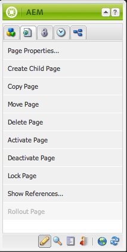

# Criação - o Ambiente e as ferramentas {#authoring-the-environment-and-tools}

O ambiente de criação do AEM fornece vários mecanismos para organização e edição de conteúdo. As ferramentas fornecidas são acessadas de vários consoles e editores de página.

## Administração de site {#site-administration}

O console **Sites** permite gerenciar e navegar em seu site. Usando dois painéis, a estrutura de seu site pode ser expandida e as ações executadas no elemento necessário:

## Editar o seu conteúdo da página {#editing-your-page-content}

Há um editor de página separado com a interface de usuário clássica, com o uso do Localizador de conteúdo e do sidekick:

`https://localhost:4502/cf#/content/geometrixx/en/products/triangle.html`

## Acessar ajuda {#accessing-help}

Vários recursos de **Ajuda** podem ser acessados diretamente do AEM:

Além de acessar a [ ajuda nas barras de ferramentas do console](/help/sites-classic-ui-authoring/author-env-basic-handling.md#accessing-help), você também pode acessá-la do sidekick (usando o  ícone ?) ao editar uma página:

Ou usando o botão **Ajuda**, na caixa de diálogo Editar, de componentes específicos; isso mostrará a ajuda sensível ao contexto.

## Sidekick {#sidekick}

A guia **Componentes** do sidekick permite navegar nos componentes disponíveis para adição à página atual. O grupo necessário pode ser expandido e, em seguida, um componente pode ser arrastado para o local necessário na página.

## O Localizador de conteúdo {#the-content-finder}

O Localizador de conteúdo é uma forma rápida e fácil de localizar ativos e/ou conteúdo no repositório durante a edição de uma página.

Use o Localizador de conteúdo para localizar uma gama de recursos. Quando apropriado, você pode arrastar um item e soltá-lo em um parágrafo na página:

* [Imagens](#finding-images)
* [Documentos](#finding-documents)
* [Filmes](#finding-movies)
* [Navegador de mídia Scene 7](/help/sites-administering/scene7.md#scene7contentbrowser)
*  [Páginas](/help/sites-classic-ui-authoring/classic-page-author-env-tools.md#finding-pages)

* [Parágrafos](#referencing-paragraphs-from-other-pages)
* [Produtos](/help/sites-classic-ui-authoring/classic-page-author-env-tools.md#products)
* Ou para [navegar pelo site através da estrutura de repositório](#the-content-finder)

Com todas as opções, você pode [pesquisar itens específicos](#the-content-finder).

### Finding Images {#finding-images}

Esta guia lista as imagens no repositório.

Depois que você criar um parágrafo de Imagem na página, poderá arrastar um item e soltá-lo no parágrafo.

### Finding Documents {#finding-documents}

Esta guia lista os documentos no repositório.

Depois que você criar um parágrafo de Download na página, poderá arrastar um item e soltá-lo no parágrafo.

### Finding Movies {#finding-movies}

Esta guia lista os filmes (por exemplo, itens Flash) no repositório.

Depois que você criar um parágrafo apropriado (por exemplo, Flash) na página, poderá arrastar um item e soltá-lo no parágrafo.

### Produtos {#products}

Esta guia lista os produtos. Depois que você criar um parágrafo apropriado (por exemplo, Produto) na página, poderá arrastar um item e soltá-lo no parágrafo.

### Encontrar páginas {#finding-pages}

Esta guia mostra todas as páginas. Clique em qualquer página para abri-la para edição.

### Referencing Paragraphs from other Pages {#referencing-paragraphs-from-other-pages}

Esta guia permite procurar outra página. Todos os parágrafos dessa página serão listados. Em seguida, você pode arrastar um parágrafo para a página atual, isso criará uma referência para o parágrafo original.

### Usar a visão completa de repositório {#using-the-full-repository-view}

Esta guia mostra todos os recursos no repositório.

### Usar a pesquisa com o navegador de conteúdo {#using-search-with-the-content-browser}

Em todas as opções, você pode procurar itens específicos. As tags e os recursos que correspondem ao padrão de pesquisa são listados:

Também é possível usar curingas para a pesquisa. Caracteres com suporte:

* `*`
corresponde a uma sequência de zero ou mais caracteres.

* `?`
corresponde a um único caractere.

>[!NOTE]
>
>Existe um “nome” de pseudopropriedade que deve ser usado para realizar uma pesquisa de curinga.

Por exemplo, se houver uma imagem disponível com o nome:

`ad-nmvtis.jpg`

os seguintes padrões de pesquisa vão encontrá-la (e qualquer outra imagem correspondente ao padrão):

* `name:*nmv*`
* `name:AD*`
a correspondência de caracteres *não* diferencia maiúsculas e minúsculas.

* `name:ad?nm??is.*`
você pode usar qualquer número de curingas em um query.

>[!NOTE]
>
>You can also use [SQL2](https://helpx.adobe.com/experience-manager/6-5/sites/developing/using/reference-materials/javadoc/org/apache/jackrabbit/commons/query/sql2/package-summary.html) search.

## Exibição de referências {#showing-references}

O AEM permite exibir quais páginas estão vinculadas à página em que você está trabalhando no momento.

Para mostrar referências de página diretas:

1. No sidekick, selecione o ícone de guia **Página.**

   

1. Select **Show References...** AEM opens the References window and displays which pages refer to the selected page, including their paths.

   

Em determinadas situações outras ações estão disponíveis no Sidekick, incluindo:

* [Lançamentos](/help/sites-classic-ui-authoring/classic-launches.md)
* [Live Copies](/help/sites-administering/msm.md)

* [Blueprint](/help/sites-administering/msm-best-practices.md)

Outros [relacionamentos entre páginas podem ser vistos no console Sites](/help/sites-classic-ui-authoring/author-env-basic-handling.md#page-information-on-the-websites-console).

## Log de auditoria {#audit-log}

O **Log de auditoria** pode ser acessado na guia **Informações** do sidekick. Ele lista as ações recentes executadas na página atual; por exemplo:

## Informações da página {#page-information}

The Website console also [provides information about the current status of the page](/help/sites-classic-ui-authoring/author-env-basic-handling.md#page-information-on-the-websites-console) such as publication, modification, locked, livecopy, etc.

## Modos de página   {#page-modes}

Durante a edição de uma página com a interface de usuário clássica, há vários modos que podem ser acessados com o uso de ícones na parte inferior do sidekick:

Os ícones na parte inferior do Sidekick são usados para alternar os modos de trabalho com as páginas:

* [Edição](/help/sites-classic-ui-authoring/classic-page-author-edit-mode.md) Esse é o modo padrão e permite a você editar a página, adicionando ou excluindo componentes e fazendo outras alterações.

* [Visualização](/help/sites-classic-ui-authoring/classic-page-author-edit-content.md#previewing-pages) Esse modo permite visualizar a página como se ela estivesse aparecendo no site em sua forma final.

* [Design](/help/sites-classic-ui-authoring/classic-page-author-design-mode.md#main-pars-procedure-0) Nesse modo, você tem a possibilidade de editar o design da página configurando os componentes acessíveis.

>[!NOTE]
>
>Também há outras opções disponíveis:
>
>* [Andaime](/help/sites-classic-ui-authoring/classic-feature-scaffolding.md)
>* [ClientContext](/help/sites-administering/client-context.md)
>* Websites - abrirá o console Websites.
>* Recarregar - atualizará a página.

## Atalhos de teclado {#keyboard-shortcuts}

Vários [atalhos de teclado](/help/sites-classic-ui-authoring/classic-page-author-keyboard-shortcuts.md) estão disponíveis.
