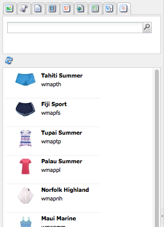

# Criação - o ambiente e as ferramentas {#authoring-the-environment-and-tools}

O ambiente de criação do AEM fornece vários mecanismos para organização e edição de conteúdo. As ferramentas fornecidas são acessadas de vários consoles e editores de página.

## Administração do site {#site-administration}

A variável **Sites** O console do permite gerenciar e navegar no site. Usando os dois painéis, a estrutura do site pode ser expandida e as ações podem ser executadas no elemento necessário:

## Editar seu conteúdo da página {#editing-your-page-content}

Há um editor de página separado com a interface clássica, usando o localizador de conteúdo e o sidekick:

`https://localhost:4502/cf#/content/geometrixx/en/products/triangle.html`

## Acessar ajuda   {#accessing-help}

Vários **Ajuda** os recursos podem ser acessados diretamente do AEM:

Além de acessar [ajuda das barras de ferramentas do console](/help/sites-classic-ui-authoring/author-env-basic-handling.md#accessing-help), você também pode acessar a ajuda do sidekick (usando o ? ícone) ao editar uma página:

Ou usando o **Ajuda** botão na caixa de diálogo de edição de componentes específicos; isso mostrará a ajuda sensível ao contexto.

## Sidekick {#sidekick}

A variável **Componentes** a guia do sidekick permite navegar pelos componentes disponíveis para serem adicionados à página atual. O grupo desejado pode ser expandido e, em seguida, um componente arrastado para o local desejado na página.

## O Localizador de conteúdo {#the-content-finder}

O Localizador de conteúdo é uma maneira rápida e fácil de encontrar ativos e/ou conteúdo no repositório ao editar uma página.

Você pode usar o localizador de conteúdo para localizar um intervalo de recursos. Quando apropriado, você pode arrastar um item e soltá-lo em um parágrafo na sua página:

* [Imagens](#finding-images)
* [Documentos](#finding-documents)
* [Filmes](#finding-movies)
* [Navegador Dynamic Media](/help/sites-administering/scene7.md#scene7contentbrowser)
* [Páginas](#finding-pages)

* [Parágrafos](#referencing-paragraphs-from-other-pages)
* [Produtos](#products)
* Ou para [navegar no site por estrutura de repositório](#the-content-finder)

Com todas as opções, você pode [pesquisar itens específicos](#the-content-finder).

### Localizando imagens {#finding-images}

Essa guia lista todas as imagens no repositório.

Depois de criar um parágrafo Imagem na página, você pode arrastar um item e soltá-lo no parágrafo.

### Localizando documentos {#finding-documents}

Essa guia lista todos os documentos no repositório.

Depois de criar um parágrafo Download na página, você pode arrastar um item e soltá-lo no parágrafo.

### Encontrar filmes {#finding-movies}

Essa guia lista todos os filmes (por exemplo, itens de Flash) no repositório.

Depois de criar um parágrafo apropriado (por exemplo, Flash) na página, você pode arrastar um item e soltá-lo no parágrafo.

### Produtos {#products}

Essa guia lista todos os produtos. Depois de criar um parágrafo apropriado (por exemplo, Produto) na página, você pode arrastar um item e soltá-lo no parágrafo.

### Encontrando páginas {#finding-pages}

Esta guia mostra todas as páginas. Clique duas vezes em qualquer página para abri-la para edição.

### Referência de parágrafos de outras páginas {#referencing-paragraphs-from-other-pages}

Esta guia permite procurar outra página. Todos os parágrafos dessa página serão listados. Você pode arrastar um parágrafo para a página atual, isso criará uma referência ao parágrafo original.

### Usando a View Repositório Completo {#using-the-full-repository-view}

Esta guia mostra todos os recursos no repositório.

### Utilização da pesquisa com o navegador de conteúdo {#using-search-with-the-content-browser}

Em todas as opções, é possível pesquisar por itens específicos. Todas as tags e recursos que correspondem ao padrão de pesquisa são listados:

Também é possível usar curingas para a pesquisa. Os curingas aceitos são:

* `*`
corresponde a uma sequência de zero ou mais caracteres.

* `?`
corresponde a um único caractere.

>[!NOTE]
>
>Há uma pseudo propriedade &quot;name&quot; que deve ser usada para executar uma pesquisa curinga.

Por exemplo, se houver uma imagem disponível com o nome:

`ad-nmvtis.jpg`

os seguintes padrões de pesquisa o encontrarão (e quaisquer outras imagens que correspondam ao padrão):

* `name:*nmv*`
* `name:AD*`
a correspondência de caracteres é *não* distinção entre maiúsculas e minúsculas.

* `name:ad?nm??is.*`
você pode usar qualquer número de curingas em uma query.

>[!NOTE]
>
>Também é possível usar [SQL2](https://helpx.adobe.com/experience-manager/6-5/sites/developing/using/reference-materials/javadoc/org/apache/jackrabbit/commons/query/sql2/package-summary.html) pesquisa.

## Mostrando referências {#showing-references}

O AEM permite visualizar quais páginas estão vinculadas à página em que você está trabalhando no momento.

Para mostrar referências diretas à página:

1. No sidekick, selecione a variável **Página** ícone de guia.

   

1. Selecionar **Mostrar referências...** O AEM abre a janela Referências e exibe quais páginas se referem à página selecionada, incluindo seus caminhos.

   

Em determinadas situações, outras ações estão disponíveis no Sidekick, incluindo:

* [Lançamentos](/help/sites-classic-ui-authoring/classic-launches.md)
* [Live Copies](/help/sites-administering/msm.md)

* [Blueprint](/help/sites-administering/msm-best-practices.md)

Outro [as relações entre páginas podem ser vistas no console Sites](/help/sites-classic-ui-authoring/author-env-basic-handling.md#page-information-on-the-websites-console).

## Log de auditoria {#audit-log}

A variável **Log de auditoria** pode ser acessado no **Informações** guia do sidekick. Ela lista as ações recentes tomadas na página atual; por exemplo:

## Informações da página {#page-information}

O console do site também [fornece informações sobre o status atual da página](/help/sites-classic-ui-authoring/author-env-basic-handling.md#page-information-on-the-websites-console) como publicação, modificação, bloqueado, livecopy etc.

## Modos de página   {#page-modes}

Ao editar uma página com a interface clássica, existem vários modos que podem ser acessados usando os ícones na parte inferior do sidekick:

A linha de ícones na parte inferior do Sidekick é usada para alternar os modos de trabalho com as páginas:

* [Editar](/help/sites-classic-ui-authoring/classic-page-author-edit-mode.md)
Esse é o modo padrão e permite editar a página, adicionar ou excluir componentes e fazer outras alterações.

* [Visualizar](/help/sites-classic-ui-authoring/classic-page-author-edit-content.md#previewing-pages)
Esse modo permite que você visualize a página como se ela estivesse aparecendo em seu site em sua forma final.

* [Design](/help/sites-classic-ui-authoring/classic-page-author-design-mode.md#main-pars-procedure-0)
Nesse modo, é possível editar o design da página configurando os componentes acessíveis.

>[!NOTE]
>
>Outras opções também estão disponíveis:
>
>* [Andaime](/help/sites-classic-ui-authoring/classic-feature-scaffolding.md)
>* [ClientContext](/help/sites-administering/client-context.md)
>* Sites - abrirá o console Sites.
>* Recarregar - atualizará a página.

## Atalhos de teclado {#keyboard-shortcuts}

Vários [atalhos de teclado](/help/sites-classic-ui-authoring/classic-page-author-keyboard-shortcuts.md) estão disponíveis.
